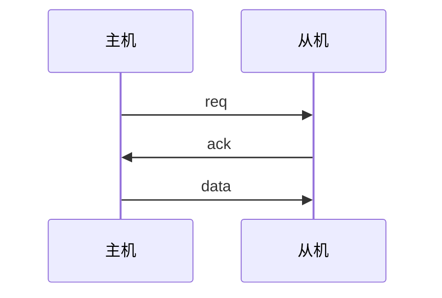
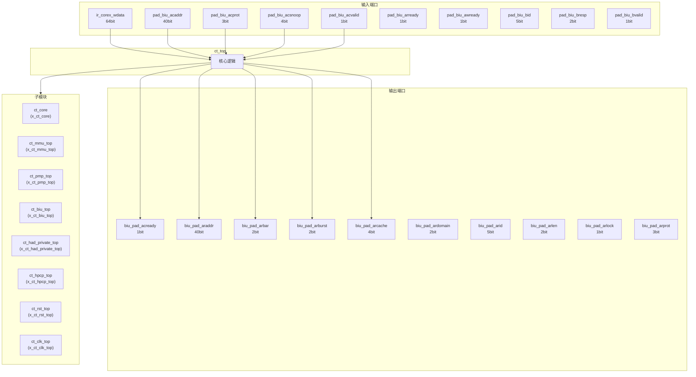
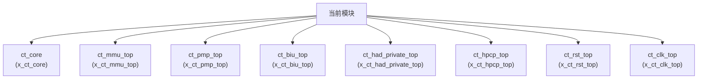

# ct_top 模块设计文档

## 1. 模块概述

### 1.1 基本信息

| 属性 | 值 |
|------|-----|
| 模块名称 | ct_top |
| 文件路径 | cpu\rtl\ct_top.v |
| 层级 | Level 0 |

### 1.2 功能描述

顶层模块 (Top Module)，主要信号: 使能信号、就绪信号、地址信号、锁定信号、操作码

### 1.3 设计特点

- 包含 8 个子模块实例

## 2. 模块接口说明

### 2.1 输入端口

| 信号名 | 方向 | 位宽 | 描述 |
|--------|------|------|------|
| ir_corex_wdata | input | 64 | 数据信号 |
| pad_biu_acaddr | input | 40 | 地址信号 |
| pad_biu_acprot | input | 3 |  |
| pad_biu_acsnoop | input | 4 | 操作码 |
| pad_biu_acvalid | input | 1 | 有效信号 |
| pad_biu_arready | input | 1 | 就绪信号 |
| pad_biu_awready | input | 1 | 就绪信号 |
| pad_biu_bid | input | 5 |  |
| pad_biu_bresp | input | 2 | 读使能 |
| pad_biu_bvalid | input | 1 | 有效信号 |
| pad_biu_cdready | input | 1 | 就绪信号 |
| pad_biu_crready | input | 1 | 就绪信号 |
| pad_biu_csr_cmplt | input | 1 |  |
| pad_biu_csr_rdata | input | 128 | 数据信号 |
| pad_biu_dbgrq_b | input | 1 |  |
| pad_biu_hpcp_l2of_int | input | 4 | 程序计数器 |
| pad_biu_me_int | input | 1 | 输入信号 |
| pad_biu_ms_int | input | 1 | 输入信号 |
| pad_biu_mt_int | input | 1 | 输入信号 |
| pad_biu_rdata | input | 128 | 数据信号 |
| pad_biu_rid | input | 5 |  |
| pad_biu_rlast | input | 1 |  |
| pad_biu_rresp | input | 4 | 读使能 |
| pad_biu_rvalid | input | 1 | 有效信号 |
| pad_biu_se_int | input | 1 | 输入信号 |
| pad_biu_ss_int | input | 1 | 输入信号 |
| pad_biu_st_int | input | 1 | 输入信号 |
| pad_biu_wns_awready | input | 1 | 就绪信号 |
| pad_biu_wns_wready | input | 1 | 就绪信号 |
| pad_biu_wready | input | 1 | 就绪信号 |
| ... | ... | ... | 共48个输入端口 |

### 2.2 输出端口

| 信号名 | 方向 | 位宽 | 描述 |
|--------|------|------|------|
| biu_pad_acready | output | 1 | 就绪信号 |
| biu_pad_araddr | output | 40 | 地址信号 |
| biu_pad_arbar | output | 2 |  |
| biu_pad_arburst | output | 2 | 复位信号 |
| biu_pad_arcache | output | 4 |  |
| biu_pad_ardomain | output | 2 | 输入信号 |
| biu_pad_arid | output | 5 |  |
| biu_pad_arlen | output | 2 | 使能信号 |
| biu_pad_arlock | output | 1 | 锁定信号 |
| biu_pad_arprot | output | 3 |  |
| biu_pad_arsize | output | 3 |  |
| biu_pad_arsnoop | output | 4 | 操作码 |
| biu_pad_aruser | output | 3 |  |
| biu_pad_arvalid | output | 1 | 有效信号 |
| biu_pad_awaddr | output | 40 | 地址信号 |
| biu_pad_awbar | output | 2 |  |
| biu_pad_awburst | output | 2 | 复位信号 |
| biu_pad_awcache | output | 4 |  |
| biu_pad_awdomain | output | 2 | 输入信号 |
| biu_pad_awid | output | 5 |  |
| biu_pad_awlen | output | 2 | 使能信号 |
| biu_pad_awlock | output | 1 | 锁定信号 |
| biu_pad_awprot | output | 3 |  |
| biu_pad_awsize | output | 3 |  |
| biu_pad_awsnoop | output | 3 | 操作码 |
| biu_pad_awunique | output | 1 |  |
| biu_pad_awuser | output | 1 |  |
| biu_pad_awvalid | output | 1 | 有效信号 |
| biu_pad_back | output | 1 | 应答信号 |
| biu_pad_bready | output | 1 | 就绪信号 |
| ... | ... | ... | 共61个输出端口 |

### 2.5 接口时序图

## 3. 模块框图

### 3.1 模块架构图

### 3.2 主要数据连线

| 源模块 | 目标模块 | 信号名 | 位宽 | 说明 |
|--------|----------|--------|------|------|
| ct_top | ct_core | biu_cp0_apb_base | - | |
| ct_top | ct_core | biu_cp0_cmplt | - | |
| ct_top | ct_core | biu_cp0_coreid | - | |
| ct_top | ct_mmu_top | biu_mmu_smp_disable | - | |
| ct_top | ct_mmu_top | cp0_mmu_cskyee | - | |
| ct_top | ct_mmu_top | cp0_mmu_icg_en | - | |
| ct_top | ct_pmp_top | cp0_pmp_icg_en | - | |
| ct_top | ct_pmp_top | cp0_pmp_mpp | - | |
| ct_top | ct_pmp_top | cp0_pmp_mprv | - | |
| ct_top | ct_biu_top | biu_cp0_apb_base | - | |
| ct_top | ct_biu_top | biu_cp0_cmplt | - | |
| ct_top | ct_biu_top | biu_cp0_coreid | - | |
| ct_top | ct_had_private_top | biu_had_coreid | - | |
| ct_top | ct_had_private_top | biu_had_sdb_req_b | - | |
| ct_top | ct_had_private_top | cp0_had_cpuid_0 | - | |
| ct_top | ct_hpcp_top | biu_hpcp_cmplt | - | |
| ct_top | ct_hpcp_top | biu_hpcp_l2of_int | - | |
| ct_top | ct_hpcp_top | biu_hpcp_rdata | - | |
| ct_top | ct_rst_top | forever_coreclk | - | |
| ct_top | ct_rst_top | fpu_rst_b | - | |
| ct_top | ct_rst_top | had_rst_b | - | |
| ct_top | ct_clk_top | biu_xx_dbg_wakeup | - | |
| ct_top | ct_clk_top | biu_xx_int_wakeup | - | |
| ct_top | ct_clk_top | biu_xx_normal_work | - | |

## 4. 模块实现方案

### 4.1 关键逻辑描述

无关键 always 块。

## 5. 内部关键信号列表

### 5.1 寄存器信号

无寄存器信号。

### 5.2 线网信号

| 信号名 | 位宽 | 描述 |
|--------|------|------|
| biu_cp0_apb_base | 40 | |
| biu_cp0_cmplt | 1 | |
| biu_cp0_coreid | 3 | |
| biu_cp0_me_int | 1 | |
| biu_cp0_ms_int | 1 | |
| biu_cp0_mt_int | 1 | |
| biu_cp0_rdata | 128 | |
| biu_cp0_rvba | 40 | |
| biu_cp0_se_int | 1 | |
| biu_cp0_ss_int | 1 | |
| biu_cp0_st_int | 1 | |
| biu_had_coreid | 2 | |
| biu_had_sdb_req_b | 1 | |
| biu_hpcp_cmplt | 1 | |
| biu_hpcp_l2of_int | 4 | |
| biu_hpcp_rdata | 128 | |
| biu_hpcp_time | 64 | |
| biu_ifu_rd_data | 128 | |
| biu_ifu_rd_data_vld | 1 | |
| biu_ifu_rd_grnt | 1 | |
| ... | ... | 共485个线网信号 |

## 6. 子模块方案

### 6.1 模块例化层次结构

### 6.2 子模块列表

| 层级 | 模块名 | 实例名 | 功能描述 |
|------|--------|--------|----------|
| 1 | ct_core | x_ct_core | 处理器核心 |
| 1 | ct_mmu_top | x_ct_mmu_top | 内存管理单元 |
| 1 | ct_pmp_top | x_ct_pmp_top | 物理内存保护 |
| 1 | ct_biu_top | x_ct_biu_top | 总线接口单元 |
| 1 | ct_had_private_top | x_ct_had_private_top | 硬件调试 |
| 1 | ct_hpcp_top | x_ct_hpcp_top | 硬件性能计数器 |
| 1 | ct_rst_top | x_ct_rst_top | 复位控制 |
| 1 | ct_clk_top | x_ct_clk_top | 时钟控制 |

## 7. 修订历史

| 版本 | 日期 | 作者 | 说明 |
|------|------|------|------|
| 1.0 | 2026-03-12 | Auto-generated | 初始版本 |
