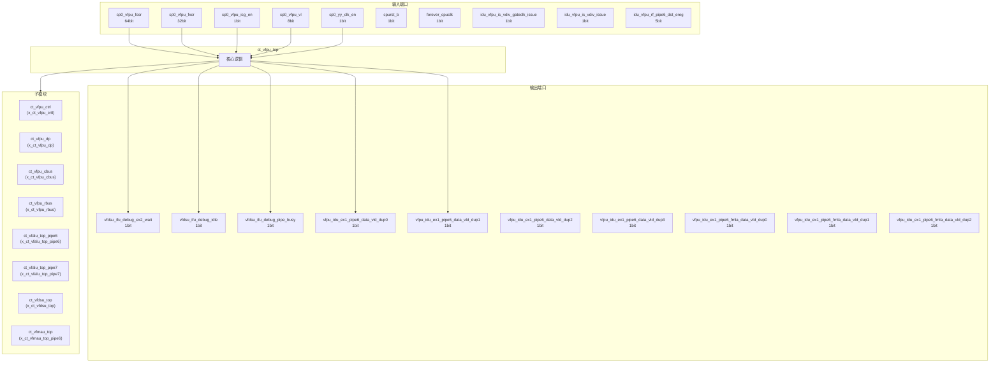
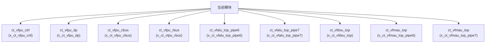

# ct_vfpu_top 模块设计文档

## 1. 模块概述

### 1.1 基本信息

| 属性 | 值 |
|------|-----|
| 模块名称 | ct_vfpu_top |
| 文件路径 | vfpu\rtl\ct_vfpu_top.v |
| 层级 | Level 2 |

### 1.2 功能描述

ct_vfpu_top 模块的功能描述。

### 1.3 设计特点

- 包含 9 个子模块实例
- 包含 5 个 assign 语句

## 2. 模块接口说明

### 2.1 输入端口

| 信号名 | 方向 | 位宽 | 描述 |
|--------|------|------|------|
| cp0_vfpu_fcsr | input | 64 | |
| cp0_vfpu_fxcr | input | 32 | |
| cp0_vfpu_icg_en | input | 1 | |
| cp0_vfpu_vl | input | 8 | |
| cp0_yy_clk_en | input | 1 | |
| cpurst_b | input | 1 | |
| forever_cpuclk | input | 1 | |
| idu_vfpu_is_vdiv_gateclk_issue | input | 1 | |
| idu_vfpu_is_vdiv_issue | input | 1 | |
| idu_vfpu_rf_pipe6_dst_ereg | input | 5 | |
| idu_vfpu_rf_pipe6_dst_preg | input | 7 | |
| idu_vfpu_rf_pipe6_dst_vld | input | 1 | |
| idu_vfpu_rf_pipe6_dst_vreg | input | 7 | |
| idu_vfpu_rf_pipe6_dste_vld | input | 1 | |
| idu_vfpu_rf_pipe6_dstv_vld | input | 1 | |
| idu_vfpu_rf_pipe6_eu_sel | input | 12 | |
| idu_vfpu_rf_pipe6_func | input | 20 | |
| idu_vfpu_rf_pipe6_gateclk_sel | input | 1 | |
| idu_vfpu_rf_pipe6_iid | input | 7 | |
| idu_vfpu_rf_pipe6_imm0 | input | 3 | |
| idu_vfpu_rf_pipe6_inst_type | input | 6 | |
| idu_vfpu_rf_pipe6_mla_srcv2_vld | input | 1 | |
| idu_vfpu_rf_pipe6_mla_srcv2_vreg | input | 7 | |
| idu_vfpu_rf_pipe6_ready_stage | input | 3 | |
| idu_vfpu_rf_pipe6_sel | input | 1 | |
| idu_vfpu_rf_pipe6_srcv0_fr | input | 64 | |
| idu_vfpu_rf_pipe6_srcv1_fr | input | 64 | |
| idu_vfpu_rf_pipe6_srcv2_fr | input | 64 | |
| idu_vfpu_rf_pipe6_vmla_type | input | 3 | |
| idu_vfpu_rf_pipe7_dst_ereg | input | 5 | |
| ... | ... | ... | 共67个输入端口 |

### 2.2 输出端口

| 信号名 | 方向 | 位宽 | 描述 |
|--------|------|------|------|
| vfdsu_ifu_debug_ex2_wait | output | 1 | |
| vfdsu_ifu_debug_idle | output | 1 | |
| vfdsu_ifu_debug_pipe_busy | output | 1 | |
| vfpu_idu_ex1_pipe6_data_vld_dup0 | output | 1 | |
| vfpu_idu_ex1_pipe6_data_vld_dup1 | output | 1 | |
| vfpu_idu_ex1_pipe6_data_vld_dup2 | output | 1 | |
| vfpu_idu_ex1_pipe6_data_vld_dup3 | output | 1 | |
| vfpu_idu_ex1_pipe6_fmla_data_vld_dup0 | output | 1 | |
| vfpu_idu_ex1_pipe6_fmla_data_vld_dup1 | output | 1 | |
| vfpu_idu_ex1_pipe6_fmla_data_vld_dup2 | output | 1 | |
| vfpu_idu_ex1_pipe6_fmla_data_vld_dup3 | output | 1 | |
| vfpu_idu_ex1_pipe6_mfvr_inst_vld_dup0 | output | 1 | |
| vfpu_idu_ex1_pipe6_mfvr_inst_vld_dup1 | output | 1 | |
| vfpu_idu_ex1_pipe6_mfvr_inst_vld_dup2 | output | 1 | |
| vfpu_idu_ex1_pipe6_mfvr_inst_vld_dup3 | output | 1 | |
| vfpu_idu_ex1_pipe6_mfvr_inst_vld_dup4 | output | 1 | |
| vfpu_idu_ex1_pipe6_preg_dup0 | output | 7 | |
| vfpu_idu_ex1_pipe6_preg_dup1 | output | 7 | |
| vfpu_idu_ex1_pipe6_preg_dup2 | output | 7 | |
| vfpu_idu_ex1_pipe6_preg_dup3 | output | 7 | |
| vfpu_idu_ex1_pipe6_preg_dup4 | output | 7 | |
| vfpu_idu_ex1_pipe6_vreg_dup0 | output | 7 | |
| vfpu_idu_ex1_pipe6_vreg_dup1 | output | 7 | |
| vfpu_idu_ex1_pipe6_vreg_dup2 | output | 7 | |
| vfpu_idu_ex1_pipe6_vreg_dup3 | output | 7 | |
| vfpu_idu_ex1_pipe7_data_vld_dup0 | output | 1 | |
| vfpu_idu_ex1_pipe7_data_vld_dup1 | output | 1 | |
| vfpu_idu_ex1_pipe7_data_vld_dup2 | output | 1 | |
| vfpu_idu_ex1_pipe7_data_vld_dup3 | output | 1 | |
| vfpu_idu_ex1_pipe7_fmla_data_vld_dup0 | output | 1 | |
| ... | ... | ... | 共175个输出端口 |

## 3. 模块框图

### 3.1 模块架构图

### 3.2 主要数据连线

| 源模块 | 目标模块 | 信号名 | 位宽 | 说明 |
|--------|----------|--------|------|------|
| ct_vfpu_top | ct_vfpu_ctrl | cp0_vfpu_icg_en | - | |
| ct_vfpu_top | ct_vfpu_ctrl | cp0_yy_clk_en | - | |
| ct_vfpu_top | ct_vfpu_ctrl | cpurst_b | - | |
| ct_vfpu_top | ct_vfpu_dp | cp0_vfpu_fxcr | - | |
| ct_vfpu_top | ct_vfpu_dp | cp0_vfpu_icg_en | - | |
| ct_vfpu_top | ct_vfpu_dp | cp0_yy_clk_en | - | |
| ct_vfpu_top | ct_vfpu_cbus | cp0_vfpu_icg_en | - | |
| ct_vfpu_top | ct_vfpu_cbus | cp0_yy_clk_en | - | |
| ct_vfpu_top | ct_vfpu_cbus | cpurst_b | - | |
| ct_vfpu_top | ct_vfpu_rbus | cp0_vfpu_icg_en | - | |
| ct_vfpu_top | ct_vfpu_rbus | cp0_yy_clk_en | - | |
| ct_vfpu_top | ct_vfpu_rbus | cpurst_b | - | |
| ct_vfpu_top | ct_vfalu_top_pipe6 | cp0_vfpu_icg_en | - | |
| ct_vfpu_top | ct_vfalu_top_pipe6 | cp0_yy_clk_en | - | |
| ct_vfpu_top | ct_vfalu_top_pipe6 | cpurst_b | - | |
| ct_vfpu_top | ct_vfalu_top_pipe7 | cp0_vfpu_icg_en | - | |
| ct_vfpu_top | ct_vfalu_top_pipe7 | cp0_yy_clk_en | - | |
| ct_vfpu_top | ct_vfalu_top_pipe7 | cpurst_b | - | |
| ct_vfpu_top | ct_vfdsu_top | cp0_vfpu_icg_en | - | |
| ct_vfpu_top | ct_vfdsu_top | cp0_yy_clk_en | - | |
| ct_vfpu_top | ct_vfdsu_top | cpurst_b | - | |
| ct_vfpu_top | ct_vfmau_top | cp0_vfpu_icg_en | - | |
| ct_vfpu_top | ct_vfmau_top | cp0_yy_clk_en | - | |
| ct_vfpu_top | ct_vfmau_top | cpurst_b | - | |
| ct_vfpu_top | ct_vfmau_top | cp0_vfpu_icg_en | - | |
| ct_vfpu_top | ct_vfmau_top | cp0_yy_clk_en | - | |
| ct_vfpu_top | ct_vfmau_top | cpurst_b | - | |

## 4. 模块实现方案

### 4.1 关键逻辑描述

无关键 always 块。

**Assign 语句列表:**

| 目标信号 | 源表达式 |
|----------|----------|
| vdivu_vfpu_ex1_pipe6_result_vld | 1'b0 |
| vdivu_vfpu_pipe6_req_for_bubble | 1'b0 |
| vdivu_vfpu_pipe6_vdiv_busy | 1'b0 |
| vdsp_vfpu_pipe6_inside_fwd_aval | 1'b0 |
| vdsp_vfpu_pipe7_inside_fwd_aval | 1'b0 |

## 5. 内部关键信号列表

### 5.1 寄存器信号

无寄存器信号。

### 5.2 线网信号

| 信号名 | 位宽 | 描述 |
|--------|------|------|
| ctrl_dp_ex2_pipe7_inst_vld | 1 | |
| ctrl_ex1_pipe6_data_vld | 1 | |
| ctrl_ex1_pipe6_data_vld_dup0 | 1 | |
| ctrl_ex1_pipe6_data_vld_dup1 | 1 | |
| ctrl_ex1_pipe6_data_vld_dup2 | 1 | |
| ctrl_ex1_pipe6_eu_sel | 12 | |
| ctrl_ex1_pipe6_inst_vld | 1 | |
| ctrl_ex1_pipe6_mfvr_inst_vld | 1 | |
| ctrl_ex1_pipe6_mfvr_inst_vld_dup0 | 1 | |
| ctrl_ex1_pipe6_mfvr_inst_vld_dup1 | 1 | |
| ctrl_ex1_pipe6_mfvr_inst_vld_dup2 | 1 | |
| ctrl_ex1_pipe6_mfvr_inst_vld_dup3 | 1 | |
| ctrl_ex1_pipe7_data_vld | 1 | |
| ctrl_ex1_pipe7_data_vld_dup0 | 1 | |
| ctrl_ex1_pipe7_data_vld_dup1 | 1 | |
| ctrl_ex1_pipe7_data_vld_dup2 | 1 | |
| ctrl_ex1_pipe7_eu_sel | 12 | |
| ctrl_ex1_pipe7_mfvr_inst_vld | 1 | |
| ctrl_ex1_pipe7_mfvr_inst_vld_dup0 | 1 | |
| ctrl_ex1_pipe7_mfvr_inst_vld_dup1 | 1 | |
| ... | ... | 共223个线网信号 |

## 6. 子模块方案

### 6.1 模块例化层次结构

### 6.2 子模块列表

| 层级 | 模块名 | 实例名 | 功能描述 |
|------|--------|--------|----------|
| 1 | ct_vfpu_ctrl | x_ct_vfpu_crtl | |
| 1 | ct_vfpu_dp | x_ct_vfpu_dp | |
| 1 | ct_vfpu_cbus | x_ct_vfpu_cbus | |
| 1 | ct_vfpu_rbus | x_ct_vfpu_rbus | |
| 1 | ct_vfalu_top_pipe6 | x_ct_vfalu_top_pipe6 | |
| 1 | ct_vfalu_top_pipe7 | x_ct_vfalu_top_pipe7 | |
| 1 | ct_vfdsu_top | x_ct_vfdsu_top | |
| 1 | ct_vfmau_top | x_ct_vfmau_top_pipe6 | |
| 1 | ct_vfmau_top | x_ct_vfmau_top_pipe7 | |

## 7. 修订历史

| 版本 | 日期 | 作者 | 说明 |
|------|------|------|------|
| 1.0 | 2026-03-12 | Auto-generated | 初始版本 |
