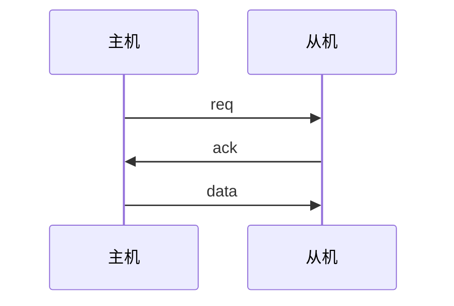
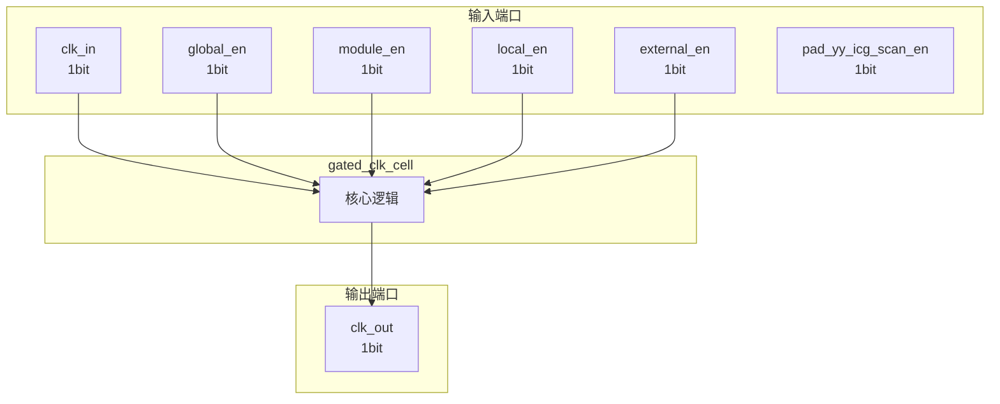

# gated_clk_cell 模块设计文档

## 1. 模块概述

### 1.1 基本信息

| 属性 | 值 |
|------|-----|
| 模块名称 | gated_clk_cell |
| 文件路径 | clk\rtl\gated_clk_cell.v |
| 层级 | Level 2 |

### 1.2 功能描述

主要信号: 时钟信号、使能信号

### 1.3 设计特点

- 包含 3 个 assign 语句

## 2. 模块接口说明

### 2.1 输入端口

| 信号名 | 方向 | 位宽 | 描述 |
|--------|------|------|------|
| clk_in | input | 1 | 时钟信号 |
| global_en | input | 1 | 使能信号 |
| module_en | input | 1 | 使能信号 |
| local_en | input | 1 | 使能信号 |
| external_en | input | 1 | 使能信号 |
| pad_yy_icg_scan_en | input | 1 | 使能信号 |

### 2.2 输出端口

| 信号名 | 方向 | 位宽 | 描述 |
|--------|------|------|------|
| clk_out | output | 1 | 时钟信号 |

### 2.5 接口时序图

## 3. 模块框图

### 3.1 模块架构图

### 3.2 主要数据连线

无子模块连接。

## 4. 模块实现方案

### 4.1 关键逻辑描述

无关键 always 块。

**Assign 语句列表:**

| 目标信号 | 源表达式 |
|----------|----------|
| clk_en_bf_latch | (global_en && (module_en || local_en)) || external_en |
| SE | pad_yy_icg_scan_en |
| clk_out | clk_in |

## 5. 内部关键信号列表

### 5.1 寄存器信号

无寄存器信号。

### 5.2 线网信号

| 信号名 | 位宽 | 描述 |
|--------|------|------|
| clk_en_bf_latch | 1 | |
| SE | 1 | |

## 6. 子模块方案

无子模块。

## 7. 修订历史

| 版本 | 日期 | 作者 | 说明 |
|------|------|------|------|
| 1.0 | 2026-03-12 | Auto-generated | 初始版本 |
