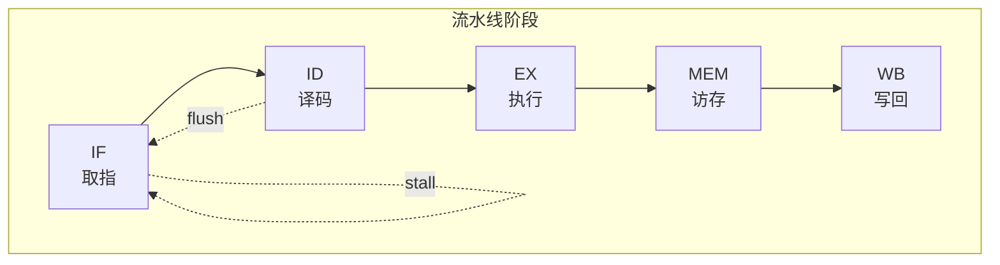

# verilog-block-diagram 技能修改计划

## 修改目标

修改 `verilog-block-diagram` 技能，实现以下功能：

1. **删除** Word/Docx 兼容格式 (ASCII 艺术图)
2. **新增** Mermaid 格式导出为 PNG 格式
3. **新增** 支持生成模块内流水线图

---

## 详细修改步骤

### 步骤 1：修改技能描述 (description)

**当前描述：**
```
输出 Markdown (Mermaid) 格式和 Word/Docx 兼容格式 (ASCII艺术图)。
```

**修改为：**
```
输出 Markdown (Mermaid) 格式和 PNG 图片格式。
支持生成模块框图和模块内流水线图。
```

### 步骤 2：删除 Word/Docx 兼容格式相关内容

需要删除以下章节：
- 步骤 6：生成 Word/Docx 兼容格式
- ASCII 艺术图规则
- 输出文件中的 ASCII 文件
- 框图生成详细指南中的 ASCII 格式示例
- 注意事项中的 ASCII 相关内容

### 步骤 3：新增 Mermaid 导出 PNG 功能

**新增步骤 6：导出 PNG 图片**

使用 mermaid-cli (mmdc) 工具将 Mermaid 代码转换为 PNG 图片：

```bash
# 安装 mermaid-cli
npm install -g @mermaid-js/mermaid-cli

# 转换命令
mmdc -i input.mmd -o output.png -b white -w 2048 -H 1024
```

**配置选项：**
- `-b white`: 白色背景
- `-w 2048`: 宽度 2048 像素
- `-H 1024`: 高度 1024 像素（自动调整）
- `-t default`: 使用默认主题

### 步骤 4：新增流水线图生成功能

**新增步骤：流水线检测与图生成**

#### 4.1 流水线检测规则

检测以下模式识别流水线结构：

| 模式 | 正则表达式 | 说明 |
|------|-----------|------|
| 阶段寄存器 | `ff\d*_\w+`, `pipe\d*_\w+`, `stage\d*_\w+` | 流水线阶段寄存器 |
| 流水线控制 | `valid`, `ready`, `stall`, `flush` | 流水线控制信号 |
| 阶段命名 | `IF`, `ID`, `EX`, `MEM`, `WB` | 经典五级流水线 |
| 延迟寄存器 | `dly\d*`, `d\d*_\w+` | 延迟寄存器 |

#### 4.2 流水线图 Mermaid 语法



#### 4.3 流水线图输出格式

| 输出类型 | 文件名 | 说明 |
|----------|--------|------|
| Markdown | {module}_pipeline.md | Mermaid 格式流水线图 |
| PNG | {module}_pipeline.png | PNG 图片格式 |

### 步骤 5：更新输出文件清单

**修改后的输出文件：**

| 文件类型 | 文件名 | 说明 |
|----------|--------|------|
| Markdown | {module}_block_diagram.md | Mermaid 格式框图 |
| Mermaid | {module}_block_diagram.mmd | Mermaid 源文件 |
| PNG | {module}_block_diagram.png | PNG 图片格式框图 |
| Markdown | {module}_pipeline.md | Mermaid 格式流水线图 (如检测到流水线) |
| PNG | {module}_pipeline.png | PNG 图片格式流水线图 (如检测到流水线) |

### 步骤 6：更新注意事项

**新增注意事项：**

1. **PNG 导出依赖**：
   - 需要安装 Node.js 和 mermaid-cli
   - 安装命令：`npm install -g @mermaid-js/mermaid-cli`

2. **流水线检测**：
   - 自动检测模块内的流水线结构
   - 如未检测到流水线，不生成流水线图

3. **图片尺寸**：
   - 框图默认宽度 2048 像素
   - 流水线图默认宽度 1536 像素
   - 高度自动调整

---

## 文件修改清单

| 文件路径 | 修改类型 | 说明 |
|----------|----------|------|
| `.trae/skills/verilog-block-diagram/SKILL.md` | 重写 | 完整重写技能定义 |

---

## 预期结果

修改后的技能将：
1. 不再生成 ASCII 艺术图
2. 生成 Mermaid 格式的 PNG 图片
3. 自动检测并生成模块内流水线图
4. 输出格式更加现代化和可视化

---

## 验证方法

修改完成后，使用以下命令验证：
1. 对 `ct_iu_top.v` 生成框图，验证 PNG 输出
2. 对 `ct_iu_top.v` 生成流水线图，验证流水线检测
