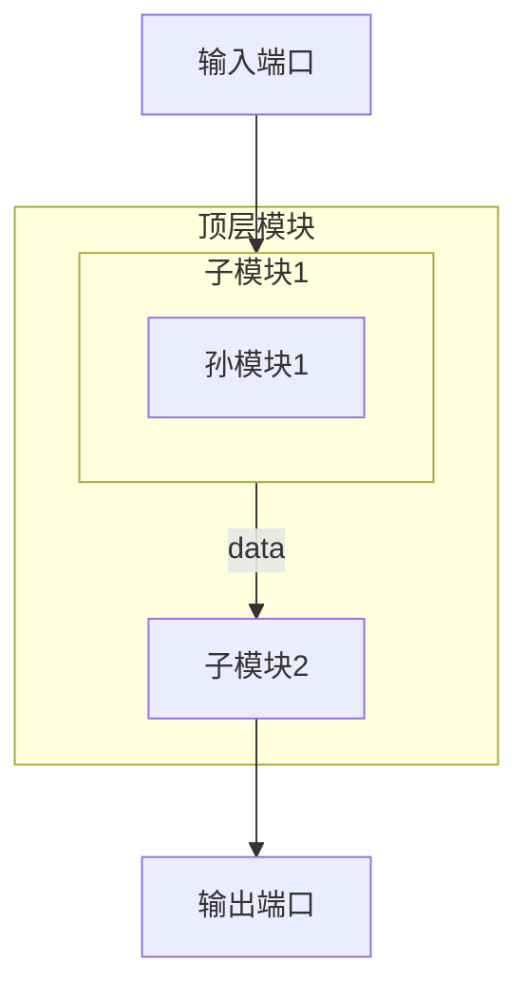

# Verilog 模块框图生成器 Skill 实现计划

## 目标

创建一个新的skill `verilog-block-diagram`，用于从Verilog RTL代码生成模块框图，支持Markdown格式和可插入docx文档的两种格式。

## 核心需求

1. **层次结构展示**: 最多显示3层嵌套关系
2. **数据连线**: 显示主要数据连线关系
3. **输出格式**:
   - Markdown格式（使用Mermaid语法）
   - Word/Docx兼容格式（ASCII艺术图或表格模拟）

## 实现步骤

### 步骤 1: 创建Skill目录结构

```
d:\code\openc910\.trae\skills\verilog-block-diagram\
├── SKILL.md                    # Skill主文件
└── scripts\
    └── block_diagram_generator.py  # 框图生成脚本
```

### 步骤 2: 编写 SKILL.md

**描述部分**:
- name: `verilog-block-diagram`
- description: 从Verilog代码生成模块框图，支持Markdown和Word格式

**工作流程**:
1. 收集输入文件
2. 解析模块层次结构
3. 提取端口连接关系
4. 识别主要数据流
5. 生成框图

### 步骤 3: 编写 block_diagram_generator.py

**核心类和函数**:

```python
@dataclass
class ModuleNode:
    name: str           # 模块名
    instance_name: str  # 实例名
    level: int          # 层级 (0-2)
    ports: Dict[str, Port]
    sub_instances: List['ModuleNode']
    connections: Dict[str, str]  # 端口连接

@dataclass
class DataConnection:
    source: str         # 源模块.端口
    target: str         # 目标模块.端口
    signal_name: str    # 信号名
    width: int          # 位宽

class BlockDiagramGenerator:
    def parse_hierarchy(file_path, max_depth=3) -> ModuleNode
    def extract_connections(module) -> List[DataConnection]
    def generate_mermaid(root_module) -> str
    def generate_ascii_art(root_module) -> str
    def generate_docx_table(root_module) -> str
```

**解析逻辑**:
1. 解析顶层模块的实例化
2. 递归解析子模块（最多3层）
3. 提取端口连接信息
4. 识别主要数据信号（data, addr, valid, ready等）

### 步骤 4: 框图生成规则

**层次结构规则**:
- 第0层: 顶层模块
- 第1层: 顶层直接实例化的子模块
- 第2层: 子模块实例化的孙模块
- 不显示第3层及以下

**数据连线规则**:
- 优先显示主要数据信号:
  - 数据信号: data, addr, offset, wdata, rdata
  - 控制信号: valid, ready, enable, stall
  - 状态信号: done, error, busy
- 合并同类信号（如 xxx_data 可合并显示为 data）
- 位宽较大的信号优先显示

**Mermaid格式示例**:


**ASCII艺术图格式示例**:
```
┌─────────────────────────────────────────────────────┐
│                    顶层模块                          │
│  ┌─────────────────┐      ┌─────────────────┐      │
│  │    子模块1       │─data─│    子模块2       │      │
│  │  ┌───────────┐  │      └─────────────────┘      │
│  │  │  孙模块1   │  │              │                │
│  │  └───────────┘  │              ▼                │
│  └─────────────────┘         [输出端口]            │
│         ▲                                           │
│     [输入端口]                                       │
└─────────────────────────────────────────────────────┘
```

### 步骤 5: 输出文件格式

**Markdown输出**:
- 文件名: `{module}_block_diagram.md`
- 内容: Mermaid语法的框图

**Word兼容输出**:
- 文件名: `{module}_block_diagram_docx.md`
- 内容: ASCII艺术图，可直接复制到Word
- 或生成独立的 `{module}_block_diagram.docx` 文件

### 步骤 6: 与现有skill集成

- 复用 `verilog_parser.py` 的解析逻辑
- 可与 `verilog-doc-generator` 配合使用
- 输出可被 `docx` skill使用

## 技术细节

### 信号优先级排序

1. **高优先级** (必须显示):
   - 时钟和复位: clk, rst, reset
   - 主要数据: data, addr, wdata, rdata

2. **中优先级** (尽量显示):
   - 控制信号: valid, ready, enable
   - 状态信号: done, error, busy

3. **低优先级** (空间允许时显示):
   - 配置信号: cfg, config
   - 调试信号: debug, test

### 连线简化规则

- 相邻模块间的多根数据线可合并为总线
- 使用 `//` 表示总线（如 `data[31:0]`）
- 相反方向的信号可用双箭头表示

### 框图布局算法

1. 从左到右布局数据流
2. 输入端口在左侧
3. 输出端口在右侧
4. 子模块按数据流顺序排列

## 文件清单

| 文件 | 路径 | 说明 |
|------|------|------|
| SKILL.md | .trae/skills/verilog-block-diagram/SKILL.md | Skill定义文件 |
| block_diagram_generator.py | .trae/skills/verilog-block-diagram/scripts/ | 框图生成脚本 |

## 验证测试

1. 使用OpenC910的简单模块测试
2. 验证3层嵌套显示
3. 验证数据连线正确性
4. 验证两种输出格式兼容性
