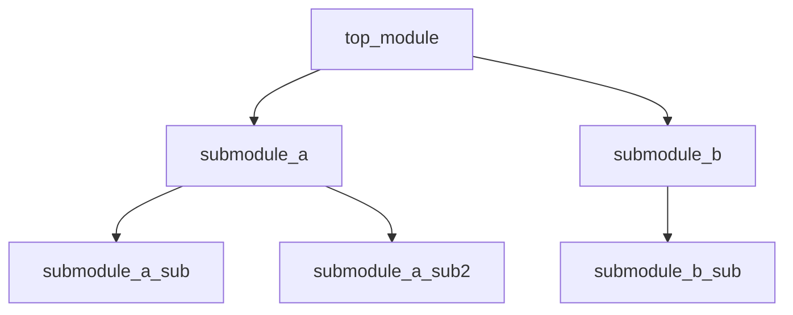

# Verilog 文件列表和模块例化树生成器 Skill 实现计划

## 目标

创建一个新的skill `verilog-file-tree`，用于从Verilog代码生成：
1. **文件列表** - 分析模块依赖关系，生成编译顺序文件列表
2. **模块例化树** - 生成模块层次结构和例化关系树

## 核心需求

1. **文件列表生成**: 
   - 分析模块定义和模块例化关系
   - 确定编译顺序（被依赖模块在前）
   - 输出文件列表（支持多种格式）

2. **模块例化树生成**:
   - 解析模块层次结构
   - 生成树形图展示例化关系
   - 支持多层嵌套显示

## 输出格式

### 1. 文件列表输出

**文本格式 (.f)**:
```
# Module dependency ordered file list
# Generated from: top_module.v
# Total files: 15

# Level 0 - Top module
top_module.v

# Level 1 - Direct submodules
submodule_a.v
submodule_b.v

# Level 2 - Nested submodules
submodule_a_sub.v
submodule_b_sub.v
```

**JSON格式**:
```json
{
  "top_module": "top_module",
  "total_files": 15,
  "compile_order": [
    {"file": "top_module.v", "module": "top_module", "level": 0},
    {"file": "submodule_a.v", "module": "submodule_a", "level": 1},
    {"file": "submodule_b.v", "module": "submodule_b", "level": 1}
  ],
  "dependencies": {
    "top_module": ["submodule_a", "submodule_b"],
    "submodule_a": ["submodule_a_sub"]
  }
}
```

### 2. 模块例化树输出

**Markdown格式 (Mermaid)**:


**文本格式 (ASCII树)**:
```
top_module
├── submodule_a (u_submodule_a)
│   ├── submodule_a_sub (u_sub_a)
│   └── submodule_a_sub2 (u_sub_a2)
└── submodule_b (u_submodule_b)
    └── submodule_b_sub (u_sub_b)
```

**JSON格式**:
```json
{
  "module": "top_module",
  "instance_name": "top_module",
  "file": "top_module.v",
  "children": [
    {
      "module": "submodule_a",
      "instance_name": "u_submodule_a",
      "file": "submodule_a.v",
      "children": [...]
    }
  ]
}
```

## 实现步骤

### 步骤 1: 创建Skill目录结构

```
d:\code\openc910\.trae\skills\verilog-file-tree\
├── SKILL.md                    # Skill主文件
└── scripts\
    └── file_tree_generator.py  # 文件树生成脚本
```

### 步骤 2: 编写 SKILL.md

**描述部分**:
- name: `verilog-file-tree`
- description: 从Verilog代码生成文件列表和模块例化树

**工作流程**:
1. 收集输入文件/目录
2. 解析所有Verilog文件，提取模块定义
3. 解析模块例化关系
4. 构建依赖图
5. 计算编译顺序
6. 生成输出文件

### 步骤 3: 编写 file_tree_generator.py

**核心类和函数**:

```python
@dataclass
class ModuleInfo:
    name: str
    file_path: str
    line_number: int
    ports: List[Port]
    parameters: List[Parameter]
    instances: List[InstanceInfo]

@dataclass
class InstanceInfo:
    module_name: str
    instance_name: str
    line_number: int
    connections: Dict[str, str]

@dataclass
class ModuleNode:
    module_name: str
    instance_name: str
    file_path: str
    children: List[ModuleNode]
    level: int

class FileTreeGenerator:
    def parse_verilog_file(file_path: str) -> ModuleInfo
    def parse_module_instantiation(content: str) -> List[InstanceInfo]
    def build_dependency_graph(modules: Dict[str, ModuleInfo]) -> Dict[str, List[str]]
    def calculate_compile_order(dependency_graph: Dict) -> List[str]
    def build_instance_tree(top_module: str, modules: Dict) -> ModuleNode
    def generate_file_list(compile_order: List, output_format: str) -> str
    def generate_instance_tree(tree: ModuleNode, output_format: str) -> str
```

### 步骤 4: 模块解析规则

**模块定义解析**:
```python
module_pattern = re.compile(r'module\s+(\w+)\s*(?:#\s*\((.*?)\))?\s*\((.*?)\);', re.DOTALL)
```

**模块例化解析**:
```python
# 标准例化格式
instantiation_pattern = re.compile(
    r'(\w+)\s+(?:#\s*\((.*?)\)\s*)?(\w+)\s*\((.*?)\)\s*;',
    re.DOTALL
)

# 支持的例化格式:
# 1. module_name instance_name (...)
# 2. module_name #(.PARAM(val)) instance_name (...)
# 3. module_name instance_name (.port(signal), ...)
```

### 步骤 5: 依赖图构建

**算法**:
1. 遍历所有模块，记录每个模块例化了哪些子模块
2. 构建邻接表表示的依赖图
3. 使用拓扑排序确定编译顺序
4. 检测循环依赖

**拓扑排序伪代码**:
```python
def topological_sort(graph):
    in_degree = {node: 0 for node in graph}
    for node in graph:
        for neighbor in graph[node]:
            in_degree[neighbor] += 1
    
    queue = [node for node in in_degree if in_degree[node] == 0]
    result = []
    
    while queue:
        node = queue.pop(0)
        result.append(node)
        for neighbor in graph[node]:
            in_degree[neighbor] -= 1
            if in_degree[neighbor] == 0:
                queue.append(neighbor)
    
    return result
```

### 步骤 6: 例化树构建

**递归构建**:
```python
def build_tree(module_name, instance_name, level=0):
    node = ModuleNode(module_name, instance_name, level)
    module_info = modules.get(module_name)
    
    if module_info:
        for inst in module_info.instances:
            child = build_tree(inst.module_name, inst.instance_name, level + 1)
            node.children.append(child)
    
    return node
```

### 步骤 7: 输出生成

**文件列表输出**:
- 文本格式 (.f) - 用于编译工具
- JSON格式 - 用于程序处理

**例化树输出**:
- Mermaid图 - Markdown文档
- ASCII树 - 纯文本
- JSON格式 - 程序处理

### 步骤 8: 命令行接口

```bash
# 生成文件列表
python file_tree_generator.py <verilog_file_or_dir> --output-filelist <output_path>

# 生成例化树
python file_tree_generator.py <verilog_file_or_dir> --output-tree <output_path>

# 同时生成两者
python file_tree_generator.py <verilog_file_or_dir> --output-dir <output_dir>

# 指定顶层模块
python file_tree_generator.py <verilog_file_or_dir> --top-module <module_name>
```

## 技术细节

### Verilog关键词过滤

```python
verilog_keywords = {
    'module', 'endmodule', 'input', 'output', 'inout', 'wire', 'reg',
    'always', 'assign', 'begin', 'end', 'if', 'else', 'case', 'endcase',
    'for', 'while', 'repeat', 'forever', 'initial', 'parameter', 'localparam',
    'generate', 'endgenerate', 'genvar', 'function', 'endfunction', 'task', 'endtask',
    'posedge', 'negedge', 'or', 'and', 'not', 'xor', 'nand', 'nor', 'xnor',
    'buf', 'not', 'tran', 'rtran', 'pullup', 'pulldown',
    'supply0', 'supply1', 'tri', 'triand', 'trior', 'trireg', 'tri0', 'tri1',
    'wand', 'wor', 'real', 'realtime', 'time', 'integer', 'signed', 'unsigned',
    'default', 'define', 'ifdef', 'ifndef', 'else', 'endif', 'include', 'timescale'
}
```

### 文件搜索策略

1. 在当前目录搜索同名文件
2. 在指定搜索路径中搜索
3. 支持通配符匹配
4. 支持相对路径和绝对路径

### 错误处理

1. 模块定义未找到
2. 循环依赖检测
3. 文件读取错误
4. 语法解析错误

## 文件清单

| 文件 | 路径 | 说明 |
|------|------|------|
| SKILL.md | .trae/skills/verilog-file-tree/SKILL.md | Skill定义文件 |
| file_tree_generator.py | .trae/skills/verilog-file-tree/scripts/ | 文件树生成脚本 |

## 验证测试

1. 使用OpenC910的顶层模块测试
2. 验证文件列表编译顺序正确性
3. 验证例化树层次结构正确性
4. 验证循环依赖检测
5. 验证多文件输入处理

## 使用示例

**用户输入示例**:
- "为这个模块生成文件列表"
- "分析模块例化层次结构"
- "生成编译顺序文件"
- "显示模块依赖关系"

**输出示例**:
```
生成完成:
  filelist: d:\output\filelist.f
  filelist_json: d:\output\filelist.json
  instance_tree_md: d:\output\instance_tree.md
  instance_tree_json: d:\output\instance_tree.json
```
