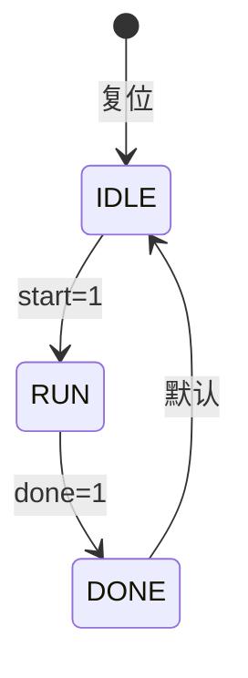

# 创建Verilog状态机转移图生成SKILL计划

## 任务概述

创建一个专门用于从Verilog代码生成状态机转移图的中文SKILL，支持：
1. **Markdown格式** - 使用Mermaid语法
2. **PNG图片格式** - 将Mermaid转换为PNG，用于嵌入Word文档

同时修改 `verilog-doc-generator` skill，使其调用 `verilog-state-diagram` 技能处理状态机部分。

## 技术分析

### 现有资源
- `verilog-doc-generator` skill: 已有状态机检测逻辑，需要修改为调用新skill
- `docx` skill: 提供了Word文档生成和图片嵌入的方法
- `verilog-sv-language` skill: 提供Verilog语法参考

### Mermaid转PNG方案

使用 `mmdc` (Mermaid CLI) 或 `puppeteer` 将Mermaid图转换为PNG：

```bash
# 安装mermaid-cli
npm install -g @mermaid-js/mermaid-cli

# 转换命令
mmdc -i input.mmd -o output.png -b white -w 2048 -H 1024
```

或者在Node.js中使用：
```javascript
const { run } = require('@mermaid-js/mermaid-cli');
await run('-i', 'diagram.mmd', '-o', 'diagram.png');
```

### 状态机识别模式

Verilog状态机通常有以下编码风格：

1. **三段式状态机**（推荐）：
   - 状态寄存器always块
   - 状态转移逻辑always块
   - 输出逻辑always块或assign

2. **两段式状态机**：
   - 状态寄存器always块
   - 组合逻辑always块（状态转移+输出）

3. **一段式状态机**：
   - 单个always块包含所有逻辑

### 状态编码方式
- 独热码 (One-hot)
- 二进制编码
- 格雷码
- 用户自定义编码

## 实现步骤

### Step 1: 创建SKILL目录结构

```
verilog-state-diagram/
├── SKILL.md          # 主skill文件
└── scripts/          # 辅助脚本
    └── mermaid_to_png.js  # Mermaid转PNG脚本
```

### Step 2: 编写SKILL.md内容

**YAML Frontmatter**:
```yaml
name: verilog-state-diagram
description: |
  从Verilog RTL源文件生成状态机转移图。
  自动检测状态机类型、提取状态列表和转移条件。
  输出Markdown (Mermaid) 格式和PNG图片格式。
  当用户想要生成状态机图、状态转移图、FSM图、状态列表时使用此技能。
  其他skill可通过调用此skill获取状态机分析结果。
```

**核心功能模块**:

1. **状态机检测模块**
   - 检测状态寄存器定义模式
   - 识别状态编码方式
   - 区分Moore型和Mealy型状态机

2. **状态提取模块**
   - 提取状态名称和编码值
   - 从parameter/localparam提取状态定义
   - 从typedef enum提取状态定义

3. **转移条件提取模块**
   - 解析case语句
   - 提取if-else条件
   - 关联转移条件与目标状态

4. **输出生成模块**
   - Mermaid stateDiagram-v2语法生成
   - PNG图片生成（调用mmdc）

### Step 3: 状态机解析逻辑

**检测状态寄存器**:
```verilog
// 模式1: 显式状态命名
reg [2:0] current_state, next_state;
reg [2:0] state, nxt_state;
reg [2:0] cs, ns;

// 模式2: SystemVerilog枚举
typedef enum logic [2:0] { IDLE, RUN, DONE } state_t;
state_t current_state, next_state;
```

**检测状态定义**:
```verilog
// 模式1: parameter定义
parameter IDLE = 3'b000, RUN = 3'b001, DONE = 3'b010;

// 模式2: localparam定义
localparam IDLE = 3'b000, RUN = 3'b001, DONE = 3'b010;

// 模式3: 枚举定义
typedef enum logic [2:0] { IDLE, RUN, DONE } state_t;
```

**提取转移条件**:
```verilog
// 从case语句提取
case (current_state)
  IDLE: if (start) next_state = RUN;
  RUN: if (done) next_state = DONE;
  DONE: next_state = IDLE;
endcase
```

### Step 4: 输出格式定义

**Markdown格式 (Mermaid)**:


**PNG生成流程**:
1. 生成Mermaid语法文件 (.mmd)
2. 调用mmdc转换为PNG
3. 返回PNG文件路径

### Step 5: 状态列表表格格式

```markdown
| 状态名称 | 编码值 | 描述 |
|----------|--------|------|
| IDLE     | 3'b000 | 空闲状态 |
| RUN      | 3'b001 | 运行状态 |
| DONE     | 3'b010 | 完成状态 |
```

### Step 6: 转移条件表格格式

```markdown
| 当前状态 | 目标状态 | 转移条件 | 描述 |
|----------|----------|----------|------|
| IDLE     | RUN      | start=1  | 启动信号有效 |
| RUN      | DONE     | done=1   | 完成信号有效 |
| DONE     | IDLE     | 默认     | 返回空闲 |
```

### Step 7: 修改verilog-doc-generator

修改 `verilog-doc-generator/SKILL.md`，在状态机检测部分改为调用 `verilog-state-diagram` skill：

**修改内容**:
- 删除原有的状态机检测逻辑
- 添加调用 `verilog-state-diagram` skill的说明
- 使用返回的Mermaid语法或PNG图片

## 文件创建/修改清单

| 序号 | 操作 | 文件路径 | 说明 |
|------|------|----------|------|
| 1 | 创建 | `C:/Users/mouxi/.trae-cn/skills/verilog-state-diagram/SKILL.md` | 主skill文件 |
| 2 | 创建 | `C:/Users/mouxi/.trae-cn/skills/verilog-state-diagram/scripts/mermaid_to_png.js` | Mermaid转PNG脚本 |
| 3 | 修改 | `C:/Users/mouxi/.trae-cn/skills/verilog-doc-generator/SKILL.md` | 修改状态机处理部分 |

## SKILL.md 完整内容结构

```markdown
---
name: verilog-state-diagram
description: |
  从Verilog RTL源文件生成状态机转移图。
  自动检测状态机类型、提取状态列表和转移条件。
  输出Markdown (Mermaid) 格式和PNG图片格式。
  当用户想要生成状态机图、状态转移图、FSM图、状态列表时使用此技能。
  其他skill可通过调用此skill获取状态机分析结果。
---

# Verilog状态机转移图生成器

## 功能概述
从Verilog源代码自动分析并生成状态机转移图，支持Mermaid和PNG两种输出格式。

## 使用场景
- 用户想要分析Verilog状态机
- 用户需要生成状态转移图
- 用户需要提取状态列表和转移条件
- 用户需要将状态机图嵌入Word文档
- 其他skill需要状态机分析功能

## 工作流程

### Step 1: 收集输入文件
[详细说明...]

### Step 2: 检测状态机
[详细说明...]

### Step 3: 提取状态定义
[详细说明...]

### Step 4: 提取转移条件
[详细说明...]

### Step 5: 生成Mermaid语法
[详细说明...]

### Step 6: 转换为PNG（可选）
[详细说明...]

## 输出格式

### Mermaid格式
[语法示例...]

### PNG格式
[转换方法...]

## 状态列表和转移条件表格
[表格格式示例...]

## 被其他Skill调用
[调用接口说明...]
```

## verilog-doc-generator修改内容

在 `verilog-doc-generator/SKILL.md` 中修改状态机检测部分：

**原内容**:
```
**State Machine Detection:**
1. Search for state register definitions...
2. Search for state transition logic...
...
```

**修改为**:
```
**State Machine Detection:**
调用 `verilog-state-diagram` skill进行状态机分析，获取：
- 状态列表
- 转移条件
- Mermaid状态图语法
- PNG图片路径（如需要）

具体调用方法：
1. 使用Skill工具调用verilog-state-diagram
2. 传递Verilog文件内容
3. 获取返回的状态机分析结果
4. 将结果整合到文档中
```

## 验证计划

1. 创建测试用例Verilog文件
2. 使用skill解析测试文件
3. 验证生成的Mermaid语法正确性
4. 验证PNG转换功能
5. 验证verilog-doc-generator调用新skill的正确性

## 依赖项

- Node.js
- @mermaid-js/mermaid-cli (mmdc)
- puppeteer (mmdc依赖)
