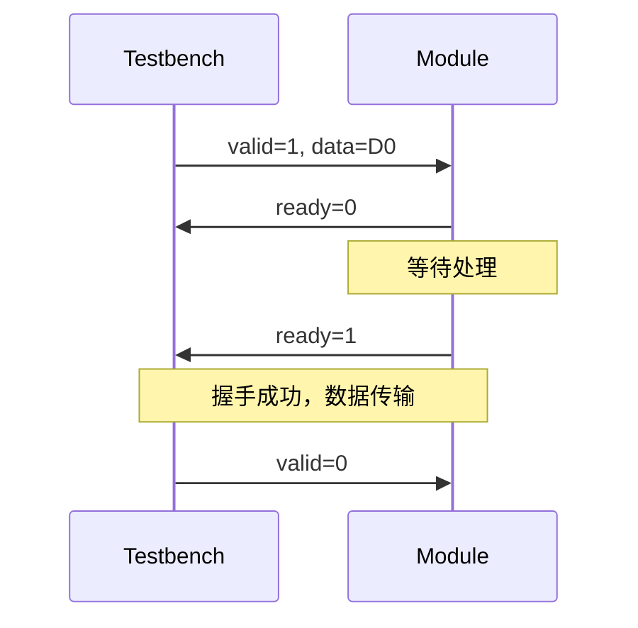

# Verilog 接口时序图生成器 Skill 实现计划

## 目标

创建一个新的skill `verilog-timing-diagram`，用于从Verilog代码生成模块接口时序图，支持三种输出文件：

1. **Markdown文件** - 使用Mermaid Sequence Diagram格式
2. **WaveDrom JSON文件** - 用于波形描述
3. **PNG图片** - 使用WaveDrom CLI导出

## 核心需求

1. **时序识别**: 结合信号名称和代码内容来识别时序关系
2. **输出格式**:

   * Markdown格式（Mermaid Sequence Diagram语法）

   * WaveDrom JSON文件（独立文件）

   * PNG图片（使用WaveDrom CLI导出）
3. **集成**: 被 `verilog-doc-generator` 调用

## 输出文件说明

### 1. Markdown文件 (`{module}_timing.md`)

使用Mermaid Sequence Diagram展示时序：



### 2. WaveDrom JSON文件 (`{module}_timing.json`)

```json
{
  "signal": [
    {"name": "clk", "wave": "p......"},
    {"name": "valid", "wave": "01.0.."},
    {"name": "ready", "wave": "0.1.0."},
    {"name": "data", "wave": "x.=x..", "data": ["D0"]}
  ],
  "head": {"text": "Valid-Ready 握手时序"}
}
```

### 3. PNG文件 (`{module}_timing.png`)

使用WaveDrom CLI从JSON文件生成PNG图片。

## 实现步骤

### 步骤 1: 修改timing\_diagram\_generator.py

**新增功能**:

1. `generate_mermaid_sequence()` - 生成Mermaid Sequence Diagram
2. `save_output_files()` - 保存三个独立文件
3. 修改命令行参数支持输出目录

### 步骤 2: Mermaid Sequence Diagram生成规则

**时序模式映射**:

| 时序模式        | Mermaid序列图描述               |
| ----------- | -------------------------- |
| Valid-Ready | TB发送valid，DUT响应ready，数据传输  |
| Req-Ack     | TB发送req，DUT响应ack           |
| FIFO Write  | TB发送wr\_en和数据，DUT返回full状态  |
| FIFO Read   | TB发送rd\_en，DUT返回数据和empty状态 |
| AXI Write   | 地址通道握手，数据通道握手，响应通道握手       |
| AXI Read    | 地址通道握手，数据通道握手              |
| APB         | SETUP阶段，ACCESS阶段           |
| Reset       | 复位释放，初始化完成                 |

### 步骤 3: 输出文件结构

```
output_dir/
├── {module}_timing.md      # Mermaid Sequence Diagram
├── {module}_timing.json    # WaveDrom JSON
└── {module}_timing.png     # PNG图片（可选）
```

### 步骤 4: 更新SKILL.md

* 更新描述：MD格式使用Mermaid Sequence Diagram

* 更新输出说明：三个独立文件

* 更新使用示例

### 步骤 5: 修改verilog-doc-generator

在需要时序图的地方调用本skill，获取三个文件路径。

## 技术细节

### Mermaid Sequence Diagram生成

````python
def generate_mermaid_sequence(self, pattern: TimingPattern, ports: List[Port], module_name: str) -> str:
    lines = ["```mermaid", f"sequenceDiagram"]
    
    # 添加参与者
    lines.append("    participant TB as Testbench/上游模块")
    lines.append(f"    participant DUT as {module_name}")
    
    # 根据时序模式生成序列
    if pattern.pattern_type == TimingPatternType.VALID_READY:
        # Valid-Ready握手序列
        valid_name = pattern.signals[0]
        ready_name = pattern.signals[1]
        data_name = pattern.signals[2] if len(pattern.signals) > 2 else None
        
        lines.append(f"    TB->>DUT: {valid_name}=1")
        if data_name:
            lines.append(f"    TB->>DUT: {data_name}=D0")
        lines.append(f"    DUT->>TB: {ready_name}=0")
        lines.append("    Note over DUT: 等待处理")
        lines.append(f"    DUT->>TB: {ready_name}=1")
        lines.append("    Note over TB,DUT: 握手成功")
        lines.append(f"    TB->>DUT: {valid_name}=0")
    
    # ... 其他模式
    
    lines.append("```")
    return '\n'.join(lines)
````

### 文件保存逻辑

```python
def save_output_files(self, result: Dict, output_dir: str, module_name: str) -> Dict[str, str]:
    os.makedirs(output_dir, exist_ok=True)
    
    base_name = f"{module_name}_timing"
    
    # 保存MD文件
    md_path = os.path.join(output_dir, f"{base_name}.md")
    with open(md_path, 'w', encoding='utf-8') as f:
        f.write(self.generate_markdown_file(result))
    
    # 保存WaveDrom JSON文件
    json_path = os.path.join(output_dir, f"{base_name}.json")
    with open(json_path, 'w', encoding='utf-8') as f:
        f.write(result['timing_diagrams'][0]['wavedrom_json'])
    
    # 导出PNG
    png_path = os.path.join(output_dir, f"{base_name}.png")
    self.export_png(result['timing_diagrams'][0]['wavedrom_json'], png_path)
    
    return {
        "md_path": md_path,
        "json_path": json_path,
        "png_path": png_path
    }
```

## 文件清单

| 文件                            | 路径                                           | 说明        |
| ----------------------------- | -------------------------------------------- | --------- |
| SKILL.md                      | .trae/skills/verilog-timing-diagram/SKILL.md | Skill定义文件 |
| timing\_diagram\_generator.py | .trae/skills/verilog-timing-diagram/scripts/ | 时序图生成脚本   |

## 验证测试

1. 使用OpenC910的AXI接口模块测试
2. 验证Mermaid Sequence Diagram生成正确性
3. 验证WaveDrom JSON文件生成
4. 验证PNG导出功能
5. 验证三个独立文件的输出

## 依赖项

* Node.js (用于WaveDrom CLI)

* wavedrom-cli: `npm install -g wavedrom-cli`

* Python json 库 (内置)

