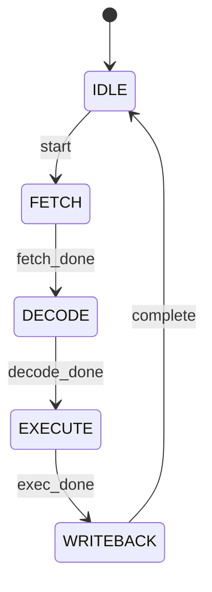
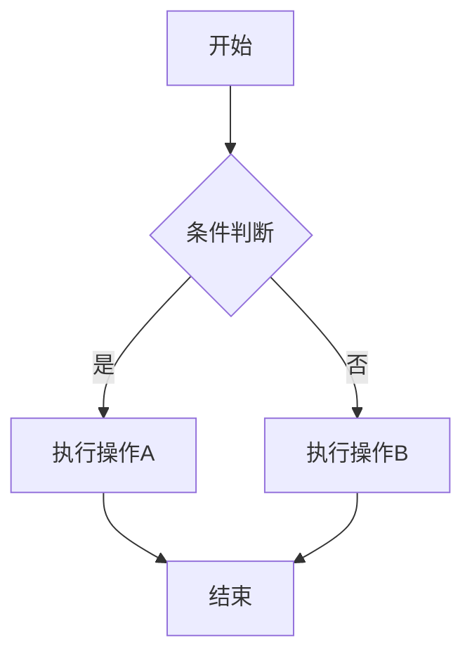

# Verilog 模块文档生成 Skill 开发计划

## 1. Skill 概述

### 1.1 目标
创建一个 skill，能够基于单个或多个 Verilog 源文件自动生成详细的模块方案文档，支持输出 Markdown 和 Word (docx) 格式。

### 1.2 主要功能
1. 解析 Verilog 源文件，提取模块信息
2. 生成模块功能说明
3. 生成模块接口说明（接口列表、数据结构、时序）
4. 生成模块参数说明
5. 生成模块框图
6. 生成模块实现方案（基于代码和注释）
7. 自动检测并生成状态转移图
8. 自动检测并生成流水线图
9. 自动检测并生成流程图
10. 生成内部关键信号列表
11. 生成模块表项设置
12. 生成子模块方案（文件引用方式）
13. 生成可测试性设计说明

## 2. 技术实现方案

### 2.1 Verilog 解析策略
使用正则表达式和代码分析相结合的方式：

**模块头解析**:
```python
# 提取模块定义
module_pattern = r'module\s+(\w+)\s*(?:#\s*\((.*?)\))?\s*\((.*?)\);'
# 提取端口列表
port_pattern = r'(input|output|inout)\s+(?:\[(\d+):(\d+)\]\s+)?(\w+)'
# 提取参数
param_pattern = r'parameter\s+(?:\[(\d+):(\d+)\]\s+)?(\w+)\s*=\s*(.+?);'
```

**信号解析**:
```python
# wire/reg 定义
wire_pattern = r'wire\s+(?:\[(\d+):(\d+)\]\s+)?(\w+(?:\s*,\s*\w+)*)\s*;'
reg_pattern = r'reg\s+(?:\[(\d+):(\d+)\]\s+)?(\w+(?:\s*,\s*\w+)*)\s*;'
```

**子模块实例化**:
```python
# 模块实例化
instance_pattern = r'(\w+)\\s+(?:#\s*\((.*?)\))?\s+(\w+)\s*\((.*?)\);'
```

### 2.2 状态机检测算法
```python
def detect_state_machine(code):
    # 检测三段式状态机特征
    # 1. 状态寄存器定义
    # 2. 状态转移逻辑 (always @(posedge clk))
    # 3. 输出逻辑
    
    patterns = {
        'state_reg': r'reg\s+(?:\[(\d+):(\d+)\]\s+)?(\w+_state|\w+_st)',
        'state_transition': r'always\s*@\s*\(posedge\s+\w+\).*?case\s*\((\w+)\)',
        'state_assignment': r'(\w+)\s*<=\s*(\w+_state|\w+_st)'
    }
    # 返回状态列表和转移条件
```

### 2.3 流水线检测算法
```python
def detect_pipeline(code):
    # 检测流水线特征
    # 1. 流水线寄存器命名 (pipe0, pipe1, ex1, ex2)
    # 2. 流水线控制信号 (valid, ready, stall)
    # 3. 级间传递逻辑
    
    patterns = {
        'pipe_reg': r'(pipe\d+|ex\d+|id\d+|if\d+|mem\d+|wb\d+)_(\w+)',
        'valid_signal': r'(\w+_valid|valid_\w+)',
        'ready_signal': r'(\w+_ready|ready_\w+)'
    }
```

### 2.4 分支逻辑检测算法
```python
def detect_branch_logic(code):
    # 检测分支处理逻辑
    # 1. if-else 条件分支
    # 2. case 语句
    # 3. 条件表达式
    
    patterns = {
        'if_else': r'if\s*\((.*?)\)\s*begin(.*?)end(?:\s*else\s*(?:if\s*\(.*?\)\s*begin.*?end)*)*(?:\s*else\s*begin.*?end)?',
        'case_stmt': r'case\s*\((.*?)\)(.*?)endcase'
    }
```

### 2.5 图表生成策略

**状态转移图 (Mermaid)**:


**流水线图 (Mermaid)**:


**流程图 (Mermaid)**:


### 2.6 文档输出格式

**Markdown 格式**:
- 使用标准 Markdown 语法
- 表格使用 GFM 格式
- 图表使用 Mermaid 语法

**Word 格式**:
- 使用 python-docx 库
- 表格格式化
- 图表嵌入为图片

## 3. Skill 工作流程

### Step 1: 输入处理
1. 接收用户输入的 Verilog 文件路径
2. 支持单个文件或目录
3. 读取文件内容

### Step 2: 代码解析
1. 提取模块定义
2. 解析端口和参数
3. 解析内部信号
4. 提取注释信息
5. 识别子模块实例

### Step 3: 智能分析
1. 检测状态机结构
2. 检测流水线结构
3. 检测分支逻辑
4. 识别关键信号

### Step 4: 文档生成
1. 生成模块功能说明
2. 生成接口表格
3. 生成参数表格
4. 生成模块框图
5. 生成实现方案描述
6. 生成状态/流水线/流程图
7. 生成信号列表
8. 生成表项设置
9. 生成子模块引用
10. 生成可测试性说明

### Step 5: 输出处理
1. 根据用户选择输出格式
2. Markdown: 直接输出 .md 文件
3. Word: 使用 python-docx 生成 .docx 文件
4. 多文件时生成索引文档

## 4. Skill 文件结构

```
verilog-doc-generator/
├── SKILL.md              # Skill 主文件
├── scripts/
│   ├── verilog_parser.py     # Verilog 解析脚本
│   ├── doc_generator.py      # 文档生成脚本
│   ├── diagram_generator.py  # 图表生成脚本
│   └── docx_generator.py     # Word 文档生成脚本
├── templates/
│   ├── module_template.md    # Markdown 模板
│   └── module_template.docx  # Word 模板
└── references/
    ├── verilog_syntax.md     # Verilog 语法参考
    └── mermaid_syntax.md     # Mermaid 语法参考
```

## 5. SKILL.md 内容框架

```markdown
---
name: verilog-doc-generator
description: |
  Generate detailed module documentation from Verilog source files.
  Supports single or multiple files, outputs Markdown and Word formats.
  Automatically detects state machines, pipelines, and branch logic.
  Creates interface tables, parameter lists, block diagrams, and implementation details.
---

# Verilog Module Documentation Generator

## Purpose
Generate comprehensive documentation for Verilog modules...

## When to Use
- User wants to document Verilog/RTL code
- User asks for module specification from code
- User needs design documentation from Verilog

## Workflow

### 1. Parse Input Files
[解析步骤]

### 2. Analyze Code Structure
[分析步骤]

### 3. Generate Documentation
[生成步骤]

## Output Format
[输出格式说明]

## Scripts
[脚本使用说明]
```

## 6. 测试计划

### 6.1 测试用例
1. **简单模块**: 单个简单 Verilog 模块
2. **状态机模块**: 包含状态机的模块
3. **流水线模块**: 包含流水线结构的模块
4. **多模块**: 多个相关联的模块
5. **复杂模块**: 包含多种结构的复杂模块

### 6.2 验证点
- [ ] 模块名正确提取
- [ ] 端口列表完整
- [ ] 参数正确识别
- [ ] 状态机正确检测
- [ ] 流水线正确识别
- [ ] 图表正确生成
- [ ] Markdown 格式正确
- [ ] Word 格式正确
- [ ] 子模块引用正确

## 7. 实施步骤

### Phase 1: 基础框架 (Day 1)
- [ ] 创建 SKILL.md 主文件
- [ ] 创建基础脚本框架
- [ ] 实现 Verilog 文件读取

### Phase 2: 解析器实现 (Day 2)
- [ ] 实现模块头解析
- [ ] 实现端口提取
- [ ] 实现参数提取
- [ ] 实现信号提取
- [ ] 实现注释提取

### Phase 3: 智能分析 (Day 3)
- [ ] 实现状态机检测
- [ ] 实现流水线检测
- [ ] 实现分支逻辑检测
- [ ] 实现关键信号识别

### Phase 4: 文档生成 (Day 4)
- [ ] 实现 Markdown 生成
- [ ] 实现 Word 生成
- [ ] 实现图表生成
- [ ] 实现多文件组织

### Phase 5: 测试优化 (Day 5)
- [ ] 创建测试用例
- [ ] 运行 eval 测试
- [ ] 根据反馈优化

---

*计划版本: 1.0*
*创建日期: 2026-03-09*
