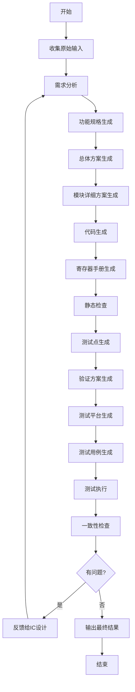

# 芯片设计工作流调度器

## 功能概述

本SKILL作为芯片设计工作流的调度器，协调各个SKILL执行完整的芯片设计流程，从需求分析到代码生成的全过程。

## 使用场景

- 需要从零开始执行完整的芯片设计流程
- 需要协调多个SKILL协同工作
- 需要检查和验证每个阶段的输出质量
- 需要迭代优化直到输出达标

## 工作流程

### Step 1: 收集原始输入

收集以下原始输入：

1. **原始需求文档**：用户提供的初始需求描述
2. **参考文档**：现有的设计文档、编码规范等
3. **项目配置**：项目名称、目标工艺等

### Step 2: 执行需求分析阶段

调用 `requirements-analyzer` SKILL：

1. 解析原始需求
2. 识别问题和不明确点
3. 生成问题清单让用户确认
4. 输出明确的需求列表

**输出**：
- 明确的需求列表（Gherkin格式）
- 问题清单和确认状态

### Step 3: 执行功能规格生成阶段

调用 `functional-spec-generator` SKILL：

1. 基于明确需求生成功能规格说明书
2. 定义功能模块划分
3. 定义接口规范
4. 定义性能指标

**输出**：
- 功能规格说明书（Markdown格式）
- 功能规格说明书（Word格式，可选）

### Step 4: 执行总体方案生成阶段

调用 `top-level-design-generator` SKILL：

1. 基于功能规格生成总体方案
2. 定义系统架构
3. 划分子系统
4. 定义系统接口
5. 制定地址规划

**输出**：
- 芯片总体方案文档

### Step 5: 执行模块详细方案生成阶段

调用 `module-design-generator` SKILL：

对每个模块执行：
1. 读取功能规格和总体方案中相关部分
2. 生成模块详细方案
3. 调用 `verilog-state-diagram` 生成状态机图
4. 调用 `verilog-block-diagram` 生成模块框图

**输出**：
- 各模块的详细方案文档

### Step 6: 执行代码生成阶段

调用 `rtl-code-generator` SKILL：

对每个模块执行：
1. 读取模块详细方案
2. 生成Verilog RTL代码
3. 遵循编码规范

**输出**：
- Verilog RTL代码文件

### Step 7: 执行寄存器手册生成阶段

调用 `register-manual-generator` SKILL：

对每个模块执行：
1. 读取模块详细方案中的寄存器定义
2. 生成寄存器手册

**输出**：
- 各模块的寄存器手册

### Step 8: 执行静态检查阶段

调用 `verilog-linter` SKILL：

1. 对生成的代码进行静态检查
2. 分析检查结果
3. 自动修复可修复的问题
4. 标记需要手动修复的问题

**输出**：
- 静态检查报告
- 修复后的代码

### Step 9: 执行测试点生成阶段

调用 `test-point-generator` SKILL：

1. 基于明确需求生成测试点文档
2. 覆盖功能测试点
3. 覆盖边界测试点
4. 覆盖异常测试点
5. 覆盖性能测试点

**输出**：
- 测试点文档

### Step 10: 执行验证方案生成阶段

调用 `verification-plan-generator` SKILL：

1. 基于测试点生成验证方案
2. 定义验证环境
3. 制定验证策略
4. 规划验证进度
5. 设定覆盖率目标

**输出**：
- 验证方案文档

### Step 11: 执行测试平台生成阶段

调用 `testbench-generator` SKILL：

1. 基于验证方案生成测试平台
2. 生成UVM环境
3. 生成Agent、Driver、Monitor等组件
4. 生成Scoreboard

**输出**：
- 测试平台代码

### Step 12: 执行测试用例生成阶段

调用 `test-case-generator` SKILL：

1. 基于验证方案和测试点生成测试用例
2. 生成功能测试用例
3. 生成随机测试用例
4. 生成边界测试用例

**输出**：
- 测试用例代码

### Step 13: 执行测试执行和问题反馈阶段

1. 使用测试平台和测试用例执行测试
2. 收集测试结果
3. 分析RTL问题
4. 反馈给IC设计专家修改

**输出**：
- 测试结果报告
- RTL问题反馈

### Step 14: 执行一致性检查阶段

调用 `consistency-checker` SKILL：

1. 检查需求列表与总体方案的一致性
2. 检查总体方案与模块方案的一致性
3. 检查模块方案与RTL代码的一致性
4. 反馈问题给IC设计专家

**输出**：
- 一致性检查报告
- 问题反馈

### Step 15: 质量验证阶段

检查各阶段输出质量：

**需求质量检查**：
- [ ] 需求完整、明确
- [ ] 无歧义和矛盾
- [ ] 可验证

**文档质量检查**：
- [ ] 文档结构完整
- [ ] 内容准确
- [ ] 格式规范

**代码质量检查**：
- [ ] 通过静态检查
- [ ] 符合编码规范
- [ ] 可综合

### Step 10: 迭代优化

如果质量检查未通过：

1. **问题识别**：确定未通过的原因
2. **返回修正**：返回到相应阶段重新执行
3. **重复验证**：重新验证质量
4. **直到达标**：持续迭代直到所有输出达标

## 工作流图



## 执行日志

### 执行日志模板

```markdown
# 芯片设计流程执行日志

## 项目信息

| 项目 | 内容 |
|------|------|
| 项目名称 | |
| 开始时间 | |
| 结束时间 | |
| 状态 | |

---

## 执行阶段

### 阶段 1: 需求分析

| 项目 | 内容 |
|------|------|
| 开始时间 | |
| 结束时间 | |
| 状态 | 完成/进行中/失败 |

**输入**：原始需求文档

**输出**：
- 明确的需求列表
- 问题清单

---

### 阶段 2: 功能规格生成

| 项目 | 内容 |
|------|------|
| 开始时间 | |
| 结束时间 | |
| 状态 | 完成/进行中/失败 |

**输入**：明确的需求列表

**输出**：
- 功能规格说明书

---

[后续阶段...]
```

## 质量标准

### 需求质量标准

| 标准 | 描述 |
|------|------|
| 完整性 | 所有需求都有明确的触发条件和预期结果 |
| 明确性 | 无模糊表述，可准确理解 |
| 一致性 | 需求之间无矛盾 |
| 可验证性 | 需求可以被测试验证 |

### 文档质量标准

| 标准 | 描述 |
|------|------|
| 完整性 | 包含所有必要章节 |
| 准确性 | 内容准确无误 |
| 规范性 | 格式符合规范 |
| 可读性 | 图表清晰，易于理解 |

### 代码质量标准

| 标准 | 描述 |
|------|------|
| 功能正确 | 实现与设计一致 |
| 静态检查 | 通过所有检查规则 |
| 编码规范 | 符合项目编码规范 |
| 可综合性 | 代码可综合 |

## 错误处理

### 常见错误及处理

| 错误类型 | 原因 | 处理方式 |
|----------|------|----------|
| 需求不明确 | 原始需求模糊 | 返回需求分析阶段 |
| 功能遗漏 | 需求分析不完整 | 返回功能规格阶段 |
| 接口不一致 | 模块间接口冲突 | 返回模块方案阶段 |
| 代码错误 | 实现与设计不符 | 修复代码重新检查 |

### 迭代策略

1. **小问题**：在当前阶段内修复
2. **中等问题**：返回上一阶段修复
3. **大问题**：返回需求阶段重新开始

## 输出产物

### 最终输出清单

| 产物 | 描述 | 格式 |
|------|------|------|
| 明确需求列表 | 经过确认的需求 | Markdown |
| 功能规格说明书 | 芯片功能规格 | Markdown/Docx |
| 总体方案文档 | 芯片总体设计 | Markdown/Docx |
| 模块详细方案 | 各模块详细设计 | Markdown/Docx |
| RTL代码 | Verilog代码 | .v |
| 寄存器手册 | 寄存器定义 | Markdown/Docx |
| 静态检查报告 | 代码检查结果 | Markdown |

## 注意事项

1. **质量第一**：每个阶段都要保证质量再进入下一阶段
2. **可追溯**：保持各阶段产物的关联关系
3. **用户确认**：关键阶段需要用户确认
4. **迭代优化**：发现问题及时迭代修复
5. **完整记录**：记录每个阶段的执行情况

## 相关SKILL

- `requirements-analyzer`: 需求分析与明确化
- `functional-spec-generator`: 功能规格生成
- `top-level-design-generator`: 总体方案生成
- `module-design-generator`: 模块详细方案生成
- `rtl-code-generator`: RTL代码生成
- `register-manual-generator`: 寄存器手册生成
- `verilog-linter`: 静态检查与代码修改
- `verilog-state-diagram`: 状态机图生成
- `verilog-block-diagram`: 模块框图生成

## 执行示例

### 输入

```
项目名称: MyCPU
原始需求: 实现一个RISC-V处理器核，支持RV64GC指令集...
```

### 执行过程

```
[09:00] 开始执行芯片设计流程
[09:05] 阶段1: 需求分析 - 开始
[09:15] 阶段1: 需求分析 - 完成
[09:20] 阶段2: 功能规格生成 - 开始
[09:45] 阶段2: 功能规格生成 - 完成
[09:50] 阶段3: 总体方案生成 - 开始
[10:20] 阶段3: 总体方案生成 - 完成
[10:25] 阶段4: 模块详细方案生成 - 开始
[12:00] 阶段4: 模块详细方案生成 - 完成 (5个模块)
[12:05] 阶段5: 代码生成 - 开始
[14:30] 阶段5: 代码生成 - 完成 (5个模块)
[14:35] 阶段6: 寄存器手册生成 - 开始
[15:00] 阶段6: 寄存器手册生成 - 完成
[15:05] 阶段7: 静态检查 - 开始
[15:30] 阶段7: 静态检查 - 发现3个问题
[15:35] 阶段8: 代码修复 - 开始
[16:00] 阶段8: 代码修复 - 完成
[16:05] 阶段9: 重新静态检查 - 通过
[16:10] 流程完成
```

### 输出

```
输出目录: output/
├── requirements/
│   └── requirements_clarified.md
├── specs/
│   ├── functional_spec.md
│   └── functional_spec.docx
├── design/
│   ├── top_level_design.md
│   └── top_level_design.docx
├── modules/
│   ├── ifu/
│   │   ├── module_design.md
│   │   └── rtl/
│   │       └── ct_ifu.v
│   ├── idu/
│   ├── iu/
│   └── lsu/
├── registers/
│   ├── ifu_regs.md
│   └── ...
└── reports/
    └── lint_report.md
```
