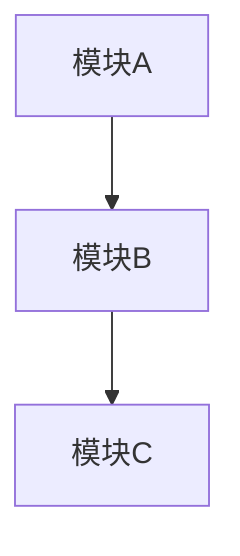

# 功能规格说明书生成

## 功能概述

本SKILL根据明确的需求列表生成完整的芯片功能规格说明书。

## 使用场景

- 需求分析完成，需要生成功能规格说明书
- 需要将需求转化为正式的功能规格文档
- 需要定义芯片的功能边界和接口规范

## 工作流程

### Step 1: 收集输入

1. 读取明确的需求列表（来自requirements-analyzer SKILL的输出）
2. 读取任何相关的参考文档
3. 确认需求已经过用户确认

### Step 2: 分析需求

从需求中提取以下信息：

**功能需求**：
- 需要实现的功能列表
- 功能的优先级
- 功能的依赖关系

**接口需求**：
- 外部接口信号
- 协议规范
- 时序要求

**性能需求**：
- 时钟频率
- 响应时间
- 吞吐量
- 功耗

**可靠性需求**：
- 错误检测
- 异常处理
- 复位策略

### Step 3: 生成功能规格说明书

按以下结构生成文档：

## 功能规格说明书模板

```markdown
# [芯片名称] 功能规格说明书

## 文档信息

| 项目 | 内容 |
|------|------|
| 文档版本 | 1.0 |
| 创建日期 | [日期] |
| 作者 | [作者] |
| 审核 | [审核人] |

---

## 1. 概述

### 1.1 芯片简介

[芯片的简要介绍，包括：
- 芯片类型和定位
- 主要应用领域
- 核心技术特点]

### 1.2 技术指标

| 指标 | 规格 | 备注 |
|------|------|------|
| 工艺 | | |
| 核心数 | | |
| 主频 | | |
| 功耗 | | |
| 封装 | | |
| 电源电压 | | |

### 1.3 功能清单

| 序号 | 功能名称 | 功能描述 | 优先级 |
|------|----------|----------|--------|
| F01 | 功能1 | 描述 | 高 |
| F02 | 功能2 | 描述 | 高 |

---

## 2. 功能详细描述

### 2.1 功能模块划分

[芯片的功能模块划分，包括：
- 整体架构图（使用Mermaid）
- 各模块的功能划分
- 模块之间的协作关系]



### 2.2 功能模块详细描述

#### 2.2.1 [模块A]

**功能描述**：
[模块A的详细功能描述]

**功能列表**：

| 功能ID | 功能名称 | 功能描述 |
|--------|----------|----------|
| A-01 | 功能1 | 描述 |
| A-02 | 功能2 | 描述 |

**接口信号**：

| 信号名 | 方向 | 描述 |
|--------|------|------|
| clk | Input | 时钟 |
| rst_n | Input | 复位 |

**性能要求**：
- 延迟：XXX周期
- 吞吐量：XXX

---

## 3. 接口定义

### 3.1 外部接口

#### 3.1.1 时钟和复位

| 信号 | 方向 | 描述 |
|------|------|------|
| clk | Input | 系统时钟 |
| rst_n | 异步复位，低电平有效 |

#### 3.1.2 外设接口

[列出所有外设接口]

### 3.2 内部接口

[芯片内部各模块之间的接口定义]

---

## 4. 寄存器定义

### 4.1 寄存器概述

[寄存器文件的总体介绍]

### 4.2 寄存器列表

| 寄存器名 | 地址 | 访问类型 | 描述 |
|----------|------|----------|------|
| REG_A | 0x00 | RW | 描述 |

### 4.3 寄存器详细定义

#### 4.3.1 REG_A (0x00)

**描述**：[描述]

**位定义**：

| 位 | 名称 | 访问 | 描述 |
|----|------|------|------|
| [31:16] | FIELD1 | RW | 字段1 |
| [15:0] | FIELD2 | RO | 字段2 |

---

## 5. 性能指标

### 5.1 时序

| 项目 | 指标 | 备注 |
|------|------|------|
| 最高工作频率 | | |
| 建立时间 | | |
| 保持时间 | | |

### 5.2 功耗

| 项目 | 指标 | 备注 |
|------|------|------|
| 动态功耗 | | |
| 静态功耗 | | |
| 休眠功耗 | | |

### 5.3 面积

| 模块 | 面积 | 备注 |
|------|------|------|
| 核 | | |
| 缓存 | | |

---

## 6. 异常处理

### 6.1 异常类型

| 异常ID | 异常名称 | 描述 |
|--------|----------|------|
| 0 | RESET | 复位 |
| 1 | ILLEGAL_INST | 非法指令 |

### 6.2 异常处理流程

[异常处理的流程描述]

---

## 7. 配置

### 7.1 可配置参数

| 参数 | 默认值 | 范围 | 描述 |
|------|--------|------|------|
| ENABLE_FOO | 1 | 0-1 | 功能开关 |

---

## 8. 版本历史

| 版本 | 日期 | 修改内容 | 作者 |
|------|------|----------|------|
| 1.0 | | 初始版本 | |
```

### Step 4: 质量检查

检查生成的功能规格说明书：

**完整性检查**：
- [ ] 所有需求都有对应的功能描述
- [ ] 所有接口都有明确定义
- [ ] 性能指标都已列出

**一致性检查**：
- [ ] 功能描述与需求一致
- [ ] 接口定义与系统要求一致
- [ ] 性能指标合理

**规范性检查**：
- [ ] 文档格式规范
- [ ] 术语使用一致
- [ ] 图表清晰准确

### Step 5: 输出文档

输出Markdown格式的功能规格说明书，并可选择生成Word(docx)格式。

## 输出格式

### 1. Markdown格式

直接输出Markdown格式文档。

### 2. Word格式

使用docx SKILL生成Word文档，包含：
- 标题页
- 目录
- 正文内容
- 表格和图表

## 示例

### 输入

```gherkin
## Requirement: 中断处理
系统应支持中断响应和处理。

### Scenario: 外部中断响应
- **WHEN** 外部中断信号有效且中断使能打开
- **THEN** 响应中断并跳转到中断处理程序
- **AND** 保存当前PC到mepc寄存器
```

### 输出（功能规格节选）

```markdown
## 2. 功能详细描述

### 2.1 功能模块划分

本芯片采用以下功能模块划分：
- 中断控制器（ICU）
- 异常处理单元
- 调试单元

### 2.2 中断控制器（ICU）功能描述

**功能描述**：
中断控制器负责管理和处理外部中断请求，支持以下功能：
- 最多支持64个外部中断源
- 支持中断优先级配置
- 支持中断嵌套
- 支持向量化中断

**功能列表**：

| 功能ID | 功能名称 | 功能描述 |
|--------|----------|----------|
| ICU-01 | 中断请求接收 | 接收外部中断请求信号 |
| ICU-02 | 中断优先级仲裁 | 根据优先级选择最高优先级中断 |
| ICU-03 | 中断向量化 | 根据中断号计算中断向量地址 |
| ICU-04 | 中断响应 | 向处理器发送中断响应信号 |

**接口信号**：

| 信号名 | 方向 | 描述 |
|--------|------|------|
| irq_in[63:0] | Input | 外部中断请求输入 |
| irq_ack | Output | 中断响应输出 |
| irq_vector[7:0] | Output | 中断向量号 |

**性能要求**：
- 中断响应延迟：≤5个时钟周期
- 吞吐量：支持同时64个中断源

---

## 4. 寄存器定义

### 4.2 寄存器列表

| 寄存器名 | 地址 | 访问类型 | 描述 |
|----------|------|----------|------|
| ICU_CTRL | 0x1000 | RW | 中断控制寄存器 |
| ICU_PR | 0x1004 | RW | 中断优先级寄存器 |
| ICU_MSTATUS | 0x1008 | RW | 中断状态寄存器 |
```

## 注意事项

1. **需求覆盖完整**：确保所有需求都有对应的功能描述
2. **接口定义准确**：接口信号要完整、准确
3. **性能指标合理**：指标要基于实际需求和工艺
4. **图表辅助说明**：使用架构图、流程图等辅助说明
5. **保持一致性**：术语、格式要保持一致

## 相关SKILL

- `requirements-analyzer`: 分析和明确化需求
- `top-level-design-generator`: 生成芯片总体方案
- `module-design-generator`: 生成模块详细方案
- `chip-design-orchestrator`: 调度整个芯片设计流程
