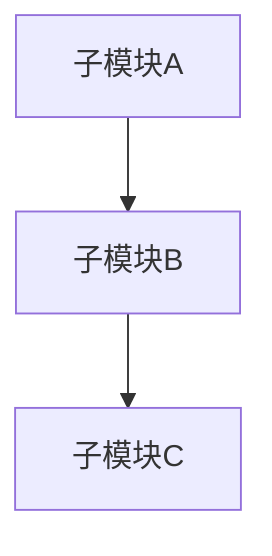
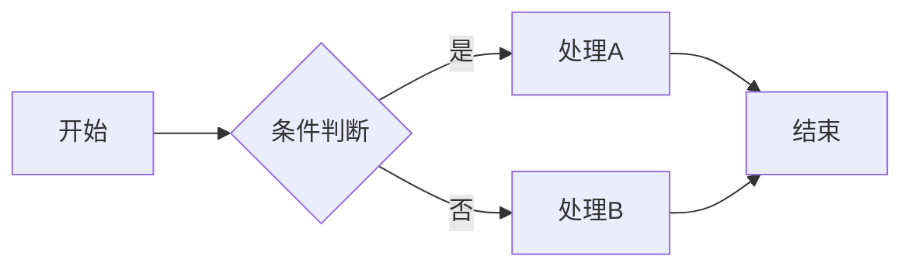
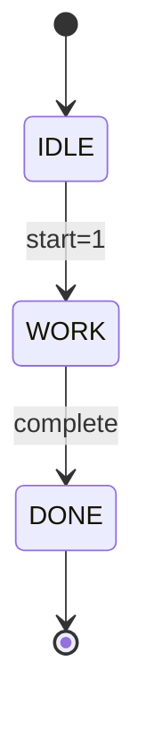
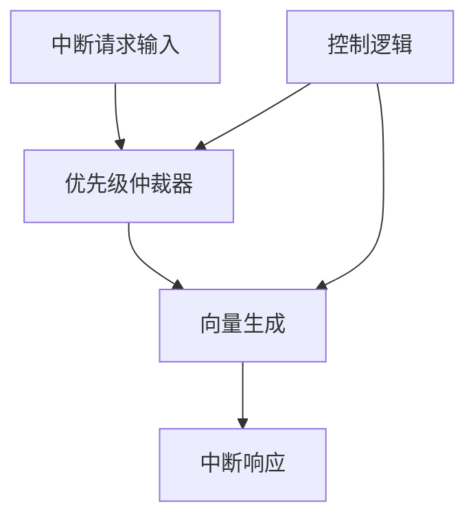
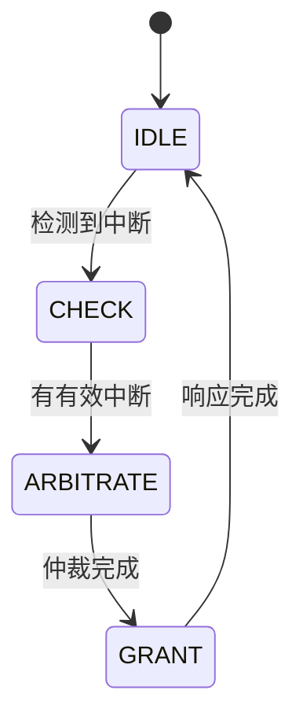

# 模块详细方案文档生成

## 功能概述

本SKILL根据功能规格说明书和芯片总体方案生成模块级详细设计文档。

## 使用场景

- 功能规格说明书已完成，需要生成模块详细方案
- 需要为特定模块生成完整的设计文档
- 需要包含状态机设计、接口定义、实现方案等内容

## 工作流程

### Step 1: 收集输入

1. 读取功能规格说明书中相关模块的描述
2. 读取芯片总体方案文档中模块的位置和接口信息
3. 确认模块的功能边界和设计目标

### Step 2: 分析模块需求

从输入文档中提取模块相关信息：

**功能需求**：
- 模块需要实现的功能
- 功能的优先级
- 功能之间的依赖

**接口需求**：
- 模块的输入输出信号
- 与其他模块的接口
- 协议规范

**性能需求**：
- 时序要求
- 吞吐量要求
- 资源使用

### Step 3: 生成模块详细方案文档

按以下结构生成文档：

## 模块详细方案文档模板

```markdown
# [模块名称] 模块详细方案

## 文档信息

| 项目 | 内容 |
|------|------|
| 模块名称 | |
| 版本 | 1.0 |
| 作者 | |
| 日期 | |

---

## 1. 模块概述

### 1.1 功能简介

[模块的简要功能介绍]

### 1.2 主要功能

| 序号 | 功能名称 | 功能描述 |
|------|----------|----------|
| 1 | 功能1 | 描述 |
| 2 | 功能2 | 描述 |

### 1.3 技术指标

| 指标 | 规格 | 备注 |
|------|------|------|
| 工作频率 | | |
| 资源使用 | | |
| 延迟 | | |

---

## 2. 系统架构

### 2.1 整体架构图

[使用Mermaid绘制模块架构图]



### 2.2 子模块列表

| 模块名称 | 功能描述 | 备注 |
|----------|----------|------|
| sub_module_a | 功能A | |
| sub_module_b | 功能B | |

### 2.3 数据流

[描述模块的数据流，包括：
- 数据输入
- 数据处理
- 数据输出]

### 2.4 控制流

[描述模块的控制流，包括：
- 状态机
- 控制信号
- 使能信号]

---

## 3. 接口定义

### 3.1 时钟和复位

| 信号名 | 方向 | 描述 |
|--------|------|------|
| clk | Input | 时钟 |
| rst_n | Input | 异步复位，低电平有效 |

### 3.2 输入信号

| 信号名 | 位宽 | 描述 |
|--------|------|------|
| signal_a | [N:0] | 描述 |

### 3.3 输出信号

| 信号名 | 位宽 | 描述 |
|--------|------|------|
| signal_b | [N:0] | 描述 |

### 3.4 内部接口

[模块内部子模块之间的接口]

---

## 4. 功能描述

### 4.1 功能1

[功能1的详细描述]

#### 4.1.1 处理流程

[使用流程图描述]



#### 4.1.2 状态机设计

[如果涉及状态机]



#### 4.1.3 异常处理

[异常情况的处理]

### 4.2 功能2

[功能2的详细描述]

---

## 5. 实现方案

### 5.1 关键逻辑设计

[关键逻辑的实现方案]

### 5.2 状态机设计

[详细的状态机设计]

| 状态 | 编码 | 描述 |
|------|------|------|
| IDLE | 000 | 空闲 |
| WORK | 001 | 工作 |

### 5.3 流水线设计

[如果涉及流水线]

### 5.4 存储单元设计

[如果涉及存储单元]

---

## 6. 测试策略

### 6.1 功能验证

- [ ] 验证点1
- [ ] 验证点2

### 6.2 边界条件

- [ ] 边界条件1
- [ ] 边界条件2

### 6.3 性能测试

- [ ] 性能测试1

---

## 7. 附录

### 7.1 术语表

| 术语 | 描述 |
|------|------|
| 术语1 | 描述 |

### 7.2 参考资料

- 参考文档1
- 参考文档2
```

### Step 4: 调用相关SKILL生成图表

可以调用以下SKILL生成辅助图表：

1. **verilog-state-diagram** - 生成状态机转移图
2. **verilog-block-diagram** - 生成模块框图
3. **verilog-timing-diagram** - 生成接口时序图

### Step 5: 质量检查

检查生成的模块详细方案：

**完整性检查**：
- [ ] 所有功能都有对应的设计描述
- [ ] 所有接口都有完整定义
- [ ] 状态机设计完整

**一致性检查**：
- [ ] 与功能规格一致
- [ ] 与总体方案一致
- [ ] 接口定义一致

**规范性检查**：
- [ ] 文档格式规范
- [ ] 图表清晰准确

### Step 6: 输出文档

输出Markdown格式文档，可选择生成Word格式。

## 输出格式

### 1. Markdown格式

直接输出Markdown格式文档。

### 2. Word格式

使用docx SKILL生成Word文档。

## 示例

### 输入（功能规格节选）

```markdown
### 2.2 中断控制器（ICU）功能描述

**功能描述**：
中断控制器负责管理和处理外部中断请求

**功能列表**：
- ICU-01: 中断请求接收
- ICU-02: 中断优先级仲裁
```

### 输出（模块详细方案节选）

```markdown
# ICU 中断控制器模块详细方案

## 1. 模块概述

### 1.1 功能简介

ICU（Interrupt Controller Unit）中断控制器负责管理和处理外部中断请求。

### 1.2 主要功能

| 序号 | 功能名称 | 功能描述 |
|------|----------|----------|
| 1 | 中断请求接收 | 接收64个外部中断请求信号 |
| 2 | 中断优先级仲裁 | 根据优先级选择最高优先级中断 |
| 3 | 中断向量化 | 根据中断号计算中断向量地址 |

---

## 2. 系统架构

### 2.1 整体架构图



### 2.2 子模块列表

| 模块名称 | 功能描述 |
|----------|----------|
| ct_icu_arb | 优先级仲裁 |
| ct_icu_vec | 向量生成 |
| ct_icu_ctrl | 控制逻辑 |

---

## 3. 接口定义

### 3.1 时钟和复位

| 信号名 | 方向 | 描述 |
|--------|------|------|
| clk | Input | 系统时钟 |
| rst_n | Input | 异步复位，低电平有效 |

### 3.2 输入信号

| 信号名 | 位宽 | 描述 |
|--------|------|------|
| irq_in | [63:0] | 外部中断请求输入 |
| irq_en | [63:0] | 中断使能信号 |

---

## 4. 功能描述

### 4.1 中断请求接收

ICU接收来自外设的中断请求信号...

### 4.2 中断优先级仲裁

使用固定优先级或可编程优先级...



---

## 5. 实现方案

### 5.1 优先级仲裁器实现

采用可编程优先级，支持配置...

### 5.2 状态机设计

| 状态 | 编码 | 描述 |
|------|------|------|
| IDLE | 4'b0000 | 空闲 |
| CHECK | 4'b0001 | 检查中断 |
| ARBITRATE | 4'b0010 | 优先级仲裁 |
| GRANT | 4'b0100 | 中断响应 |

---

## 6. 测试策略

### 6.1 功能验证

- [ ] 验证64个中断源的正确接收
- [ ] 验证优先级仲裁逻辑
- [ ] 验证中断向量化功能

### 6.2 边界条件

- [ ] 验证多个同时中断
- [ ] 验证中断优先级配置边界
```

## 注意事项

1. **功能覆盖完整**：确保所有功能都有详细设计描述
2. **接口定义准确**：信号定义要完整准确
3. **状态机设计完整**：状态机设计要覆盖所有状态
4. **图表辅助说明**：使用架构图、流程图等辅助理解
5. **测试策略可行**：测试点要覆盖所有功能

## 相关SKILL

- `functional-spec-generator`: 生成功能规格说明书
- `top-level-design-generator`: 生成芯片总体方案
- `rtl-code-generator`: 基于方案生成代码
- `register-manual-generator`: 生成寄存器手册
- `verilog-state-diagram`: 生成状态机图
- `verilog-block-diagram`: 生成模块框图
- `chip-design-orchestrator`: 调度整个芯片设计流程
