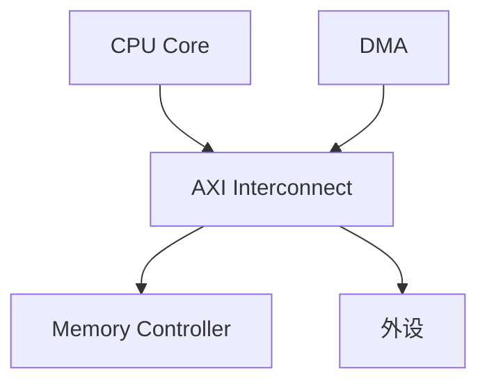
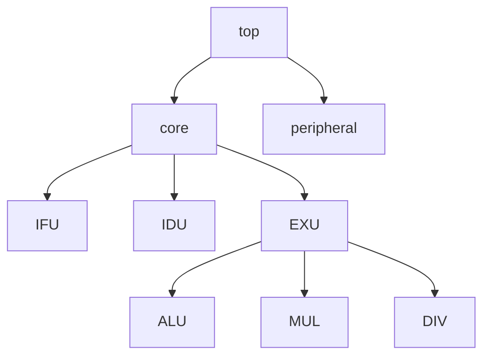

# 芯片总体方案文档生成

## 功能概述

本SKILL根据功能规格说明书生成芯片总体方案文档。

## 使用场景

- 功能规格说明书已完成，需要生成总体方案
- 需要定义系统的整体架构
- 需要划分各子系统及其接口

## 工作流程

### Step 1: 收集输入

1. 读取功能规格说明书
2. 确认芯片的整体功能和性能指标
3. 了解各功能模块的关系

### Step 2: 分析系统需求

从功能规格中提取以下信息：

**系统级需求**：
- 芯片整体功能
- 性能指标
- 功耗要求
- 物理规格

**模块级需求**：
- 功能模块划分
- 模块间接口
- 数据流

### Step 3: 生成总体方案文档

按以下结构生成文档：

## 总体方案文档模板

```markdown
# [芯片名称] 总体方案

## 文档信息

| 项目 | 内容 |
|------|------|
| 芯片名称 | |
| 版本 | 1.0 |
| 日期 | |
| 作者 | |

---

## 1. 芯片概述

### 1.1 芯片简介

[芯片的整体介绍]

### 1.2 主要特性

| 特性 | 描述 |
|------|------|
| 特性1 | 描述 |
| 特性2 | 描述 |

### 1.3 技术指标

| 指标 | 规格 |
|------|------|
| 工艺 | |
| 核心数 | |
| 主频 | |
| 功耗 | |
| 封装 | |
| 电源电压 | |
| 温度范围 | |

---

## 2. 系统架构

### 2.1 整体架构图

[使用Mermaid绘制系统架构图]



### 2.2 子系统划分

| 子系统 | 主要功能 | 备注 |
|--------|----------|------|
| 子系统1 | 功能1 | |
| 子系统2 | 功能2 | |

### 2.3 模块层次结构

[模块层次结构图]



---

## 3. 子系统功能描述

### 3.1 处理器核

[处理器核的详细功能描述]

### 3.2 缓存系统

[缓存系统的详细功能描述]

### 3.3 内存控制器

[内存控制器的详细功能描述]

### 3.4 外设接口

[外设接口的详细功能描述]

---

## 4. 系统接口

### 4.1 时钟和复位

| 信号 | 描述 |
|------|------|
| clk | 系统时钟 |
| rst_n | 异步复位 |

### 4.2 调试接口

[调试接口定义]

### 4.3 外设接口

[外设接口定义]

---

## 5. 地址规划

### 5.1 地址空间划分

| 地址范围 | 用途 | 访问属性 |
|----------|------|----------|
| 0x0000_0000 - 0x0FFF_FFFF | Flash | R/W |
| 0x1000_0000 - 0x1000_FFFF | SRAM | R/W |
| 0x4000_0000 - 0x4000_FFFF | 外设 | R/W |

### 5.2 外设地址映射

| 外设 | 基地址 | 大小 |
|------|--------|------|
| UART0 | 0x4000_0000 | 4KB |
| SPI0 | 0x4000_1000 | 4KB |

---

## 6. 中断和异常

### 6.1 中断源

| 中断号 | 中断源 | 描述 |
|--------|--------|------|
| 0 | UART0 | UART0中断 |
| 1 | SPI0 | SPI0中断 |

### 6.2 异常类型

| 异常号 | 异常类型 | 描述 |
|--------|----------|------|
| 0 | Reset | 复位 |
| 1 | Illegal Inst | 非法指令 |

---

## 7. 低功耗设计

### 7.1 电源域划分

[电源域划分说明]

### 7.2 时钟门控策略

[时钟门控策略说明]

---

## 8. 版本历史

| 版本 | 日期 | 修改内容 |
|------|------|----------|
| 1.0 | | 初始版本 |
```

### Step 4: 质量检查

**完整性检查**：
- [ ] 所有子系统都有描述
- [ ] 所有接口都有定义
- [ ] 地址规划完整

**一致性检查**：
- [ ] 与功能规格一致
- [ ] 模块划分合理
- [ ] 接口定义一致

### Step 5: 输出文档

输出Markdown格式文档，可选择生成Word格式。

## 输出格式

### 1. Markdown格式

直接输出Markdown格式文档。

### 2. Word格式

使用docx SKILL生成Word文档。

## 注意事项

1. **架构清晰**：系统架构要清晰合理
2. **划分合理**：子系统划分要合理
3. **接口明确**：接口定义要准确
4. **规划完整**：地址规划要完整

## 相关SKILL

- `functional-spec-generator`: 生成功能规格说明书
- `module-design-generator`: 生成模块详细方案
- `chip-design-orchestrator`: 调度整个芯片设计流程
