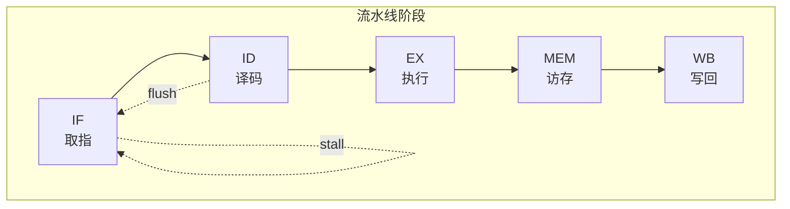
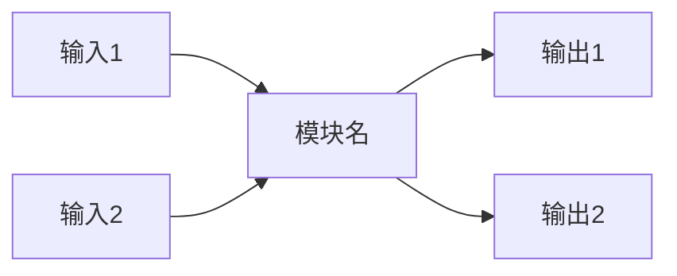
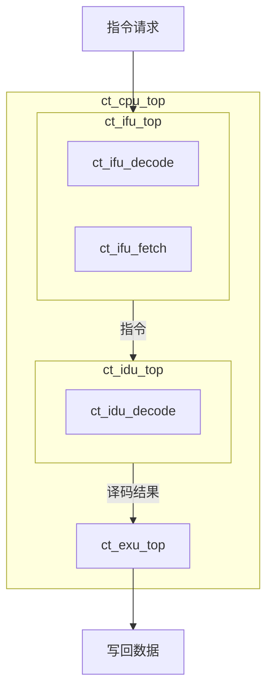
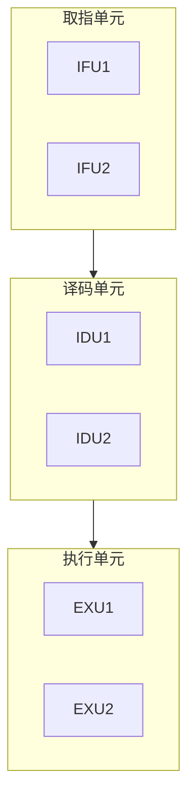
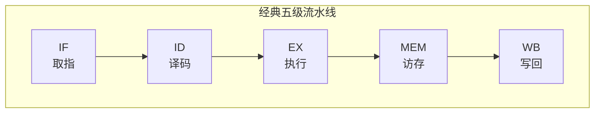
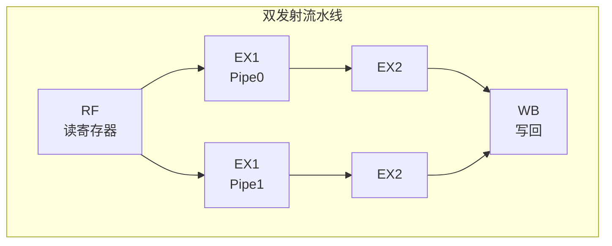
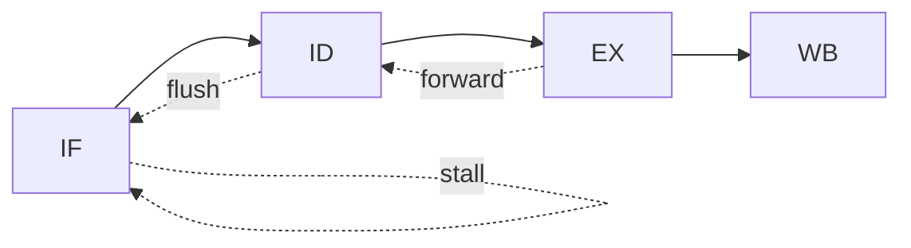

# Verilog 模块框图生成器

## 目的

基于 Verilog 源代码分析生成模块框图和流水线图，清晰展示模块层次结构、数据连线关系和流水线阶段。该技能解析 Verilog 文件，提取模块实例化信息，识别数据流向和流水线结构，生成 Mermaid 格式和 PNG 图片格式的输出。

## 使用场景

- 用户想要生成模块框图/架构图
- 用户想要查看模块层次结构
- 用户想要了解模块间的数据连接关系
- 用户想要生成模块内流水线图
- 用户提到"框图"、"架构图"、"层次图"、"连接图"、"流水线图"并涉及 Verilog 文件
- 用户需要将 Verilog 代码结构可视化

## 工作流程

### 步骤 1：收集输入文件

1. 如果用户指定了文件路径，使用这些文件
2. 如果用户指定了目录，扫描 .v 和 .sv 文件
3. 如果用户描述了模块功能，在代码库中搜索匹配的文件
4. 读取所有相关文件内容

### 步骤 2：解析模块层次结构

**层次解析规则：**
- 第0层：顶层模块（用户指定的目标模块）
- 第1层：顶层直接实例化的子模块
- 第2层：子模块实例化的孙模块
- 最多显示3层，第3层及以下不展开

**实例化解析：**
```verilog
module_name #(
    .PARAM1(value)
) instance_name (
    .port1(signal1),
    .port2(signal2)
);
```

### 步骤 3：提取端口连接关系

**端口连接提取：**
1. 从实例化语句提取端口映射
2. 识别连接信号名称
3. 追踪信号来源和去向

**信号分类：**
- 输入信号：连接到模块输入端口的外部信号
- 输出信号：从模块输出端口发出的信号
- 内部互联：模块间的连接信号

### 步骤 4：识别主要数据流

**信号优先级分类：**

| 优先级 | 信号类型 | 关键词 |
|--------|----------|--------|
| 高 | 时钟复位 | clk, clock, rst, reset, rst_b |
| 高 | 主要数据 | data, addr, wdata, rdata, din, dout |
| 中 | 控制信号 | valid, ready, enable, stall, flush |
| 中 | 状态信号 | done, error, busy, status |
| 低 | 配置信号 | cfg, config, mode, sel |
| 低 | 调试信号 | debug, test, scan |

**数据流识别规则：**
1. 优先显示高优先级信号
2. 合并同类信号（如 xxx_data 显示为 data）
3. 位宽较大的信号优先显示
4. 总线信号使用 `[width]` 标注

### 步骤 5：生成 Mermaid 格式框图

使用 Mermaid graph 语法生成框图：

```mermaid
graph TB
    subgraph TOP["顶层模块名"]
        direction TB
        subgraph SUB1["子模块1"]
            LEAF1["孙模块1"]
        end
        SUB2["子模块2"]
    end
    
    INPUT["输入端口"] --> SUB1
    SUB1 -->|data[31:0]| SUB2
    SUB2 --> OUTPUT["输出端口"]
```

**Mermaid 语法规则：**
- 使用 `subgraph` 表示嵌套层次
- 使用 `-->` 表示数据流向
- 使用 `|label|` 标注信号名称
- 输入输出端口使用圆角矩形

### 步骤 6：导出 PNG 图片

使用 mermaid-cli (mmdc) 工具将 Mermaid 代码转换为 PNG 图片。

**安装依赖：**
```bash
npm install -g @mermaid-js/mermaid-cli
```

**转换命令：**
```bash
mmdc -i input.mmd -o output.png -b white -w 2048 -H 1024
```

**配置选项：**
| 选项 | 值 | 说明 |
|------|-----|------|
| `-b` | white | 白色背景 |
| `-w` | 2048 | 宽度 2048 像素 |
| `-H` | 1024 | 高度 1024 像素（自动调整） |
| `-t` | default | 使用默认主题 |
| `--scale` | 2 | 缩放比例，提高清晰度 |

**PNG 导出流程：**
1. 将 Mermaid 代码保存为 `.mmd` 文件
2. 使用 mmdc 命令转换为 PNG
3. 验证 PNG 文件生成成功

### 步骤 7：检测流水线结构

**流水线检测规则：**

| 模式 | 正则表达式 | 说明 |
|------|-----------|------|
| 阶段寄存器 | `ff\d*_\w+`, `pipe\d*_\w+`, `stage\d*_\w+` | 流水线阶段寄存器 |
| 流水线控制 | `valid`, `ready`, `stall`, `flush` | 流水线控制信号 |
| 阶段命名 | `IF`, `ID`, `EX`, `MEM`, `WB` | 经典五级流水线 |
| 延迟寄存器 | `dly\d*`, `d\d*_\w+` | 延迟寄存器 |
| EX 阶段 | `ex1`, `ex2`, `ex3`, `ex4` | 执行阶段 |
| RF 阶段 | `rf` | 寄存器读取阶段 |

**检测算法：**
1. 扫描 always 块中的寄存器赋值
2. 识别阶段寄存器命名模式
3. 追踪数据在阶段间的流动
4. 提取流水线控制信号

### 步骤 8：生成流水线图

如果检测到流水线结构，生成流水线图。

**Mermaid 流水线图语法：**


**流水线图规则：**
- 使用 `flowchart LR` 从左到右布局
- 每个阶段使用矩形节点
- 阶段名称使用 `<br/>` 换行显示中英文
- 控制信号使用虚线 `-.->` 表示
- 标注关键控制信号（stall, flush）

**流水线图导出 PNG：**
```bash
mmdc -i pipeline.mmd -o pipeline.png -b white -w 1536 -H 800
```

### 步骤 9：输出文件

**必须生成以下文件：**

| 文件类型 | 文件名 | 说明 |
|----------|--------|------|
| Markdown | {module}_block_diagram.md | Mermaid 格式框图 |
| Mermaid | {module}_block_diagram.mmd | Mermaid 源文件 |
| PNG | {module}_block_diagram.png | PNG 图片格式框图 |

**可选生成（检测到流水线时）：**

| 文件类型 | 文件名 | 说明 |
|----------|--------|------|
| Markdown | {module}_pipeline.md | Mermaid 格式流水线图 |
| Mermaid | {module}_pipeline.mmd | Mermaid 源文件 |
| PNG | {module}_pipeline.png | PNG 图片格式流水线图 |

## 框图生成详细指南

### 单模块框图

当模块没有子实例时，显示模块端口连接：



### 多层嵌套框图

**3层嵌套示例：**



### 数据连线标注规则

**信号标注格式：**
- 单比特信号：`signal_name`
- 多比特信号：`signal_name[width]`
- 总线信号：`signal_name[high:low]`

**连线样式：**
- 数据信号：实线 `──>`
- 控制信号：虚线 `- ->`
- 时钟信号：点线 `···>`

### 模块分组

当模块数量较多时，按功能分组：



## 流水线图生成详细指南

### 经典五级流水线



### 多发射流水线



### 流水线控制信号



### 流水线暂停和冲刷

| 控制信号 | 作用 | 图形表示 |
|----------|------|----------|
| stall | 暂停当前阶段 | 虚线自环 |
| flush | 冲刷流水线 | 虚线指向前阶段 |
| forward | 数据前递 | 虚线跨阶段回指 |

## 使用示例

用户输入示例：
- "为 ct_ifu_top.v 生成模块框图"
- "生成这个 Verilog 文件的架构图，显示3层嵌套"
- "分析 ct_cpu_top 的模块层次结构并生成框图"
- "生成模块连接图，输出 Markdown 和 PNG 格式"
- "为 ct_iu_top.v 生成流水线图"
- "分析模块内的流水线结构"

## 输出模板

### Markdown 文件模板

```markdown
# {模块名} 模块框图

## 1. 模块层次结构

| 层级 | 模块名 | 实例名 | 说明 |
|------|--------|--------|------|
| 0 | xxx_top | - | 顶层模块 |
| 1 | xxx_sub1 | u_sub1 | 子模块1 |
| 2 | xxx_leaf | u_leaf | 孙模块 |

## 2. 模块框图 (Mermaid)

```mermaid
graph TB
    [框图内容]
```

## 3. 主要数据连线

| 源模块 | 源端口 | 信号名 | 位宽 | 目标模块 | 目标端口 |
|--------|--------|--------|------|----------|----------|
| TOP | - | clk | 1 | ALL | clk |
| SUB1 | dout | data | 32 | SUB2 | din |

## 4. 流水线图 (如检测到)

```mermaid
flowchart LR
    [流水线内容]
```
```

### Mermaid 源文件模板

```mermaid
%% {模块名} 模块框图
%% 生成时间: {timestamp}

graph TB
    subgraph TOP["{模块名}"]
        [模块内容]
    end
```

## 注意事项

1. **PNG 导出依赖**：
   - 需要安装 Node.js 和 mermaid-cli
   - 安装命令：`npm install -g @mermaid-js/mermaid-cli`
   - 如果 mmdc 不可用，仅生成 Mermaid 源文件

2. **层次限制**：最多显示3层嵌套，避免框图过于复杂。

3. **信号筛选**：优先显示关键数据信号，次要信号可省略。

4. **布局优化**：
   - 数据流从左到右
   - 输入在左侧，输出在右侧
   - 相关模块就近放置

5. **流水线检测**：
   - 自动检测模块内的流水线结构
   - 如未检测到流水线，不生成流水线图
   - 支持自定义阶段名称

6. **图片尺寸**：
   - 框图默认宽度 2048 像素
   - 流水线图默认宽度 1536 像素
   - 高度自动调整

7. **文件命名**：
   - Markdown: `{module}_block_diagram.md`
   - Mermaid: `{module}_block_diagram.mmd`
   - PNG: `{module}_block_diagram.png`
   - 流水线 Markdown: `{module}_pipeline.md`
   - 流水线 PNG: `{module}_pipeline.png`

## 错误处理

1. 如果找不到模块定义，报告错误并列出可用的模块
2. 如果模块没有子实例，生成单模块端口框图
3. 如果层次超过3层，截断并标注"..."
4. 如果信号过多，按优先级筛选并标注"部分信号"
5. 如果 mmdc 命令不可用，跳过 PNG 生成并提示用户安装 mermaid-cli
6. 如果未检测到流水线结构，跳过流水线图生成
