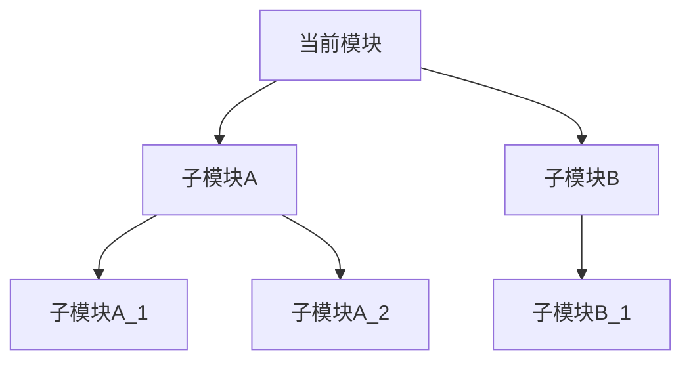

# Verilog 模块文档生成器

## 目的

基于源代码分析为 Verilog 模块生成全面的技术文档。该技能作为文档生成的主控制器，协调多个子 SKILL 完成图表生成，并整合输出为 Markdown 和 Word 格式的结构化文档。

## 依赖安装

### Python 库

```bash
pip install pyverilog hdlparse
```

### Node.js 库（用于 Word 文档和图片生成）

```bash
npm install -g docx @mermaid-js/mermaid-cli wavedrom-cli
```

### 相关子 SKILL

| SKILL 名称 | 功能 | 调用场景 |
|-----------|------|----------|
| verilog-file-tree | 文件列表和例化树生成 | 多文件输入时确定处理顺序；子模块方案章节 |
| verilog-state-diagram | 状态机分析和状态图生成 | 检测到状态机时 |
| verilog-timing-diagram | 接口时序图生成 | 需要时序说明时 |
| verilog-block-diagram | 模块框图和流水线图生成 | 所有模块文档 |

## 使用场景

- 用户想要记录 Verilog/RTL 代码
- 用户要求从代码生成模块规范
- 用户需要从 Verilog 文件生成设计文档
- 用户提到"生成文档"、"创建规范"、"记录此模块"并涉及 Verilog 文件
- 用户想要将 Verilog 代码转换为 Word/Markdown 文档

## 工作流程

### 步骤 1：收集输入文件

**判断输入类型：**

1. **单个文件**：直接处理该文件，不调用 verilog-file-tree
2. **多个文件**：调用 verilog-file-tree 分析依赖关系
3. **文件夹**：调用 verilog-file-tree 扫描并分析

**多文件/文件夹处理流程：**

```
输入文件/目录
      │
      ▼
┌─────────────────┐
│ 判断输入类型     │
└────────┬────────┘
         │
    ┌────┴────┐
    │         │
 单文件    多文件/目录
    │         │
    │         ▼
    │   ┌─────────────────┐
    │   │ 调用            │
    │   │ verilog-file-tree│
    │   └────────┬────────┘
    │            │
    │            ▼
    │   ┌─────────────────┐
    │   │ 获取例化树      │
    │   │ 和编译顺序      │
    │   └────────┬────────┘
    │            │
    │            ▼
    │   ┌─────────────────┐
    │   │ 按层次顺序      │
    │   │ 生成处理队列    │
    │   └────────┬────────┘
    │            │
    └─────┬──────┘
          │
          ▼
┌─────────────────┐
│ 遍历处理队列    │
│ (最多3层)       │
└────────┬────────┘
         │
         ▼
┌─────────────────┐
│ 对每个模块执行  │
│ 文档生成流程    │
└─────────────────┘
```

**调用 verilog-file-tree：**

使用 Skill 工具调用 `verilog-file-tree`，传递参数：
- `input_path`：输入文件或目录路径
- `top_module`：顶层模块名（如用户指定）
- `max_depth`：最大深度（默认3层）

**返回数据结构：**

```json
{
    "top_module": "ct_top",
    "total_modules": 486,
    "compile_order": [
        {"module": "ct_top", "file": "ct_top.v", "level": 0},
        {"module": "ct_core", "file": "ct_core.v", "level": 1},
        {"module": "ct_ifu_top", "file": "ct_ifu_top.v", "level": 2}
    ],
    "instance_tree": {
        "module": "ct_top",
        "children": [...]
    }
}
```

**生成文档处理队列：**

1. 从 `compile_order` 提取模块列表
2. 过滤掉 level > max_depth 的模块
3. 按 level 排序，同 level 按依赖顺序
4. 队列格式：`[{module, file, level}, ...]`

**参数控制：**

| 参数名 | 类型 | 默认值 | 说明 |
|--------|------|--------|------|
| max_depth | int | 3 | 子模块文档最大深度 |
| top_only | bool | false | 是否只生成顶层文档 |

**示例：**

```bash
# 生成3层子模块文档（默认）
python doc_generator.py ./rtl/ --top-module ct_top

# 只生成顶层模块文档
python doc_generator.py ./rtl/ --top-module ct_top --top-only

# 生成2层子模块文档
python doc_generator.py ./rtl/ --top-module ct_top --max-depth 2
```

### 步骤 2：解析 Verilog 代码

**使用 scripts/verilog_parser.py 进行代码解析：**

```bash
python scripts/verilog_parser.py <file.v> --output parse_result.json --pretty
```

**解析器功能：**
- 使用 Hdlparse 提取基础信息（端口、参数）
- 使用 Pyverilog 进行深度分析（实例化、信号、always块）
- 正则表达式作为回退方案
- 输出 JSON 格式的解析结果

**解析结果 JSON 结构：**

```json
{
    "module_name": "ct_iu_top",
    "ports": [
        {"name": "clk", "direction": "input", "width": 1, "description": ""}
    ],
    "parameters": [
        {"name": "ALU_SEL", "default_value": "21", "description": ""}
    ],
    "instances": [
        {"module": "ct_iu_alu", "name": "x_ct_iu_alu0", "connections": {}}
    ],
    "signals": [
        {"name": "alu_result", "type": "wire", "width": 64, "description": ""}
    ],
    "always_blocks": [
        {"sensitivity": "posedge clk", "body": ""}
    ],
    "assigns": [
        {"lhs": "result", "rhs": "alu_out"}
    ],
    "comments": {
        "header": "模块功能说明...",
        "inline": {}
    },
    "inferred_description": "整数执行单元，负责ALU运算、分支跳转和乘除法操作"
}
```

### 步骤 2.5：功能描述推断

**推断优先级（从高到低）：**

1. **文件头注释** - 解析 `/** ... */` 或 `// ...` 格式的模块头注释
2. **模块名推断** - 根据模块名前缀/后缀推断功能
3. **信号名推断** - 分析关键信号名推断功能
4. **子模块推断** - 根据子模块类型推断功能
5. **代码结构推断** - 分析 always 块和 assign 语句推断功能

**实现说明：**

功能描述推断的具体实现（包括模块名前缀/后缀映射表、信号名关键词映射表和推断算法）详见 `scripts/verilog_parser.py` 脚本。

### 步骤 3：调用子 SKILL 生成图表

#### 3.1 调用 verilog-state-diagram 生成状态转移图

**调用时机：** 检测到状态机结构时（状态寄存器定义、状态转移逻辑）

**调用方法：**

```
使用 Skill 工具调用 verilog-state-diagram
传递 Verilog 文件路径
获取返回的状态机分析结果
```

**返回数据结构：**

```json
{
    "fsm_type": "Moore",
    "fsm_structure": "三段式",
    "state_reg": "current_state",
    "next_state_reg": "next_state",
    "states": [
        {"name": "IDLE", "encoding": "3'b000", "description": "空闲状态"},
        {"name": "RUN", "encoding": "3'b001", "description": "运行状态"}
    ],
    "transitions": [
        {"from": "IDLE", "to": "RUN", "condition": "start=1", "description": "启动"}
    ],
    "mermaid": "stateDiagram-v2\n    [*] --> IDLE: 复位\n    IDLE --> RUN: start=1\n    ...",
    "png_path": "/path/to/state_diagram.png"
}
```

**整合到文档：**
- 将 `mermaid` 内容插入 Markdown 文档的状态转移图章节
- 将 `png_path` 指向的图片嵌入 Word 文档
- 将 `states` 和 `transitions` 转换为表格格式

#### 3.2 调用 verilog-timing-diagram 生成接口时序图

**调用时机：** 需要说明接口时序时（存在握手信号、总线接口等）

**调用方法：**

```
使用 Skill 工具调用 verilog-timing-diagram
传递 Verilog 文件路径和输出目录
获取返回的时序图文件路径
```

**返回数据结构：**

```json
{
    "md_path": "/path/to/module_timing.md",
    "json_path": "/path/to/module_timing.json",
    "png_path": "/path/to/module_timing.png"
}
```

**整合到文档：**
- 将 Markdown 文件内容嵌入文档的"接口时序"章节
- 将 PNG 图片嵌入 Word 文档
- 使用 JSON 文件进行进一步处理或在线预览

#### 3.3 调用 verilog-block-diagram 生成模块框图和流水线图

**调用时机：** 所有模块文档（必需）

**调用方法：**

```
使用 Skill 工具调用 verilog-block-diagram
传递 Verilog 文件路径和输出目录
获取返回的框图和流水线图文件路径
```

**返回数据结构：**

```json
{
    "md_path": "/path/to/module_block_diagram.md",
    "mmd_path": "/path/to/module_block_diagram.mmd",
    "png_path": "/path/to/module_block_diagram.png",
    "pipeline_detected": true,
    "pipeline_md_path": "/path/to/module_pipeline.md",
    "pipeline_png_path": "/path/to/module_pipeline.png"
}
```

**整合到文档：**
- 将框图 Markdown 内容插入文档的"模块框图"章节
- 将流水线图 Markdown 内容插入文档的"流水线图"章节（如检测到流水线）
- 将 PNG 图片嵌入 Word 文档

### 步骤 4：生成 Markdown 文档

生成以下章节的 Markdown 文档：

**1. 模块概述**

合并模块功能说明和参数信息：

```markdown
## 1. 模块概述

### 1.1 基本信息

| 属性 | 值 |
|------|-----|
| 模块名称 | xxx |
| 文件路径 | xxx |
| 参数 | PARAM1=值, PARAM2=值 |

### 1.2 功能描述

从文件头注释、模块名、信号名推断的功能描述。

### 1.3 设计特点

- 特点1
- 特点2
```

**2. 模块接口说明**

分为输入端口、输出端口和接口时序：

```markdown
## 2. 模块接口说明

### 2.1 输入端口

| 信号名 | 方向 | 位宽 | 描述 |

### 2.2 输出端口

| 信号名 | 方向 | 位宽 | 描述 |

### 2.3 接口时序图

调用 verilog-timing-diagram 生成的 Mermaid 时序图 + PNG 图片：

#### 2.3.1 握手协议时序

Mermaid 时序图 + PNG 图片

#### 2.3.2 数据传输时序

Mermaid 时序图 + PNG 图片
```

**3. 模块框图**

包含架构图和流水线结构图：

```markdown
## 3. 模块框图

### 3.1 模块架构图

调用 verilog-block-diagram 生成的 Mermaid 架构图 + PNG 图片

### 3.2 流水线结构图

调用 verilog-block-diagram 生成的 Mermaid 流水线图 + PNG 图片（如检测到流水线）

### 3.3 主要数据连线

| 源模块 | 目标模块 | 信号名 | 位宽 | 说明 |
```

**4. 模块实现方案**

包含流水线详细说明和关键逻辑描述：

```markdown
## 4. 模块实现方案

### 4.1 流水线设计

#### 4.1.1 流水线概述

| 流水线 | 执行单元 | 级数 | 支持指令 |

#### 4.1.2 各流水线详细说明

- Pipe0 详细说明
- Pipe1 详细说明
- Pipe2 详细说明

### 4.2 关键逻辑描述

从 always 块和 assign 语句提取的关键逻辑描述。

### 4.3 数据前递机制

| 前递路径 | 源阶段 | 目标阶段 | 说明 |

### 4.4 流水线控制信号

| 信号 | 说明 |
```

**5. 状态转移图**（如适用）

调用 verilog-state-diagram 生成的 Mermaid 图 + PNG 图片（如检测到状态机）

**6. 内部关键信号列表**

分为寄存器信号和线网信号：

```markdown
## 7. 内部关键信号列表

### 7.1 寄存器信号

| 信号名 | 位宽 | 描述 |

### 7.2 线网信号

| 信号名 | 位宽 | 描述 |
```

**7. 数据结构定义**（如适用）

定义模块使用的关键数据结构：

```markdown
## 7. 数据结构定义

### 7.1 状态编码

| 状态名 | 编码值 | 描述 |

### 7.2 控制字格式

| 位域 | 名称 | 描述 |

### 7.3 配置寄存器

| 寄存器名 | 地址 | 位宽 | 描述 |
```

**8. 模块表项设置**（如适用）

```markdown
## 8. 模块表项设置

| 表项名称 | 域段内容 | RAM资源 | 说明 |
```

**9. 子模块方案**

调用 `verilog-file-tree` 生成模块例化树，显示最多3层子模块。

**调用方法：**

使用 Skill 工具调用 `verilog-file-tree`，传递当前模块的文件路径作为输入。

**返回数据结构：**

```json
{
    "instance_tree": {
        "module": "当前模块名",
        "children": [
            {
                "module": "子模块A",
                "instance_name": "u_sub_a",
                "file": "sub_a.v",
                "children": [...]
            }
        ]
    }
}
```

**模块例化层次结构（Mermaid图）：**



**子模块列表：**

| 层级 | 模块名 | 实例名 | 文件路径 | 功能描述 |
|------|--------|--------|----------|----------|
| 1 | ct_ifu_top | x_ct_ifu | ct_ifu_top.v | 取指单元 |
| 1 | ct_idu_top | x_ct_idu | ct_idu_top.v | 译码单元 |
| 2 | ct_ifu_bht | x_bht | ct_ifu_bht.v | 分支预测 |

**子模块功能说明：**

各子模块的详细功能说明。

**子模块文档链接：**

为每个子模块生成文档链接（如果生成了子模块文档）：

- [ct_ifu_top 详细文档](./ct_ifu_top_top.md)
- [ct_idu_top 详细文档](./ct_idu_top_top.md)

**整合到文档：**
- 将 Mermaid 例化树插入 Markdown 文档
- 将子模块表格插入文档
- 添加子模块功能说明
- 添加子模块文档链接

**10. 可测试性设计**（如适用）

```markdown
## 10. 可测试性设计

### 10.1 测试信号

| 信号名 | 方向 | 位宽 | 描述 |

### 10.2 调试接口

调试接口说明。

### 10.3 扫描链支持

扫描链配置说明。
```

**11. 修订历史**

```markdown
## 11. 修订历史

| 版本 | 日期 | 作者 | 说明 |
|------|------|------|------|
| 1.0 | YYYY-MM-DD | Auto-generated | 初始版本 |
```

### 步骤 5：生成 Word (docx) 文档

**重要：必须同时生成 docx 文件，不能遗漏！**

使用 docx-js 库生成 Word 文档：

**文档结构：**

```javascript
const { Document, Packer, Paragraph, TextRun, Table, TableRow, TableCell,
        HeadingLevel, AlignmentType, WidthType, BorderStyle, ShadingType,
        Header, Footer, PageNumber, LevelFormat, ImageRun } = require('docx');
```

**框图生成方案：**

| 方案 | 说明 | 适用场景 |
|------|------|----------|
| ASCII 艺术图 | 使用等宽字体显示 | 简单结构图 |
| 表格模拟 | 使用 Word 表格 | 模块框图 |
| PNG 图片 | 使用 mermaid-cli 转换 | 所有图表（推荐） |

### 步骤 6：输出文件清单

**必须同时生成以下文件：**

| 文件类型 | 文件名 | 说明 |
|----------|--------|------|
| Markdown | {module}_top.md | Markdown 格式文档 |
| Word | {module}_top.docx | Word 格式文档 |

**可选生成（根据模块特性）：**

| 文件类型 | 文件名 | 说明 |
|----------|--------|------|
| 状态图 PNG | {module}_state.png | 状态转移图（如检测到状态机） |
| 时序图 PNG | {module}_timing.png | 接口时序图（如需要） |
| 框图 PNG | {module}_block_diagram.png | 模块框图 |
| 流水线图 PNG | {module}_pipeline.png | 流水线图（如检测到流水线） |

**验证检查清单：**
- [ ] Markdown 文件已生成
- [ ] Word (docx) 文件已生成
- [ ] 两个文件内容一致
- [ ] 框图正确显示
- [ ] 状态图正确显示（如适用）
- [ ] 流水线图正确显示（如适用）
- [ ] 表格格式正确
- [ ] 中文显示正常

## 脚本文件

### scripts/verilog_parser.py

Verilog 代码解析脚本，使用 Hdlparse 和 Pyverilog 提取模块信息。

**使用方法：**
```bash
python scripts/verilog_parser.py <file.v> [--output output.json] [--pretty]
```

**输出：** JSON 格式的解析结果

## 错误处理

### Python 库不可用

如果 Hdlparse 或 Pyverilog 未安装，verilog_parser.py 会自动回退到正则表达式解析。

### 子 SKILL 调用失败

如果子 SKILL 调用失败，跳过对应图表生成，继续生成其他内容。

### 解析失败处理

| 错误类型 | 处理方式 |
|----------|----------|
| 语法错误 | 报告错误位置和原因，跳过问题代码 |
| 不支持的语法 | 跳过并记录警告 |
| 部分解析失败 | 返回已解析的部分结果 |
| 文件编码错误 | 尝试多种编码（UTF-8, GBK, GB2312） |

## 注意事项

1. **必须同时生成两种格式**：Markdown 和 Word 文档必须同时生成，不能遗漏任何一种格式。

2. **子 SKILL 调用顺序**：
   - 先调用 verilog-file-tree（多文件输入时）
   - 再调用 verilog-block-diagram（必需）
   - 根据解析结果决定是否调用 verilog-state-diagram
   - 根据需要调用 verilog-timing-diagram

3. **图表优先使用 PNG**：
   - Word 文档优先嵌入 PNG 图片
   - Markdown 使用 Mermaid 语法

4. **中文支持**：
   - Word 文档使用支持中文的字体（如 Arial、SimSun）
   - 确保中文正确显示

5. **文件命名**：
   - Markdown: `{module}_top.md`
   - Word: `{module}_top.docx`

6. **多文件处理**：
   - 多文件/文件夹输入时，必须调用 verilog-file-tree 确定处理顺序
   - 按例化树层次从上往下处理
   - 默认最多生成3层子模块文档

7. **深度控制**：
   - 使用 `max_depth` 参数控制子模块文档深度
   - 使用 `top_only` 参数只生成顶层模块文档

## 使用示例

用户输入示例：
- "为 ct_ifu_top.v 生成文档"
- "分析这个 Verilog 文件并创建 Word 格式的规范文档"
- "为 C910_RTL_FACTORY/gen_rtl/ifu 目录中的所有模块生成文档"
- "解析 ct_rtu_rob.v 并输出详细的设计规范"
- "为整个 RTL 目录生成文档，最多3层子模块"
- "生成 ct_top 模块及其子模块的文档"

**多文件处理示例：**

```bash
# 为整个RTL目录生成文档（默认3层子模块）
python doc_generator.py ./rtl/ --top-module ct_top --output-dir ./docs

# 只生成顶层模块文档
python doc_generator.py ./rtl/ --top-module ct_top --top-only

# 生成2层子模块文档
python doc_generator.py ./rtl/ --top-module ct_top --max-depth 2
```

## 性能优化

对于大型设计：
1. 缓存解析结果，避免重复解析
2. 并行调用子 SKILL
3. 增量更新文档（仅更新修改的部分）
