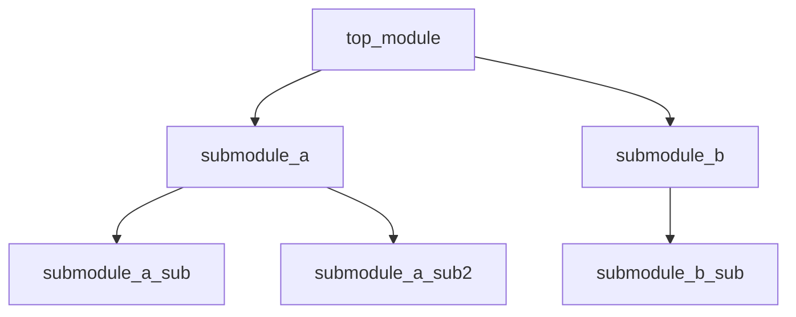

# Verilog 文件列表和模块例化树生成器

## 目的

基于 Verilog 源代码分析生成：
1. **文件列表** - 分析模块依赖关系，确定编译顺序
2. **模块例化树** - 生成模块层次结构和例化关系树

## 使用场景

- 用户想要生成编译文件列表
- 用户想要分析模块层次结构
- 用户想要查看模块例化关系
- 用户提到"文件列表"、"编译顺序"、"例化树"、"模块层次"并涉及 Verilog 文件

## 工作流程

### 步骤 1：收集输入信息

1. 如果用户指定了文件路径，读取该文件
2. 如果用户指定了目录，扫描 .v 和 .sv 文件
3. 如果用户指定了顶层模块，以该模块为根构建树
4. 如果未指定顶层模块，尝试自动检测（无被其他模块例化的模块）

### 步骤 2：解析 Verilog 文件

使用 `scripts/file_tree_generator.py` 解析：

**模块定义解析：**
- 从 `module xxx` 提取模块名
- 提取模块所在文件路径
- 记录模块定义行号

**模块例化解析：**
- 提取例化模块名
- 提取例化实例名
- 提取端口连接关系
- 支持参数化例化

### 步骤 3：构建依赖图

**依赖关系分析：**
1. 遍历所有模块，记录每个模块例化了哪些子模块
2. 构建邻接表表示的依赖图
3. 检测循环依赖

**拓扑排序：**
1. 计算每个模块的入度
2. 使用 Kahn 算法进行拓扑排序
3. 确定编译顺序（被依赖模块在前）

### 步骤 4：构建例化树

**递归构建：**
1. 从顶层模块开始
2. 递归遍历所有例化实例
3. 记录层次深度
4. 处理重复例化

### 步骤 5：生成输出文件

**文件列表输出：**
- 文本格式 (.f) - 用于编译工具
- JSON格式 - 用于程序处理

**例化树输出：**
- Mermaid图 - Markdown文档
- ASCII树 - 纯文本
- JSON格式 - 程序处理

## 输出格式详细说明

### 1. 文件列表输出

#### 文本格式 (.f)

```
# Module dependency ordered file list
# Generated from: top_module.v
# Total files: 15

# Level 0 - Top module
top_module.v

# Level 1 - Direct submodules
submodule_a.v
submodule_b.v

# Level 2 - Nested submodules
submodule_a_sub.v
submodule_b_sub.v
```

#### JSON格式

```json
{
  "top_module": "top_module",
  "total_files": 15,
  "compile_order": [
    {"file": "top_module.v", "module": "top_module", "level": 0},
    {"file": "submodule_a.v", "module": "submodule_a", "level": 1},
    {"file": "submodule_b.v", "module": "submodule_b", "level": 1}
  ],
  "dependencies": {
    "top_module": ["submodule_a", "submodule_b"],
    "submodule_a": ["submodule_a_sub"]
  }
}
```

### 2. 模块例化树输出

#### Mermaid 格式



#### ASCII 树格式

```
top_module
├── submodule_a (u_submodule_a)
│   ├── submodule_a_sub (u_sub_a)
│   └── submodule_a_sub2 (u_sub_a2)
└── submodule_b (u_submodule_b)
    └── submodule_b_sub (u_sub_b)
```

#### JSON 格式

```json
{
  "module": "top_module",
  "instance_name": "top_module",
  "file": "top_module.v",
  "children": [
    {
      "module": "submodule_a",
      "instance_name": "u_submodule_a",
      "file": "submodule_a.v",
      "children": [
        {
          "module": "submodule_a_sub",
          "instance_name": "u_sub_a",
          "file": "submodule_a_sub.v",
          "children": []
        }
      ]
    }
  ]
}
```

## 模块例化解析规则

### 支持的例化格式

**1. 标准例化：**
```verilog
submodule u_submodule (
    .clk(clk),
    .rst(rst),
    .data_in(data_in)
);
```

**2. 参数化例化：**
```verilog
submodule #(
    .WIDTH(32),
    .DEPTH(16)
) u_submodule (
    .clk(clk),
    .rst(rst)
);
```

**3. 多行例化：**
```verilog
submodule
    #(.WIDTH(32))
    u_submodule
    (
        .clk(clk),
        .rst(rst)
    );
```

### Verilog 关键词过滤

以下关键词不应被识别为模块名：

```
module, endmodule, input, output, inout, wire, reg,
always, assign, begin, end, if, else, case, endcase,
for, while, repeat, forever, initial, parameter, localparam,
generate, endgenerate, genvar, function, endfunction, task, endtask,
posedge, negedge, or, and, not, xor, nand, nor, xnor,
buf, tran, rtran, pullup, pulldown,
supply0, supply1, tri, triand, trior, trireg, tri0, tri1,
wand, wor, real, realtime, time, integer, signed, unsigned,
default, define, ifdef, ifndef, endif, include, timescale
```

## 依赖图构建算法

### 拓扑排序

```python
def topological_sort(graph):
    # 计算入度
    in_degree = {node: 0 for node in graph}
    for node in graph:
        for neighbor in graph[node]:
            in_degree[neighbor] += 1
    
    # 入度为0的节点入队
    queue = [node for node in in_degree if in_degree[node] == 0]
    result = []
    
    while queue:
        node = queue.pop(0)
        result.append(node)
        for neighbor in graph[node]:
            in_degree[neighbor] -= 1
            if in_degree[neighbor] == 0:
                queue.append(neighbor)
    
    return result
```

### 循环依赖检测

如果拓扑排序结果中模块数量少于图中节点数量，则存在循环依赖。

## 返回数据结构

```json
{
    "top_module": "模块名",
    "total_files": 15,
    "files": [
        {
            "file": "文件路径",
            "module": "模块名",
            "level": 0
        }
    ],
    "instance_tree": {
        "module": "模块名",
        "instance_name": "实例名",
        "file": "文件路径",
        "children": []
    },
    "dependencies": {
        "模块名": ["依赖模块列表"]
    },
    "output_files": {
        "filelist": "文件列表路径",
        "filelist_json": "JSON文件列表路径",
        "tree_md": "Mermaid树文件路径",
        "tree_txt": "ASCII树文件路径",
        "tree_json": "JSON树文件路径"
    }
}
```

## 错误处理

1. **模块定义未找到**：警告并跳过该例化
2. **循环依赖检测**：报告循环依赖链
3. **文件读取错误**：报告错误文件路径
4. **语法解析错误**：报告错误位置和原因

## 使用示例

**命令行使用：**

```bash
# 生成文件列表
python file_tree_generator.py top_module.v --output-filelist ./output/filelist.f

# 生成例化树
python file_tree_generator.py top_module.v --output-tree ./output/tree.md

# 同时生成两者
python file_tree_generator.py ./rtl/ --output-dir ./output

# 指定顶层模块
python file_tree_generator.py ./rtl/ --top-module ct_top --output-dir ./output
```

**用户输入示例：**
- "为这个模块生成文件列表"
- "分析模块例化层次结构"
- "生成编译顺序文件"
- "显示模块依赖关系"
- "生成模块例化树"

## 注意事项

1. **文件搜索**：模块定义文件需要在搜索路径中找到
2. **重复定义**：如果同一模块在多个文件中定义，报告警告
3. **参数化模块**：参数化例化需要正确解析参数传递
4. **generate块**：generate块中的例化需要特殊处理
5. **数组例化**：数组例化（如 u_sub[7:0]）需要展开

## 与其他 Skill 的集成

### 被 verilog-doc-generator 调用

当 `verilog-doc-generator` 需要生成子模块列表时，可以调用本 skill 获取模块依赖关系。

### 调用 verilog-block-diagram

生成的例化树可以用于生成模块框图。
