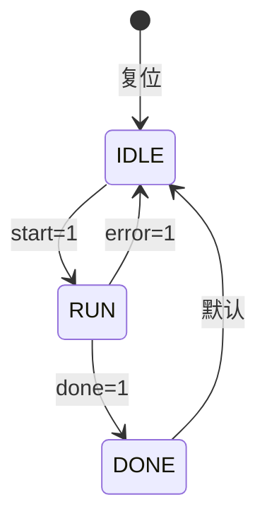
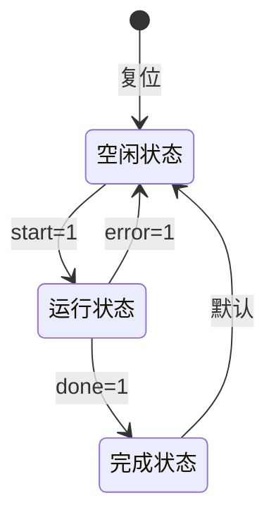
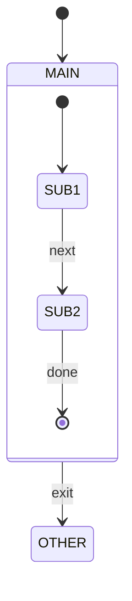

# Verilog状态机转移图生成器

## 功能概述

从Verilog/SystemVerilog源代码自动分析并生成状态机转移图，支持：
- 自动检测状态机类型（Moore型/Mealy型）
- 提取状态列表和编码值
- 提取状态转移条件
- 生成Mermaid状态图语法
- 转换为PNG图片（用于嵌入Word文档）

## 使用场景

- 用户想要分析Verilog状态机
- 用户需要生成状态转移图
- 用户需要提取状态列表和转移条件
- 用户需要将状态机图嵌入Word文档
- 其他skill需要状态机分析功能

## 工作流程

### Step 1: 收集输入文件

1. 如果用户指定了文件路径，使用这些文件
2. 如果用户指定了目录，扫描 .v 和 .sv 文件
3. 如果用户描述了模块功能，搜索代码库查找匹配文件
4. 读取所有相关文件内容

### Step 2: 检测状态机

执行以下检测逻辑：

**检测状态寄存器定义**：

搜索以下模式的状态寄存器：
```verilog
// 模式1: 显式状态命名
reg [N:0] current_state, next_state;
reg [N:0] state, nxt_state;
reg [N:0] cs, ns;
reg [N:0] cur_state, nxt_state;
reg [N:0] present_state, next_state;

// 模式2: SystemVerilog枚举类型
typedef enum logic [N:0] { ... } state_t;
state_t current_state, next_state;
```

**识别状态机类型**：

1. **Moore型状态机**：输出仅依赖于当前状态
   - 输出逻辑在独立的always块或assign语句中
   - 输出不依赖于输入信号

2. **Mealy型状态机**：输出依赖于当前状态和输入
   - 输出逻辑中包含输入信号
   - 输出随输入变化

**识别状态机结构**：

1. **三段式状态机**（推荐）：
   - 状态寄存器always块（时序逻辑）
   - 状态转移always块（组合逻辑）
   - 输出逻辑always块或assign

2. **两段式状态机**：
   - 状态寄存器always块（时序逻辑）
   - 组合逻辑always块（状态转移+输出）

3. **一段式状态机**：
   - 单个always块包含所有逻辑

### Step 3: 提取状态定义

**从parameter提取**：
```verilog
parameter [2:0] IDLE = 3'b000,
                RUN  = 3'b001,
                DONE = 3'b010;
```

**从localparam提取**：
```verilog
localparam [2:0] IDLE = 3'b000,
                 RUN  = 3'b001,
                 DONE = 3'b010;
```

**从typedef enum提取**：
```systemverilog
typedef enum logic [2:0] {
    IDLE = 3'b000,
    RUN  = 3'b001,
    DONE = 3'b010
} state_t;
```

**从独热码定义提取**：
```verilog
localparam [3:0] IDLE = 4'b0001,
                 RUN  = 4'b0010,
                 DONE = 4'b0100,
                 ERR  = 4'b1000;
```

### Step 4: 提取转移条件

**解析case语句**：

```verilog
case (current_state)
    IDLE: begin
        if (start)
            next_state = RUN;
        else
            next_state = IDLE;
    end
    RUN: begin
        if (done)
            next_state = DONE;
        else if (error)
            next_state = IDLE;
        else
            next_state = RUN;
    end
    DONE: begin
        next_state = IDLE;
    end
    default: next_state = IDLE;
endcase
```

**提取转移条件规则**：

1. 识别case表达式中的状态变量
2. 解析每个case分支内的if-else语句
3. 提取条件表达式和目标状态
4. 处理嵌套的条件语句
5. 记录默认转移

**条件表达式简化**：

将复杂条件简化为易读格式：
- `start == 1'b1` → `start=1`
- `rst_b == 1'b0` → `rst_b=0`
- `cnt >= MAX` → `cnt>=MAX`
- `valid & ready` → `valid&ready`

### Step 5: 生成Mermaid语法

**基本语法格式**：


**带状态描述的语法**：


**带复合状态语法**（适用于层次状态机）：


**Mermaid语法规则**：

1. 使用 `[*]` 表示初始状态
2. 使用 `-->` 表示转移
3. 使用 `:` 后跟转移条件
4. 状态名称使用大写字母
5. 条件表达式使用简洁格式
6. 中文描述放在引号内

### Step 6: 转换为PNG图片

**使用mermaid-cli转换**：

```bash
# 安装mermaid-cli（如未安装）
npm install -g @mermaid-js/mermaid-cli

# 转换命令
mmdc -i state_diagram.mmd -o state_diagram.png -b white -w 2048 -H 1024
```

**转换脚本使用**：

使用skill附带的脚本：
```bash
node scripts/mermaid_to_png.js -i state_diagram.mmd -o state_diagram.png
```

**PNG参数说明**：
- `-b white`: 白色背景
- `-w 2048`: 图片宽度2048像素
- `-H 1024`: 图片高度1024像素（自动调整）
- `-t dark`: 暗色主题（可选）
- `-C config.json`: 自定义配置（可选）

## 输出格式

### 1. 状态列表表格

```markdown
| 状态名称 | 编码值 | 描述 |
|----------|--------|------|
| IDLE     | 3'b000 | 空闲状态，等待启动信号 |
| RUN      | 3'b001 | 运行状态，执行主要功能 |
| DONE     | 3'b010 | 完成状态，处理完成 |
```

### 2. 转移条件表格

```markdown
| 当前状态 | 目标状态 | 转移条件 | 描述 |
|----------|----------|----------|------|
| IDLE     | RUN      | start=1  | 启动信号有效，开始运行 |
| RUN      | DONE     | done=1   | 完成信号有效，进入完成状态 |
| RUN      | IDLE     | error=1  | 错误发生，返回空闲 |
| DONE     | IDLE     | 默认     | 自动返回空闲状态 |
```

### 3. Mermaid状态图


### 4. PNG图片文件

生成的高清PNG图片，可直接嵌入Word文档。

## 被其他Skill调用

此skill可被其他skill调用以获取状态机分析结果。

**调用方式**：

其他skill在处理Verilog代码时，如果需要状态机分析，应该：

1. 调用 `verilog-state-diagram` skill
2. 传递Verilog文件路径或内容
3. 获取返回的分析结果：
   - `states`: 状态列表（数组）
   - `transitions`: 转移条件列表（数组）
   - `mermaid`: Mermaid语法字符串
   - `png_path`: PNG图片路径（如请求生成）

**返回数据结构**：

```json
{
    "fsm_type": "Moore",
    "fsm_structure": "三段式",
    "state_reg": "current_state",
    "next_state_reg": "next_state",
    "states": [
        {"name": "IDLE", "encoding": "3'b000", "description": "空闲状态"},
        {"name": "RUN", "encoding": "3'b001", "description": "运行状态"},
        {"name": "DONE", "encoding": "3'b010", "description": "完成状态"}
    ],
    "transitions": [
        {"from": "IDLE", "to": "RUN", "condition": "start=1", "description": "启动"},
        {"from": "RUN", "to": "DONE", "condition": "done=1", "description": "完成"},
        {"from": "RUN", "to": "IDLE", "condition": "error=1", "description": "错误"},
        {"from": "DONE", "to": "IDLE", "condition": "默认", "description": "返回"}
    ],
    "mermaid": "stateDiagram-v2\n    [*] --> IDLE: 复位\n    IDLE --> RUN: start=1\n    ...",
    "png_path": "/path/to/state_diagram.png"
}
```

## 示例用法

**用户输入示例**：

1. "分析这个Verilog文件的状态机"
2. "生成状态转移图"
3. "提取状态列表和转移条件"
4. "将状态机图转换为PNG"

**处理流程示例**：

```
用户: "分析ct_ifu_top.v中的状态机"

Skill执行:
1. 读取ct_ifu_top.v文件
2. 检测状态寄存器定义
3. 提取状态定义
4. 解析转移条件
5. 生成Mermaid语法
6. 输出状态列表表格
7. 输出转移条件表格
8. 输出Mermaid状态图
```

## 注意事项

1. **状态机检测准确性**：
   - 使用正则表达式结合语法分析
   - 处理多种编码风格
   - 支持SystemVerilog枚举类型

2. **转移条件解析**：
   - 正确处理嵌套if-else
   - 处理复杂的条件表达式
   - 保留原始条件便于调试

3. **Mermaid语法兼容性**：
   - 使用stateDiagram-v2语法
   - 避免特殊字符
   - 中文描述使用引号

4. **PNG生成**：
   - 确保mermaid-cli已安装
   - 设置合适的图片尺寸
   - 使用白色背景便于文档嵌入

## 依赖项

- Node.js
- @mermaid-js/mermaid-cli (mmdc)
- puppeteer (mmdc依赖)

## 相关Skill

- `verilog-doc-generator`: 完整模块文档生成
- `verilog-sv-language`: Verilog/SystemVerilog语法参考
- `docx`: Word文档生成和图片嵌入
