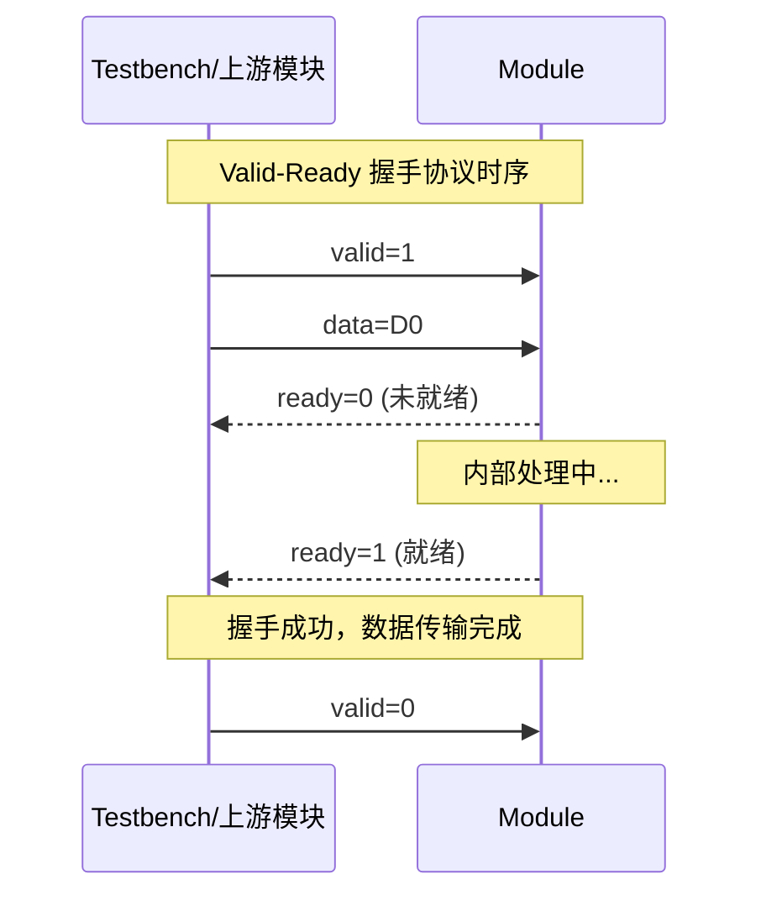
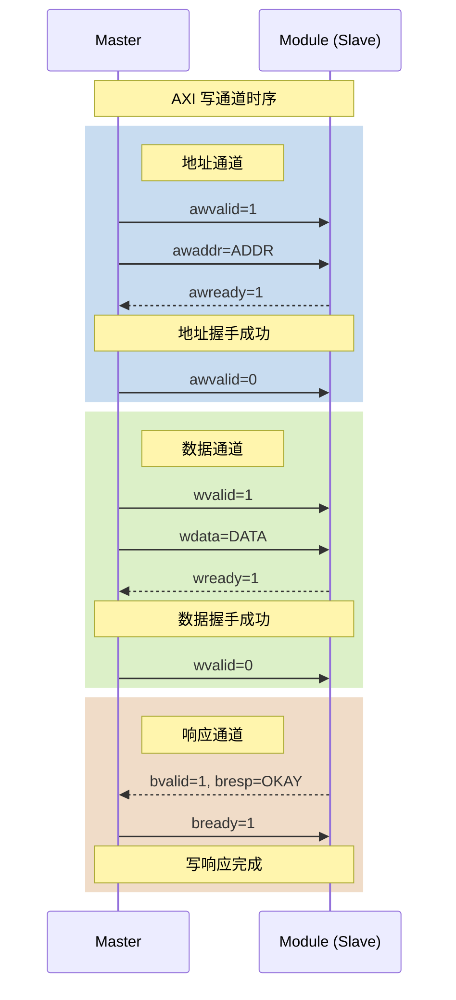
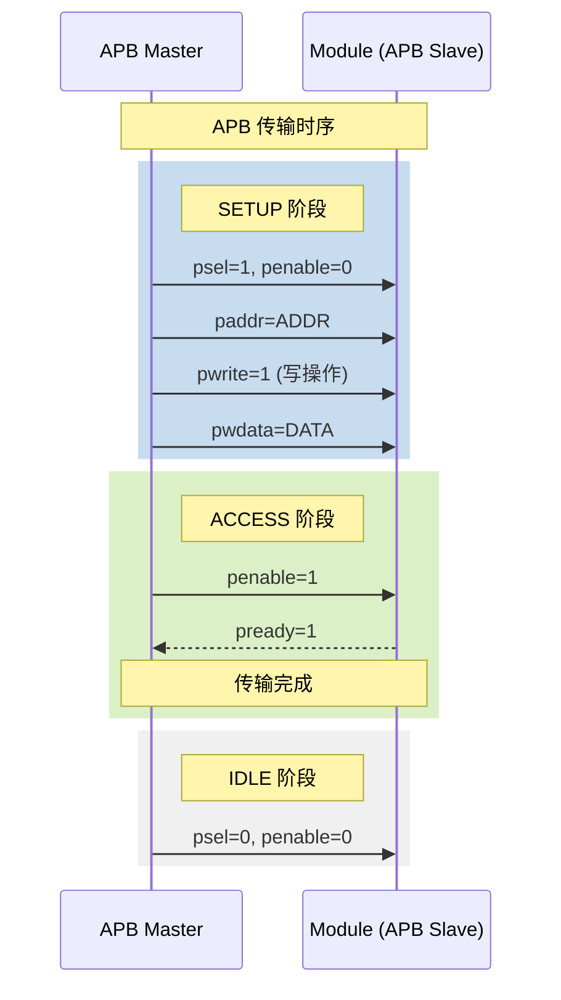

# Verilog 接口时序图生成器

## 目的

基于 Verilog 源代码分析生成模块接口时序图，自动识别常见时序模式，生成三种输出文件：
1. **Markdown文件** - 使用 Mermaid Sequence Diagram 格式
2. **WaveDrom JSON文件** - 用于波形描述
3. **PNG图片** - 使用 WaveDrom CLI 导出

## 使用场景

- 用户想要生成接口时序图
- 用户想要分析握手协议时序
- 用户提到"时序图"、"波形图"、"握手时序"并涉及 Verilog 文件
- verilog-doc-generator 需要生成接口时序时调用

## 工作流程

### 步骤 1：收集输入信息

1. 如果用户指定了文件路径，读取该文件
2. 如果用户指定了目标接口信号，只分析这些信号
3. 如果未指定，分析所有端口信号

### 步骤 2：信号分类

使用 `scripts/timing_diagram_generator.py` 对信号进行分类：

**信号类型分类：**

| 类型 | 关键词 | 说明 |
|------|--------|------|
| 时钟 | clk, clock, sys_clk, cpuclk | 系统时钟信号 |
| 复位 | rst, reset, rst_b, rst_n | 复位信号 |
| 握手有效 | valid, vld | Valid-Ready 协议有效信号 |
| 握手就绪 | ready, rdy | Valid-Ready 协议就绪信号 |
| 请求 | req, request | 请求-响应协议请求信号 |
| 响应 | ack, acknowledge | 请求-响应协议响应信号 |
| 数据 | data, wdata, rdata, din, dout | 数据信号 |
| 地址 | addr, address | 地址信号 |
| 使能 | en, enable, we, re, wr_en, rd_en | 使能信号 |
| 状态 | full, empty, done, busy, error | 状态信号 |

### 步骤 3：时序模式检测

**支持的时序模式：**

1. **Valid-Ready 握手协议**
   - 检测条件：存在 valid 和 ready 信号对
   - 时序特征：valid 拉高后等待 ready 响应
   - 数据传输：valid & ready 时数据有效

2. **Req-Ack 请求响应**
   - 检测条件：存在 req 和 ack 信号对
   - 时序特征：req 拉高后等待 ack 响应

3. **FIFO 接口**
   - 检测条件：存在 wr_en/full 或 rd_en/empty 信号对
   - 时序特征：写使能和满标志，读使能和空标志

4. **SRAM 接口**
   - 检测条件：存在 cs/we/addr/data 信号
   - 时序特征：片选、写使能、地址、数据

5. **AXI 写通道**
   - 检测条件：存在 awvalid/awready/wvalid/wready 信号
   - 时序特征：地址通道和数据通道分离

6. **AXI 读通道**
   - 检测条件：存在 arvalid/arready/rvalid/rready 信号
   - 时序特征：地址通道和响应通道分离

7. **APB 传输**
   - 检测条件：存在 psel/penable/pwrite 信号
   - 时序特征：SETUP、ACCESS、IDLE 三阶段

8. **复位时序**
   - 检测条件：存在复位信号
   - 时序特征：复位释放后的初始化

### 步骤 4：生成输出文件

#### 4.1 Markdown 文件 (Mermaid Sequence Diagram)

**Mermaid 序列图语法：**



**Mermaid 语法说明：**

| 语法 | 含义 |
|------|------|
| `participant A as B` | 定义参与者 A，显示名为 B |
| `A->>B: msg` | 实线箭头，同步消息 |
| `A-->>B: msg` | 虚线箭头，异步消息/返回 |
| `Note over A: text` | 在 A 上方添加注释 |
| `Note over A,B: text` | 在 A 和 B 之间添加注释 |
| `rect rgb(r,g,b)` | 添加背景色块 |

#### 4.2 WaveDrom JSON 文件

**WaveDrom 波形字符说明：**

| 字符 | 含义 |
|------|------|
| `p` | 正沿时钟 |
| `n` | 负沿时钟 |
| `P` | 正沿时钟（带箭头标记） |
| `N` | 负沿时钟（带箭头标记） |
| `0` | 低电平 |
| `1` | 高电平 |
| `x` | 未知态 |
| `z` | 高阻态 |
| `=` | 数据值（配合 data 数组） |
| `.` | 保持前一状态 |
| `|` | 时间间隙 |

**示例输出：**

```json
{
  "signal": [
    {"name": "clk", "wave": "p......"},
    {"name": "valid", "wave": "01.0.."},
    {"name": "ready", "wave": "0.1.0."},
    {"name": "data", "wave": "x.=x..", "data": ["D0"]}
  ],
  "head": {"text": "Valid-Ready 握手时序"},
  "config": {"hscale": 2}
}
```

#### 4.3 PNG 图片导出

**导出方法：**

使用 WaveDrom CLI：
```bash
wavedrom -i timing.json -o timing.png
```

**依赖安装：**
```bash
npm install -g wavedrom-cli
```

### 步骤 5：输出结果

**输出文件结构：**

```
output_dir/
├── {module}_timing.md      # Mermaid Sequence Diagram
├── {module}_timing.json    # WaveDrom JSON
└── {module}_timing.png     # PNG图片（可选）
```

**返回数据结构：**

```json
{
    "md_path": "/path/to/module_timing.md",
    "json_path": "/path/to/module_timing.json",
    "png_path": "/path/to/module_timing.png"
}
```

## 时序模式详细说明

### Valid-Ready 握手协议

**Mermaid 序列图：**


**WaveDrom JSON：**
```json
{
  "signal": [
    {"name": "clk", "wave": "p..........."},
    {"name": "valid", "wave": "01..0......"},
    {"name": "ready", "wave": "0..1.0....."},
    {"name": "data", "wave": "x..=.x.....", "data": ["D0"]}
  ]
}
```

### AXI 写通道

**Mermaid 序列图：**


### APB 传输

**Mermaid 序列图：**


## 与其他 Skill 的集成

### 被 verilog-doc-generator 调用

当 `verilog-doc-generator` 需要生成接口时序图时，调用本 skill：

**调用方式：**
1. 使用 Skill 工具调用 `verilog-timing-diagram`
2. 传递 Verilog 文件路径和输出目录
3. 获取返回的文件路径：
   - `md_path`: Markdown 文件路径
   - `json_path`: WaveDrom JSON 文件路径
   - `png_path`: PNG 图片路径

**整合到文档：**
- 将 Markdown 文件内容嵌入文档的时序图章节
- 将 PNG 图片嵌入 Word 文档
- 使用 JSON 文件进行进一步处理或在线预览

## 使用示例

**命令行使用：**

```bash
# 生成所有文件（包括PNG）
python timing_diagram_generator.py module.v --output-dir ./output

# 只生成MD和JSON文件
python timing_diagram_generator.py module.v --output-dir ./output --no-png
```

**用户输入示例：**
- "为这个模块生成接口时序图"
- "分析 valid-ready 握手时序"
- "生成 AXI 写通道时序图"
- "这个 FIFO 接口的时序是怎样的"

## 注意事项

1. **信号名称识别**：基于常见命名约定，可能存在误识别，建议用户确认。

2. **时序准确性**：生成的时序图是典型时序模式，实际时序需参考代码实现。

3. **PNG 导出依赖**：需要安装 Node.js 和 wavedrom-cli。

4. **复杂时序**：对于复杂的多通道时序，可能需要手动调整生成的 JSON。

5. **文件命名**：
   - Markdown: `{module}_timing.md`
   - JSON: `{module}_timing.json`
   - PNG: `{module}_timing.png`

6. **Mermaid 渲染**：Mermaid Sequence Diagram 需要支持 Mermaid 的 Markdown 渲染器（如 GitHub、GitLab、Typora 等）。
