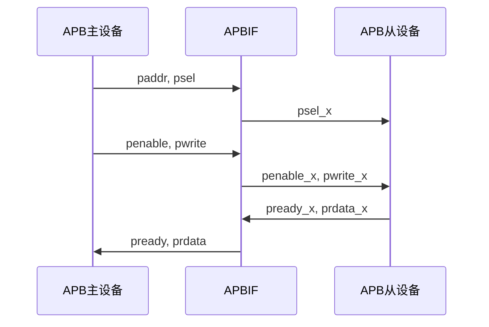
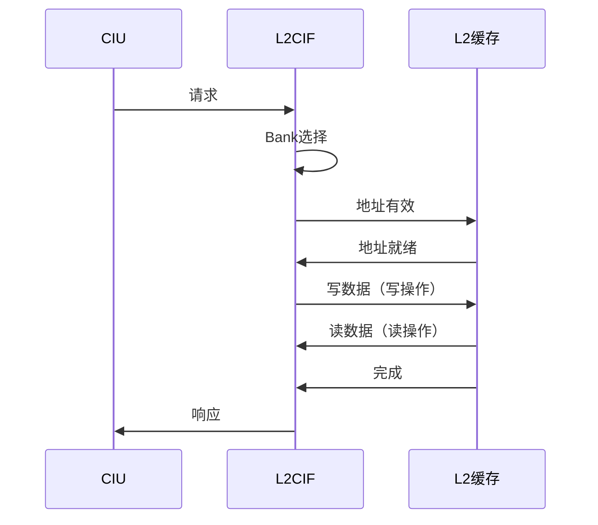

# CIU接口模块详细设计文档

## 1. 接口模块概述

### 1.1 基本信息

| 属性 | 值 |
|------|-----|
| 模块分类 | 接口模块 |
| 包含模块 | apbif, bmbif, ebiuif, l2cif |
| 功能分类 | 总线与缓存接口 |

### 1.2 功能描述

CIU接口模块负责CIU与外部系统的各种接口，包括APB总线、总线矩阵、外部总线和L2缓存接口。主要功能包括：

1. **APB接口**：连接CLINT、PLIC等外设
2. **总线矩阵接口**：连接多个处理器核心
3. **外部总线接口**：连接外部存储器和IO
4. **L2缓存接口**：连接L2缓存控制器

## 2. APBIF（APB Interface）模块

### 2.1 模块概述

APBIF模块实现APB总线接口，用于访问CLINT、PLIC、HAD等外设。

### 2.2 主要功能

1. **APB协议实现**：实现APB总线协议
2. **地址译码**：根据地址选择目标外设
3. **读写操作**：处理APB读写操作
4. **错误处理**：处理访问错误

### 2.3 APB总线信号

| 信号名 | 方向 | 位宽 | 描述 |
|--------|------|------|------|
| paddr | input | 32 | APB地址 |
| psel | input | 1 | APB选择 |
| penable | input | 1 | APB使能 |
| pwrite | input | 1 | APB写使能 |
| pwdata | input | 32 | APB写数据 |
| prdata | output | 32 | APB读数据 |
| pready | output | 1 | APB就绪 |
| perr | output | 1 | APB错误 |

### 2.4 地址译码逻辑

```verilog
// 地址译码
always @(*) begin
    case(paddr[31:20])
        12'h020: begin  // CLINT
            psel_clint = psel;
            psel_plic  = 1'b0;
            psel_had   = 1'b0;
        end
        12'h0C0: begin  // PLIC
            psel_clint = 1'b0;
            psel_plic  = psel;
            psel_had   = 1'b0;
        end
        12'h1A0: begin  // HAD
            psel_clint = 1'b0;
            psel_plic  = 1'b0;
            psel_had   = psel;
        end
        default: begin
            psel_clint = 1'b0;
            psel_plic  = 1'b0;
            psel_had   = 1'b0;
        end
    endcase
end
```

### 2.5 APB总线时序图



## 3. BMBIF（Bus Matrix Interface）模块

### 3.1 模块概述

BMBIF模块实现总线矩阵接口，连接多个处理器核心和CIU内部队列。

### 3.2 主要功能

1. **请求仲裁**：仲裁来自多个PIU的请求
2. **请求路由**：将请求路由到目标队列
3. **响应分发**：将响应分发回源PIU
4. **优先级管理**：管理请求优先级

### 3.3 仲裁策略

```verilog
// 固定优先级仲裁
always @(*) begin
    if (piu0_req) begin
        grant = 2'b00;  // PIU0优先
    end
    else if (piu1_req) begin
        grant = 2'b01;  // PIU1次优先
    end
    else begin
        grant = 2'b00;
    end
end
```

### 3.4 请求路由逻辑

```verilog
// 请求路由
always @(*) begin
    case(req_type)
        COHERENT: begin
            route = CTCQ;  // 一致性请求路由到CTCQ
        end
        NON_COHERENT: begin
            route = NCQ;   // 非一致性请求路由到NCQ
        end
        VICTIM: begin
            route = VB;    // Victim请求路由到VB
        end
        default: begin
            route = NCQ;
        end
    endcase
end
```

## 4. EBIUIF（External Bus Interface）模块

### 4.1 模块概述

EBIUIF模块实现外部总线接口，连接EBIU和CIU内部队列。

### 4.2 主要功能

1. **AXI接口**：提供AXI总线接口
2. **协议转换**：转换CIU内部协议到AXI协议
3. **Snoop接口**：提供ACE Snoop接口
4. **数据缓冲**：缓冲读写数据

### 4.3 AXI总线信号

#### 4.3.1 读通道信号

| 信号名 | 方向 | 位宽 | 描述 |
|--------|------|------|------|
| araddr | output | 40 | 读地址 |
| arvalid | output | 1 | 读地址有效 |
| arready | input | 1 | 读地址就绪 |
| rdata | input | 128 | 读数据 |
| rvalid | input | 1 | 读数据有效 |
| rready | output | 1 | 读数据就绪 |

#### 4.3.2 写通道信号

| 信号名 | 方向 | 位宽 | 描述 |
|--------|------|------|------|
| awaddr | output | 40 | 写地址 |
| awvalid | output | 1 | 写地址有效 |
| awready | input | 1 | 写地址就绪 |
| wdata | output | 128 | 写数据 |
| wvalid | output | 1 | 写数据有效 |
| wready | input | 1 | 写数据就绪 |
| bvalid | input | 1 | 写响应有效 |
| bready | output | 1 | 写响应就绪 |

### 4.4 ACE Snoop信号

| 信号名 | 方向 | 位宽 | 描述 |
|--------|------|------|------|
| acaddr | output | 40 | Snoop地址 |
| acvalid | output | 1 | Snoop地址有效 |
| acready | input | 1 | Snoop地址就绪 |
| crresp | input | 5 | Snoop响应 |
| crvalid | input | 1 | Snoop响应有效 |
| crready | output | 1 | Snoop响应就绪 |
| cddata | input | 128 | Snoop数据 |
| cdvalid | input | 1 | Snoop数据有效 |
| cdready | output | 1 | Snoop数据就绪 |

## 5. L2CIF（L2 Cache Interface）模块

### 5.1 模块概述

L2CIF模块实现L2缓存接口，连接CIU和L2缓存控制器。

### 5.2 主要功能

1. **L2访问管理**：管理对L2缓存的读写访问
2. **Bank分配**：将请求分配到不同的L2 Bank
3. **响应处理**：处理L2缓存的响应
4. **一致性维护**：维护L2缓存一致性

### 5.3 L2缓存接口信号

#### 5.3.1 地址通道信号

| 信号名 | 方向 | 位宽 | 描述 |
|--------|------|------|------|
| ciu_l2c_addr_vld_bank_0 | output | 1 | Bank0地址有效 |
| ciu_l2c_addr_bank_0 | output | 40 | Bank0地址 |
| ciu_l2c_addr_vld_bank_1 | output | 1 | Bank1地址有效 |
| ciu_l2c_addr_bank_1 | output | 40 | Bank1地址 |
| l2c_ciu_addr_ready_bank_0 | input | 1 | Bank0地址就绪 |
| l2c_ciu_addr_ready_bank_1 | input | 1 | Bank1地址就绪 |

#### 5.3.2 数据通道信号

| 信号名 | 方向 | 位宽 | 描述 |
|--------|------|------|------|
| ciu_l2c_wdata_bank_0 | output | 512 | Bank0写数据 |
| ciu_l2c_wdata_bank_1 | output | 512 | Bank1写数据 |
| l2c_ciu_data_bank_0 | input | 512 | Bank0读数据 |
| l2c_ciu_data_bank_1 | input | 512 | Bank1读数据 |
| l2c_ciu_data_vld_bank_0 | input | 1 | Bank0数据有效 |
| l2c_ciu_data_vld_bank_1 | input | 1 | Bank1数据有效 |

### 5.4 Bank分配策略

```verilog
// Bank选择
assign bank_sel = addr[6];  // 根据地址位6选择Bank

// Bank请求分配
assign ciu_l2c_addr_vld_bank_0 = addr_vld && (bank_sel == 1'b0);
assign ciu_l2c_addr_vld_bank_1 = addr_vld && (bank_sel == 1'b1);

// Bank地址分配
assign ciu_l2c_addr_bank_0 = bank_sel ? 40'b0 : addr;
assign ciu_l2c_addr_bank_1 = bank_sel ? addr : 40'b0;
```

### 5.5 L2缓存访问流程



## 6. 接口模块性能优化

### 6.1 带宽优化

- **Bank并行**：多个Bank并行访问提高带宽
- **读写并行**：读写操作并行执行
- **流水线设计**：接口流水线化提高吞吐率

### 6.2 延迟优化

- **快速路径**：关键路径优化减少延迟
- **预取**：数据预取减少访问延迟
- **旁路**：支持队列旁路减少延迟

### 6.3 功耗优化

- **时钟门控**：空闲接口关闭时钟
- **数据门控**：无效数据不传递
- **低功耗模式**：支持低功耗模式

## 7. 修订历史

| 版本 | 日期 | 作者 | 说明 |
|------|------|------|------|
| 1.0 | 2024-01-XX | Auto-generated | 初始版本 |
