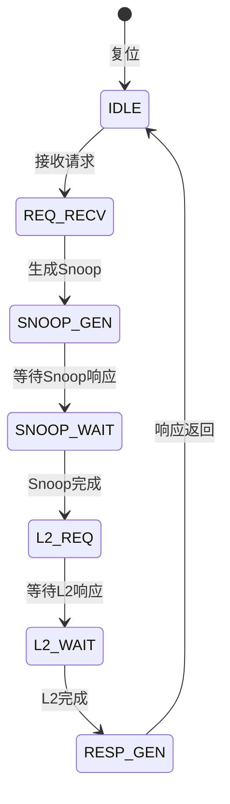
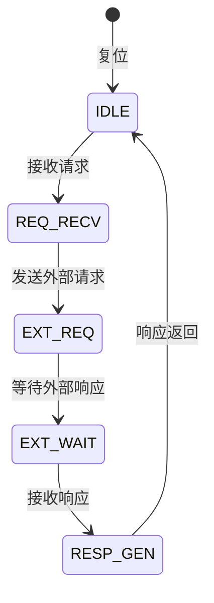
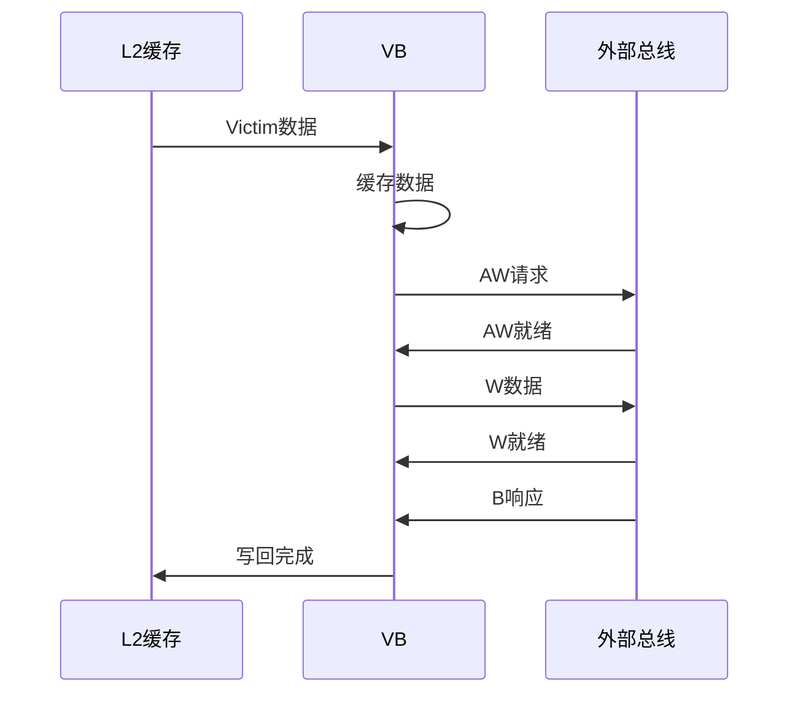

# CIU队列模块详细设计文档

## 1. 队列模块概述

### 1.1 基本信息

| 属性 | 值 |
|------|-----|
| 模块分类 | 队列模块 |
| 包含模块 | ctcq, ncq, vb |
| 功能分类 | 请求队列管理 |

### 1.2 功能描述

CIU队列模块负责管理各类请求队列，缓存和调度对L2缓存和外部总线的访问。主要功能包括：

1. **一致性事务队列（CTCQ）**：管理需要缓存一致性的请求
2. **非一致性队列（NCQ）**：管理不需要缓存一致性的请求
3. **Victim缓冲区（VB）**：管理缓存驱逐和写回

## 2. CTCQ（Coherent Transaction Queue）模块

### 2.1 模块概述

CTCQ管理一致性事务队列，处理需要缓存一致性的读写请求。

### 2.2 主要功能

1. **一致性请求管理**：管理需要一致性的读写请求
2. **Snoop生成**：生成Snoop请求到其他核心
3. **响应收集**：收集Snoop响应
4. **L2访问**：访问L2缓存
5. **数据返回**：将数据返回给请求者

### 2.3 队列结构

#### 2.3.1 请求队列

| 字段 | 位宽 | 描述 |
|------|------|------|
| valid | 1 | 有效位 |
| addr | 40 | 请求地址 |
| cmd | 4 | 命令类型 |
| id | 6 | 请求ID |
| snoop_req | 1 | Snoop请求标志 |
| snoop_done | 1 | Snoop完成标志 |
| l2_req | 1 | L2请求标志 |
| l2_done | 1 | L2完成标志 |

#### 2.3.2 响应队列

| 字段 | 位宽 | 描述 |
|------|------|------|
| valid | 1 | 有效位 |
| id | 6 | 请求ID |
| data | 128 | 响应数据 |
| resp | 4 | 响应状态 |

### 2.4 状态机设计



### 2.5 Snoop处理逻辑

```verilog
// Snoop生成
always @(posedge clk) begin
    if (state == SNOOP_GEN) begin
        // 生成Snoop请求到其他核心
        snoop_req_valid <= 1'b1;
        snoop_addr <= req_addr;
    end
end

// Snoop响应收集
always @(posedge clk) begin
    if (snoop_resp_valid) begin
        snoop_resp_collected <= snoop_resp_collected | snoop_resp_mask;
        if (snoop_resp_collected == ALL_CORES) begin
            snoop_done <= 1'b1;
        end
    end
end
```

### 2.6 L2访问逻辑

```verilog
// L2请求生成
always @(posedge clk) begin
    if (state == L2_REQ) begin
        l2_addr_vld <= 1'b1;
        l2_addr <= req_addr;
        l2_cmd <= req_cmd;
    end
end

// L2响应处理
always @(posedge clk) begin
    if (l2_data_vld) begin
        resp_data <= l2_data;
        resp_valid <= 1'b1;
        state <= RESP_GEN;
    end
end
```

## 3. NCQ（Non-Coherent Queue）模块

### 3.1 模块概述

NCQ管理非一致性队列，处理不需要缓存一致性的请求（如IO访问）。

### 3.2 主要功能

1. **非一致性请求管理**：管理非一致性读写请求
2. **外部访问**：访问外部存储器或IO
3. **响应处理**：处理外部响应
4. **数据缓冲**：缓冲读写数据

### 3.3 队列结构

#### 3.3.1 读请求队列

| 字段 | 位宽 | 描述 |
|------|------|------|
| valid | 1 | 有效位 |
| addr | 40 | 请求地址 |
| id | 8 | 请求ID |
| len | 8 | 数据长度 |
| size | 3 | 数据大小 |

#### 3.3.2 写请求队列

| 字段 | 位宽 | 描述 |
|------|------|------|
| valid | 1 | 有效位 |
| addr | 40 | 请求地址 |
| id | 8 | 请求ID |
| data | 128 | 写数据 |
| strb | 16 | 写选通 |

### 3.4 状态机设计



### 3.5 外部访问逻辑

```verilog
// 外部读请求
always @(posedge clk) begin
    if (state == EXT_REQ && read_req) begin
        ext_arvalid <= 1'b1;
        ext_araddr <= req_addr;
        ext_arid <= req_id;
    end
end

// 外部写请求
always @(posedge clk) begin
    if (state == EXT_REQ && write_req) begin
        ext_awvalid <= 1'b1;
        ext_awaddr <= req_addr;
        ext_awid <= req_id;
        ext_wvalid <= 1'b1;
        ext_wdata <= req_data;
    end
end
```

## 4. VB（Victim Buffer）模块

### 4.1 模块概述

VB管理Victim缓冲区，处理缓存驱逐和写回。

### 4.2 主要功能

1. **Victim管理**：管理L2缓存的驱逐数据
2. **写回处理**：将驱逐数据写回外部存储器
3. **缓冲存储**：临时存储驱逐数据
4. **写合并**：合并相同地址的写操作

### 4.3 队列结构

#### 4.3.1 AW队列

| 字段 | 位宽 | 描述 |
|------|------|------|
| valid | 1 | 有效位 |
| addr | 40 | 写地址 |
| id | 6 | 写ID |
| len | 8 | 数据长度 |
| data_cnt | 8 | 数据计数 |

#### 4.3.2 W队列

| 字段 | 位宽 | 描述 |
|------|------|------|
| valid | 1 | 有效位 |
| data | 128 | 写数据 |
| strb | 16 | 写选通 |
| last | 1 | 最后一个数据 |

### 4.4 写回流程



### 4.5 写合并逻辑

```verilog
// 写合并检测
always @(posedge clk) begin
    if (new_victim_valid) begin
        // 检查是否有相同地址的待写回数据
        for (int i = 0; i < QUEUE_DEPTH; i++) begin
            if (victim_queue[i].addr == new_victim_addr && victim_queue[i].valid) begin
                merge_found <= 1'b1;
                merge_idx <= i;
            end
        end
    end
end

// 写合并执行
always @(posedge clk) begin
    if (merge_found) begin
        // 合并数据
        victim_queue[merge_idx].data <= new_victim_data;
    end
    else begin
        // 分配新队列项
        victim_queue[alloc_idx] <= new_victim;
    end
end
```

## 5. 队列仲裁与调度

### 5.1 队列优先级

| 队列 | 优先级 | 说明 |
|------|--------|------|
| CTCQ | 高 | 一致性请求优先 |
| VB | 中 | 写回请求次优先 |
| NCQ | 低 | 非一致性请求最低 |

### 5.2 仲裁逻辑

```verilog
// 固定优先级仲裁
always @(*) begin
    if (ctcq_req) begin
        grant = CTCQ;
    end
    else if (vb_req) begin
        grant = VB;
    end
    else if (ncq_req) begin
        grant = NCQ;
    end
    else begin
        grant = NONE;
    end
end
```

### 5.3 调度策略

- **轮询调度**：相同优先级队列轮询调度
- **权重调度**：根据权重分配带宽
- **饥饿避免**：防止低优先级队列饥饿

## 6. 队列性能优化

### 6.1 队列深度优化

- **动态调整**：根据负载动态调整队列深度
- **分级队列**：不同类型请求使用不同深度
- **队列共享**：多个请求类型共享队列

### 6.2 队列延迟优化

- **快速路径**：关键请求快速路径
- **队列旁路**：支持队列旁路
- **预分配**：预分配队列项减少延迟

### 6.3 队列带宽优化

- **批量处理**：批量处理多个请求
- **流水线化**：队列操作流水线化
- **并行处理**：多个队列并行处理

## 7. 修订历史

| 版本 | 日期 | 作者 | 说明 |
|------|------|------|------|
| 1.0 | 2024-01-XX | Auto-generated | 初始版本 |
