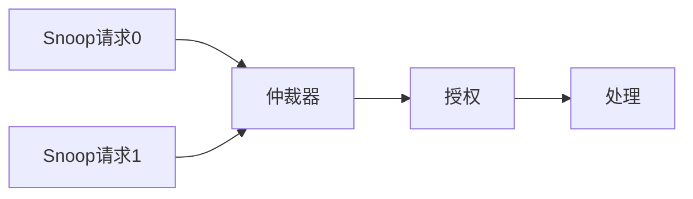
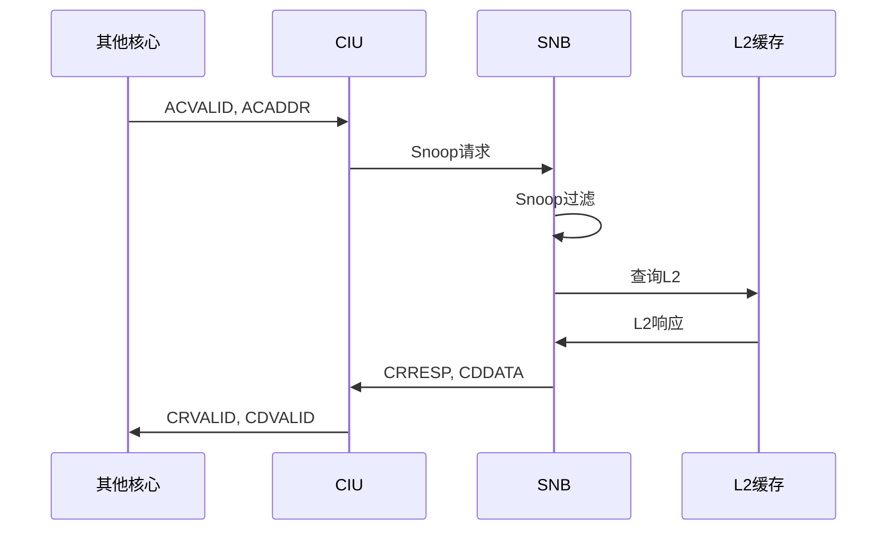
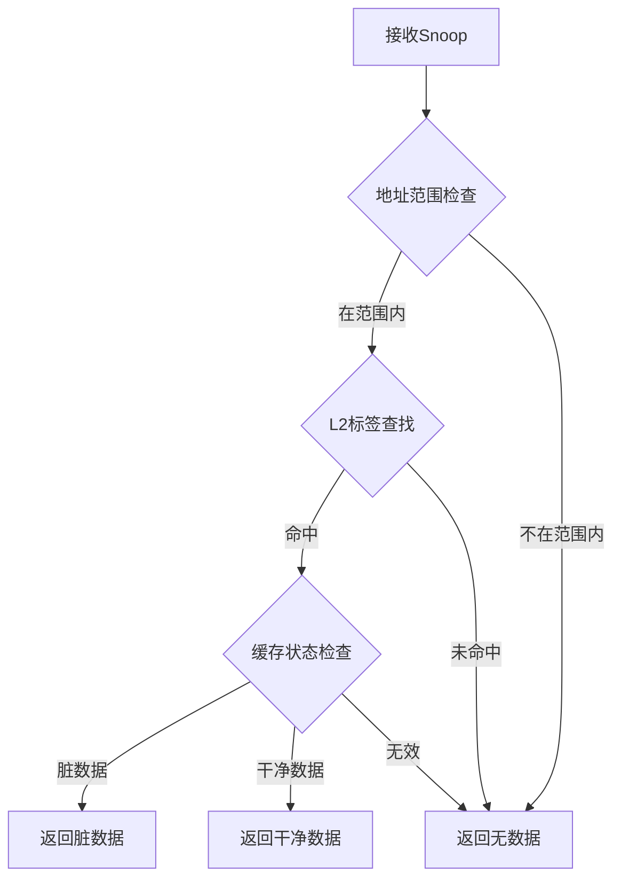

# CIU Snoop模块详细设计文档

## 1. Snoop模块概述

### 1.1 基本信息

| 属性 | 值 |
|------|-----|
| 模块分类 | Snoop模块 |
| 包含模块 | snb, snb_arb, snb_sab, snb_dp_sel |
| 功能分类 | 缓存一致性维护 |

### 1.2 功能描述

CIU Snoop模块负责处理缓存一致性协议中的Snoop操作，维护多核之间的缓存一致性。主要功能包括：

1. **Snoop接收**：接收来自其他核心的Snoop请求
2. **Snoop过滤**：过滤不必要的Snoop请求
3. **Snoop响应**：生成Snoop响应
4. **数据提供**：提供缓存数据给请求者
5. **缓存更新**：根据Snoop结果更新缓存状态

## 2. SNB（Snoop Buffer）模块

### 2.1 模块概述

SNB管理Snoop缓冲区，处理来自其他核心的Snoop请求。

### 2.2 主要功能

1. **Snoop接收**：接收ACE Snoop请求
2. **Snoop过滤**：根据地址范围过滤Snoop
3. **Snoop仲裁**：仲裁多个Snoop请求
4. **Snoop响应**：生成Snoop响应

### 2.3 Snoop类型

| Snoop类型 | 编码 | 描述 |
|-----------|------|------|
| ReadShared | 0000 | 读共享 |
| ReadClean | 0001 | 读干净 |
| ReadNotSharedDirty | 0010 | 读非共享脏 |
| ReadSharedOnce | 0011 | 读共享一次 |
| ReadUnique | 0100 | 读唯一 |
| CleanShared | 0111 | 清理共享 |
| CleanInvalid | 1000 | 清理无效 |
| MakeShared | 1001 | 使共享 |
| MakeInvalid | 1011 | 使无效 |

### 2.4 Snoop响应

| 响应位 | 描述 |
|--------|------|
| DataTransfer | 是否传输数据 |
| Error | 是否错误 |
| PassDirty | 是否传递脏状态 |
| IsShared | 是否共享 |

### 2.5 Snoop缓冲区结构

| 字段 | 位宽 | 描述 |
|------|------|------|
| valid | 1 | 有效位 |
| addr | 40 | Snoop地址 |
| snoop_type | 4 | Snoop类型 |
| resp | 5 | 响应状态 |
| data_valid | 1 | 数据有效 |
| data | 128 | 数据 |

## 3. SNB_ARB（Snoop Arbiter）模块

### 3.1 模块概述

SNB_ARB实现Snoop仲裁器，仲裁来自多个源的Snoop请求。

### 3.2 主要功能

1. **多源仲裁**：仲裁来自多个源的Snoop请求
2. **优先级管理**：管理Snoop请求优先级
3. **公平调度**：保证公平性

### 3.3 仲裁策略

```verilog
// 固定优先级仲裁
always @(*) begin
    if (snoop0_req) begin
        grant = 2'b00;  // Snoop0优先
    end
    else if (snoop1_req) begin
        grant = 2'b01;  // Snoop1次优先
    end
    else begin
        grant = 2'b00;
    end
end
```

### 3.4 仲裁流程



## 4. SNB_SAB（Snoop Address Buffer）模块

### 4.1 模块概述

SNB_SAB管理Snoop地址缓冲区，存储待处理的Snoop地址。

### 4.2 主要功能

1. **地址存储**：存储Snoop地址
2. **地址匹配**：匹配相同地址的Snoop
3. **地址合并**：合并相同地址的Snoop

### 4.3 地址缓冲区结构

| 字段 | 位宽 | 描述 |
|------|------|------|
| valid | 1 | 有效位 |
| addr | 40 | Snoop地址 |
| pending | 1 | 待处理标志 |
| count | 3 | 计数器 |

### 4.4 地址匹配逻辑

```verilog
// 地址匹配
always @(*) begin
    match_found = 1'b0;
    match_idx = 0;
    for (int i = 0; i < BUFFER_DEPTH; i++) begin
        if (sab[i].valid && sab[i].addr == snoop_addr) begin
            match_found = 1'b1;
            match_idx = i;
        end
    end
end
```

## 5. SNB_DP_SEL（Data Path Selector）模块

### 5.1 模块概述

SNB_DP_SEL实现数据通路选择器，选择Snoop响应的数据源。

### 5.2 主要功能

1. **数据源选择**：选择数据来源
2. **数据路由**：路由数据到目标
3. **数据格式转换**：转换数据格式

### 5.3 数据源类型

| 数据源 | 描述 |
|--------|------|
| L2缓存 | 来自L2缓存的数据 |
| 核心缓存 | 来自核心缓存的数据 |
| 无数据 | 不需要传输数据 |

### 5.4 数据选择逻辑

```verilog
// 数据源选择
always @(*) begin
    case(data_source)
        L2_CACHE: begin
            data = l2_data;
            data_valid = l2_data_valid;
        end
        CORE_CACHE: begin
            data = core_data;
            data_valid = core_data_valid;
        end
        default: begin
            data = 128'b0;
            data_valid = 1'b0;
        end
    endcase
end
```

## 6. Snoop处理流程

### 6.1 Snoop接收流程



### 6.2 Snoop过滤流程



### 6.3 Snoop响应生成

```verilog
// Snoop响应生成
always @(*) begin
    case(snoop_type)
        READ_SHARED: begin
            if (cache_hit && cache_state == MODIFIED) begin
                crresp = {PASS_DIRTY, DATA_TRANSFER, IS_SHARED};
                cdvalid = 1'b1;
            end
            else if (cache_hit && cache_state == SHARED) begin
                crresp = {NO_PASS_DIRTY, NO_DATA_TRANSFER, IS_SHARED};
                cdvalid = 1'b0;
            end
            else begin
                crresp = {NO_PASS_DIRTY, NO_DATA_TRANSFER, NOT_SHARED};
                cdvalid = 1'b0;
            end
        end
        READ_UNIQUE: begin
            if (cache_hit) begin
                crresp = {PASS_DIRTY, DATA_TRANSFER, NOT_SHARED};
                cdvalid = 1'b1;
                // 使本地缓存无效
                cache_state = INVALID;
            end
            else begin
                crresp = {NO_PASS_DIRTY, NO_DATA_TRANSFER, NOT_SHARED};
                cdvalid = 1'b0;
            end
        end
        default: begin
            crresp = 5'b0;
            cdvalid = 1'b0;
        end
    endcase
end
```

## 7. Snoop性能优化

### 7.1 Snoop过滤优化

- **地址范围过滤**：根据地址范围过滤Snoop
- **目录过滤**：使用目录减少Snoop
- **历史过滤**：根据历史信息过滤

### 7.2 Snoop延迟优化

- **快速响应**：快速生成Snoop响应
- **并行处理**：并行处理多个Snoop
- **预测响应**：预测Snoop响应

### 7.3 Snoop带宽优化

- **Snoop合并**：合并相同地址的Snoop
- **批量响应**：批量生成Snoop响应
- **数据压缩**：压缩Snoop数据

## 8. 修订历史

| 版本 | 日期 | 作者 | 说明 |
|------|------|------|------|
| 1.0 | 2024-01-XX | Auto-generated | 初始版本 |
