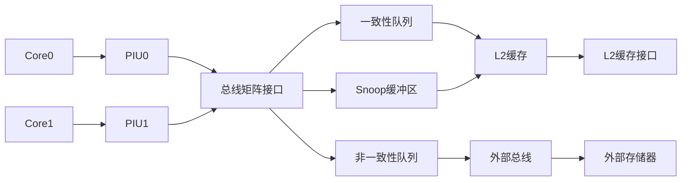
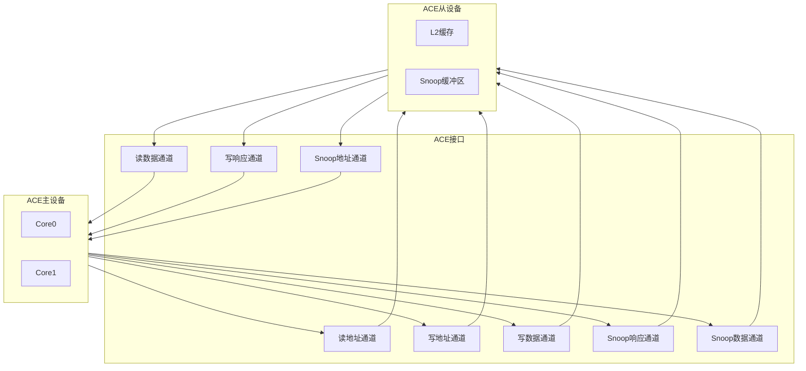
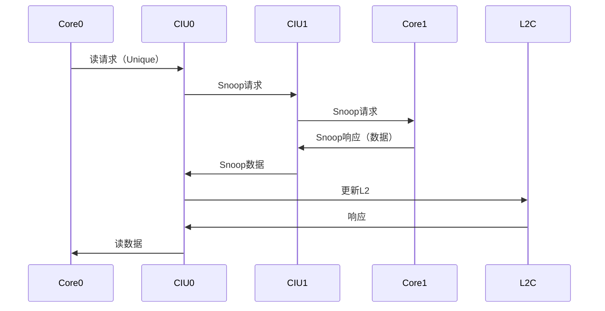

# CIU顶层模块详细设计文档

## 1. 模块概述

### 1.1 基本信息

| 属性 | 值 |
|------|-----|
| 模块名称 | ct_ciu_top |
| 文件路径 | C910_RTL_FACTORY/gen_rtl/ciu/rtl/ct_ciu_top.v |
| 模块类型 | 顶层模块 |
| 功能分类 | 核接口单元 |

### 1.2 功能描述

CIU（Core Interface Unit，核接口单元）是C910处理器的核心接口模块，负责处理器核心与外部系统的通信。主要功能包括：

1. **总线接口**：提供AXI总线接口，连接外部存储器和外设
2. **L2缓存接口**：管理L2缓存的访问和一致性
3. **多核一致性**：支持多核之间的缓存一致性协议
4. **Snoop处理**：处理来自其他核心的Snoop请求
5. **APB接口**：提供APB总线接口，连接CLINT、PLIC等外设
6. **电源管理**：支持低功耗管理
7. **中断处理**：处理来自PLIC的中断

### 1.3 设计特点

- **多核支持**：支持双核处理器配置
- **ACE协议**：支持AXI Coherency Extensions协议
- **缓存一致性**：硬件维护多核缓存一致性
- **多队列设计**：CTCQ、NCQ、VB等多种队列
- **Snoop过滤**：支持Snoop过滤优化
- **低功耗设计**：支持时钟门控和电源管理

## 2. 模块接口说明

### 2.1 主要输入端口

#### 2.1.1 时钟与复位

| 信号名 | 方向 | 位宽 | 描述 |
|--------|------|------|------|
| forever_cpuclk | input | 1 | CPU主时钟 |
| cpurst_b | input | 1 | 系统复位，低有效 |
| ciu_top_clk | input | 1 | CIU时钟 |
| clk_en | input | 1 | 时钟使能 |
| apb_clk_en | input | 1 | APB时钟使能 |

#### 2.1.2 IBIU接口（核心总线接口）

| 信号名 | 方向 | 位宽 | 描述 |
|--------|------|------|------|
| ibiu0_pad_araddr | input | 40 | Core0读地址 |
| ibiu0_pad_arvalid | input | 1 | Core0读地址有效 |
| ibiu0_pad_awaddr | input | 40 | Core0写地址 |
| ibiu0_pad_awvalid | input | 1 | Core0写地址有效 |
| ibiu0_pad_wdata | input | 128 | Core0写数据 |
| ibiu0_pad_wvalid | input | 1 | Core0写数据有效 |
| ibiu1_pad_araddr | input | 40 | Core1读地址 |
| ibiu1_pad_arvalid | input | 1 | Core1读地址有效 |

#### 2.1.3 L2缓存接口

| 信号名 | 方向 | 位宽 | 描述 |
|--------|------|------|------|
| l2c_ciu_addr_ready_bank_0 | input | 1 | L2 Bank0地址就绪 |
| l2c_ciu_addr_ready_bank_1 | input | 1 | L2 Bank1地址就绪 |
| l2c_ciu_data_bank_0 | input | 512 | L2 Bank0数据 |
| l2c_ciu_data_bank_1 | input | 512 | L2 Bank1数据 |
| l2c_ciu_cmplt_bank_0 | input | 1 | L2 Bank0完成 |
| l2c_ciu_cmplt_bank_1 | input | 1 | L2 Bank1完成 |

#### 2.1.4 APB接口

| 信号名 | 方向 | 位宽 | 描述 |
|--------|------|------|------|
| paddr | input | 32 | APB地址 |
| psel_clint | input | 1 | CLINT选择 |
| psel_plic | input | 1 | PLIC选择 |
| psel_had | input | 1 | HAD选择 |
| penable | input | 1 | APB使能 |
| pwrite | input | 1 | APB写使能 |
| pwdata | input | 32 | APB写数据 |

### 2.2 主要输出端口

#### 2.2.1 IBIU接口响应

| 信号名 | 方向 | 位宽 | 描述 |
|--------|------|------|------|
| pad_ibiu0_arready | output | 1 | Core0读地址就绪 |
| pad_ibiu0_awready | output | 1 | Core0写地址就绪 |
| pad_ibiu0_rdata | output | 128 | Core0读数据 |
| pad_ibiu0_rvalid | output | 1 | Core0读数据有效 |
| pad_ibiu0_bvalid | output | 1 | Core0写响应有效 |

#### 2.2.2 L2缓存控制

| 信号名 | 方向 | 位宽 | 描述 |
|--------|------|------|------|
| ciu_l2c_addr_vld_bank_0 | output | 1 | L2 Bank0地址有效 |
| ciu_l2c_addr_vld_bank_1 | output | 1 | L2 Bank1地址有效 |
| ciu_l2c_wdata_bank_0 | output | 512 | L2 Bank0写数据 |
| ciu_l2c_wdata_bank_1 | output | 512 | L2 Bank1写数据 |

#### 2.2.3 外部总线接口

| 信号名 | 方向 | 位宽 | 描述 |
|--------|------|------|------|
| biu_pad_araddr | output | 40 | 外部读地址 |
| biu_pad_arvalid | output | 1 | 外部读地址有效 |
| biu_pad_awaddr | output | 40 | 外部写地址 |
| biu_pad_awvalid | output | 1 | 外部写地址有效 |
| biu_pad_wdata | output | 128 | 外部写数据 |
| biu_pad_wvalid | output | 1 | 外部写数据有效 |

#### 2.2.4 中断输出

| 信号名 | 方向 | 位宽 | 描述 |
|--------|------|------|------|
| sysio_piu0_mt_int | output | 1 | Core0机器定时器中断 |
| sysio_piu0_ms_int | output | 1 | Core0机器软件中断 |
| sysio_piu0_me_int | output | 1 | Core0机器外部中断 |
| sysio_piu1_mt_int | output | 1 | Core1机器定时器中断 |

## 3. 模块框图

### 3.1 整体架构图

```mermaid
graph TB
    TOP[ct_ciu_top<br/>CIU顶层模块]
    
    subgraph CORE_IF[核心接口]
        PIU0[piu_top<br/>Core0接口]
        PIU1[piu_top<br/>Core1接口]
    end
    
    subgraph BUS_IF[总线接口]
        BMBIF[bmbif<br/>总线矩阵接口]
        APBIF[apbif<br/>APB接口]
        EBIU[ebiu_top<br/>外部总线接口]
    end
    
    subgraph L2_IF[L2缓存接口]
        L2CIF[l2cif<br/>L2缓存接口]
    end
    
    subgraph QUEUES[队列管理]
        CTCQ[ctcq<br/>一致性事务队列]
        NCQ[ncq<br/>非一致性队列]
        VB[vb<br/>虚拟缓冲区]
    end
    
    subgraph SNOOP[Snoop处理]
        SNB[snb<br/>Snoop缓冲区]
    end
    
    subgraph REGS[寄存器]
        REGS[regs<br/>配置寄存器]
    end
    
    TOP --> CORE_IF
    TOP --> BUS_IF
    TOP --> L2_IF
    TOP --> QUEUES
    TOP --> SNOOP
    TOP --> REGS
    
    CORE_IF --> BMBIF
    BMBIF --> QUEUES
    QUEUES --> L2CIF
    QUEUES --> EBIU
    SNOOP --> L2CIF
    
    style TOP fill:#e1f5ff
    style CORE_IF fill:#fff4e1
    style BUS_IF fill:#e8f5e9
    style L2_IF fill:#fce4ec
    style QUEUES fill:#f3e5f5
    style SNOOP fill:#e0e0e0
```

### 3.2 数据流图



### 3.3 ACE协议接口图



## 4. 子系统详细设计

### 4.1 PIU（Processor Interface Unit）

#### 4.1.1 功能描述

PIU负责处理器核心与CIU之间的接口，处理来自核心的总线请求。

#### 4.1.2 主要功能

1. **请求接收**：接收来自核心的AXI/ACE请求
2. **协议转换**：转换核心接口协议到CIU内部协议
3. **Snoop响应**：响应来自其他核心的Snoop请求
4. **电源管理**：支持核心的电源管理请求

#### 4.1.3 关键信号

| 信号名 | 方向 | 描述 |
|--------|------|------|
| ibiu_ciu_arvalid | input | 核心读请求有效 |
| ibiu_ciu_araddr | input | 核心读地址 |
| ciu_ibiu_arready | output | 核心读请求就绪 |
| ciu_ibiu_acvalid | output | Snoop请求有效 |
| ibiu_ciu_acready | input | Snoop请求就绪 |

### 4.2 BMBIF（Bus Matrix Interface）

#### 4.2.1 功能描述

BMBIF负责CIU内部的总线矩阵接口，仲裁和路由各PIU的请求。

#### 4.2.2 主要功能

1. **请求仲裁**：仲裁来自多个PIU的请求
2. **请求路由**：将请求路由到目标队列
3. **响应分发**：将响应分发回源PIU

### 4.3 CTCQ（Coherent Transaction Queue）

#### 4.3.1 功能描述

CTCQ管理一致性事务队列，处理需要缓存一致性的请求。

#### 4.3.2 主要功能

1. **一致性请求管理**：管理需要一致性的读写请求
2. **Snoop生成**：生成Snoop请求到其他核心
3. **响应收集**：收集Snoop响应
4. **L2访问**：访问L2缓存

#### 4.3.3 队列结构

| 队列类型 | 深度 | 宽度 | 描述 |
|----------|------|------|------|
| 请求队列 | 16项 | 256位 | 存储一致性请求 |
| 响应队列 | 16项 | 128位 | 存储一致性响应 |

### 4.4 NCQ（Non-Coherent Queue）

#### 4.4.1 功能描述

NCQ管理非一致性队列，处理不需要缓存一致性的请求（如IO访问）。

#### 4.4.2 主要功能

1. **非一致性请求管理**：管理非一致性读写请求
2. **外部访问**：访问外部存储器或IO
3. **响应处理**：处理外部响应

### 4.5 VB（Victim Buffer）

#### 4.5.1 功能描述

VB管理Victim缓冲区，处理缓存驱逐和写回。

#### 4.5.2 主要功能

1. **Victim管理**：管理L2缓存的驱逐数据
2. **写回处理**：将驱逐数据写回外部存储器
3. **缓冲存储**：临时存储驱逐数据

### 4.6 SNB（Snoop Buffer）

#### 4.6.1 功能描述

SNB管理Snoop缓冲区，处理来自其他核心的Snoop请求。

#### 4.6.2 主要功能

1. **Snoop接收**：接收来自其他核心的Snoop请求
2. **Snoop过滤**：过滤不必要的Snoop
3. **数据响应**：响应Snoop数据

#### 4.6.3 Snoop仲裁

```verilog
// Snoop仲裁逻辑
always @(*) begin
    case(snoop_arbiter)
        2'b00: snoop_grant = snoop0_req;
        2'b01: snoop_grant = snoop1_req;
        default: snoop_grant = 2'b00;
    endcase
end
```

### 4.7 L2CIF（L2 Cache Interface）

#### 4.7.1 功能描述

L2CIF管理L2缓存接口，处理所有对L2缓存的访问。

#### 4.7.2 主要功能

1. **L2访问管理**：管理对L2缓存的读写访问
2. **Bank分配**：将请求分配到不同的L2 Bank
3. **响应处理**：处理L2缓存的响应

#### 4.7.3 Bank分配策略

L2缓存分为2个Bank，根据地址位进行分配：

```verilog
// Bank选择
assign bank_sel = addr[6];  // 根据地址位6选择Bank
assign bank0_req = req && (bank_sel == 1'b0);
assign bank1_req = req && (bank_sel == 1'b1);
```

### 4.8 EBIU（External Bus Interface Unit）

#### 4.8.1 功能描述

EBIU管理外部总线接口，处理所有对外部存储器和IO的访问。

#### 4.8.2 主要功能

1. **AXI接口**：提供AXI总线接口
2. **协议转换**：转换CIU内部协议到AXI协议
3. **读写通道**：管理读写通道
4. **Snoop通道**：管理ACE Snoop通道

### 4.9 APBIF（APB Interface）

#### 4.9.1 功能描述

APBIF管理APB总线接口，连接CLINT、PLIC等外设。

#### 4.9.2 主要功能

1. **APB接口**：提供APB总线接口
2. **外设访问**：访问CLINT、PLIC、HAD等外设
3. **地址译码**：根据地址选择目标外设

#### 4.9.3 外设地址映射

| 外设 | 地址范围 | 描述 |
|------|----------|------|
| CLINT | 0x0200_0000 - 0x0200_FFFF | 核心本地中断控制器 |
| PLIC | 0x0C00_0000 - 0x0FFF_FFFF | 平台级中断控制器 |
| HAD | 0x1A00_0000 - 0x1A00_FFFF | 硬件调试模块 |

## 5. 缓存一致性协议

### 5.1 ACE协议支持

CIU支持ACE（AXI Coherency Extensions）协议，实现硬件缓存一致性。

#### 5.1.1 ACE通道

| 通道 | 描述 |
|------|------|
| AR/R | 读地址/读数据通道 |
| AW/W/B | 写地址/写数据/写响应通道 |
| AC | Snoop地址通道 |
| CR | Snoop响应通道 |
| CD | Snoop数据通道 |

#### 5.1.2 缓存状态

| 状态 | 描述 |
|------|------|
| Invalid | 缓存行无效 |
| Shared | 缓存行共享 |
| Unique | 缓存行独占 |
| Modified | 缓存行已修改 |

### 5.2 Snoop处理流程



## 6. 性能优化

### 6.1 队列优化

- **队列深度优化**：根据访问模式调整队列深度
- **队列优先级**：不同类型请求设置不同优先级
- **队列旁路**：支持队列旁路减少延迟

### 6.2 Snoop优化

- **Snoop过滤**：过滤不必要的Snoop请求
- **Snoop合并**：合并相同地址的Snoop请求
- **Snoop预测**：预测Snoop响应

### 6.3 带宽优化

- **Bank并行**：多个Bank并行访问
- **读写并行**：读写操作并行执行
- **数据预取**：预取数据减少延迟

## 7. 低功耗设计

### 7.1 时钟门控

- **模块级门控**：各模块独立时钟门控
- **队列级门控**：空闲队列关闭时钟
- **通道级门控**：空闲通道关闭时钟

### 7.2 电源管理

- **低功耗模式**：支持低功耗模式
- **动态电压频率调节**：支持DVFS
- **电源域划分**：划分多个电源域

## 8. 子模块列表

| 层级 | 模块名 | 文件 | 功能描述 |
|------|--------|------|----------|
| 1 | ct_piu_top | ct_piu_top.v | 处理器接口单元 |
| 1 | ct_ebiu_top | ct_ebiu_top.v | 外部总线接口单元 |
| 1 | ct_ciu_apbif | ct_ciu_apbif.v | APB接口 |
| 1 | ct_ciu_bmbif | ct_ciu_bmbif.v | 总线矩阵接口 |
| 1 | ct_ciu_l2cif | ct_ciu_l2cif.v | L2缓存接口 |
| 1 | ct_ciu_ctcq | ct_ciu_ctcq.v | 一致性事务队列 |
| 1 | ct_ciu_ncq | ct_ciu_ncq.v | 非一致性队列 |
| 1 | ct_ciu_vb | ct_ciu_vb.v | 虚拟缓冲区 |
| 1 | ct_ciu_snb | ct_ciu_snb.v | Snoop缓冲区 |
| 1 | ct_ciu_regs | ct_ciu_regs.v | 配置寄存器 |

## 9. 修订历史

| 版本 | 日期 | 作者 | 说明 |
|------|------|------|------|
| 1.0 | 2024-01-XX | Auto-generated | 初始版本 |
