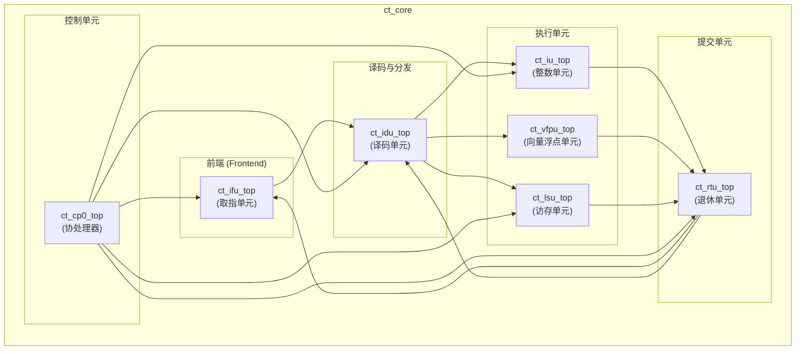

# ct_core 模块设计文档

## 1. 模块概述

### 1.1 基本信息
| 项目 | 内容 |
|------|------|
| 模块名称 | ct_core |
| 文件路径 | C910_RTL_FACTORY/gen_rtl/cpu/rtl/ct_core.v |
| 模块类型 | 核心处理单元顶层模块 |
| 作者 | T-Head Semiconductor Co., Ltd. |
| 许可证 | Apache License 2.0 |

### 1.2 功能描述
ct_core 是 OpenC910 处理器的核心处理单元顶层模块，集成了取指单元 (IFU)、译码单元 (IDU)、整数单元 (IU)、访存单元 (LSU)、退休单元 (RTU)、协处理器 (CP0)、向量浮点单元 (VFPU) 等所有核心组件。该模块实现了完整的 RISC-V 指令集架构，支持标量和向量运算。

### 1.3 设计特点
- 完整的 RISC-V 指令集实现
- 多发射超标量架构
- 支持向量扩展 (RVV)
- 支持浮点运算 (RVF/RVD)
- 乱序执行、顺序提交
- 多级流水线设计

## 2. 接口描述

### 2.1 输入端口

#### 2.1.1 BIU 接口输入
| 信号名称 | 位宽 | 描述 |
|----------|------|------|
| biu_cp0_apb_base | [39:0] | APB 基地址 |
| biu_cp0_cmplt | 1 | CP0 操作完成 |
| biu_cp0_coreid | [2:0] | 核心 ID |
| biu_cp0_me_int | 1 | 机器模式外部中断 |
| biu_cp0_ms_int | 1 | 机器模式软件中断 |
| biu_cp0_mt_int | 1 | 机器模式定时器中断 |
| biu_cp0_rdata | [127:0] | CP0 读数据 |
| biu_cp0_rvba | [39:0] | 复位向量基地址 |
| biu_cp0_se_int | 1 | 监管模式外部中断 |
| biu_cp0_ss_int | 1 | 监管模式软件中断 |
| biu_cp0_st_int | 1 | 监管模式定时器中断 |
| biu_ifu_rd_data | [127:0] | IFU 读数据 |
| biu_ifu_rd_data_vld | 1 | IFU 读数据有效 |
| biu_ifu_rd_grnt | 1 | IFU 读授权 |
| biu_ifu_rd_id | 1 | IFU 读 ID |
| biu_ifu_rd_last | 1 | IFU 读最后数据 |
| biu_ifu_rd_resp | [1:0] | IFU 读响应 |
| biu_lsu_ac_addr | [39:0] | LSU AC 通道地址 |
| biu_lsu_ac_prot | [2:0] | LSU AC 通道保护属性 |
| biu_lsu_ac_req | 1 | LSU AC 通道请求 |
| biu_lsu_ac_snoop | [3:0] | LSU AC 通道监听类型 |
| biu_lsu_ar_ready | 1 | LSU AR 通道就绪 |
| biu_lsu_aw_vb_grnt | 1 | LSU AW VB 授权 |
| biu_lsu_aw_wmb_grnt | 1 | LSU AW WMB 授权 |
| biu_lsu_b_id | [4:0] | LSU B 通道 ID |
| biu_lsu_b_resp | [1:0] | LSU B 通道响应 |
| biu_lsu_b_vld | 1 | LSU B 通道有效 |
| biu_lsu_cd_ready | 1 | LSU CD 通道就绪 |
| biu_lsu_cr_ready | 1 | LSU CR 通道就绪 |
| biu_lsu_r_data | [127:0] | LSU R 通道数据 |
| biu_lsu_r_id | [4:0] | LSU R 通道 ID |
| biu_lsu_r_last | 1 | LSU R 通道最后数据 |
| biu_lsu_r_resp | [3:0] | LSU R 通道响应 |
| biu_lsu_r_vld | 1 | LSU R 通道有效 |
| biu_lsu_w_vb_grnt | 1 | LSU W VB 授权 |
| biu_lsu_w_wmb_grnt | 1 | LSU W WMB 授权 |
| biu_yy_xx_no_op | 1 | 无操作标志 |

#### 2.1.2 时钟复位输入
| 信号名称 | 位宽 | 描述 |
|----------|------|------|
| forever_cpuclk | 1 | 永久 CPU 时钟 |
| fpu_rst_b | 1 | FPU 复位 |
| idu_rst_b | 1 | IDU 复位 |
| ifu_rst_b | 1 | IFU 复位 |
| lsu_rst_b | 1 | LSU 复位 |

#### 2.1.3 HAD 调试接口输入
| 信号名称 | 位宽 | 描述 |
|----------|------|------|
| had_cp0_xx_dbg | 1 | 调试模式标志 |
| had_idu_debug_id_inst_en | 1 | IDU 调试指令使能 |
| had_idu_wbbr_data | [63:0] | IDU 写回数据 |
| had_idu_wbbr_vld | 1 | IDU 写回有效 |
| had_ifu_ir | [31:0] | IFU 指令寄存器 |
| had_ifu_ir_vld | 1 | IFU 指令有效 |
| had_ifu_pc | [38:0] | IFU PC 值 |
| had_ifu_pcload | 1 | IFU PC 加载 |
| had_lsu_bus_trace_en | 1 | LSU 总线跟踪使能 |
| had_lsu_dbg_en | 1 | LSU 调试使能 |
| had_rtu_data_bkpt_dbgreq | 1 | RTU 数据断点调试请求 |
| had_rtu_dbg_disable | 1 | RTU 调试禁用 |
| had_rtu_dbg_req_en | 1 | RTU 调试请求使能 |
| had_yy_xx_bkpta_base | [39:0] | 断点 A 基地址 |
| had_yy_xx_bkpta_mask | [7:0] | 断点 A 掩码 |
| had_yy_xx_bkpta_rc | 1 | 断点 A 读/清除 |
| had_yy_xx_bkptb_base | [39:0] | 断点 B 基地址 |
| had_yy_xx_bkptb_mask | [7:0] | 断点 B 掩码 |
| had_yy_xx_bkptb_rc | 1 | 断点 B 读/清除 |
| had_yy_xx_exit_dbg | 1 | 退出调试模式 |

#### 2.1.4 HPCP 性能计数器接口输入
| 信号名称 | 位宽 | 描述 |
|----------|------|------|
| hpcp_cp0_cmplt | 1 | HPCP CP0 操作完成 |
| hpcp_cp0_data | [63:0] | HPCP CP0 数据 |
| hpcp_cp0_int_vld | 1 | HPCP CP0 中断有效 |
| hpcp_cp0_sce | 1 | HPCP SCE 标志 |
| hpcp_idu_cnt_en | 1 | HPCP IDU 计数使能 |
| hpcp_ifu_cnt_en | 1 | HPCP IFU 计数使能 |
| hpcp_lsu_cnt_en | 1 | HPCP LSU 计数使能 |
| hpcp_rtu_cnt_en | 1 | HPCP RTU 计数使能 |

#### 2.1.5 MMU 接口输入
| 信号名称 | 位宽 | 描述 |
|----------|------|------|
| mmu_cp0_cmplt | 1 | MMU CP0 操作完成 |
| mmu_cp0_data | [63:0] | MMU CP0 数据 |
| mmu_cp0_satp_data | [63:0] | SATP 寄存器数据 |
| mmu_cp0_tlb_done | 1 | TLB 操作完成 |
| mmu_ifu_buf | 1 | IFU 缓冲属性 |
| mmu_ifu_ca | 1 | IFU 缓存属性 |
| mmu_ifu_deny | 1 | IFU 拒绝访问 |
| mmu_ifu_pa | [27:0] | IFU 物理地址 |
| mmu_ifu_pavld | 1 | IFU 物理地址有效 |
| mmu_ifu_pgflt | 1 | IFU 页错误 |
| mmu_ifu_sec | 1 | IFU 安全属性 |
| mmu_lsu_access_fault0 | 1 | LSU 访问错误 0 |
| mmu_lsu_access_fault1 | 1 | LSU 访问错误 1 |
| mmu_lsu_pa0 | [27:0] | LSU 物理地址 0 |
| mmu_lsu_pa0_vld | 1 | LSU 物理地址 0 有效 |
| mmu_lsu_pa1 | [27:0] | LSU 物理地址 1 |
| mmu_lsu_pa1_vld | 1 | LSU 物理地址 1 有效 |
| mmu_lsu_page_fault0 | 1 | LSU 页错误 0 |
| mmu_lsu_page_fault1 | 1 | LSU 页错误 1 |
| mmu_xx_mmu_en | 1 | MMU 使能 |

#### 2.1.6 PMP 接口输入
| 信号名称 | 位宽 | 描述 |
|----------|------|------|
| pmp_cp0_data | [63:0] | PMP CP0 数据 |

### 2.2 输出端口

#### 2.2.1 CP0 接口输出
| 信号名称 | 位宽 | 描述 |
|----------|------|------|
| cp0_biu_icg_en | 1 | CP0 BIU 时钟门控使能 |
| cp0_biu_lpmd_b | [1:0] | CP0 低功耗模式 |
| cp0_biu_op | [15:0] | CP0 操作码 |
| cp0_biu_sel | 1 | CP0 选择 |
| cp0_biu_wdata | [63:0] | CP0 写数据 |
| cp0_had_cpuid_0 | [31:0] | CPU ID |
| cp0_had_debug_info | [3:0] | CP0 调试信息 |
| cp0_had_lpmd_b | [1:0] | CP0 HAD 低功耗模式 |
| cp0_hpcp_icg_en | 1 | CP0 HPCP 时钟门控使能 |
| cp0_hpcp_index | [11:0] | CP0 HPCP 索引 |
| cp0_hpcp_op | [3:0] | CP0 HPCP 操作 |
| cp0_hpcp_sel | 1 | CP0 HPCP 选择 |
| cp0_hpcp_wdata | [63:0] | CP0 HPCP 写数据 |
| cp0_mmu_cskyee | 1 | CSKY 扩展使能 |
| cp0_mmu_icg_en | 1 | CP0 MMU 时钟门控使能 |
| cp0_mmu_maee | 1 | MAEE 扩展使能 |
| cp0_mmu_mpp | [1:0] | MMU 特权模式 |
| cp0_mmu_mprv | 1 | MMU 特权访问 |
| cp0_mmu_mxr | 1 | MMU 可执行读 |
| cp0_pad_mstatus | [63:0] | 机器状态寄存器 |
| cp0_xx_core_icg_en | 1 | 核心时钟门控使能 |
| cp0_yy_priv_mode | [1:0] | 特权模式 |

#### 2.2.2 IFU 接口输出
| 信号名称 | 位宽 | 描述 |
|----------|------|------|
| ifu_biu_r_ready | 1 | IFU R 通道就绪 |
| ifu_biu_rd_addr | [39:0] | IFU 读地址 |
| ifu_biu_rd_burst | [1:0] | IFU 读突发类型 |
| ifu_biu_rd_cache | [3:0] | IFU 读缓存属性 |
| ifu_biu_rd_domain | [1:0] | IFU 读域 |
| ifu_biu_rd_id | 1 | IFU 读 ID |
| ifu_biu_rd_len | [1:0] | IFU 读长度 |
| ifu_biu_rd_prot | [2:0] | IFU 读保护属性 |
| ifu_biu_rd_req | 1 | IFU 读请求 |
| ifu_biu_rd_size | [2:0] | IFU 读大小 |
| ifu_biu_rd_snoop | [3:0] | IFU 读监听类型 |
| ifu_mmu_abort | 1 | IFU MMU 中止 |
| ifu_mmu_va | [62:0] | IFU 虚拟地址 |
| ifu_mmu_va_vld | 1 | IFU 虚拟地址有效 |

#### 2.2.3 LSU 接口输出
| 信号名称 | 位宽 | 描述 |
|----------|------|------|
| lsu_biu_ac_empty | 1 | LSU AC 通道空 |
| lsu_biu_ac_ready | 1 | LSU AC 通道就绪 |
| lsu_biu_ar_addr | [39:0] | LSU AR 通道地址 |
| lsu_biu_ar_bar | [1:0] | LSU AR 通道屏障 |
| lsu_biu_ar_burst | [1:0] | LSU AR 通道突发类型 |
| lsu_biu_ar_cache | [3:0] | LSU AR 通道缓存属性 |
| lsu_biu_ar_domain | [1:0] | LSU AR 通道域 |
| lsu_biu_ar_id | [4:0] | LSU AR 通道 ID |
| lsu_biu_ar_len | [1:0] | LSU AR 通道长度 |
| lsu_biu_ar_lock | 1 | LSU AR 通道锁定 |
| lsu_biu_ar_prot | [2:0] | LSU AR 通道保护属性 |
| lsu_biu_ar_req | 1 | LSU AR 通道请求 |
| lsu_biu_ar_size | [2:0] | LSU AR 通道大小 |
| lsu_biu_ar_snoop | [3:0] | LSU AR 通道监听类型 |
| lsu_biu_aw_st_addr | [39:0] | LSU AW 存储地址 |
| lsu_biu_aw_st_req | 1 | LSU AW 存储请求 |
| lsu_biu_w_st_data | [127:0] | LSU W 存储数据 |
| lsu_biu_w_st_vld | 1 | LSU W 存储有效 |
| lsu_mmu_abort0 | 1 | LSU MMU 中止 0 |
| lsu_mmu_abort1 | 1 | LSU MMU 中止 1 |
| lsu_mmu_va0 | [63:0] | LSU 虚拟地址 0 |
| lsu_mmu_va0_vld | 1 | LSU 虚拟地址 0 有效 |
| lsu_mmu_va1 | [63:0] | LSU 虚拟地址 1 |
| lsu_mmu_va1_vld | 1 | LSU 虚拟地址 1 有效 |

#### 2.2.4 RTU 接口输出
| 信号名称 | 位宽 | 描述 |
|----------|------|------|
| rtu_cpu_no_retire | 1 | CPU 无退休指令 |
| rtu_pad_retire0 | 1 | 退休指令 0 |
| rtu_pad_retire0_pc | [39:0] | 退休指令 0 PC |
| rtu_pad_retire1 | 1 | 退休指令 1 |
| rtu_pad_retire1_pc | [39:0] | 退休指令 1 PC |
| rtu_pad_retire2 | 1 | 退休指令 2 |
| rtu_pad_retire2_pc | [39:0] | 退休指令 2 PC |
| rtu_yy_xx_dbgon | 1 | 调试模式开启 |
| rtu_yy_xx_flush | 1 | 流水线刷新 |
| rtu_yy_xx_retire0 | 1 | 退休指令 0 (内部) |
| rtu_yy_xx_retire0_normal | 1 | 正常退休指令 0 |
| rtu_yy_xx_retire1 | 1 | 退休指令 1 (内部) |
| rtu_yy_xx_retire2 | 1 | 退休指令 2 (内部) |

## 3. 模块框图

## 4. 实现细节

### 4.1 模块例化

#### 4.1.1 ct_ifu_top 例化
取指单元顶层模块，负责：
- 指令缓存管理
- 分支预测 (BTB, BHT, RAS)
- 指令预取
- 虚拟地址转换

#### 4.1.2 ct_idu_top 例化
译码单元顶层模块，负责：
- 指令译码
- 寄存器重命名
- 指令分发
- 发射队列管理

#### 4.1.3 ct_iu_top 例化
整数单元顶层模块，负责：
- 整数运算
- 乘除法运算
- 分支执行
- CSR 访问

#### 4.1.4 ct_lsu_top 例化
访存单元顶层模块，负责：
- 数据缓存管理
- 加载/存储操作
- 内存一致性
- 地址转换

#### 4.1.5 ct_rtu_top 例化
退休单元顶层模块，负责：
- 指令顺序提交
- 异常处理
- 中断响应
- 断点调试

#### 4.1.6 ct_cp0_top 例化
协处理器顶层模块，负责：
- CSR 寄存器管理
- 特权模式控制
- 中断管理
- 性能计数器配置

### 4.2 内部信号连接

模块间通过大量内部信号进行连接，主要包括：

| 信号组 | 描述 |
|--------|------|
| ifu_idu_* | IFU 到 IDU 的接口信号 |
| idu_iu_* | IDU 到 IU 的接口信号 |
| idu_vfpu_* | IDU 到 VFPU 的接口信号 |
| idu_lsu_* | IDU 到 LSU 的接口信号 |
| iu_rtu_* | IU 到 RTU 的接口信号 |
| vfpu_rtu_* | VFPU 到 RTU 的接口信号 |
| lsu_rtu_* | LSU 到 RTU 的接口信号 |
| rtu_idu_* | RTU 到 IDU 的接口信号 |
| rtu_ifu_* | RTU 到 IFU 的接口信号 |
| cp0_* | CP0 相关信号 |

## 5. 子模块描述

### 5.1 ct_ifu_top
取指单元顶层模块，实现指令获取和分支预测功能。

### 5.2 ct_idu_top
译码单元顶层模块，实现指令译码、寄存器重命名和指令分发功能。

### 5.3 ct_iu_top
整数单元顶层模块，实现整数运算和分支执行功能。

### 5.4 ct_lsu_top
访存单元顶层模块，实现数据访问和缓存管理功能。

### 5.5 ct_rtu_top
退休单元顶层模块，实现指令提交和异常处理功能。

### 5.6 ct_cp0_top
协处理器顶层模块，实现 CSR 寄存器和特权模式管理功能。

## 6. 设计注意事项

### 6.1 时钟域
- forever_cpuclk: 永久 CPU 时钟域
- 各子模块有独立的复位信号

### 6.2 复位策略
- 多级复位：IDU 复位、IFU 复位、LSU 复位、FPU 复位
- 支持扫描模式

### 6.3 流水线设计
- 支持多发射（最多 4 条指令）
- 乱序执行、顺序提交
- 支持推测执行

## 7. 修订历史

| 版本 | 日期 | 描述 |
|------|------|------|
| 1.0 | 2021-10 | 初始版本 |
