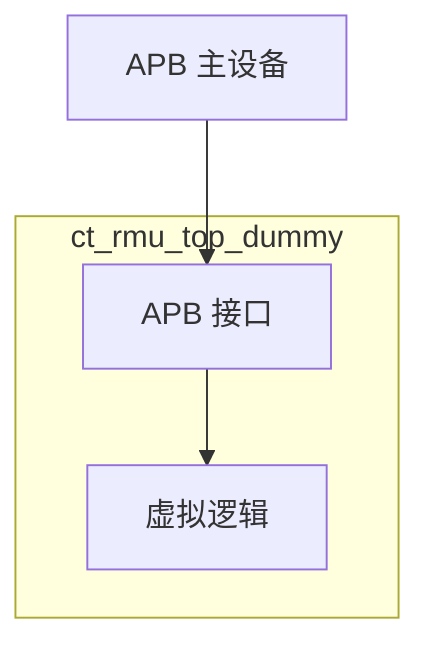

# ct_rmu_top_dummy 模块设计文档

## 1. 模块概述

### 1.1 基本信息
| 项目 | 内容 |
|------|------|
| 模块名称 | ct_rmu_top_dummy |
| 文件路径 | C910_RTL_FACTORY/gen_rtl/cpu/rtl/ct_rmu_top_dummy.v |
| 模块类型 | 复位管理单元虚拟模块 |
| 作者 | T-Head Semiconductor Co., Ltd. |
| 许可证 | Apache License 2.0 |

### 1.2 功能描述
ct_rmu_top_dummy 是 OpenC910 处理器的复位管理单元虚拟模块，提供 APB 接口用于复位管理配置。该模块是一个占位符实现，用于在完整 RMU 未实现时提供基本接口。

### 1.3 设计特点
- APB 总线接口
- 复位管理功能占位
- 简化实现

## 2. 接口描述

### 2.1 输入端口

#### 2.1.1 APB 接口输入
| 信号名称 | 位宽 | 描述 |
|----------|------|------|
| pad_rmu_paddr | [39:0] | APB 地址 |
| pad_rmu_penable | 1 | APB 使能 |
| pad_rmu_psel | 1 | APB 选择 |
| pad_rmu_pwdata | [31:0] | APB 写数据 |
| pad_rmu_pwrite | 1 | APB 写使能 |

#### 2.1.2 时钟复位输入
| 信号名称 | 位宽 | 描述 |
|----------|------|------|
| pad_rmu_clk | 1 | RMU 时钟 |
| pad_rmu_rst_b | 1 | RMU 复位 |

### 2.2 输出端口

#### 2.2.1 APB 接口输出
| 信号名称 | 位宽 | 描述 |
|----------|------|------|
| rmu_pad_prdata | [31:0] | APB 读数据 |
| rmu_pad_pready | 1 | APB 就绪 |
| rmu_pad_pslverr | 1 | APB 从设备错误 |

## 3. 模块框图

## 4. 实现细节

### 4.1 APB 接口处理
- 接收 APB 读写请求
- 返回默认响应

### 4.2 虚拟实现
该模块是一个占位符实现：
- 读操作返回 0
- 写操作被忽略
- 总是返回就绪状态

## 5. 设计注意事项

### 5.1 功能限制
- 该模块为虚拟实现，不提供实际复位管理功能
- 完整实现需要替换为真实的 RMU 模块

### 5.2 APB 协议
- 遵循 APB 协议规范
- 支持 PADDR、PENABLE、PSEL、PWDATA、PWRITE 信号
- 返回 PRDATA、PREADY、PSLVERR 信号

## 6. 修订历史

| 版本 | 日期 | 描述 |
|------|------|------|
| 1.0 | 2021-10 | 初始版本 |
