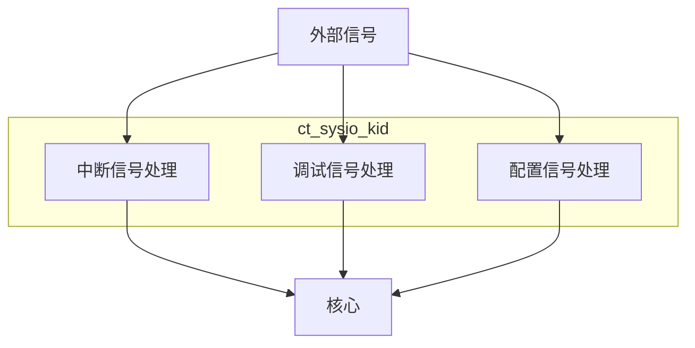

# ct_sysio_kid 模块设计文档

## 1. 模块概述

### 1.1 基本信息
| 项目 | 内容 |
|------|------|
| 模块名称 | ct_sysio_kid |
| 文件路径 | C910_RTL_FACTORY/gen_rtl/cpu/rtl/ct_sysio_kid.v |
| 模块类型 | 每核心系统 I/O 子模块 |
| 作者 | T-Head Semiconductor Co., Ltd. |
| 许可证 | Apache License 2.0 |

### 1.2 功能描述
ct_sysio_kid 是 OpenC910 处理器的每核心系统 I/O 子模块，负责处理单个核心的中断信号、调试请求、APB 基地址配置等系统级 I/O 功能。该模块作为 ct_sysio_top 的子模块，为核心提供系统 I/O 接口。

### 1.3 设计特点
- 中断信号处理与分发
- 调试请求转发
- APB 基地址配置
- 系统计时器值传递

## 2. 接口描述

### 2.1 输入端口

#### 2.1.1 中断接口输入
| 信号名称 | 位宽 | 描述 |
|----------|------|------|
| pad_sysio_me_int | 1 | 机器模式外部中断 |
| pad_sysio_ms_int | 1 | 机器模式软件中断 |
| pad_sysio_mt_int | 1 | 机器模式定时器中断 |
| pad_sysio_se_int | 1 | 监管模式外部中断 |
| pad_sysio_ss_int | 1 | 监管模式软件中断 |
| pad_sysio_st_int | 1 | 监管模式定时器中断 |
| pad_sysio_hpcp_l2of_int | [3:0] | HPCP L2 溢出中断 |

#### 2.1.2 调试接口输入
| 信号名称 | 位宽 | 描述 |
|----------|------|------|
| pad_sysio_dbgrq_b | 1 | 调试请求 |

#### 2.1.3 系统配置输入
| 信号名称 | 位宽 | 描述 |
|----------|------|------|
| pad_sysio_apb_base | [39:0] | APB 基地址 |
| pad_sysio_time | [63:0] | 系统计时器值 |

### 2.2 输出端口

#### 2.2.1 核心接口输出
| 信号名称 | 位宽 | 描述 |
|----------|------|------|
| sysio_pad_me_int | 1 | 机器模式外部中断 |
| sysio_pad_ms_int | 1 | 机器模式软件中断 |
| sysio_pad_mt_int | 1 | 机器模式定时器中断 |
| sysio_pad_se_int | 1 | 监管模式外部中断 |
| sysio_pad_ss_int | 1 | 监管模式软件中断 |
| sysio_pad_st_int | 1 | 监管模式定时器中断 |
| sysio_pad_hpcp_l2of_int | [3:0] | HPCP L2 溢出中断 |
| sysio_pad_dbgrq_b | 1 | 调试请求 |
| sysio_pad_apb_base | [39:0] | APB 基地址 |

## 3. 模块框图

## 4. 实现细节

### 4.1 信号传递
该模块主要实现信号传递功能：
- 中断信号直接传递
- 调试请求直接传递
- APB 基地址直接传递
- 系统计时器值直接传递

### 4.2 信号命名规则
- pad_sysio_*: 来自外部的输入信号
- sysio_pad_*: 输出到核心的信号

## 5. 设计注意事项

### 5.1 中断处理
- 支持机器模式 (M-mode) 和监管模式 (S-mode) 中断
- 支持外部中断 (E)、软件中断 (S)、定时器中断 (T)
- 中断信号为高电平有效

### 5.2 调试支持
- 调试请求信号为低电平有效 (dbgrq_b)

## 6. 修订历史

| 版本 | 日期 | 描述 |
|------|------|------|
| 1.0 | 2021-10 | 初始版本 |
