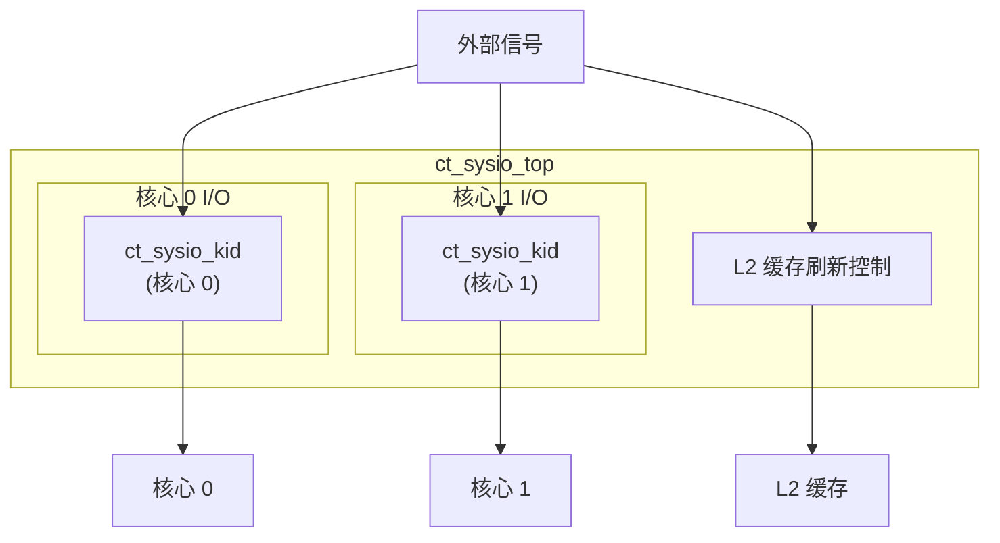

# ct_sysio_top 模块设计文档

## 1. 模块概述

### 1.1 基本信息
| 项目 | 内容 |
|------|------|
| 模块名称 | ct_sysio_top |
| 文件路径 | C910_RTL_FACTORY/gen_rtl/cpu/rtl/ct_sysio_top.v |
| 模块类型 | 系统 I/O 顶层模块 |
| 作者 | T-Head Semiconductor Co., Ltd. |
| 许可证 | Apache License 2.0 |

### 1.2 功能描述
ct_sysio_top 是 OpenC910 处理器的系统 I/O 顶层模块，负责处理中断信号、调试请求、APB 基地址配置、L2 缓存刷新等系统级 I/O 功能。该模块例化了两个 ct_sysio_kid 子模块，分别对应两个核心的系统 I/O 处理。

### 1.3 设计特点
- 支持双核配置
- 中断信号聚合与分发
- 调试请求处理
- APB 基地址配置
- L2 缓存刷新控制

## 2. 接口描述

### 2.1 输入端口

#### 2.1.1 中断接口输入
| 信号名称 | 位宽 | 描述 |
|----------|------|------|
| pad_sysio_me_int | [1:0] | 机器模式外部中断 |
| pad_sysio_ms_int | [1:0] | 机器模式软件中断 |
| pad_sysio_mt_int | [1:0] | 机器模式定时器中断 |
| pad_sysio_se_int | [1:0] | 监管模式外部中断 |
| pad_sysio_ss_int | [1:0] | 监管模式软件中断 |
| pad_sysio_st_int | [1:0] | 监管模式定时器中断 |
| pad_sysio_hpcp_l2of_int | [3:0] | HPCP L2 溢出中断 |

#### 2.1.2 调试接口输入
| 信号名称 | 位宽 | 描述 |
|----------|------|------|
| pad_sysio_dbgrq_b | [1:0] | 调试请求 |

#### 2.1.3 系统配置输入
| 信号名称 | 位宽 | 描述 |
|----------|------|------|
| pad_sysio_apb_base | [39:0] | APB 基地址 |
| pad_sysio_l2c_flush_req | 1 | L2 缓存刷新请求 |
| pad_sysio_time | [63:0] | 系统计时器值 |

### 2.2 输出端口

#### 2.2.1 核心接口输出
| 信号名称 | 位宽 | 描述 |
|----------|------|------|
| sysio_pad_l2c_flush_done | 1 | L2 缓存刷新完成 |
| sysio_pad_core0_me_int | 1 | 核心 0 机器模式外部中断 |
| sysio_pad_core0_ms_int | 1 | 核心 0 机器模式软件中断 |
| sysio_pad_core0_mt_int | 1 | 核心 0 机器模式定时器中断 |
| sysio_pad_core0_se_int | 1 | 核心 0 监管模式外部中断 |
| sysio_pad_core0_ss_int | 1 | 核心 0 监管模式软件中断 |
| sysio_pad_core0_st_int | 1 | 核心 0 监管模式定时器中断 |
| sysio_pad_core0_hpcp_l2of_int | [3:0] | 核心 0 HPCP L2 溢出中断 |
| sysio_pad_core0_dbgrq_b | 1 | 核心 0 调试请求 |
| sysio_pad_core0_apb_base | [39:0] | 核心 0 APB 基地址 |
| sysio_pad_core1_me_int | 1 | 核心 1 机器模式外部中断 |
| sysio_pad_core1_ms_int | 1 | 核心 1 机器模式软件中断 |
| sysio_pad_core1_mt_int | 1 | 核心 1 机器模式定时器中断 |
| sysio_pad_core1_se_int | 1 | 核心 1 监管模式外部中断 |
| sysio_pad_core1_ss_int | 1 | 核心 1 监管模式软件中断 |
| sysio_pad_core1_st_int | 1 | 核心 1 监管模式定时器中断 |
| sysio_pad_core1_hpcp_l2of_int | [3:0] | 核心 1 HPCP L2 溢出中断 |
| sysio_pad_core1_dbgrq_b | 1 | 核心 1 调试请求 |
| sysio_pad_core1_apb_base | [39:0] | 核心 1 APB 基地址 |

## 3. 模块框图

## 4. 实现细节

### 4.1 模块例化

#### 4.1.1 ct_sysio_kid 例化 (核心 0)
为核心 0 提供系统 I/O 功能：
- 中断信号处理
- 调试请求转发
- APB 基地址配置

#### 4.1.2 ct_sysio_kid 例化 (核心 1)
为核心 1 提供系统 I/O 功能：
- 中断信号处理
- 调试请求转发
- APB 基地址配置

### 4.2 L2 缓存刷新控制
处理 L2 缓存刷新请求：
- 接收外部刷新请求
- 生成刷新完成信号

## 5. 子模块描述

### 5.1 ct_sysio_kid
每核心系统 I/O 子模块，处理单个核心的系统 I/O 信号。

## 6. 设计注意事项

### 6.1 中断处理
- 支持机器模式和监管模式中断
- 支持外部、软件和定时器中断
- 中断信号按核心独立分发

### 6.2 调试支持
- 每核心独立的调试请求信号
- 支持外部调试请求

## 7. 修订历史

| 版本 | 日期 | 描述 |
|------|------|------|
| 1.0 | 2021-10 | 初始版本 |
