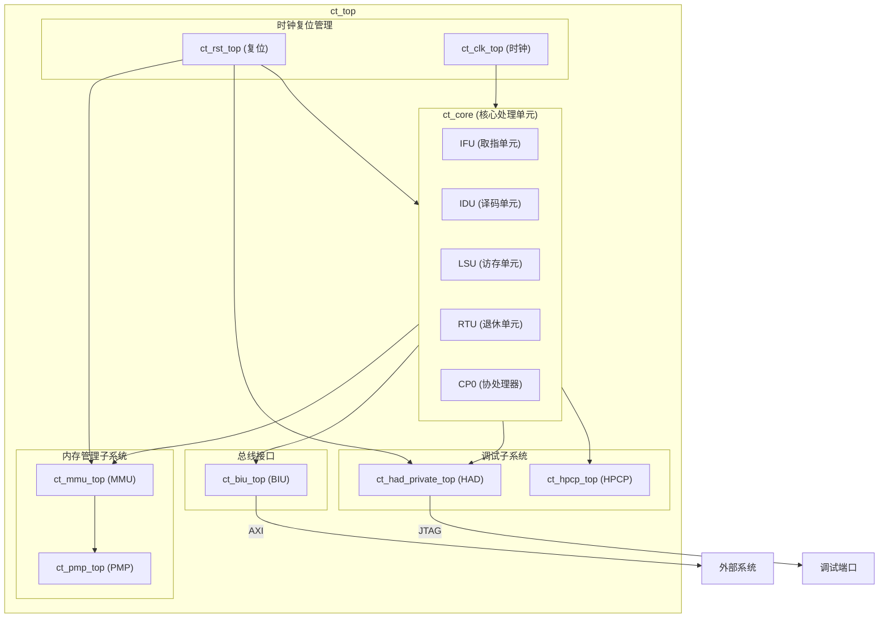

# ct_top 模块设计文档

## 1. 模块概述

### 1.1 基本信息
| 项目 | 内容 |
|------|------|
| 模块名称 | ct_top |
| 文件路径 | C910_RTL_FACTORY/gen_rtl/cpu/rtl/ct_top.v |
| 模块类型 | 单核顶层模块 |
| 作者 | T-Head Semiconductor Co., Ltd. |
| 许可证 | Apache License 2.0 |

### 1.2 功能描述
ct_top 是 OpenC910 处理器的单核顶层模块，负责集成和管理单个 CPU 核心的所有子模块。该模块是单核配置下的顶层封装，包含核心处理单元、内存管理单元、总线接口单元、调试单元、性能计数器等关键组件。

### 1.3 设计特点
- 单核处理器顶层封装
- 支持多时钟域设计
- 集成完整的内存管理子系统
- 支持硬件调试功能
- 包含性能监控单元

## 2. 接口描述

### 2.1 输入端口

#### 2.1.1 AXI 总线接口输入
| 信号名称 | 位宽 | 描述 |
|----------|------|------|
| pad_biu_acaddr | [39:0] | AC 通道地址 |
| pad_biu_acprot | [2:0] | AC 通道保护属性 |
| pad_biu_acsnoop | [3:0] | AC 通道监听类型 |
| pad_biu_acvalid | 1 | AC 通道有效信号 |
| pad_biu_arready | 1 | AR 通道就绪信号 |
| pad_biu_awready | 1 | AW 通道就绪信号 |
| pad_biu_bid | [4:0] | B 通道 ID |
| pad_biu_bresp | [1:0] | B 通道响应 |
| pad_biu_bvalid | 1 | B 通道有效信号 |
| pad_biu_cdready | 1 | CD 通道就绪信号 |
| pad_biu_crready | 1 | CR 通道就绪信号 |
| pad_biu_csr_cmplt | 1 | CSR 操作完成 |
| pad_biu_csr_rdata | [127:0] | CSR 读数据 |
| pad_biu_rdata | [127:0] | R 通道读数据 |
| pad_biu_rid | [4:0] | R 通道 ID |
| pad_biu_rlast | 1 | R 通道最后一个数据 |
| pad_biu_rresp | [3:0] | R 通道响应 |
| pad_biu_rvalid | 1 | R 通道有效信号 |
| pad_biu_wready | 1 | W 通道就绪信号 |

#### 2.1.2 中断接口输入
| 信号名称 | 位宽 | 描述 |
|----------|------|------|
| pad_biu_me_int | 1 | 机器模式外部中断 |
| pad_biu_ms_int | 1 | 机器模式软件中断 |
| pad_biu_mt_int | 1 | 机器模式定时器中断 |
| pad_biu_se_int | 1 | 监管模式外部中断 |
| pad_biu_ss_int | 1 | 监管模式软件中断 |
| pad_biu_st_int | 1 | 监管模式定时器中断 |
| pad_biu_hpcp_l2of_int | [3:0] | HPCP L2 溢出中断 |
| pad_biu_dbgrq_b | 1 | 调试请求 |

#### 2.1.3 系统控制输入
| 信号名称 | 位宽 | 描述 |
|----------|------|------|
| pad_core_hartid | [2:0] | 硬件线程 ID |
| pad_core_rst_b | 1 | 核心复位信号 |
| pad_core_rvba | [39:0] | 复位向量基地址 |
| pad_cpu_rst_b | 1 | CPU 复位信号 |
| pad_xx_apb_base | [39:0] | APB 基地址 |
| pad_xx_time | [63:0] | 系统计时器值 |
| pll_core_clk | 1 | PLL 核心时钟 |

#### 2.1.4 测试与调试输入
| 信号名称 | 位宽 | 描述 |
|----------|------|------|
| pad_yy_icg_scan_en | 1 | 扫描使能 |
| pad_yy_mbist_mode | 1 | MBIST 模式 |
| pad_yy_scan_mode | 1 | 扫描模式 |
| pad_yy_scan_rst_b | 1 | 扫描复位 |
| sm_update_dr | 1 | JTAG DR 更新 |
| sm_update_ir | 1 | JTAG IR 更新 |
| x_enter_dbg_req_i | 1 | 进入调试请求输入 |
| x_exit_dbg_req_i | 1 | 退出调试请求输入 |
| x_had_dbg_mask | 1 | 调试屏蔽 |
| ir_corex_wdata | [63:0] | 调试数据输入 |

### 2.2 输出端口

#### 2.2.1 AXI 总线接口输出
| 信号名称 | 位宽 | 描述 |
|----------|------|------|
| biu_pad_acready | 1 | AC 通道就绪信号 |
| biu_pad_araddr | [39:0] | AR 通道地址 |
| biu_pad_arbar | [1:0] | AR 通道屏障 |
| biu_pad_arburst | [1:0] | AR 通道突发类型 |
| biu_pad_arcache | [3:0] | AR 通道缓存属性 |
| biu_pad_ardomain | [1:0] | AR 通道域 |
| biu_pad_arid | [4:0] | AR 通道 ID |
| biu_pad_arlen | [1:0] | AR 通道长度 |
| biu_pad_arlock | 1 | AR 通道锁定 |
| biu_pad_arprot | [2:0] | AR 通道保护属性 |
| biu_pad_arsize | [2:0] | AR 通道大小 |
| biu_pad_arsnoop | [3:0] | AR 通道监听类型 |
| biu_pad_aruser | [2:0] | AR 通道用户属性 |
| biu_pad_arvalid | 1 | AR 通道有效信号 |
| biu_pad_awaddr | [39:0] | AW 通道地址 |
| biu_pad_awbar | [1:0] | AW 通道屏障 |
| biu_pad_awburst | [1:0] | AW 通道突发类型 |
| biu_pad_awcache | [3:0] | AW 通道缓存属性 |
| biu_pad_awdomain | [1:0] | AW 通道域 |
| biu_pad_awid | [4:0] | AW 通道 ID |
| biu_pad_awlen | [1:0] | AW 通道长度 |
| biu_pad_awlock | 1 | AW 通道锁定 |
| biu_pad_awprot | [2:0] | AW 通道保护属性 |
| biu_pad_awsize | [2:0] | AW 通道大小 |
| biu_pad_awsnoop | [2:0] | AW 通道监听类型 |
| biu_pad_awunique | 1 | AW 通道唯一性 |
| biu_pad_awuser | 1 | AW 通道用户属性 |
| biu_pad_awvalid | 1 | AW 通道有效信号 |
| biu_pad_back | 1 | B 通道应答 |
| biu_pad_bready | 1 | B 通道就绪信号 |
| biu_pad_cddata | [127:0] | CD 通道数据 |
| biu_pad_cderr | 1 | CD 通道错误 |
| biu_pad_cdlast | 1 | CD 通道最后数据 |
| biu_pad_cdvalid | 1 | CD 通道有效信号 |
| biu_pad_crresp | [4:0] | CR 通道响应 |
| biu_pad_crvalid | 1 | CR 通道有效信号 |
| biu_pad_rack | 1 | R 通道应答 |
| biu_pad_rready | 1 | R 通道就绪信号 |
| biu_pad_wdata | [127:0] | W 通道写数据 |
| biu_pad_werr | 1 | W 通道错误 |
| biu_pad_wlast | 1 | W 通道最后数据 |
| biu_pad_wns | 1 | W 通道非安全 |
| biu_pad_wstrb | [15:0] | W 通道写选通 |
| biu_pad_wvalid | 1 | W 通道有效信号 |

#### 2.2.2 系统状态输出
| 信号名称 | 位宽 | 描述 |
|----------|------|------|
| cp0_pad_mstatus | [63:0] | 机器状态寄存器 |
| rtu_cpu_no_retire | 1 | CPU 无退休指令 |
| rtu_pad_retire0 | 1 | 退休指令 0 |
| rtu_pad_retire0_pc | [39:0] | 退休指令 0 PC |
| rtu_pad_retire1 | 1 | 退休指令 1 |
| rtu_pad_retire1_pc | [39:0] | 退休指令 1 PC |
| rtu_pad_retire2 | 1 | 退休指令 2 |
| rtu_pad_retire2_pc | [39:0] | 退休指令 2 PC |
| biu_pad_cnt_en | [3:0] | 计数器使能 |
| biu_pad_csr_sel | 1 | CSR 选择 |
| biu_pad_csr_wdata | [79:0] | CSR 写数据 |
| biu_pad_jdb_pm | 1 | JTAG 调试电源管理 |
| biu_pad_lpmd_b | 1 | 低功耗模式 |

#### 2.2.3 调试接口输出
| 信号名称 | 位宽 | 描述 |
|----------|------|------|
| x_dbg_ack_pc | 1 | 调试应答 PC |
| x_enter_dbg_req_o | 1 | 进入调试请求输出 |
| x_exit_dbg_req_o | 1 | 退出调试请求输出 |
| x_regs_serial_data | [63:0] | 寄存器串行数据 |

## 3. 模块框图

## 4. 实现细节

### 4.1 模块例化

#### 4.1.1 ct_core 例化
ct_core 是核心处理单元，包含：
- 取指单元 (IFU)
- 译码单元 (IDU)
- 访存单元 (LSU)
- 退休单元 (RTU)
- 协处理器 (CP0)

#### 4.1.2 ct_mmu_top 例化
内存管理单元顶层模块，负责：
- 虚拟地址到物理地址转换
- TLB 管理
- 页表遍历

#### 4.1.3 ct_pmp_top 例化
物理内存保护单元，负责：
- 内存区域权限检查
- 内存访问控制

#### 4.1.4 ct_biu_top 例化
总线接口单元，负责：
- AXI 总线协议处理
- 缓存一致性协议
- 外部接口通信

#### 4.1.5 ct_had_private_top 例化
硬件辅助调试模块（私有），负责：
- 调试断点管理
- 单步调试
- 寄存器访问

#### 4.1.6 ct_hpcp_top 例化
硬件性能计数器模块，负责：
- 性能事件计数
- 性能监控

#### 4.1.7 ct_rst_top 例化
复位管理模块，负责：
- 多级复位控制
- 复位时序管理

#### 4.1.8 ct_clk_top 例化
时钟管理模块，负责：
- 时钟门控
- 低功耗管理

### 4.2 内部信号连接

模块间通过大量内部信号进行连接，主要包括：

| 信号组 | 描述 |
|--------|------|
| biu_* | BIU 与其他模块的接口信号 |
| cp0_* | CP0 与其他模块的接口信号 |
| had_* | HAD 与其他模块的接口信号 |
| hpcp_* | HPCP 与其他模块的接口信号 |
| mmu_* | MMU 与其他模块的接口信号 |
| pmp_* | PMP 与其他模块的接口信号 |
| ifu_* | IFU 相关信号 |
| lsu_* | LSU 相关信号 |
| rtu_* | RTU 相关信号 |
| idu_* | IDU 相关信号 |

## 5. 子模块描述

### 5.1 ct_core
核心处理单元，实现 RISC-V 指令集架构，包含完整的流水线和执行单元。

### 5.2 ct_mmu_top
内存管理单元顶层模块，实现虚拟内存管理功能。

### 5.3 ct_pmp_top
物理内存保护单元，实现内存区域保护功能。

### 5.4 ct_biu_top
总线接口单元，实现 AXI 总线接口和缓存一致性协议。

### 5.5 ct_had_private_top
硬件辅助调试私有模块，实现调试功能。

### 5.6 ct_hpcp_top
硬件性能计数器模块，实现性能监控功能。

### 5.7 ct_rst_top
复位管理模块，实现多级复位控制。

### 5.8 ct_clk_top
时钟管理模块，实现时钟门控和低功耗管理。

## 6. 设计注意事项

### 6.1 时钟域
- forever_coreclk: 核心时钟域
- coreclk: 核心工作时钟

### 6.2 复位策略
- 多级复位：CPU 复位、核心复位、模块复位
- 支持扫描复位和 MBIST 模式

### 6.3 低功耗设计
- 支持时钟门控
- 支持低功耗模式
- 支持调试唤醒和中断唤醒

## 7. 修订历史

| 版本 | 日期 | 描述 |
|------|------|------|
| 1.0 | 2021-10 | 初始版本 |
