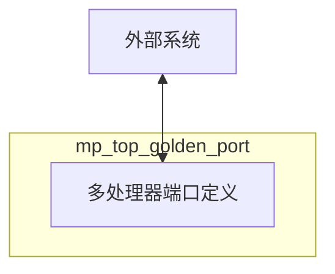

# mp_top_golden_port 模块设计文档

## 1. 模块概述

### 1.1 基本信息
| 项目 | 内容 |
|------|------|
| 模块名称 | mp_top_golden_port |
| 文件路径 | C910_RTL_FACTORY/gen_rtl/cpu/rtl/mp_top_golden_port.v |
| 模块类型 | 多处理器端口定义模块 |
| 作者 | T-Head Semiconductor Co., Ltd. |
| 许可证 | Apache License 2.0 |

### 1.2 功能描述
mp_top_golden_port 是 OpenC910 处理器的多处理器端口定义模块，定义了双核配置下处理器的所有外部接口。该模块作为端口模板，用于验证和文档目的。

### 1.3 设计特点
- 完整的双核端口定义
- AXI 总线接口
- 调试接口
- 中断接口（支持多核）

## 2. 接口描述

### 2.1 输入端口

#### 2.1.1 AXI 总线接口输入
| 信号名称 | 位宽 | 描述 |
|----------|------|------|
| pad_biu_acaddr | [39:0] | AC 通道地址 |
| pad_biu_acprot | [2:0] | AC 通道保护属性 |
| pad_biu_acsnoop | [3:0] | AC 通道监听类型 |
| pad_biu_acvalid | 1 | AC 通道有效信号 |
| pad_biu_arready | 1 | AR 通道就绪信号 |
| pad_biu_awready | 1 | AW 通道就绪信号 |
| pad_biu_bid | [4:0] | B 通道 ID |
| pad_biu_bresp | [1:0] | B 通道响应 |
| pad_biu_bvalid | 1 | B 通道有效信号 |
| pad_biu_cdready | 1 | CD 通道就绪信号 |
| pad_biu_crready | 1 | CR 通道就绪信号 |
| pad_biu_csr_cmplt | 1 | CSR 操作完成 |
| pad_biu_csr_rdata | [127:0] | CSR 读数据 |
| pad_biu_rdata | [127:0] | R 通道读数据 |
| pad_biu_rid | [4:0] | R 通道 ID |
| pad_biu_rlast | 1 | R 通道最后一个数据 |
| pad_biu_rresp | [3:0] | R 通道响应 |
| pad_biu_rvalid | 1 | R 通道有效信号 |
| pad_biu_wready | 1 | W 通道就绪信号 |

#### 2.1.2 中断接口输入（多核）
| 信号名称 | 位宽 | 描述 |
|----------|------|------|
| pad_biu_me_int | [1:0] | 机器模式外部中断（每核心） |
| pad_biu_ms_int | [1:0] | 机器模式软件中断（每核心） |
| pad_biu_mt_int | [1:0] | 机器模式定时器中断（每核心） |
| pad_biu_se_int | [1:0] | 监管模式外部中断（每核心） |
| pad_biu_ss_int | [1:0] | 监管模式软件中断（每核心） |
| pad_biu_st_int | [1:0] | 监管模式定时器中断（每核心） |
| pad_biu_hpcp_l2of_int | [3:0] | HPCP L2 溢出中断 |
| pad_biu_dbgrq_b | [1:0] | 调试请求（每核心） |

#### 2.1.3 系统控制输入
| 信号名称 | 位宽 | 描述 |
|----------|------|------|
| pad_core_hartid | [2:0] | 硬件线程 ID |
| pad_core_rst_b | [1:0] | 核心复位信号（每核心） |
| pad_core_rvba | [39:0] | 复位向量基地址 |
| pad_cpu_rst_b | 1 | CPU 复位信号 |
| pad_xx_apb_base | [39:0] | APB 基地址 |
| pad_xx_time | [63:0] | 系统计时器值 |
| pll_core_clk | 1 | PLL 核心时钟 |

### 2.2 输出端口

#### 2.2.1 AXI 总线接口输出
| 信号名称 | 位宽 | 描述 |
|----------|------|------|
| biu_pad_acready | 1 | AC 通道就绪信号 |
| biu_pad_araddr | [39:0] | AR 通道地址 |
| biu_pad_arbar | [1:0] | AR 通道屏障 |
| biu_pad_arburst | [1:0] | AR 通道突发类型 |
| biu_pad_arcache | [3:0] | AR 通道缓存属性 |
| biu_pad_ardomain | [1:0] | AR 通道域 |
| biu_pad_arid | [4:0] | AR 通道 ID |
| biu_pad_arlen | [1:0] | AR 通道长度 |
| biu_pad_arlock | 1 | AR 通道锁定 |
| biu_pad_arprot | [2:0] | AR 通道保护属性 |
| biu_pad_arsize | [2:0] | AR 通道大小 |
| biu_pad_arsnoop | [3:0] | AR 通道监听类型 |
| biu_pad_aruser | [2:0] | AR 通道用户属性 |
| biu_pad_arvalid | 1 | AR 通道有效信号 |
| biu_pad_awaddr | [39:0] | AW 通道地址 |
| biu_pad_awbar | [1:0] | AW 通道屏障 |
| biu_pad_awburst | [1:0] | AW 通道突发类型 |
| biu_pad_awcache | [3:0] | AW 通道缓存属性 |
| biu_pad_awdomain | [1:0] | AW 通道域 |
| biu_pad_awid | [4:0] | AW 通道 ID |
| biu_pad_awlen | [1:0] | AW 通道长度 |
| biu_pad_awlock | 1 | AW 通道锁定 |
| biu_pad_awprot | [2:0] | AW 通道保护属性 |
| biu_pad_awsize | [2:0] | AW 通道大小 |
| biu_pad_awsnoop | [2:0] | AW 通道监听类型 |
| biu_pad_awunique | 1 | AW 通道唯一性 |
| biu_pad_awuser | 1 | AW 通道用户属性 |
| biu_pad_awvalid | 1 | AW 通道有效信号 |
| biu_pad_back | 1 | B 通道应答 |
| biu_pad_bready | 1 | B 通道就绪信号 |
| biu_pad_cddata | [127:0] | CD 通道数据 |
| biu_pad_cderr | 1 | CD 通道错误 |
| biu_pad_cdlast | 1 | CD 通道最后数据 |
| biu_pad_cdvalid | 1 | CD 通道有效信号 |
| biu_pad_crresp | [4:0] | CR 通道响应 |
| biu_pad_crvalid | 1 | CR 通道有效信号 |
| biu_pad_rack | 1 | R 通道应答 |
| biu_pad_rready | 1 | R 通道就绪信号 |
| biu_pad_wdata | [127:0] | W 通道写数据 |
| biu_pad_werr | 1 | W 通道错误 |
| biu_pad_wlast | 1 | W 通道最后数据 |
| biu_pad_wns | 1 | W 通道非安全 |
| biu_pad_wstrb | [15:0] | W 通道写选通 |
| biu_pad_wvalid | 1 | W 通道有效信号 |

## 3. 模块框图

## 4. 实现细节

### 4.1 端口定义
该模块仅定义端口，不包含实际逻辑实现：
- 用于端口验证
- 用于文档生成
- 用于接口一致性检查

### 4.2 多核信号
与单核端口的主要区别：
- 中断信号为 2 位（每核心 1 位）
- 调试请求为 2 位（每核心 1 位）
- 核心复位为 2 位（每核心 1 位）

### 4.3 信号命名规则
- pad_*: 来自外部的输入信号
- biu_*: 输出到外部的信号

## 5. 设计注意事项

### 5.1 接口协议
- AXI4 总线协议
- ACE 扩展用于缓存一致性

### 5.2 信号位宽
- 地址位宽: 40 位
- 数据位宽: 128 位
- ID 位宽: 5 位

### 5.3 多核配置
- 支持双核配置
- 每核心独立的中断和调试信号

## 6. 修订历史

| 版本 | 日期 | 描述 |
|------|------|------|
| 1.0 | 2021-10 | 初始版本 |
