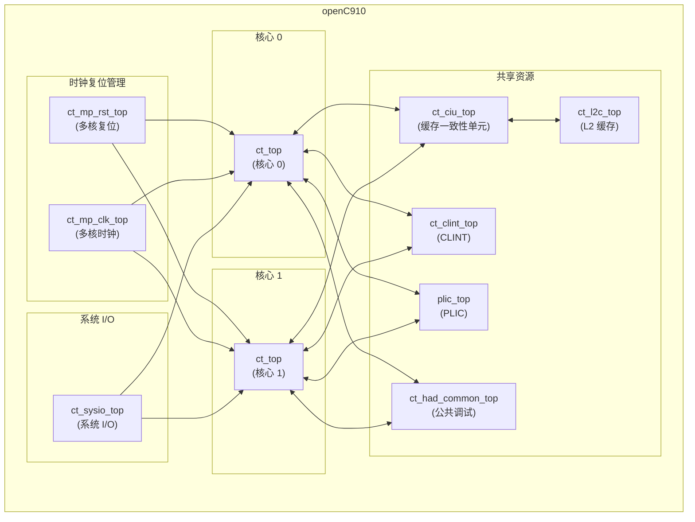

# openC910 模块设计文档

## 1. 模块概述

### 1.1 基本信息
| 项目 | 内容 |
|------|------|
| 模块名称 | openC910 |
| 文件路径 | C910_RTL_FACTORY/gen_rtl/cpu/rtl/openC910.v |
| 模块类型 | 多处理器顶层模块 |
| 作者 | T-Head Semiconductor Co., Ltd. |
| 许可证 | Apache License 2.0 |

### 1.2 功能描述
openC910 是 OpenC910 处理器的多处理器顶层模块，实现了双核处理器系统的完整集成。该模块例化了两个 ct_top 核心以及共享的缓存一致性单元 (CIU)、L2 缓存 (L2C)、核心本地中断控制器 (CLINT)、平台级中断控制器 (PLIC) 等共享资源。

### 1.3 设计特点
- 双核处理器配置
- 共享 L2 缓存
- 缓存一致性协议
- 完整的中断子系统
- 硬件调试支持

## 2. 接口描述

### 2.1 输入端口

#### 2.1.1 AXI 总线接口输入
| 信号名称 | 位宽 | 描述 |
|----------|------|------|
| pad_biu_acaddr | [39:0] | AC 通道地址 |
| pad_biu_acprot | [2:0] | AC 通道保护属性 |
| pad_biu_acsnoop | [3:0] | AC 通道监听类型 |
| pad_biu_acvalid | 1 | AC 通道有效信号 |
| pad_biu_arready | 1 | AR 通道就绪信号 |
| pad_biu_awready | 1 | AW 通道就绪信号 |
| pad_biu_bid | [4:0] | B 通道 ID |
| pad_biu_bresp | [1:0] | B 通道响应 |
| pad_biu_bvalid | 1 | B 通道有效信号 |
| pad_biu_cdready | 1 | CD 通道就绪信号 |
| pad_biu_crready | 1 | CR 通道就绪信号 |
| pad_biu_csr_cmplt | 1 | CSR 操作完成 |
| pad_biu_csr_rdata | [127:0] | CSR 读数据 |
| pad_biu_rdata | [127:0] | R 通道读数据 |
| pad_biu_rid | [4:0] | R 通道 ID |
| pad_biu_rlast | 1 | R 通道最后一个数据 |
| pad_biu_rresp | [3:0] | R 通道响应 |
| pad_biu_rvalid | 1 | R 通道有效信号 |
| pad_biu_wready | 1 | W 通道就绪信号 |

#### 2.1.2 中断接口输入
| 信号名称 | 位宽 | 描述 |
|----------|------|------|
| pad_biu_me_int | [1:0] | 机器模式外部中断 |
| pad_biu_ms_int | [1:0] | 机器模式软件中断 |
| pad_biu_mt_int | [1:0] | 机器模式定时器中断 |
| pad_biu_se_int | [1:0] | 监管模式外部中断 |
| pad_biu_ss_int | [1:0] | 监管模式软件中断 |
| pad_biu_st_int | [1:0] | 监管模式定时器中断 |
| pad_biu_hpcp_l2of_int | [3:0] | HPCP L2 溢出中断 |
| pad_biu_dbgrq_b | [1:0] | 调试请求 |

#### 2.1.3 系统控制输入
| 信号名称 | 位宽 | 描述 |
|----------|------|------|
| pad_core_hartid | [2:0] | 硬件线程 ID |
| pad_core_rst_b | [1:0] | 核心复位信号 |
| pad_core_rvba | [39:0] | 复位向量基地址 |
| pad_cpu_rst_b | 1 | CPU 复位信号 |
| pad_xx_apb_base | [39:0] | APB 基地址 |
| pad_xx_time | [63:0] | 系统计时器值 |
| pll_core_clk | 1 | PLL 核心时钟 |

### 2.2 输出端口

#### 2.2.1 AXI 总线接口输出
| 信号名称 | 位宽 | 描述 |
|----------|------|------|
| biu_pad_acready | 1 | AC 通道就绪信号 |
| biu_pad_araddr | [39:0] | AR 通道地址 |
| biu_pad_arbar | [1:0] | AR 通道屏障 |
| biu_pad_arburst | [1:0] | AR 通道突发类型 |
| biu_pad_arcache | [3:0] | AR 通道缓存属性 |
| biu_pad_ardomain | [1:0] | AR 通道域 |
| biu_pad_arid | [4:0] | AR 通道 ID |
| biu_pad_arlen | [1:0] | AR 通道长度 |
| biu_pad_arlock | 1 | AR 通道锁定 |
| biu_pad_arprot | [2:0] | AR 通道保护属性 |
| biu_pad_arsize | [2:0] | AR 通道大小 |
| biu_pad_arsnoop | [3:0] | AR 通道监听类型 |
| biu_pad_aruser | [2:0] | AR 通道用户属性 |
| biu_pad_arvalid | 1 | AR 通道有效信号 |
| biu_pad_awaddr | [39:0] | AW 通道地址 |
| biu_pad_awbar | [1:0] | AW 通道屏障 |
| biu_pad_awburst | [1:0] | AW 通道突发类型 |
| biu_pad_awcache | [3:0] | AW 通道缓存属性 |
| biu_pad_awdomain | [1:0] | AW 通道域 |
| biu_pad_awid | [4:0] | AW 通道 ID |
| biu_pad_awlen | [1:0] | AW 通道长度 |
| biu_pad_awlock | 1 | AW 通道锁定 |
| biu_pad_awprot | [2:0] | AW 通道保护属性 |
| biu_pad_awsize | [2:0] | AW 通道大小 |
| biu_pad_awsnoop | [2:0] | AW 通道监听类型 |
| biu_pad_awunique | 1 | AW 通道唯一性 |
| biu_pad_awuser | 1 | AW 通道用户属性 |
| biu_pad_awvalid | 1 | AW 通道有效信号 |
| biu_pad_back | 1 | B 通道应答 |
| biu_pad_bready | 1 | B 通道就绪信号 |
| biu_pad_cddata | [127:0] | CD 通道数据 |
| biu_pad_cderr | 1 | CD 通道错误 |
| biu_pad_cdlast | 1 | CD 通道最后数据 |
| biu_pad_cdvalid | 1 | CD 通道有效信号 |
| biu_pad_crresp | [4:0] | CR 通道响应 |
| biu_pad_crvalid | 1 | CR 通道有效信号 |
| biu_pad_rack | 1 | R 通道应答 |
| biu_pad_rready | 1 | R 通道就绪信号 |
| biu_pad_wdata | [127:0] | W 通道写数据 |
| biu_pad_werr | 1 | W 通道错误 |
| biu_pad_wlast | 1 | W 通道最后数据 |
| biu_pad_wns | 1 | W 通道非安全 |
| biu_pad_wstrb | [15:0] | W 通道写选通 |
| biu_pad_wvalid | 1 | W 通道有效信号 |

## 3. 模块框图

## 4. 实现细节

### 4.1 模块例化

#### 4.1.1 ct_top 例化 (核心 0)
为核心 0 例化完整的处理核心：
- 核心处理单元 (ct_core)
- 内存管理单元 (ct_mmu_top)
- 物理内存保护 (ct_pmp_top)
- 总线接口单元 (ct_biu_top)
- 调试单元 (ct_had_private_top)
- 性能计数器 (ct_hpcp_top)

#### 4.1.2 ct_top 例化 (核心 1)
为核心 1 例化完整的处理核心，结构与核心 0 相同。

#### 4.1.3 ct_ciu_top 例化
缓存一致性单元，负责：
- 维护双核之间的缓存一致性
- 实现 ACE 协议
- 管理共享内存访问

#### 4.1.4 ct_l2c_top 例化
L2 缓存控制器，负责：
- 共享 L2 缓存管理
- 缓存替换策略
- 预取控制

#### 4.1.5 ct_clint_top 例化
核心本地中断控制器，负责：
- 软件中断生成
- 定时器中断生成
- 每核心独立的中断控制

#### 4.1.6 plic_top 例化
平台级中断控制器，负责：
- 外部中断路由
- 中断优先级管理
- 中断目标选择

#### 4.1.7 ct_had_common_top 例化
公共硬件辅助调试模块，负责：
- 多核调试协调
- 公共调试资源管理

#### 4.1.8 ct_mp_rst_top 例化
多核复位管理模块，负责：
- 多核复位协调
- 复位时序控制

#### 4.1.9 ct_mp_clk_top 例化
多核时钟管理模块，负责：
- 多核时钟分配
- 时钟门控控制

#### 4.1.10 ct_sysio_top 例化
系统 I/O 模块，负责：
- 中断信号分发
- 调试请求路由
- 系统配置传递

## 5. 子模块描述

### 5.1 ct_top
单核处理器顶层模块，实现完整的处理器核心功能。

### 5.2 ct_ciu_top
缓存一致性单元，实现双核之间的缓存一致性协议。

### 5.3 ct_l2c_top
L2 缓存控制器，管理共享的 L2 缓存。

### 5.4 ct_clint_top
核心本地中断控制器，提供软件和定时器中断。

### 5.5 plic_top
平台级中断控制器，管理外部中断路由。

### 5.6 ct_had_common_top
公共硬件辅助调试模块，提供多核调试支持。

### 5.7 ct_mp_rst_top
多核复位管理模块，协调双核复位。

### 5.8 ct_mp_clk_top
多核时钟管理模块，分配和管理时钟。

### 5.9 ct_sysio_top
系统 I/O 模块，处理系统级 I/O 信号。

## 6. 设计注意事项

### 6.1 多核配置
- 支持双核 (SMP) 配置
- 核心 ID 通过 pad_core_hartid 配置
- 共享 L2 缓存和中断控制器

### 6.2 缓存一致性
- 使用 ACE 协议维护缓存一致性
- CIU 负责监听和响应一致性请求

### 6.3 中断处理
- CLINT 处理软件和定时器中断
- PLIC 处理外部中断
- 支持中断路由到不同核心

## 7. 修订历史

| 版本 | 日期 | 描述 |
|------|------|------|
| 1.0 | 2021-10 | 初始版本 |
