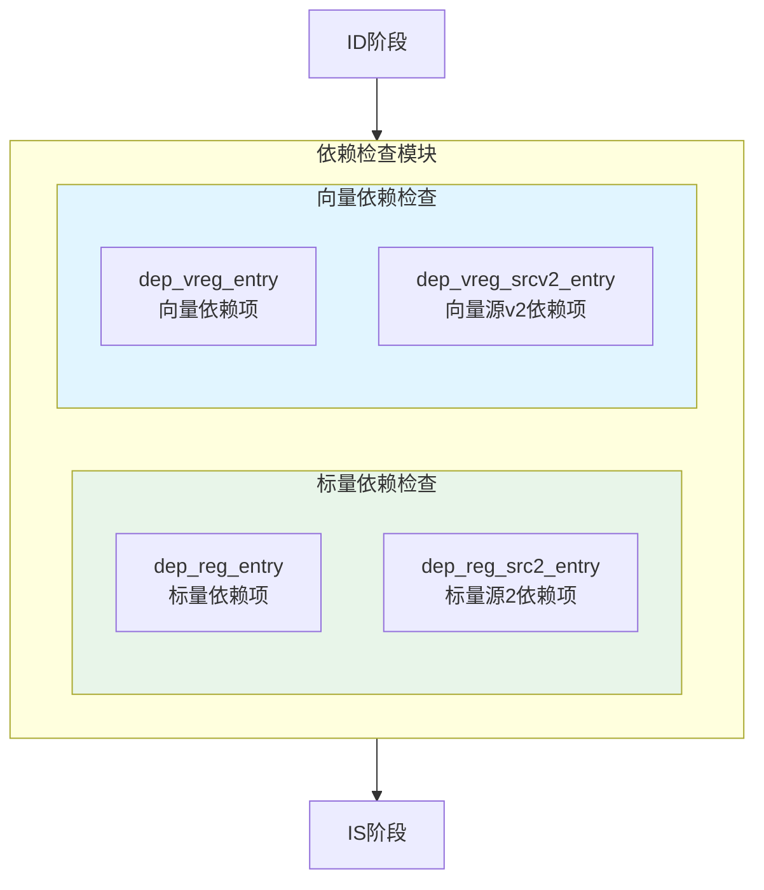
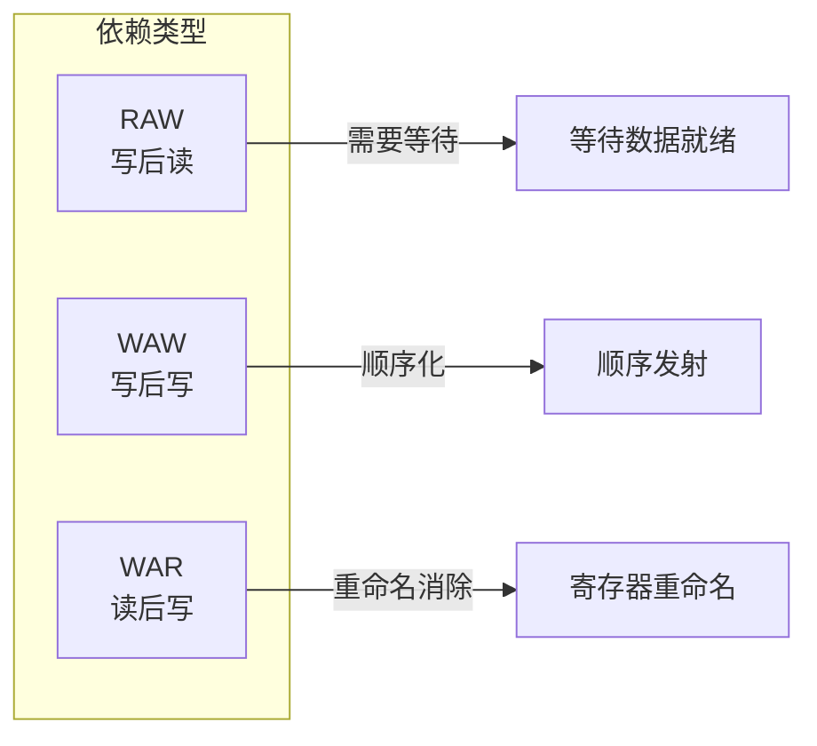

# IDU依赖检查模块详细设计文档

## 1. 依赖检查模块概述

### 1.1 基本信息

| 属性 | 值 |
|------|-----|
| 模块分类 | 依赖检查模块 |
| 包含模块 | dep_reg_entry, dep_reg_src2_entry, dep_vreg_entry, dep_vreg_srcv2_entry |
| 功能分类 | 数据依赖检测 |

### 1.2 功能描述

依赖检查模块负责检测指令间的数据依赖关系，确保指令按正确的顺序执行。主要功能包括：

1. **RAW依赖检测**：检测写后读（Read After Write）依赖
2. **WAW依赖检测**：检测写后写（Write After Write）依赖
3. **依赖标记**：标记依赖的指令
4. **依赖清除**：指令完成后清除依赖

### 1.3 设计特点

- **并行检测**：并行检测多条指令的依赖
- **快速响应**：快速检测依赖关系
- **精确标记**：精确标记依赖的指令
- **自动清除**：指令完成后自动清除依赖

## 2. 依赖检查模块架构

### 2.1 模块框图



### 2.2 依赖类型



## 3. dep_reg_entry模块详细设计

### 3.1 模块概述

dep_reg_entry模块负责标量寄存器的依赖检查。

### 3.2 主要功能

1. **依赖检测**：检测标量寄存器的依赖关系
2. **依赖记录**：记录依赖关系
3. **依赖清除**：清除已解决的依赖

### 3.3 依赖检测逻辑

```verilog
// RAW依赖检测
always @(*) begin
    for (int i = 0; i < INST_NUM; i++) begin
        for (int j = 0; j < i; j++) begin
            // 检测源操作数是否依赖前面的目标操作数
            if (inst[i].src0_reg == inst[j].dst_reg && inst[j].dst_vld) begin
                inst[i].src0_dep = 1'b1;
                inst[i].src0_dep_iid = inst[j].iid;
            end
            
            if (inst[i].src1_reg == inst[j].dst_reg && inst[j].dst_vld) begin
                inst[i].src1_dep = 1'b1;
                inst[i].src1_dep_iid = inst[j].iid;
            end
        end
    end
end

// WAW依赖检测
always @(*) begin
    for (int i = 0; i < INST_NUM; i++) begin
        for (int j = 0; j < i; j++) begin
            // 检测目标操作数是否与前面的目标操作数相同
            if (inst[i].dst_reg == inst[j].dst_reg && inst[j].dst_vld) begin
                inst[i].waw_dep = 1'b1;
                inst[i].waw_dep_iid = inst[j].iid;
            end
        end
    end
end
```

### 3.4 依赖表结构

| 字段 | 位宽 | 描述 |
|------|------|------|
| valid | 1 | 有效位 |
| src0_reg | 5 | 源操作数0逻辑寄存器 |
| src0_preg | 7 | 源操作数0物理寄存器 |
| src0_dep | 1 | 源操作数0依赖标志 |
| src0_dep_iid | 7 | 源操作数0依赖指令ID |
| src1_reg | 5 | 源操作数1逻辑寄存器 |
| src1_preg | 7 | 源操作数1物理寄存器 |
| src1_dep | 1 | 源操作数1依赖标志 |
| src1_dep_iid | 7 | 源操作数1依赖指令ID |
| dst_reg | 5 | 目标逻辑寄存器 |
| dst_preg | 7 | 目标物理寄存器 |
| waw_dep | 1 | WAW依赖标志 |
| waw_dep_iid | 7 | WAW依赖指令ID |

## 4. dep_reg_src2_entry模块详细设计

### 4.1 模块概述

dep_reg_src2_entry模块负责标量寄存器源操作数2的依赖检查，主要用于Store指令。

### 4.2 主要功能

1. **源操作数2依赖检测**：检测Store指令源操作数2的依赖
2. **依赖记录**：记录依赖关系
3. **依赖清除**：清除已解决的依赖

### 4.3 Store指令依赖

Store指令有三个操作数：
- src0：基址寄存器
- src1：偏移量（立即数）
- src2：存储数据

```verilog
// Store指令src2依赖检测
always @(*) begin
    for (int i = 0; i < INST_NUM; i++) begin
        if (inst[i].is_store) begin
            for (int j = 0; j < i; j++) begin
                // 检测src2是否依赖前面的目标操作数
                if (inst[i].src2_reg == inst[j].dst_reg && inst[j].dst_vld) begin
                    inst[i].src2_dep = 1'b1;
                    inst[i].src2_dep_iid = inst[j].iid;
                end
            end
        end
    end
end
```

## 5. dep_vreg_entry模块详细设计

### 5.1 模块概述

dep_vreg_entry模块负责向量寄存器的依赖检查。

### 5.2 主要功能

1. **向量依赖检测**：检测向量寄存器的依赖关系
2. **向量长度相关**：考虑向量长度（vl）
3. **向量掩码**：考虑向量掩码（vm）

### 5.3 向量依赖特点

向量指令的依赖检查需要考虑：

1. **向量长度**：不同向量长度可能影响依赖
2. **向量掩码**：掩码操作可能影响依赖
3. **向量寄存器组**：向量寄存器组（LMUL）影响依赖

```verilog
// 向量依赖检测
always @(*) begin
    for (int i = 0; i < INST_NUM; i++) begin
        for (int j = 0; j < i; j++) begin
            // 检测向量源操作数是否依赖前面的向量目标操作数
            if (inst[i].vs0_reg == inst[j].vd_reg && inst[j].vd_vld) begin
                // 考虑向量长度和掩码
                if (vector_overlap(inst[i].vs0_reg, inst[j].vd_reg, 
                                   inst[i].vl, inst[j].vl)) begin
                    inst[i].vs0_dep = 1'b1;
                    inst[i].vs0_dep_iid = inst[j].iid;
                end
            end
        end
    end
end

// 向量重叠检测函数
function vector_overlap;
    input [4:0] reg1;
    input [4:0] reg2;
    input [31:0] vl1;
    input [31:0] vl2;
    // 检测两个向量寄存器组是否重叠
    // 考虑LMUL和VL
endfunction
```

### 5.4 向量依赖表结构

| 字段 | 位宽 | 描述 |
|------|------|------|
| valid | 1 | 有效位 |
| vs0_reg | 5 | 向量源操作数0逻辑寄存器 |
| vs0_preg | 7 | 向量源操作数0物理寄存器 |
| vs0_dep | 1 | 向量源操作数0依赖标志 |
| vs0_dep_iid | 7 | 向量源操作数0依赖指令ID |
| vs1_reg | 5 | 向量源操作数1逻辑寄存器 |
| vs1_preg | 7 | 向量源操作数1物理寄存器 |
| vs1_dep | 1 | 向量源操作数1依赖标志 |
| vs1_dep_iid | 7 | 向量源操作数1依赖指令ID |
| vd_reg | 5 | 向量目标逻辑寄存器 |
| vd_preg | 7 | 向量目标物理寄存器 |
| vm | 1 | 向量掩码标志 |
| vl | 32 | 向量长度 |

## 6. dep_vreg_srcv2_entry模块详细设计

### 6.1 模块概述

dep_vreg_srcv2_entry模块负责向量寄存器源操作数v2的依赖检查，主要用于向量Store指令。

### 6.2 主要功能

1. **向量源操作数v2依赖检测**：检测向量Store指令源操作数v2的依赖
2. **依赖记录**：记录依赖关系
3. **依赖清除**：清除已解决的依赖

### 6.3 向量Store指令依赖

向量Store指令有三个操作数：
- vs0：基址寄存器
- vs1：偏移量（立即数或向量）
- vs2：存储数据（向量）

```verilog
// 向量Store指令vs2依赖检测
always @(*) begin
    for (int i = 0; i < INST_NUM; i++) begin
        if (inst[i].is_vstore) begin
            for (int j = 0; j < i; j++) begin
                // 检测vs2是否依赖前面的目标操作数
                if (inst[i].vs2_reg == inst[j].vd_reg && inst[j].vd_vld) begin
                    // 考虑向量长度和掩码
                    if (vector_overlap(inst[i].vs2_reg, inst[j].vd_reg,
                                       inst[i].vl, inst[j].vl)) begin
                        inst[i].vs2_dep = 1'b1;
                        inst[i].vs2_dep_iid = inst[j].iid;
                    end
                end
            end
        end
    end
end
```

## 7. 依赖清除机制

### 7.1 依赖清除时机

依赖在以下情况下清除：

1. **指令完成**：指令执行完成，写回结果
2. **异常**：指令发生异常
3. **刷新**：流水线刷新

### 7.2 依赖清除逻辑

```verilog
// 依赖清除
always @(posedge clk) begin
    for (int i = 0; i < QUEUE_DEPTH; i++) begin
        // 检测依赖指令是否完成
        if (dep_iid[i] == wb_iid && wb_vld) begin
            src_dep[i] <= 1'b0;
        end
        
        // 检测是否发生刷新
        if (flush) begin
            src_dep[i] <= 1'b0;
        end
    end
end
```

## 8. 性能优化

### 8.1 并行检测

- **多指令并行检测**：同时检测多条指令的依赖
- **多操作数并行检测**：同时检测多个操作数的依赖

### 8.2 快速清除

- **快速唤醒**：指令完成后快速清除依赖
- **批量清除**：刷新时批量清除依赖

## 9. 修订历史

| 版本 | 日期 | 作者 | 说明 |
|------|------|------|------|
| 1.0 | 2024-01-XX | Auto-generated | 初始版本 |
