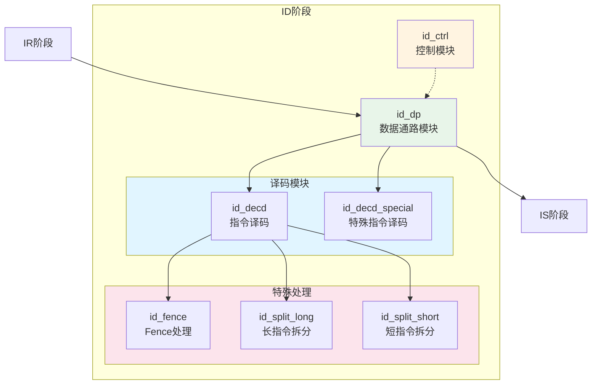
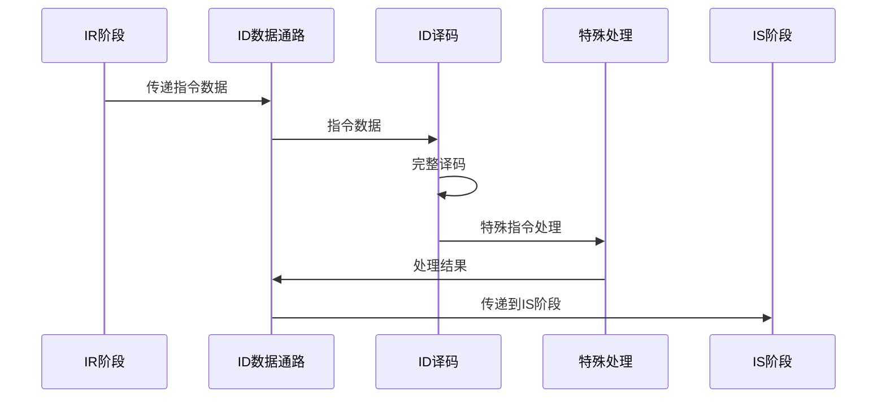

# IDU ID阶段模块详细设计文档

## 1. ID阶段概述

### 1.1 基本信息

| 属性 | 值 |
|------|-----|
| 阶段名称 | ID（Instruction Decode）阶段 |
| 功能分类 | 指令完整译码与依赖检查 |
| 包含模块 | id_ctrl, id_dp, id_decd, id_decd_special, id_fence, id_split_long, id_split_short |
| 流水线位置 | IDU第二级 |

### 1.2 功能描述

ID（Instruction Decode）阶段是IDU流水线的第二级，完成指令的完整译码和依赖检查。主要功能包括：

1. **完整译码**：解析指令的所有信息（操作码、功能码、操作数、立即数等）
2. **依赖检查**：检测指令间的数据依赖关系
3. **指令分类**：确定指令的目标发射队列
4. **特殊指令处理**：处理Fence、长指令等特殊情况
5. **指令拆分**：将复杂指令拆分为多个微操作

### 1.3 设计特点

- **完整指令译码**：支持RISC-V完整指令集译码
- **向量指令支持**：支持RVV 1.0向量指令译码
- **依赖检查**：检测RAW、WAW、WAR依赖
- **指令拆分**：支持长指令和复杂指令拆分
- **Fence处理**：处理Fence指令的特殊逻辑

## 2. ID阶段模块架构

### 2.1 模块框图



### 2.2 数据流图



## 3. id_ctrl模块详细设计

### 3.1 模块概述

id_ctrl模块负责ID阶段的控制逻辑，包括流水线控制、指令有效性控制等。

### 3.2 主要功能

1. **流水线控制**：
   - ID阶段停顿控制
   - ID阶段刷新控制
   - 流水线下传控制

2. **指令有效性控制**：
   - 指令有效标志生成
   - 指令类型判断

3. **发射队列选择控制**：
   - 根据指令类型选择目标发射队列
   - 发射队列满检测

### 3.3 关键信号

#### 3.3.1 输入信号

| 信号名 | 位宽 | 描述 |
|--------|------|------|
| ctrl_ir_pipedown_inst0_vld | 1 | IR阶段指令0下传有效 |
| ctrl_ir_pipedown_inst1_vld | 1 | IR阶段指令1下传有效 |
| ctrl_ir_pipedown_inst2_vld | 1 | IR阶段指令2下传有效 |
| ctrl_ir_pipedown_inst3_vld | 1 | IR阶段指令3下传有效 |
| ctrl_is_stall | 1 | IS阶段停顿 |
| rtu_idu_flush_is | 1 | IS阶段刷新 |

#### 3.3.2 输出信号

| 信号名 | 位宽 | 描述 |
|--------|------|------|
| ctrl_id_pipedown | 1 | ID阶段下传使能 |
| ctrl_id_pipedown_inst0_vld | 1 | ID阶段指令0下传有效 |
| ctrl_id_pipedown_inst1_vld | 1 | ID阶段指令1下传有效 |
| ctrl_id_pipedown_inst2_vld | 1 | ID阶段指令2下传有效 |
| ctrl_id_pipedown_inst3_vld | 1 | ID阶段指令3下传有效 |
| ctrl_id_stall | 1 | ID阶段停顿标志 |

### 3.4 控制逻辑

#### 3.4.1 流水线停顿逻辑

```verilog
// ID阶段停顿条件
assign ctrl_id_stall = ctrl_id_stage_stall
                    || ctrl_is_stall
                    || rtu_idu_flush_stall;

// ID阶段下传使能
assign ctrl_id_pipedown = !ctrl_id_stall 
                       && (ctrl_id_pipedown_inst0_vld
                        || ctrl_id_pipedown_inst1_vld
                        || ctrl_id_pipedown_inst2_vld
                        || ctrl_id_pipedown_inst3_vld);
```

#### 3.4.2 发射队列选择逻辑

```verilog
// AIQ选择
assign ctrl_id_inst0_aiq_sel = dp_id_inst0_alu_type;

// BIQ选择
assign ctrl_id_inst0_biq_sel = dp_id_inst0_br_type;

// LSIQ选择
assign ctrl_id_inst0_lsiq_sel = dp_id_inst0_ldst_type;

// VIQ选择
assign ctrl_id_inst0_viq_sel = dp_id_inst0_vec_type;
```

## 4. id_dp模块详细设计

### 4.1 模块概述

id_dp模块是ID阶段的数据通路，包含指令数据的存储、传递和处理逻辑。

### 4.2 主要功能

1. **指令数据存储**：
   - 存储来自IR阶段的指令数据
   - 存储译码后的指令信息

2. **数据传递**：
   - 将指令数据传递到IS阶段
   - 接收来自译码模块的译码结果

3. **数据选择**：
   - 选择有效的指令数据
   - 选择译码结果

### 4.3 关键信号

#### 4.3.1 指令译码信息信号

| 信号名 | 位宽 | 描述 |
|--------|------|------|
| dp_id_inst0_opcode | 10 | 指令0操作码 |
| dp_id_inst0_func | 10 | 指令0功能码 |
| dp_id_inst0_src0_preg | 7 | 指令0源操作数0物理寄存器 |
| dp_id_inst0_src1_preg | 7 | 指令0源操作数1物理寄存器 |
| dp_id_inst0_dst_preg | 7 | 指令0目标物理寄存器 |
| dp_id_inst0_iid | 7 | 指令0指令ID |
| dp_id_inst0_imm | 20 | 指令0立即数 |

#### 4.3.2 控制信息信号

| 信号名 | 位宽 | 描述 |
|--------|------|------|
| dp_id_inst0_alu_type | 1 | 指令0为ALU类型 |
| dp_id_inst0_br_type | 1 | 指令0为分支类型 |
| dp_id_inst0_ldst_type | 1 | 指令0为Load/Store类型 |
| dp_id_inst0_vec_type | 1 | 指令0为向量类型 |
| dp_id_inst0_mul_type | 1 | 指令0为乘法类型 |

## 5. id_decd模块详细设计

### 5.1 模块概述

id_decd模块负责ID阶段的完整指令译码，解析指令的所有信息。

### 5.2 主要功能

1. **操作码译码**：解析指令的操作码
2. **功能码译码**：解析指令的功能码
3. **操作数译码**：解析源操作数和目标操作数
4. **立即数译码**：解析立即数
5. **指令类型判断**：判断指令的类型

### 5.3 译码逻辑

#### 5.3.1 RISC-V指令译码

```verilog
// R型指令译码
assign r_type = (opcode == OPCODE_OP);
assign rd = inst[11:7];
assign funct3 = inst[14:12];
assign rs1 = inst[19:15];
assign rs2 = inst[24:20];
assign funct7 = inst[31:25];

// I型指令译码
assign i_type = (opcode inside {OPCODE_OP_IMM, OPCODE_LOAD, OPCODE_JALR});
assign rd = inst[11:7];
assign funct3 = inst[14:12];
assign rs1 = inst[19:15];
assign imm = {{20{inst[31]}}, inst[31:20]};

// S型指令译码
assign s_type = (opcode == OPCODE_STORE);
assign imm = {{20{inst[31]}}, inst[31:25], inst[11:7]};
assign rs1 = inst[19:15];
assign rs2 = inst[24:20];

// B型指令译码
assign b_type = (opcode == OPCODE_BRANCH);
assign imm = {{20{inst[31]}}, inst[7], inst[30:25], inst[11:8], 1'b0};

// U型指令译码
assign u_type = (opcode inside {OPCODE_LUI, OPCODE_AUIPC});
assign rd = inst[11:7];
assign imm = {inst[31:12], 12'b0};

// J型指令译码
assign j_type = (opcode == OPCODE_JAL);
assign rd = inst[11:7];
assign imm = {{12{inst[31]}}, inst[19:12], inst[20], inst[30:21], 1'b0};
```

#### 5.3.2 向量指令译码

```verilog
// 向量指令译码
assign v_type = (opcode == OPCODE_OP_V);
assign vd = inst[11:7];
assign funct3 = inst[14:12];
assign vs1 = inst[19:15];
assign vs2 = inst[24:20];
assign vm = inst[25];
assign funct6 = inst[31:26];

// 向量长度相关
assign vl = cp0_idu_vstart;
assign vsew = vtype[2:0];  // 向量元素宽度
assign vlmul = vtype[5:3]; // 向量寄存器组乘数
```

## 6. id_fence模块详细设计

### 6.1 模块概述

id_fence模块负责处理Fence和Fence.i指令，确保内存操作的顺序性。

### 6.2 主要功能

1. **Fence指令处理**：
   - 解析Fence指令的fm域
   - 确定内存屏障类型
   - 等待所有内存操作完成

2. **Fence.i指令处理**：
   - 刷新指令缓存
   - 确保指令序列一致性

### 6.3 Fence指令类型

| Fence类型 | 描述 |
|-----------|------|
| Fence | 内存屏障 |
| Fence.i | 指令屏障 |
| Fence.tso | TSO内存屏障 |

### 6.4 Fence处理逻辑

```verilog
// Fence指令检测
assign inst_fence = (opcode == OPCODE_MISC_MEM) && (funct3 == 3'b000);
assign inst_fence_i = (opcode == OPCODE_MISC_MEM) && (funct3 == 3'b001);

// Fence处理
always @(posedge clk) begin
    if (inst_fence) begin
        // 等待所有Load完成
        // 等待所有Store完成
        // 刷新流水线
    end
end
```

## 7. id_split模块详细设计

### 7.1 模块概述

id_split模块负责将复杂指令拆分为多个微操作，包括id_split_long和id_split_short两个子模块。

### 7.2 主要功能

1. **长指令拆分**：
   - 将长延迟指令拆分为多个短操作
   - 提高流水线利用率

2. **复杂指令拆分**：
   - 将复杂指令拆分为多个简单操作
   - 简化硬件实现

### 7.3 指令拆分示例

#### 7.3.1 乘法指令拆分

```
MUL rd, rs1, rs2
拆分为：
  uop0: MULT_LOW  rd_low,  rs1, rs2
  uop1: MULT_HIGH rd_high, rs1, rs2
  uop2: MERGE     rd, rd_low, rd_high
```

#### 7.3.2 除法指令拆分

```
DIV rd, rs1, rs2
拆分为：
  uop0: DIV_ITER0 ...
  uop1: DIV_ITER1 ...
  ...
  uopN: DIV_FINAL rd, ...
```

## 8. ID阶段流水线控制

### 8.1 流水线寄存器

ID阶段包含以下流水线寄存器：

| 寄存器名 | 位宽 | 描述 |
|----------|------|------|
| id_inst0_opcode | 10 | 指令0操作码 |
| id_inst0_func | 10 | 指令0功能码 |
| id_inst0_src0_preg | 7 | 指令0源操作数0物理寄存器 |
| id_inst0_src1_preg | 7 | 指令0源操作数1物理寄存器 |
| id_inst0_dst_preg | 7 | 指令0目标物理寄存器 |
| id_inst0_vld | 1 | 指令0有效 |

### 8.2 流水线停顿条件

ID阶段在以下条件下停顿：

1. **发射队列满**：目标发射队列已满
2. **后级停顿**：IS阶段停顿
3. **刷新**：IS阶段刷新

### 8.3 流水线刷新

ID阶段在以下条件下刷新：

1. **分支预测错误**：检测到分支预测错误
2. **异常**：检测到异常
3. **中断**：检测到中断

## 9. 依赖检查

### 9.1 依赖类型

| 依赖类型 | 描述 | 处理方式 |
|----------|------|----------|
| RAW（Read After Write） | 写后读依赖 | 等待源操作数就绪 |
| WAW（Write After Write） | 写后写依赖 | 顺序化发射 |
| WAR（Write After Read） | 读后写依赖 | 寄存器重命名消除 |

### 9.2 依赖检查逻辑

```verilog
// RAW依赖检查
assign raw_dep = (src_preg == dst_preg_older) && dst_preg_older_valid;

// WAW依赖检查
assign waw_dep = (dst_preg == dst_preg_older) && dst_preg_older_valid;

// 依赖标志
assign dep_flag = raw_dep || waw_dep;
```

## 10. 性能优化

### 10.1 译码优化

- **并行译码**：多条指令并行译码
- **预译码**：在IR阶段进行预译码
- **译码缓存**：缓存译码结果

### 10.2 依赖检查优化

- **快速比较**：使用比较器快速检测依赖
- **依赖预测**：预测依赖关系
- **依赖旁路**：支持依赖旁路

## 11. 修订历史

| 版本 | 日期 | 作者 | 说明 |
|------|------|------|------|
| 1.0 | 2024-01-XX | Auto-generated | 初始版本 |
