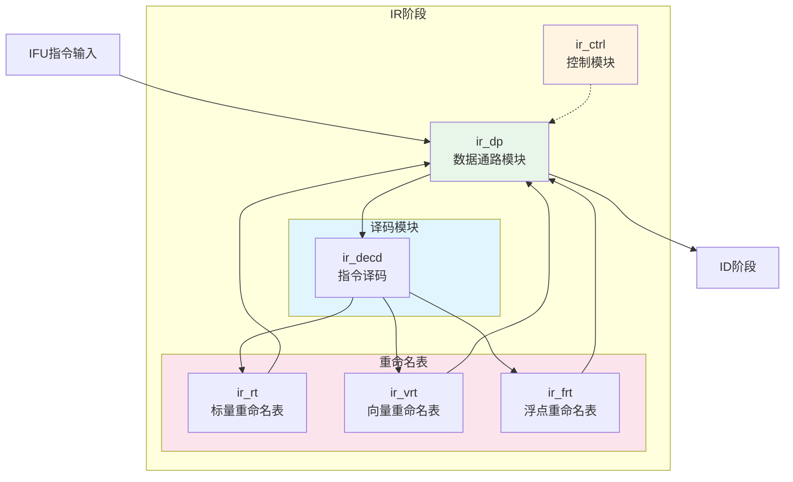
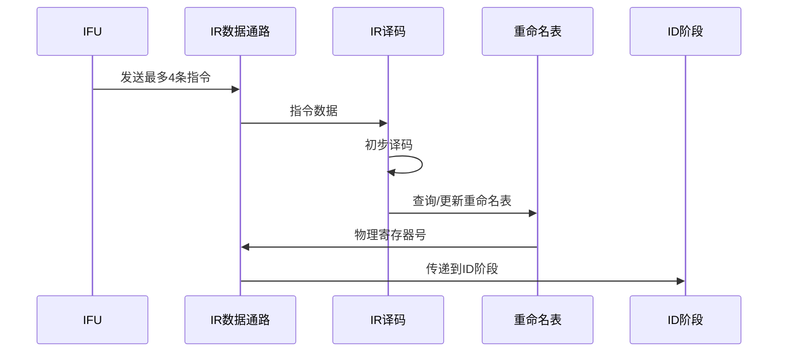

# IDU IR阶段模块详细设计文档

## 1. IR阶段概述

### 1.1 基本信息

| 属性 | 值 |
|------|-----|
| 阶段名称 | IR（Instruction Register）阶段 |
| 功能分类 | 指令接收与初步处理 |
| 包含模块 | ir_ctrl, ir_dp, ir_decd, ir_rt, ir_vrt, ir_frt |
| 流水线位置 | IDU第一级 |

### 1.2 功能描述

IR（Instruction Register）阶段是IDU流水线的第一级，负责从IFU接收指令并进行初步处理。主要功能包括：

1. **指令接收**：从IFU接收最多4条指令
2. **初步译码**：解析指令的基本信息（操作码、操作数类型等）
3. **寄存器重命名**：将逻辑寄存器映射到物理寄存器
4. **资源分配**：分配ROB项、物理寄存器项
5. **指令有效性检查**：检查指令是否有效

### 1.3 设计特点

- **4指令并行处理**：每周期处理最多4条指令
- **三类寄存器重命名**：支持标量、浮点、向量寄存器
- **资源预分配**：提前分配ROB和物理寄存器资源
- **流水线停顿处理**：支持IR阶段停顿和刷新

## 2. IR阶段模块架构

### 2.1 模块框图



### 2.2 数据流图



## 3. ir_ctrl模块详细设计

### 3.1 模块概述

ir_ctrl模块负责IR阶段的控制逻辑，包括流水线控制、资源分配控制等。

### 3.2 主要功能

1. **流水线控制**：
   - IR阶段停顿控制
   - IR阶段刷新控制
   - 流水线下传控制

2. **资源分配控制**：
   - ROB分配控制
   - 物理寄存器分配控制
   - 发射队列分配控制

3. **指令有效性控制**：
   - 指令有效标志生成
   - 指令类型判断

### 3.3 关键信号

#### 3.3.1 输入信号

| 信号名 | 位宽 | 描述 |
|--------|------|------|
| ctrl_id_pipedown_inst0_vld | 1 | ID阶段指令0下传有效 |
| ctrl_id_pipedown_inst1_vld | 1 | ID阶段指令1下传有效 |
| ctrl_id_pipedown_inst2_vld | 1 | ID阶段指令2下传有效 |
| ctrl_id_pipedown_inst3_vld | 1 | ID阶段指令3下传有效 |
| ctrl_is_stall | 1 | IS阶段停顿 |
| rtu_idu_flush_fe | 1 | 前端刷新 |
| rtu_idu_flush_is | 1 | IS阶段刷新 |

#### 3.3.2 输出信号

| 信号名 | 位宽 | 描述 |
|--------|------|------|
| ctrl_ir_pipedown | 1 | IR阶段下传使能 |
| ctrl_ir_pipedown_inst0_vld | 1 | IR阶段指令0下传有效 |
| ctrl_ir_pipedown_inst1_vld | 1 | IR阶段指令1下传有效 |
| ctrl_ir_pipedown_inst2_vld | 1 | IR阶段指令2下传有效 |
| ctrl_ir_pipedown_inst3_vld | 1 | IR阶段指令3下传有效 |
| ctrl_ir_stall | 1 | IR阶段停顿标志 |

### 3.4 控制逻辑

#### 3.4.1 流水线停顿逻辑

```verilog
// IR阶段停顿条件
assign ctrl_ir_stall = ctrl_ir_stage_stall
                    || ctrl_is_stall
                    || rtu_idu_flush_stall;

// IR阶段下传使能
assign ctrl_ir_pipedown = !ctrl_ir_stall 
                       && (ctrl_ir_pipedown_inst0_vld
                        || ctrl_ir_pipedown_inst1_vld
                        || ctrl_ir_pipedown_inst2_vld
                        || ctrl_ir_pipedown_inst3_vld);
```

#### 3.4.2 资源分配逻辑

```verilog
// ROB分配选择
assign ctrl_ir_pre_dis_rob_create0_sel = inst0_vld && rob_not_full;
assign ctrl_ir_pre_dis_rob_create1_en = inst1_vld && rob_not_full;
assign ctrl_ir_pre_dis_rob_create1_sel = inst1_vld;
assign ctrl_ir_pre_dis_rob_create2_en = inst2_vld && rob_not_full;
assign ctrl_ir_pre_dis_rob_create2_sel = inst2_vld;
assign ctrl_ir_pre_dis_rob_create3_en = inst3_vld && rob_not_full;

// 物理寄存器分配
assign idu_rtu_ir_preg0_alloc_vld = inst0_dst_vld && preg_not_full;
assign idu_rtu_ir_preg1_alloc_vld = inst1_dst_vld && preg_not_full;
assign idu_rtu_ir_preg2_alloc_vld = inst2_dst_vld && preg_not_full;
assign idu_rtu_ir_preg3_alloc_vld = inst3_dst_vld && preg_not_full;
```

## 4. ir_dp模块详细设计

### 4.1 模块概述

ir_dp模块是IR阶段的数据通路，包含指令数据的存储、传递和处理逻辑。

### 4.2 主要功能

1. **指令数据存储**：
   - 存储来自IFU的指令数据
   - 存储译码后的指令信息

2. **数据传递**：
   - 将指令数据传递到ID阶段
   - 接收来自重命名表的物理寄存器号

3. **数据选择**：
   - 选择有效的指令数据
   - 选择物理寄存器号

### 4.3 关键信号

#### 4.3.1 指令数据信号

| 信号名 | 位宽 | 描述 |
|--------|------|------|
| dp_ctrl_ir_inst0_dst_vld | 1 | 指令0目标寄存器有效 |
| dp_ctrl_ir_inst0_dst_x0 | 1 | 指令0目标寄存器为x0 |
| dp_ctrl_ir_inst0_dste_vld | 1 | 指令0目标扩展寄存器有效 |
| dp_ctrl_ir_inst0_dstf_vld | 1 | 指令0目标浮点寄存器有效 |
| dp_ctrl_ir_inst0_dstv_vld | 1 | 指令0目标向量寄存器有效 |

#### 4.3.2 控制信息信号

| 信号名 | 位宽 | 描述 |
|--------|------|------|
| dp_ctrl_ir_inst0_ctrl_info | 13 | 指令0控制信息 |
| dp_ctrl_ir_inst0_hpcp_type | 7 | 指令0性能计数器类型 |
| dp_ctrl_ir_inst0_bar | 1 | 指令0为Barrier指令 |

## 5. ir_decd模块详细设计

### 5.1 模块概述

ir_decd模块负责IR阶段的指令译码，解析指令的基本信息。

### 5.2 主要功能

1. **操作码译码**：解析指令的操作码
2. **操作数类型判断**：判断源操作数和目标操作数的类型
3. **指令类型判断**：判断指令的类型（ALU、Load、Store等）
4. **特殊指令识别**：识别特殊指令（Fence、Barrier等）

### 5.3 译码逻辑

#### 5.3.1 指令类型判断

```verilog
// ALU指令判断
assign inst_alu = (opcode == OPCODE_OP) 
               || (opcode == OPCODE_OP_IMM);

// Load指令判断
assign inst_load = (opcode == OPCODE_LOAD);

// Store指令判断
assign inst_store = (opcode == OPCODE_STORE);

// 分支指令判断
assign inst_branch = (opcode == OPCODE_BRANCH);

// 向量指令判断
assign inst_vector = (opcode == OPCODE_OP_V);
```

#### 5.3.2 操作数类型判断

```verilog
// 源操作数类型
assign src0_is_reg = funct3[2] || (opcode inside {OPCODE_OP, OPCODE_LOAD});
assign src1_is_reg = (opcode inside {OPCODE_OP, OPCODE_STORE, OPCODE_BRANCH});
assign src2_is_imm = (opcode inside {OPCODE_OP_IMM, OPCODE_LOAD, OPCODE_STORE});

// 目标寄存器类型
assign dst_is_int = (opcode inside {OPCODE_OP, OPCODE_OP_IMM, OPCODE_LOAD, 
                                     OPCODE_LUI, OPCODE_AUIPC, OPCODE_JAL, OPCODE_JALR});
assign dst_is_fp = (opcode inside {OPCODE_LOAD_FP, OPCODE_OP_FP});
assign dst_is_vec = (opcode == OPCODE_OP_V);
```

## 6. ir_rt模块详细设计

### 6.1 模块概述

ir_rt（Register Table）模块是标量整数寄存器的重命名表，维护逻辑寄存器到物理寄存器的映射关系。

### 6.2 主要功能

1. **映射表维护**：维护x0-x31到p0-p127的映射
2. **物理寄存器分配**：分配新的物理寄存器
3. **映射表更新**：更新映射关系
4. **映射表读取**：读取当前映射关系

### 6.3 重命名表结构

#### 6.3.1 映射表

| 逻辑寄存器 | 物理寄存器 | 有效位 |
|------------|------------|--------|
| x0 | p0（固定） | 1 |
| x1 | p_xxx | 1 |
| ... | ... | ... |
| x31 | p_xxx | 1 |

#### 6.3.2 空闲列表

维护空闲物理寄存器的列表，用于分配。

### 6.4 重命名逻辑

```verilog
// 读取当前映射
assign current_preg = rt_table[logic_reg];

// 分配新物理寄存器
assign new_preg = freelist_head;

// 更新映射表
always @(posedge clk) begin
    if (alloc_en) begin
        rt_table[dst_reg] <= new_preg;
    end
end

// 释放旧物理寄存器
always @(posedge clk) begin
    if (dealloc_en) begin
        freelist[tail] <= old_preg;
    end
end
```

## 7. ir_vrt模块详细设计

### 7.1 模块概述

ir_vrt（Vector Register Table）模块是向量寄存器的重命名表，维护向量逻辑寄存器到向量物理寄存器的映射关系。

### 7.2 主要功能

1. **向量映射表维护**：维护v0-v31到v0-v127的映射
2. **向量物理寄存器分配**：分配新的向量物理寄存器
3. **向量映射表更新**：更新向量映射关系
4. **向量映射表读取**：读取当前向量映射关系

### 7.3 向量重命名特点

- **向量寄存器组**：每个向量寄存器可能包含多个元素
- **向量长度相关**：重命名需要考虑vl（向量长度）
- **向量掩码**：支持向量掩码操作

## 8. ir_frt模块详细设计

### 8.1 模块概述

ir_frt（Floating-point Register Table）模块是浮点寄存器的重命名表，维护浮点逻辑寄存器到浮点物理寄存器的映射关系。

### 8.2 主要功能

1. **浮点映射表维护**：维护f0-f31到f0-f127的映射
2. **浮点物理寄存器分配**：分配新的浮点物理寄存器
3. **浮点映射表更新**：更新浮点映射关系
4. **浮点映射表读取**：读取当前浮点映射关系

### 8.3 浮点重命名特点

- **浮点状态**：需要考虑浮点状态寄存器（fcsr）
- **浮点舍入模式**：支持多种舍入模式
- **浮点异常**：处理浮点异常

## 9. IR阶段流水线控制

### 9.1 流水线寄存器

IR阶段包含以下流水线寄存器：

| 寄存器名 | 位宽 | 描述 |
|----------|------|------|
| ir_inst0_data | 32 | 指令0数据 |
| ir_inst1_data | 32 | 指令1数据 |
| ir_inst2_data | 32 | 指令2数据 |
| ir_inst3_data | 32 | 指令3数据 |
| ir_inst0_vld | 1 | 指令0有效 |
| ir_inst1_vld | 1 | 指令1有效 |
| ir_inst2_vld | 1 | 指令2有效 |
| ir_inst3_vld | 1 | 指令3有效 |

### 9.2 流水线停顿条件

IR阶段在以下条件下停顿：

1. **资源不足**：ROB满、物理寄存器满、发射队列满
2. **后级停顿**：ID阶段或IS阶段停顿
3. **刷新**：前端刷新或IS阶段刷新

### 9.3 流水线刷新

IR阶段在以下条件下刷新：

1. **分支预测错误**：检测到分支预测错误
2. **异常**：检测到异常
3. **中断**：检测到中断

## 10. 性能优化

### 10.1 重命名表优化

- **快速查找**：使用RAM实现重命名表，支持快速查找
- **多端口访问**：支持多个读写端口，提高并行度
- **空闲列表优化**：使用FIFO实现空闲列表，简化分配逻辑

### 10.2 流水线优化

- **前递优化**：减少流水线停顿
- **旁路优化**：支持指令旁路，减少延迟
- **资源预分配**：提前分配资源，减少等待

## 11. 修订历史

| 版本 | 日期 | 作者 | 说明 |
|------|------|------|------|
| 1.0 | 2024-01-XX | Auto-generated | 初始版本 |
