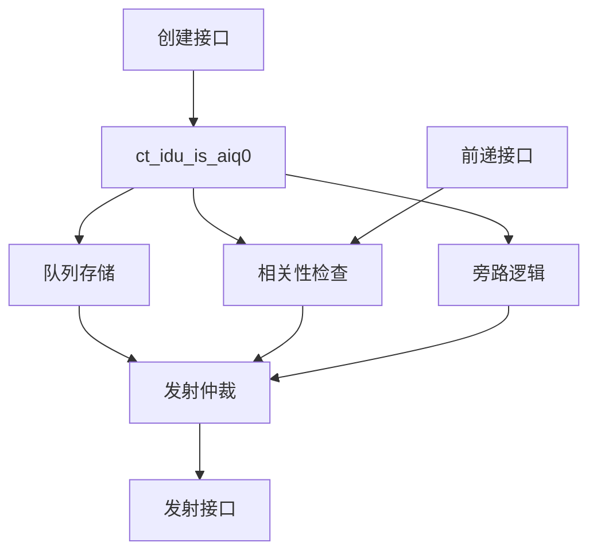

# ct_idu_is_aiq0 模块设计文档

## 1. 模块概述

### 1.1 基本信息

| 属性 | 值 |
|------|-----|
| 模块名称 | ct_idu_is_aiq0 |
| 文件路径 | C910_RTL_FACTORY/gen_rtl/idu/rtl/ct_idu_is_aiq0.v |
| 功能描述 | ALU发射队列0（ALU Issue Queue 0） |
| 生成日期 | 2025-01-20 |

### 1.2 功能描述

ct_idu_is_aiq0是IDU（指令分发单元）发射阶段的ALU发射队列0，负责：

1. **指令缓存**：缓存等待发射到ALU的指令
2. **发射仲裁**：仲裁就绪指令的发射顺序
3. **相关性检查**：检查源操作数的相关性
4. **数据前递**：支持数据前递机制
5. **队列管理**：管理队列的创建、发射和清空

### 1.3 设计特点

- 支持多条指令并行发射
- 高效的发射仲裁机制
- 支持数据旁路和前递
- 低功耗设计（门控时钟）
- 支持除法指令

## 2. 模块接口说明

### 2.1 输入端口

#### 2.1.1 时钟和复位

| 信号名 | 方向 | 位宽 | 描述 |
|--------|------|------|------|
| cp0_yy_clk_en | input | 1 | 时钟使能 |
| cp0_idu_icg_en | input | 1 | IDU门控时钟使能 |
| cpurst_b | input | 1 | CPU复位信号（低有效） |

#### 2.1.2 创建控制

| 信号名 | 方向 | 位宽 | 描述 |
|--------|------|------|------|
| ctrl_aiq0_create0_en | input | 1 | AIQ0创建0使能 |
| ctrl_aiq0_create0_dp_en | input | 1 | AIQ0创建0数据通路使能 |
| ctrl_aiq0_create0_gateclk_en | input | 1 | AIQ0创建0门控时钟使能 |
| ctrl_aiq0_create1_en | input | 1 | AIQ0创建1使能 |
| ctrl_aiq0_create1_dp_en | input | 1 | AIQ0创建1数据通路使能 |
| ctrl_aiq0_create1_gateclk_en | input | 1 | AIQ0创建1门控时钟使能 |

#### 2.1.3 创建数据

| 信号名 | 方向 | 位宽 | 描述 |
|--------|------|------|------|
| dp_aiq0_create0_data | input | - | AIQ0创建0数据 |
| dp_aiq0_create1_data | input | - | AIQ0创建1数据 |
| dp_aiq0_create_div | input | 1 | AIQ0创建除法指令标志 |

#### 2.1.4 发射控制

| 信号名 | 方向 | 位宽 | 描述 |
|--------|------|------|------|
| ctrl_aiq0_rf_pop_vld | input | 1 | AIQ0发射有效 |
| ctrl_aiq0_rf_lch_fail_vld | input | 1 | AIQ0锁存失败有效 |
| ctrl_aiq0_stall | input | 1 | AIQ0停顿 |

#### 2.1.5 前递和旁路

| 信号名 | 方向 | 位宽 | 描述 |
|--------|------|------|------|
| ctrl_xx_rf_pipe0_preg_lch_vld_dupx | input | 1 | RF Pipe0物理寄存器锁存有效 |
| ctrl_xx_rf_pipe1_preg_lch_vld_dupx | input | 1 | RF Pipe1物理寄存器锁存有效 |
| ctrl_aiq0_rf_pipe0_alu_reg_fwd_vld | input | 1 | RF Pipe0 ALU寄存器前递有效 |
| ctrl_aiq0_rf_pipe1_alu_reg_fwd_vld | input | 1 | RF Pipe1 ALU寄存器前递有效 |

### 2.2 输出端口

#### 2.2.1 队列状态

| 信号名 | 方向 | 位宽 | 描述 |
|--------|------|------|------|
| aiq0_ctrl_empty | output | 1 | AIQ0为空标志 |
| aiq0_ctrl_full | output | 1 | AIQ0已满标志 |
| aiq0_ctrl_1_left_updt | output | 1 | AIQ0剩余1个表项更新 |
| aiq0_ctrl_full_updt | output | 1 | AIQ0满状态更新 |
| aiq0_top_aiq0_entry_cnt | output | - | AIQ0表项计数 |

#### 2.2.2 发射数据

| 信号名 | 方向 | 位宽 | 描述 |
|--------|------|------|------|
| aiq0_dp_issue_entry | output | - | AIQ0发射表项 |
| aiq0_dp_issue_read_data | output | - | AIQ0发射读数据 |
| aiq0_xx_issue_en | output | 1 | AIQ0发射使能 |
| aiq0_xx_gateclk_issue_en | output | 1 | AIQ0发射门控时钟使能 |

#### 2.2.3 旁路数据

| 信号名 | 方向 | 位宽 | 描述 |
|--------|------|------|------|
| dp_aiq0_bypass_data | output | - | AIQ0旁路数据 |
| dp_aiq0_create_src0_rdy_for_bypass | output | 1 | AIQ0创建源0旁路就绪 |
| dp_aiq0_create_src1_rdy_for_bypass | output | 1 | AIQ0创建源1旁路就绪 |
| dp_aiq0_create_src2_rdy_for_bypass | output | 1 | AIQ0创建源2旁路就绪 |

## 3. 模块框图

## 4. 模块实现方案

### 4.1 队列结构

AIQ0采用表项（Entry）结构，每个表项存储一条指令的信息：

- 指令操作码
- 源操作数寄存器编号
- 目标寄存器编号
- 源操作数就绪标志
- 指令有效标志

### 4.2 关键逻辑描述

#### 4.2.1 创建逻辑

- 接收来自IS阶段的创建请求
- 分配空闲表项
- 写入指令信息
- 初始化源操作数就绪标志

#### 4.2.2 发射仲裁逻辑

- 扫描所有就绪的表项
- 选择最老的就绪指令
- 生成发射信号
- 更新队列状态

#### 4.2.3 相关性检查逻辑

- 监听前递总线
- 检查源操作数是否就绪
- 更新源操作数就绪标志

#### 4.2.4 旁路逻辑

- 支持数据旁路
- 从RF阶段直接获取数据
- 减少数据依赖延迟

### 4.3 数据前递机制

| 前递路径 | 源阶段 | 目标阶段 | 说明 |
|----------|--------|----------|------|
| RF Pipe0 -> AIQ0 | RF Pipe0 | AIQ0 | ALU指令前递 |
| RF Pipe1 -> AIQ0 | RF Pipe1 | AIQ0 | ALU指令前递 |

### 4.4 流水线控制信号

| 信号 | 说明 |
|------|------|
| ctrl_aiq0_stall | AIQ0停顿控制 |
| ctrl_aiq0_rf_pop_vld | AIQ0发射有效控制 |

## 5. 内部关键信号列表

### 5.1 寄存器信号

| 信号名 | 位宽 | 描述 |
|--------|------|------|
| entry_valid | N | 表项有效标志（N为表项数量） |
| entry_src0_rdy | N | 表项源0就绪标志 |
| entry_src1_rdy | N | 表项源1就绪标志 |
| entry_age | N | 表项年龄信息 |

### 5.2 线网信号

| 信号名 | 位宽 | 描述 |
|--------|------|------|
| issue_grant | 1 | 发射授权信号 |
| oldest_entry | log2(N) | 最老表项编号 |
| ready_count | log2(N) | 就绪表项计数 |

## 6. 设计考虑

### 6.1 性能优化

- 并行扫描所有表项
- 快速仲裁逻辑
- 支持多周期发射

### 6.2 关键路径

- 表项年龄比较逻辑
- 发射仲裁逻辑
- 源操作数就绪判断逻辑

## 7. 修订历史

| 版本 | 日期 | 作者 | 说明 |
|------|------|------|------|
| 1.0 | 2025-01-20 | Auto-generated | 初始版本 |
