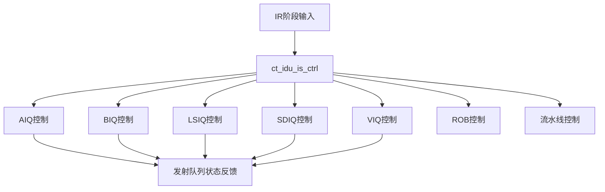

# ct_idu_is_ctrl 模块设计文档

## 1. 模块概述

### 1.1 基本信息

| 属性 | 值 |
|------|-----|
| 模块名称 | ct_idu_is_ctrl |
| 文件路径 | C910_RTL_FACTORY/gen_rtl/idu/rtl/ct_idu_is_ctrl.v |
| 功能描述 | IDU发射阶段控制模块 |
| 生成日期 | 2025-01-20 |

### 1.2 功能描述

ct_idu_is_ctrl是IDU（指令分发单元）发射阶段的核心控制模块，负责：

1. **发射队列管理**：管理多个发射队列（AIQ、BIQ、LSIQ、SDIQ、VIQ）的创建和调度
2. **指令分发控制**：控制指令从IR阶段流向IS阶段的分发过程
3. **资源仲裁**：仲裁各发射队列的资源使用，避免冲突
4. **流水线控制**：控制IS阶段的流水线停顿和刷新
5. **ROB管理**：管理重排序缓冲区（ROB）的创建

### 1.3 设计特点

- 支持多发射队列并行管理
- 高效的指令调度机制
- 低功耗设计（门控时钟）
- 支持乱序发射

## 2. 模块接口说明

### 2.1 输入端口

#### 2.1.1 时钟和复位

| 信号名 | 方向 | 位宽 | 描述 |
|--------|------|------|------|
| forever_cpuclk | input | 1 | CPU时钟 |
| cpurst_b | input | 1 | CPU复位信号（低有效） |
| cp0_yy_clk_en | input | 1 | 时钟使能 |
| cp0_idu_icg_en | input | 1 | IDU门控时钟使能 |

#### 2.1.2 发射队列状态

| 信号名 | 方向 | 位宽 | 描述 |
|--------|------|------|------|
| aiq0_ctrl_empty | input | 1 | AIQ0为空标志 |
| aiq0_ctrl_full | input | 1 | AIQ0已满标志 |
| aiq0_ctrl_1_left_updt | input | 1 | AIQ0剩余1个表项更新 |
| aiq1_ctrl_empty | input | 1 | AIQ1为空标志 |
| aiq1_ctrl_full | input | 1 | AIQ1已满标志 |
| biq_ctrl_empty | input | 1 | BIQ为空标志 |
| biq_ctrl_full | input | 1 | BIQ已满标志 |
| lsiq_ctrl_empty | input | 1 | LSIQ为空标志 |
| lsiq_ctrl_full | input | 1 | LSIQ已满标志 |
| sdiq_ctrl_empty | input | 1 | SDIQ为空标志 |
| sdiq_ctrl_full | input | 1 | SDIQ已满标志 |
| viq0_ctrl_empty | input | 1 | VIQ0为空标志 |
| viq0_ctrl_full | input | 1 | VIQ0已满标志 |
| viq1_ctrl_empty | input | 1 | VIQ1为空标志 |
| viq1_ctrl_full | input | 1 | VIQ1已满标志 |

#### 2.1.3 IR阶段控制信号

| 信号名 | 方向 | 位宽 | 描述 |
|--------|------|------|------|
| ctrl_ir_pipedown_inst0_vld | input | 1 | IR阶段指令0有效 |
| ctrl_ir_pipedown_inst1_vld | input | 1 | IR阶段指令1有效 |
| ctrl_ir_pipedown_inst2_vld | input | 1 | IR阶段指令2有效 |
| ctrl_ir_pipedown_inst3_vld | input | 1 | IR阶段指令3有效 |

#### 2.1.4 刷新和取消信号

| 信号名 | 方向 | 位宽 | 描述 |
|--------|------|------|------|
| rtu_idu_flush_fe | input | 1 | RTU刷新前端 |
| rtu_idu_flush_is | input | 1 | RTU刷新IS阶段 |
| rtu_yy_xx_flush | input | 1 | 全局刷新信号 |
| iu_yy_xx_cancel | input | 1 | IU取消信号 |

### 2.2 输出端口

#### 2.2.1 发射队列创建控制

| 信号名 | 方向 | 位宽 | 描述 |
|--------|------|------|------|
| ctrl_aiq0_create0_en | output | 1 | AIQ0创建0使能 |
| ctrl_aiq0_create0_dp_en | output | 1 | AIQ0创建0数据通路使能 |
| ctrl_aiq0_create1_en | output | 1 | AIQ0创建1使能 |
| ctrl_aiq1_create0_en | output | 1 | AIQ1创建0使能 |
| ctrl_aiq1_create1_en | output | 1 | AIQ1创建1使能 |
| ctrl_biq_create0_en | output | 1 | BIQ创建0使能 |
| ctrl_biq_create1_en | output | 1 | BIQ创建1使能 |
| ctrl_lsiq_create0_en | output | 1 | LSIQ创建0使能 |
| ctrl_lsiq_create1_en | output | 1 | LSIQ创建1使能 |
| ctrl_sdiq_create0_en | output | 1 | SDIQ创建0使能 |
| ctrl_sdiq_create1_en | output | 1 | SDIQ创建1使能 |
| ctrl_viq0_create0_en | output | 1 | VIQ0创建0使能 |
| ctrl_viq0_create1_en | output | 1 | VIQ0创建1使能 |
| ctrl_viq1_create0_en | output | 1 | VIQ1创建0使能 |
| ctrl_viq1_create1_en | output | 1 | VIQ1创建1使能 |

#### 2.2.2 ROB创建控制

| 信号名 | 方向 | 位宽 | 描述 |
|--------|------|------|------|
| idu_rtu_rob_create0_en | output | 1 | ROB创建0使能 |
| idu_rtu_rob_create1_en | output | 1 | ROB创建1使能 |
| idu_rtu_rob_create2_en | output | 1 | ROB创建2使能 |
| idu_rtu_rob_create3_en | output | 1 | ROB创建3使能 |

#### 2.2.3 流水线控制

| 信号名 | 方向 | 位宽 | 描述 |
|--------|------|------|------|
| ctrl_dp_is_dis_stall | output | 1 | IS分发停顿 |
| ctrl_is_stall | output | 1 | IS阶段停顿 |
| ctrl_top_is_iq_full | output | 1 | 发射队列已满 |
| ctrl_fence_is_pipe_empty | output | 1 | Fence指令流水线空 |

## 3. 模块框图

## 4. 模块实现方案

### 4.1 流水线设计

该模块属于IDU IS阶段，负责指令发射控制。主要流水线阶段：

1. **IR阶段**：指令从IR阶段流入
2. **Pre-Dispatch**：预分发阶段，判断资源可用性
3. **Dispatch**：分发阶段，实际创建发射队列表项

### 4.2 关键逻辑描述

#### 4.2.1 发射队列选择逻辑

- 根据指令类型选择对应的发射队列
- AIQ：ALU指令
- BIQ：分支指令
- LSIQ：加载存储指令
- SDIQ：特殊除法指令
- VIQ：向量指令

#### 4.2.2 资源仲裁逻辑

- 检查发射队列是否有空余表项
- 检查ROB是否有空余表项
- 仲裁多条指令的资源请求

#### 4.2.3 流水线停顿逻辑

- 发射队列满时停顿
- ROB满时停顿
- Fence指令等待流水线空

### 4.3 数据前递机制

该模块不涉及数据前递，主要负责控制信号传递。

### 4.4 流水线控制信号

| 信号 | 说明 |
|------|------|
| ctrl_dp_is_dis_stall | 分发停顿，表示资源不足 |
| ctrl_is_stall | IS阶段停顿 |
| ctrl_ir_pipedown_gateclk | IR阶段流水线下沉门控时钟 |

## 5. 内部关键信号列表

### 5.1 寄存器信号

| 信号名 | 位宽 | 描述 |
|--------|------|------|
| - | - | 该模块主要为组合逻辑 |

### 5.2 线网信号

| 信号名 | 位宽 | 描述 |
|--------|------|------|
| aiq0_create0_sel | 1 | AIQ0创建0选择信号 |
| aiq1_create0_sel | 1 | AIQ1创建0选择信号 |
| biq_create0_sel | 1 | BIQ创建0选择信号 |
| lsiq_create0_sel | 1 | LSIQ创建0选择信号 |
| sdiq_create0_sel | 1 | SDIQ创建0选择信号 |
| viq0_create0_sel | 1 | VIQ0创建0选择信号 |

## 6. 设计考虑

### 6.1 性能优化

- 并行处理多条指令的分发请求
- 提前判断资源可用性，减少流水线停顿
- 使用门控时钟降低功耗

### 6.2 关键路径

- 发射队列满标志判断
- 多发射队列仲裁逻辑
- ROB创建控制逻辑

## 7. 修订历史

| 版本 | 日期 | 作者 | 说明 |
|------|------|------|------|
| 1.0 | 2025-01-20 | Auto-generated | 初始版本 |
