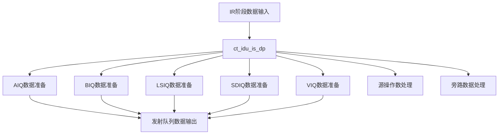

# ct_idu_is_dp 模块设计文档

## 1. 模块概述

### 1.1 基本信息

| 属性 | 值 |
|------|-----|
| 模块名称 | ct_idu_is_dp |
| 文件路径 | C910_RTL_FACTORY/gen_rtl/idu/rtl/ct_idu_is_dp.v |
| 功能描述 | IDU发射阶段数据通路模块 |
| 生成日期 | 2025-01-20 |

### 1.2 功能描述

ct_idu_is_dp是IDU（指令分发单元）发射阶段的数据通路模块，负责：

1. **数据传递**：在IR阶段和IS阶段之间传递指令数据
2. **发射队列数据准备**：为各个发射队列准备创建数据
3. **源操作数处理**：处理指令的源操作数信息
4. **目标寄存器处理**：处理指令的目标寄存器信息
5. **旁路数据处理**：处理数据旁路逻辑

### 1.3 设计特点

- 支持多发射队列数据并行处理
- 高效的数据传递机制
- 支持数据旁路
- 低功耗设计（门控时钟）

## 2. 模块接口说明

### 2.1 输入端口

#### 2.1.1 时钟和复位

| 信号名 | 方向 | 位宽 | 描述 |
|--------|------|------|------|
| cp0_yy_clk_en | input | 1 | 时钟使能 |
| cp0_idu_icg_en | input | 1 | IDU门控时钟使能 |
| cpurst_b | input | 1 | CPU复位信号（低有效） |

#### 2.1.2 控制信号

| 信号名 | 方向 | 位宽 | 描述 |
|--------|------|------|------|
| ctrl_ir_pipedown | input | 1 | IR阶段流水线下沉 |
| ctrl_ir_pipedown_gateclk | input | 1 | IR阶段流水线下沉门控时钟 |
| ctrl_dp_is_dis_stall | input | 1 | IS分发停顿 |
| ctrl_xx_is_inst0_sel | input | 1 | IS指令0选择 |
| ctrl_xx_is_inst_sel | input | 1 | IS指令选择 |

#### 2.1.3 发射队列创建使能

| 信号名 | 方向 | 位宽 | 描述 |
|--------|------|------|------|
| ctrl_aiq0_create0_dp_en | input | 1 | AIQ0创建0数据通路使能 |
| ctrl_aiq0_create1_dp_en | input | 1 | AIQ0创建1数据通路使能 |
| ctrl_aiq1_create0_dp_en | input | 1 | AIQ1创建0数据通路使能 |
| ctrl_aiq1_create1_dp_en | input | 1 | AIQ1创建1数据通路使能 |
| ctrl_biq_create0_dp_en | input | 1 | BIQ创建0数据通路使能 |
| ctrl_biq_create1_dp_en | input | 1 | BIQ创建1数据通路使能 |
| ctrl_lsiq_create0_dp_en | input | 1 | LSIQ创建0数据通路使能 |
| ctrl_lsiq_create1_dp_en | input | 1 | LSIQ创建1数据通路使能 |
| ctrl_sdiq_create0_dp_en | input | 1 | SDIQ创建0数据通路使能 |
| ctrl_sdiq_create1_dp_en | input | 1 | SDIQ创建1数据通路使能 |
| ctrl_viq0_create0_dp_en | input | 1 | VIQ0创建0数据通路使能 |
| ctrl_viq0_create1_dp_en | input | 1 | VIQ0创建1数据通路使能 |
| ctrl_viq1_create0_dp_en | input | 1 | VIQ1创建0数据通路使能 |
| ctrl_viq1_create1_dp_en | input | 1 | VIQ1创建1数据通路使能 |

### 2.2 输出端口

#### 2.2.1 发射队列创建数据

| 信号名 | 方向 | 位宽 | 描述 |
|--------|------|------|------|
| dp_aiq0_create0_data | output | - | AIQ0创建0数据 |
| dp_aiq0_create1_data | output | - | AIQ0创建1数据 |
| dp_aiq1_create0_data | output | - | AIQ1创建0数据 |
| dp_aiq1_create1_data | output | - | AIQ1创建1数据 |
| dp_biq_create0_data | output | - | BIQ创建0数据 |
| dp_biq_create1_data | output | - | BIQ创建1数据 |

#### 2.2.2 源操作数信息

| 信号名 | 方向 | 位宽 | 描述 |
|--------|------|------|------|
| dp_aiq_dis_inst0_src0_preg | output | - | AIQ分发指令0源0物理寄存器 |
| dp_aiq_dis_inst0_src1_preg | output | - | AIQ分发指令0源1物理寄存器 |
| dp_aiq_dis_inst0_src2_preg | output | - | AIQ分发指令0源2物理寄存器 |

#### 2.2.3 旁路数据

| 信号名 | 方向 | 位宽 | 描述 |
|--------|------|------|------|
| dp_aiq0_bypass_data | output | - | AIQ0旁路数据 |
| dp_aiq1_bypass_data | output | - | AIQ1旁路数据 |
| dp_biq_bypass_data | output | - | BIQ旁路数据 |

#### 2.2.4 寄存器有效性

| 信号名 | 方向 | 位宽 | 描述 |
|--------|------|------|------|
| ctrl_dp_dis_inst0_preg_vld | output | 1 | 分发指令0物理寄存器有效 |
| ctrl_dp_dis_inst0_freg_vld | output | 1 | 分发指令0浮点寄存器有效 |
| ctrl_dp_dis_inst0_vreg_vld | output | 1 | 分发指令0向量寄存器有效 |
| ctrl_dp_dis_inst0_ereg_vld | output | 1 | 分发指令0扩展寄存器有效 |

## 3. 模块框图

## 4. 模块实现方案

### 4.1 流水线设计

该模块属于IDU IS阶段，负责数据通路处理。主要功能：

1. **数据锁存**：锁存IR阶段传递的指令数据
2. **数据分发**：将数据分发到各个发射队列
3. **数据选择**：根据控制信号选择正确的数据路径

### 4.2 关键逻辑描述

#### 4.2.1 发射队列数据准备逻辑

- 根据指令类型准备对应的发射队列创建数据
- AIQ数据：ALU指令相关信息
- BIQ数据：分支指令相关信息
- LSIQ数据：加载存储指令相关信息
- SDIQ数据：特殊除法指令相关信息
- VIQ数据：向量指令相关信息

#### 4.2.2 源操作数处理逻辑

- 提取指令的源操作数寄存器编号
- 判断源操作数是否就绪
- 处理源操作数的旁路数据

#### 4.2.3 目标寄存器处理逻辑

- 提取指令的目标寄存器编号
- 判断目标寄存器类型（整数、浮点、向量）
- 生成寄存器有效性信号

### 4.3 数据前递机制

该模块支持数据旁路，可以从RF阶段直接获取数据：

| 前递路径 | 源阶段 | 目标阶段 | 说明 |
|----------|--------|----------|------|
| RF->IS | RF阶段 | IS阶段 | RF阶段锁存的数据可以直接旁路到IS阶段 |

### 4.4 流水线控制信号

| 信号 | 说明 |
|------|------|
| ctrl_ir_pipedown | IR阶段流水线下沉控制 |
| ctrl_dp_is_dis_stall | IS分发停顿控制 |

## 5. 内部关键信号列表

### 5.1 寄存器信号

| 信号名 | 位宽 | 描述 |
|--------|------|------|
| is_inst0_data_latch | - | IS阶段指令0数据锁存 |
| is_inst1_data_latch | - | IS阶段指令1数据锁存 |
| is_inst2_data_latch | - | IS阶段指令2数据锁存 |
| is_inst3_data_latch | - | IS阶段指令3数据锁存 |

### 5.2 线网信号

| 信号名 | 位宽 | 描述 |
|--------|------|------|
| aiq0_create0_src0_data | - | AIQ0创建0源0数据 |
| aiq0_create0_src1_data | - | AIQ0创建0源1数据 |
| aiq1_create0_src0_data | - | AIQ1创建0源0数据 |
| biq_create0_src0_data | - | BIQ创建0源0数据 |

## 6. 设计考虑

### 6.1 性能优化

- 并行处理多条指令的数据通路
- 使用旁路机制减少数据依赖延迟
- 提前准备发射队列创建数据

### 6.2 关键路径

- 源操作数就绪判断逻辑
- 发射队列创建数据准备逻辑
- 旁路数据选择逻辑

## 7. 修订历史

| 版本 | 日期 | 作者 | 说明 |
|------|------|------|------|
| 1.0 | 2025-01-20 | Auto-generated | 初始版本 |
