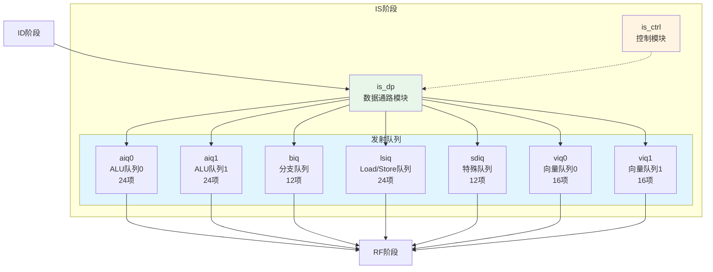
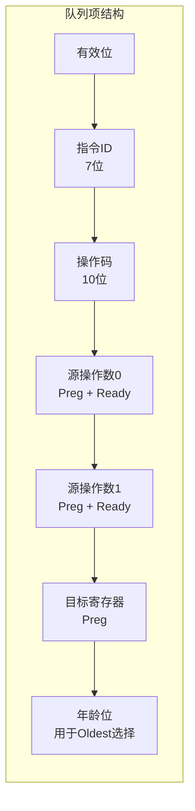

# IDU IS阶段模块详细设计文档

## 1. IS阶段概述

### 1.1 基本信息

| 属性 | 值 |
|------|-----|
| 阶段名称 | IS（Issue）阶段 |
| 功能分类 | 发射队列管理与指令发射 |
| 包含模块 | is_ctrl, is_dp, is_aiq0, is_aiq1, is_biq, is_lsiq, is_sdiq, is_viq0, is_viq1等 |
| 流水线位置 | IDU第三级 |

### 1.2 功能描述

IS（Issue）阶段是IDU流水线的第三级，管理指令的发射队列并负责指令的发射。主要功能包括：

1. **发射队列管理**：维护各类指令的发射队列
2. **就绪检测**：检测指令的操作数是否就绪
3. **发射仲裁**：选择就绪的指令发射到执行单元
4. **唤醒逻辑**：发射后唤醒依赖指令
5. **负载平衡**：动态平衡各执行单元的负载

### 1.3 设计特点

- **多发射队列**：AIQ、BIQ、LSIQ、SDIQ、VIQ等多种队列
- **乱序发射**：支持指令乱序发射
- **Oldest-first策略**：优先发射最老的指令
- **动态负载平衡**：DLB（Dynamic Load Balancing）
- **零延迟Move**：支持零延迟Move指令优化

## 2. IS阶段模块架构

### 2.1 模块框图



### 2.2 发射队列结构



## 3. is_ctrl模块详细设计

### 3.1 模块概述

is_ctrl模块负责IS阶段的控制逻辑，包括发射仲裁、唤醒控制等。

### 3.2 主要功能

1. **发射仲裁**：
   - 选择就绪的指令发射
   - Oldest-first策略
   - 负载平衡

2. **唤醒控制**：
   - 发射后唤醒依赖指令
   - 更新就绪位

3. **队列管理**：
   - 队列满检测
   - 队列项分配

### 3.3 关键信号

#### 3.3.1 发射选择信号

| 信号名 | 位宽 | 描述 |
|--------|------|------|
| ctrl_is_aiq0_issue_en | 1 | AIQ0发射使能 |
| ctrl_is_aiq0_issue_idx | 5 | AIQ0发射项索引 |
| ctrl_is_aiq1_issue_en | 1 | AIQ1发射使能 |
| ctrl_is_aiq1_issue_idx | 5 | AIQ1发射项索引 |
| ctrl_is_biq_issue_en | 1 | BIQ发射使能 |
| ctrl_is_lsiq_issue_en | 1 | LSIQ发射使能 |

#### 3.3.2 唤醒信号

| 信号名 | 位宽 | 描述 |
|--------|------|------|
| rtu_idu_wb_preg0 | 7 | 写回物理寄存器0 |
| rtu_idu_wb_preg0_vld | 1 | 写回物理寄存器0有效 |
| rtu_idu_wb_preg1 | 7 | 写回物理寄存器1 |
| rtu_idu_wb_preg1_vld | 1 | 写回物理寄存器1有效 |

### 3.4 控制逻辑

#### 3.4.1 发射仲裁逻辑

```verilog
// AIQ0发射选择（Oldest-first）
assign aiq0_ready_mask = aiq0_src0_rdy & aiq0_src1_rdy & aiq0_valid;
assign aiq0_issue_idx = find_oldest(aiq0_ready_mask, aiq0_age);
assign ctrl_is_aiq0_issue_en = |aiq0_ready_mask;

// AIQ1发射选择（Oldest-first）
assign aiq1_ready_mask = aiq1_src0_rdy & aiq1_src1_rdy & aiq1_valid;
assign aiq1_issue_idx = find_oldest(aiq1_ready_mask, aiq1_age);
assign ctrl_is_aiq1_issue_en = |aiq1_ready_mask;

// Oldest查找函数
function [4:0] find_oldest;
    input [23:0] ready_mask;
    input [23:0] age;
    // 返回年龄最大（最老）的就绪项索引
endfunction
```

#### 3.4.2 唤醒逻辑

```verilog
// 唤醒检测
always @(posedge clk) begin
    for (int i = 0; i < QUEUE_DEPTH; i++) begin
        // 源操作数0唤醒
        if (src0_preg[i] == rtu_idu_wb_preg0 && rtu_idu_wb_preg0_vld) begin
            src0_rdy[i] <= 1'b1;
        end
        if (src0_preg[i] == rtu_idu_wb_preg1 && rtu_idu_wb_preg1_vld) begin
            src0_rdy[i] <= 1'b1;
        end
        
        // 源操作数1唤醒
        if (src1_preg[i] == rtu_idu_wb_preg0 && rtu_idu_wb_preg0_vld) begin
            src1_rdy[i] <= 1'b1;
        end
        if (src1_preg[i] == rtu_idu_wb_preg1 && rtu_idu_wb_preg1_vld) begin
            src1_rdy[i] <= 1'b1;
        end
    end
end
```

## 4. is_dp模块详细设计

### 4.1 模块概述

is_dp模块是IS阶段的数据通路，包含发射队列的数据存储和传递逻辑。

### 4.2 主要功能

1. **指令数据存储**：
   - 存储来自ID阶段的指令数据
   - 存储发射队列项数据

2. **数据传递**：
   - 将指令数据传递到RF阶段
   - 接收唤醒信号

3. **数据选择**：
   - 选择发射的指令数据
   - 选择就绪的指令

### 4.3 关键信号

#### 4.3.1 队列项数据信号

| 信号名 | 位宽 | 描述 |
|--------|------|------|
| dp_is_aiq0_inst0_iid | 7 | AIQ0指令0 IID |
| dp_is_aiq0_inst0_opcode | 10 | AIQ0指令0操作码 |
| dp_is_aiq0_inst0_src0_preg | 7 | AIQ0指令0源操作数0物理寄存器 |
| dp_is_aiq0_inst0_src0_rdy | 1 | AIQ0指令0源操作数0就绪 |
| dp_is_aiq0_inst0_src1_preg | 7 | AIQ0指令0源操作数1物理寄存器 |
| dp_is_aiq0_inst0_src1_rdy | 1 | AIQ0指令0源操作数1就绪 |
| dp_is_aiq0_inst0_dst_preg | 7 | AIQ0指令0目标物理寄存器 |

## 5. AIQ（ALU Issue Queue）模块详细设计

### 5.1 模块概述

AIQ（ALU Issue Queue）是ALU指令的发射队列，分为AIQ0和AIQ1两个队列。

### 5.2 AIQ特性

| 属性 | AIQ0 | AIQ1 |
|------|------|------|
| 容量 | 24项 | 24项 |
| 目标单元 | ALU0 | ALU1/Mult |
| 支持指令 | 整数运算、逻辑运算 | 整数运算、乘法 |
| 发射带宽 | 1指令/周期 | 1指令/周期 |

### 5.3 AIQ项结构

```verilog
// AIQ项结构
struct aiq_entry {
    logic valid;              // 有效位
    logic [6:0]  iid;         // 指令ID
    logic [9:0]  opcode;      // 操作码
    logic [9:0]  func;        // 功能码
    logic [6:0]  src0_preg;   // 源操作数0物理寄存器
    logic        src0_rdy;    // 源操作数0就绪
    logic [6:0]  src1_preg;   // 源操作数1物理寄存器
    logic        src1_rdy;    // 源操作数1就绪
    logic [6:0]  dst_preg;    // 目标物理寄存器
    logic [23:0] age;         // 年龄位（用于Oldest选择）
};
```

### 5.4 AIQ操作

#### 5.4.1 入队操作

```verilog
// AIQ入队
always @(posedge clk) begin
    if (alloc_en && !full) begin
        aiq_entry[alloc_idx].valid <= 1'b1;
        aiq_entry[alloc_idx].iid <= inst_iid;
        aiq_entry[alloc_idx].opcode <= inst_opcode;
        aiq_entry[alloc_idx].src0_preg <= inst_src0_preg;
        aiq_entry[alloc_idx].src0_rdy <= inst_src0_rdy;
        aiq_entry[alloc_idx].src1_preg <= inst_src1_preg;
        aiq_entry[alloc_idx].src1_rdy <= inst_src1_rdy;
        aiq_entry[alloc_idx].dst_preg <= inst_dst_preg;
        aiq_entry[alloc_idx].age <= current_age;
    end
end
```

#### 5.4.2 出队操作

```verilog
// AIQ出队
always @(posedge clk) begin
    if (issue_en) begin
        aiq_entry[issue_idx].valid <= 1'b0;
    end
end
```

## 6. BIQ（Branch Issue Queue）模块详细设计

### 6.1 模块概述

BIQ（Branch Issue Queue）是分支指令的发射队列。

### 6.2 BIQ特性

| 属性 | 值 |
|------|-----|
| 容量 | 12项 |
| 目标单元 | BJU（Branch Jump Unit） |
| 支持指令 | 分支、跳转、Call、Return |
| 发射带宽 | 1指令/周期 |

### 6.3 BIQ特殊处理

BIQ需要处理以下特殊情况：

1. **分支预测**：存储分支预测信息
2. **跳转目标**：存储跳转目标地址
3. **返回地址**：存储返回地址（Call指令）

## 7. LSIQ（Load/Store Issue Queue）模块详细设计

### 7.1 模块概述

LSIQ（Load/Store Issue Queue）是Load和Store指令的发射队列。

### 7.2 LSIQ特性

| 属性 | 值 |
|------|-----|
| 容量 | 24项 |
| 目标单元 | LSU（Load/Store Unit） |
| 支持指令 | Load、Store、AMO |
| 发射带宽 | 1指令/周期 |

### 7.3 LSIQ特殊处理

LSIQ需要处理以下特殊情况：

1. **地址依赖**：检测地址依赖关系
2. **内存序**：保证Load/Store的内存序
3. **Store-to-Load前递**：支持Store到Load的数据前递

## 8. VIQ（Vector Issue Queue）模块详细设计

### 8.1 模块概述

VIQ（Vector Issue Queue）是向量指令的发射队列，分为VIQ0和VIQ1两个队列。

### 8.2 VIQ特性

| 属性 | VIQ0 | VIQ1 |
|------|------|------|
| 容量 | 16项 | 16项 |
| 目标单元 | VFPU0 | VFPU1 |
| 支持指令 | 向量运算 | 向量运算 |
| 发射带宽 | 1指令/周期 | 1指令/周期 |

### 8.3 VIQ特殊处理

VIQ需要处理以下特殊情况：

1. **向量长度**：考虑向量长度（vl）
2. **向量掩码**：支持向量掩码操作
3. **向量寄存器组**：处理向量寄存器组

## 9. 发射策略

### 9.1 Oldest-first策略

优先发射最老的指令：

```verilog
// 年龄比较
always @(*) begin
    for (int i = 0; i < QUEUE_DEPTH; i++) begin
        for (int j = 0; j < QUEUE_DEPTH; j++) begin
            if (i < j) begin
                age_comp[i][j] = age[i] > age[j];
            end
        end
    end
end

// 选择最老的
assign oldest_idx = find_max_age(ready_mask, age_comp);
```

### 9.2 动态负载平衡（DLB）

动态平衡AIQ0和AIQ1的负载：

```verilog
// DLB使能
assign dlb_en = !cp0_idu_dlb_disable;

// 负载检测
assign aiq0_load = count_valid(aiq0_valid);
assign aiq1_load = count_valid(aiq1_valid);

// 动态分配
assign target_aiq = dlb_en ? ((aiq0_load <= aiq1_load) ? AIQ0 : AIQ1) 
                           : default_aiq;
```

### 9.3 零延迟Move优化

Move指令零延迟优化：

```verilog
// Move指令检测
assign inst_move = (opcode == OP_ADD) && (src1 == 0);

// 零延迟Move
assign move_src_preg = src0_preg;
assign move_dst_preg = dst_preg;

// 直接前递
assign zero_delay_move = inst_move && src0_rdy;
```

## 10. 性能优化

### 10.1 发射优化

- **并行唤醒**：并行检测多个唤醒信号
- **快速仲裁**：使用优先编码器快速选择
- **压缩队列**：队列压缩减少碎片

### 10.2 功耗优化

- **时钟门控**：空闲项关闭时钟
- **数据门控**：无效数据不传递
- **选择性唤醒**：只唤醒相关项

## 11. 修订历史

| 版本 | 日期 | 作者 | 说明 |
|------|------|------|------|
| 1.0 | 2024-01-XX | Auto-generated | 初始版本 |
