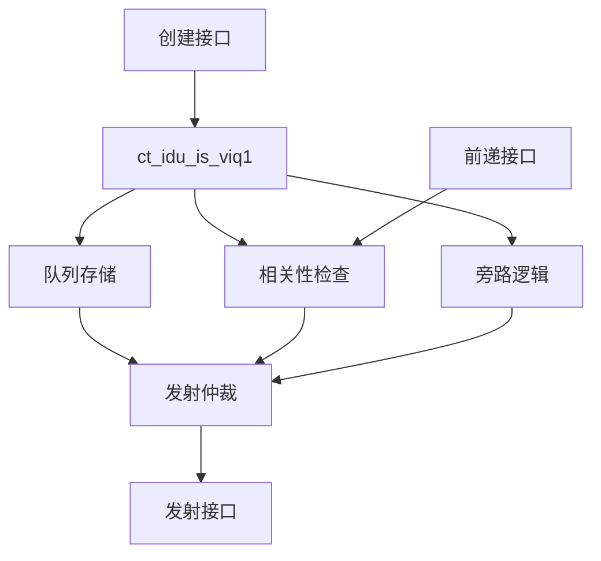

# ct_idu_is_viq1 模块设计文档

## 1. 模块概述

### 1.1 基本信息

| 属性 | 值 |
|------|-----|
| 模块名称 | ct_idu_is_viq1 |
| 文件路径 | C910_RTL_FACTORY/gen_rtl/idu/rtl/ct_idu_is_viq1.v |
| 功能描述 | 向量发射队列1（Vector Issue Queue 1） |
| 生成日期 | 2025-01-20 |

### 1.2 功能描述

ct_idu_is_viq1是IDU（指令分发单元）发射阶段的向量发射队列1，功能与VIQ0类似，负责：

1. **向量指令缓存**：缓存等待发射的向量指令
2. **发射仲裁**：仲裁就绪向量指令的发射顺序
3. **相关性检查**：检查向量源操作数的相关性
4. **数据前递**：支持数据前递机制
5. **队列管理**：管理队列的创建、发射和清空

### 1.3 设计特点

- 与VIQ0形成双发射队列，提高向量指令发射带宽
- 支持向量寄存器操作
- 高效的发射仲裁机制
- 支持数据旁路和前递
- 低功耗设计（门控时钟）

## 2. 模块接口说明

### 2.1 主要接口

VIQ1的接口与VIQ0类似，主要包括：

- **创建接口**：接收来自IS阶段的向量指令创建请求
- **发射接口**：输出就绪的向量指令到VFPU
- **前递接口**：接收来自VFPU的前递数据
- **状态接口**：输出队列状态信息

### 2.2 关键区别

VIQ1与VIQ0的主要区别：
- 两者独立运行，提高向量指令发射带宽
- 可以并行发射多条向量指令

## 3. 模块框图

## 4. 模块实现方案

### 4.1 队列结构

VIQ1采用与VIQ0相同的表项结构，每个表项存储一条向量指令的信息。

### 4.2 关键逻辑

- 创建逻辑：接收向量指令，分配表项
- 发射仲裁：选择最老的就绪向量指令
- 相关性检查：检查向量操作数
- 旁路逻辑：支持向量数据旁路

## 5. 修订历史

| 版本 | 日期 | 作者 | 说明 |
|------|------|------|------|
| 1.0 | 2025-01-20 | Auto-generated | 初始版本 |
