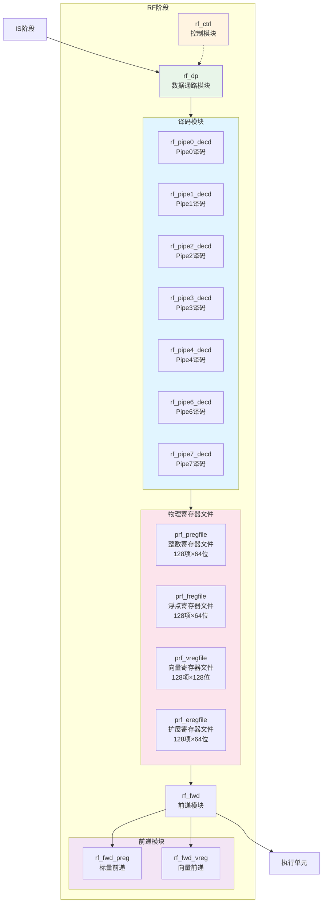
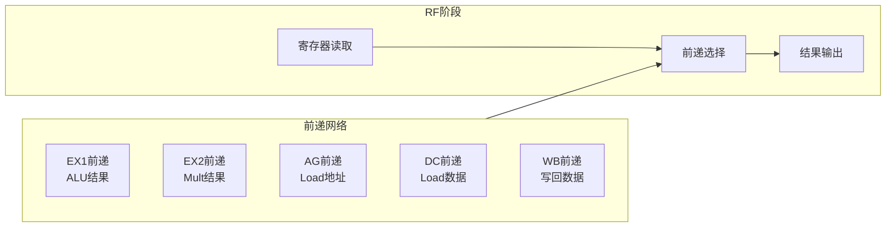

# IDU RF阶段模块详细设计文档

## 1. RF阶段概述

### 1.1 基本信息

| 属性 | 值 |
|------|-----|
| 阶段名称 | RF（Register File）阶段 |
| 功能分类 | 寄存器文件读取与前递 |
| 包含模块 | rf_ctrl, rf_dp, rf_fwd, rf_pipe*_decd, rf_prf_*等 |
| 流水线位置 | IDU第四级 |

### 1.2 功能描述

RF（Register File）阶段是IDU流水线的第四级，负责读取操作数和处理数据前递。主要功能包括：

1. **操作数读取**：从物理寄存器文件读取操作数
2. **数据前递**：处理来自各执行单元的前递数据
3. **结果输出**：将操作数发送到执行单元
4. **前递网络**：维护前递网络，减少数据冒险

### 1.3 设计特点

- **多端口寄存器文件**：支持多个读写端口
- **多级前递**：支持EX1、EX2、AG、DC等多级前递
- **零延迟前递**：支持零延迟前递
- **向量前递**：支持向量数据前递

## 2. RF阶段模块架构

### 2.1 模块框图



### 2.2 前递网络结构



## 3. rf_ctrl模块详细设计

### 3.1 模块概述

rf_ctrl模块负责RF阶段的控制逻辑，包括流水线控制、前递控制等。

### 3.2 主要功能

1. **流水线控制**：
   - RF阶段停顿控制
   - RF阶段刷新控制
   - 流水线下传控制

2. **前递控制**：
   - 前递使能控制
   - 前递源选择

3. **发射控制**：
   - 发射使能控制
   - 发射有效性检查

### 3.3 关键信号

#### 3.3.1 发射控制信号

| 信号名 | 位宽 | 描述 |
|--------|------|------|
| ctrl_rf_pipe0_sel | 1 | Pipe0发射选择 |
| ctrl_rf_pipe1_sel | 1 | Pipe1发射选择 |
| ctrl_rf_pipe2_sel | 1 | Pipe2发射选择 |
| ctrl_rf_pipe3_sel | 1 | Pipe3发射选择 |
| ctrl_rf_pipe4_sel | 1 | Pipe4发射选择 |
| ctrl_rf_pipe6_sel | 1 | Pipe6发射选择 |
| ctrl_rf_pipe7_sel | 1 | Pipe7发射选择 |

#### 3.3.2 前递控制信号

| 信号名 | 位宽 | 描述 |
|--------|------|------|
| ctrl_rf_fwd_en | 1 | 前递使能 |
| ctrl_rf_fwd_sel | 3 | 前递源选择 |

## 4. rf_dp模块详细设计

### 4.1 模块概述

rf_dp模块是RF阶段的数据通路，包含操作数数据的读取和传递逻辑。

### 4.2 主要功能

1. **操作数读取**：
   - 从物理寄存器文件读取操作数
   - 接收前递数据

2. **数据传递**：
   - 将操作数传递到执行单元
   - 接收来自IS阶段的指令信息

3. **数据选择**：
   - 选择前递数据或寄存器数据
   - 选择有效的操作数

### 4.3 关键信号

#### 4.3.1 操作数数据信号

| 信号名 | 位宽 | 描述 |
|--------|------|------|
| dp_rf_pipe0_src0 | 64 | Pipe0源操作数0 |
| dp_rf_pipe0_src1 | 64 | Pipe0源操作数1 |
| dp_rf_pipe0_src2 | 64 | Pipe0源操作数2 |
| dp_rf_pipe1_src0 | 64 | Pipe1源操作数0 |
| dp_rf_pipe1_src1 | 64 | Pipe1源操作数1 |

## 5. rf_fwd模块详细设计

### 5.1 模块概述

rf_fwd模块负责RF阶段的数据前递，包括标量前递和向量前递。

### 5.2 主要功能

1. **前递检测**：检测是否需要前递
2. **前递选择**：选择前递源
3. **前递数据**：提供前递数据

### 5.3 前递源

| 前递源 | 延迟 | 描述 |
|--------|------|------|
| EX1前递 | 1周期 | ALU EX1阶段结果 |
| EX2前递 | 2周期 | ALU EX2阶段结果、Mult结果 |
| AG前递 | 2周期 | Load AG阶段地址 |
| DC前递 | 3周期 | Load DC阶段数据 |
| WB前递 | 4周期 | 写回阶段数据 |

### 5.4 前递逻辑

```verilog
// 前递检测
assign fwd_needed = (src_preg == fwd_preg) && fwd_preg_vld;

// 前递选择（优先级：EX1 > EX2 > AG > DC > WB）
always @(*) begin
    if (ex1_fwd_vld && (src_preg == ex1_fwd_preg)) begin
        fwd_data = ex1_fwd_data;
        fwd_sel = EX1_FWD;
    end
    else if (ex2_fwd_vld && (src_preg == ex2_fwd_preg)) begin
        fwd_data = ex2_fwd_data;
        fwd_sel = EX2_FWD;
    end
    else if (ag_fwd_vld && (src_preg == ag_fwd_preg)) begin
        fwd_data = ag_fwd_data;
        fwd_sel = AG_FWD;
    end
    else if (dc_fwd_vld && (src_preg == dc_fwd_preg)) begin
        fwd_data = dc_fwd_data;
        fwd_sel = DC_FWD;
    end
    else if (wb_fwd_vld && (src_preg == wb_fwd_preg)) begin
        fwd_data = wb_fwd_data;
        fwd_sel = WB_FWD;
    end
    else begin
        fwd_data = reg_file_data;
        fwd_sel = REG_FILE;
    end
end
```

## 6. 物理寄存器文件详细设计

### 6.1 PRF（Physical Register File）

#### 6.1.1 基本信息

| 属性 | 值 |
|------|-----|
| 名称 | 整数物理寄存器文件 |
| 容量 | 128项 × 64位 |
| 读端口 | 10个 |
| 写端口 | 4个 |

#### 6.1.2 端口分配

| 读端口 | 目标单元 |
|--------|----------|
| PRF_R0 | Pipe0源操作数0 |
| PRF_R1 | Pipe0源操作数1 |
| PRF_R2 | Pipe1源操作数0 |
| PRF_R3 | Pipe1源操作数1 |
| PRF_R4 | Pipe2源操作数0 |
| PRF_R5 | Pipe2源操作数1 |
| PRF_R6 | Pipe3源操作数0 |
| PRF_R7 | Pipe4源操作数0 |
| PRF_R8 | Pipe6源操作数0 |
| PRF_R9 | Pipe7源操作数0 |

| 写端口 | 来源单元 |
|--------|----------|
| PRF_W0 | Pipe0写回 |
| PRF_W1 | Pipe1写回 |
| PRF_W2 | Pipe3写回 |
| PRF_W3 | Pipe6写回 |

### 6.2 FRF（Floating-point Register File）

#### 6.2.1 基本信息

| 属性 | 值 |
|------|-----|
| 名称 | 浮点物理寄存器文件 |
| 容量 | 128项 × 64位 |
| 读端口 | 6个 |
| 写端口 | 4个 |

### 6.3 VRF（Vector Register File）

#### 6.3.1 基本信息

| 属性 | 值 |
|------|-----|
| 名称 | 向量物理寄存器文件 |
| 容量 | 128项 × 128位 |
| 读端口 | 8个 |
| 写端口 | 4个 |

### 6.4 ERF（Extension Register File）

#### 6.4.1 基本信息

| 属性 | 值 |
|------|-----|
| 名称 | 扩展物理寄存器文件 |
| 容量 | 128项 × 64位 |
| 读端口 | 4个 |
| 写端口 | 2个 |

## 7. Pipe译码模块详细设计

### 7.1 模块概述

Pipe译码模块负责各流水线的指令译码，包括rf_pipe0_decd到rf_pipe7_decd。

### 7.2 主要功能

1. **指令译码**：解析指令的操作码和功能码
2. **操作数选择**：选择需要的操作数
3. **控制信号生成**：生成执行单元的控制信号

### 7.3 Pipe译码示例

```verilog
// Pipe0译码（ALU0）
always @(*) begin
    case(opcode)
        OP_ADD: begin
            alu_op = ALU_ADD;
            src0_sel = SRC0_REG;
            src1_sel = SRC1_REG;
        end
        OP_SUB: begin
            alu_op = ALU_SUB;
            src0_sel = SRC0_REG;
            src1_sel = SRC1_REG;
        end
        OP_AND: begin
            alu_op = ALU_AND;
            src0_sel = SRC0_REG;
            src1_sel = SRC1_REG;
        end
        // ... 其他指令
    endcase
end
```

## 8. 前递模块详细设计

### 8.1 rf_fwd_preg（标量前递）

#### 8.1.1 模块概述

rf_fwd_preg模块负责标量数据的前递。

#### 8.1.2 前递源

| 前递源 | 位宽 | 描述 |
|--------|------|------|
| iu_pipe0_ex1_fwd | 64 | IU Pipe0 EX1前递 |
| iu_pipe1_ex1_fwd | 64 | IU Pipe1 EX1前递 |
| iu_pipe1_ex2_fwd | 64 | IU Pipe1 EX2前递 |
| lsu_pipe3_ag_fwd | 64 | LSU Pipe3 AG前递 |
| lsu_pipe3_dc_fwd | 64 | LSU Pipe3 DC前递 |

### 8.2 rf_fwd_vreg（向量前递）

#### 8.2.1 模块概述

rf_fwd_vreg模块负责向量数据的前递。

#### 8.2.2 前递源

| 前递源 | 位宽 | 描述 |
|--------|------|------|
| vfpu_pipe6_ex1_fwd | 128 | VFPU Pipe6 EX1前递 |
| vfpu_pipe7_ex1_fwd | 128 | VFPU Pipe7 EX1前递 |
| vfpu_pipe6_ex2_fwd | 128 | VFPU Pipe6 EX2前递 |
| vfpu_pipe7_ex2_fwd | 128 | VFPU Pipe7 EX2前递 |

## 9. 性能优化

### 9.1 前递优化

- **并行前递检测**：并行检测多个前递源
- **前递优先级**：合理的优先级减少延迟
- **零延迟前递**：关键路径零延迟

### 9.2 寄存器文件优化

- **多端口设计**：支持多个读写端口
- **低功耗设计**：时钟门控、数据门控
- **快速访问**：优化访问延迟

## 10. 修订历史

| 版本 | 日期 | 作者 | 说明 |
|------|------|------|------|
| 1.0 | 2024-01-XX | Auto-generated | 初始版本 |
