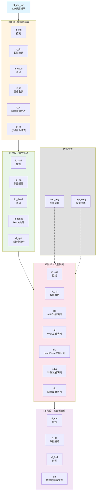
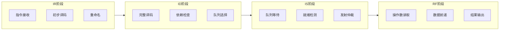
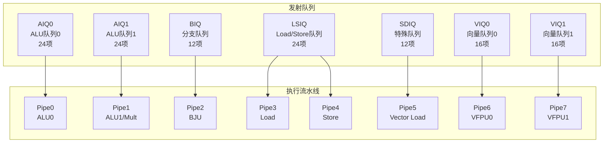

# IDU顶层模块详细设计文档

## 1. 模块概述

### 1.1 基本信息

| 属性 | 值 |
|------|-----|
| 模块名称 | ct_idu_top |
| 文件路径 | C910_RTL_FACTORY/gen_rtl _rvv1.0/idu/rtl/ct_idu_top.v |
| 模块类型 | 顶层模块 |
| 功能分类 | 指令译码单元 |

### 1.2 功能描述

IDU（Instruction Decode Unit，指令译码单元）是C910处理器的核心模块之一，负责指令的译码、发射和调度。IDU实现了从指令取指到指令发射的完整流程，支持超标量、乱序执行和向量扩展。主要功能包括：

1. **指令接收**：从IFU接收最多4条指令
2. **指令译码**：解析指令类型、操作数、目标寄存器等
3. **依赖检查**：检测指令间的数据依赖关系
4. **寄存器重命名**：将逻辑寄存器映射到物理寄存器
5. **发射队列管理**：管理各类指令的发射队列
6. **操作数读取**：从物理寄存器文件读取操作数
7. **数据前递**：支持多级前递机制
8. **向量指令支持**：支持RISC-V向量扩展指令

### 1.3 设计特点

- **4发射超标量**：每周期最多发射4条指令
- **乱序执行**：支持指令乱序发射和执行
- **多级流水线**：IR→ID→IS→RF四级流水线
- **多发射队列**：AIQ、BIQ、LSIQ、SDIQ、VIQ等多种队列
- **向量扩展支持**：支持RVV 1.0向量指令集
- **动态负载平衡**：支持DLB（Dynamic Load Balancing）
- **零延迟前递**：支持操作数零延迟前递

## 2. 模块接口说明

### 2.1 主要输入端口

#### 2.1.1 时钟与复位

| 信号名 | 方向 | 位宽 | 描述 |
|--------|------|------|------|
| forever_cpuclk | input | 1 | CPU主时钟 |
| cpurst_b | input | 1 | 系统复位，低有效 |
| cp0_yy_clk_en | input | 1 | CP0全局时钟使能 |
| cp0_idu_icg_en | input | 1 | IDU时钟门控使能 |

#### 2.1.2 指令输入接口

| 信号名 | 方向 | 位宽 | 描述 |
|--------|------|------|------|
| ifu_idu_ib_inst0_data | input | 32 | 指令0数据 |
| ifu_idu_ib_inst0_vld | input | 1 | 指令0有效 |
| ifu_idu_ib_inst1_data | input | 32 | 指令1数据 |
| ifu_idu_ib_inst1_vld | input | 1 | 指令1有效 |
| ifu_idu_ib_inst2_data | input | 32 | 指令2数据 |
| ifu_idu_ib_inst2_vld | input | 1 | 指令2有效 |

#### 2.1.3 CP0控制接口

| 信号名 | 方向 | 位宽 | 描述 |
|--------|------|------|------|
| cp0_idu_fs | input | 3 | 浮点状态 |
| cp0_idu_frm | input | 3 | 浮点舍入模式 |
| cp0_idu_vs | input | 1 | 向量状态 |
| cp0_idu_vstart | input | 32 | 向量起始索引 |
| cp0_idu_vill | input | 1 | 向量非法指令标志 |
| cp0_idu_dlb_disable | input | 1 | 禁用动态负载平衡 |
| cp0_idu_iq_bypass_disable | input | 1 | 禁用发射队列旁路 |

### 2.2 主要输出端口

#### 2.2.1 IU发射接口

| 信号名 | 方向 | 位宽 | 描述 |
|--------|------|------|------|
| idu_iu_rf_pipe0_sel | output | 1 | Pipe0发射选择 |
| idu_iu_rf_pipe0_iid | output | 7 | Pipe0指令ID |
| idu_iu_rf_pipe0_opcode | output | 10 | Pipe0操作码 |
| idu_iu_rf_pipe0_func | output | 10 | Pipe0功能码 |
| idu_iu_rf_pipe0_src0 | output | 64 | Pipe0源操作数0 |
| idu_iu_rf_pipe0_src1 | output | 64 | Pipe0源操作数1 |
| idu_iu_rf_pipe0_src2 | output | 64 | Pipe0源操作数2 |

#### 2.2.2 LSU发射接口

| 信号名 | 方向 | 位宽 | 描述 |
|--------|------|------|------|
| idu_lsu_rf_pipe3_sel | output | 1 | Pipe3发射选择（Load） |
| idu_lsu_rf_pipe3_iid | output | 7 | Pipe3指令ID |
| idu_lsu_rf_pipe3_offset | output | 12 | Pipe3地址偏移 |
| idu_lsu_rf_pipe4_sel | output | 1 | Pipe4发射选择（Store） |
| idu_lsu_rf_pipe4_iid | output | 7 | Pipe4指令ID |

#### 2.2.3 VFPU发射接口

| 信号名 | 方向 | 位宽 | 描述 |
|--------|------|------|------|
| idu_vfpu_rf_pipe6_sel | output | 1 | Pipe6发射选择 |
| idu_vfpu_rf_pipe6_iid | output | 7 | Pipe6指令ID |
| idu_vfpu_rf_pipe6_func | output | 10 | Pipe6功能码 |
| idu_vfpu_rf_pipe7_sel | output | 1 | Pipe7发射选择 |
| idu_vfpu_rf_pipe7_iid | output | 7 | Pipe7指令ID |

#### 2.2.4 RTU接口

| 信号名 | 方向 | 位宽 | 描述 |
|--------|------|------|------|
| idu_rtu_rob_create0_en | output | 1 | ROB创建0使能 |
| idu_rtu_rob_create0_data | output | 95 | ROB创建0数据 |
| idu_rtu_rob_create1_en | output | 1 | ROB创建1使能 |
| idu_rtu_rob_create1_data | output | 95 | ROB创建1数据 |

## 3. 模块框图

### 3.1 整体架构图

### 3.2 流水线结构图

### 3.3 发射队列结构图

## 4. 流水线详细设计

### 4.1 IR阶段（Instruction Register）

#### 4.1.1 功能描述

IR阶段是指令进入IDU的第一级，主要功能包括：

1. **指令接收**：从IFU接收最多4条指令
2. **初步译码**：解析指令的基本信息
3. **寄存器重命名**：将逻辑寄存器映射到物理寄存器
4. **资源分配**：分配ROB项和物理寄存器

#### 4.1.2 关键模块

| 模块名 | 功能 |
|--------|------|
| ct_idu_ir_ctrl | IR阶段控制逻辑 |
| ct_idu_ir_dp | IR阶段数据通路 |
| ct_idu_ir_decd | IR阶段指令译码 |
| ct_idu_ir_rt | 标量寄存器重命名表 |
| ct_idu_ir_vrt | 向量寄存器重命名表 |
| ct_idu_ir_frt | 浮点寄存器重命名表 |

#### 4.1.3 寄存器重命名

IDU支持三类寄存器的重命名：

| 寄存器类型 | 逻辑寄存器 | 物理寄存器 | 重命名表 |
|------------|------------|------------|----------|
| 标量整数 | x0-x31 | p0-p127 | ir_rt |
| 标量浮点 | f0-f31 | f0-f127 | ir_frt |
| 向量 | v0-v31 | v0-v127 | ir_vrt |

### 4.2 ID阶段（Instruction Decode）

#### 4.2.1 功能描述

ID阶段完成指令的完整译码和依赖检查：

1. **完整译码**：解析指令的所有信息
2. **依赖检查**：检测指令间的数据依赖
3. **指令分类**：确定指令的目标发射队列
4. **特殊处理**：处理Fence、长指令等特殊情况

#### 4.2.2 关键模块

| 模块名 | 功能 |
|--------|------|
| ct_idu_id_ctrl | ID阶段控制逻辑 |
| ct_idu_id_dp | ID阶段数据通路 |
| ct_idu_id_decd | ID阶段指令译码 |
| ct_idu_id_fence | Fence指令处理 |
| ct_idu_id_split_long | 长指令拆分 |
| ct_idu_id_split_short | 短指令拆分 |

#### 4.2.3 依赖检查

依赖检查模块检测以下类型的依赖：

| 依赖类型 | 描述 | 处理方式 |
|----------|------|----------|
| RAW | 写后读依赖 | 等待源操作数就绪 |
| WAW | 写后写依赖 | 顺序化发射 |
| WAR | 读后写依赖 | 寄存器重命名消除 |

### 4.3 IS阶段（Issue）

#### 4.3.1 功能描述

IS阶段管理指令的发射队列：

1. **队列管理**：维护各类发射队列
2. **就绪检测**：检测指令的操作数是否就绪
3. **发射仲裁**：选择就绪的指令发射
4. **唤醒逻辑**：发射后唤醒依赖指令

#### 4.3.2 发射队列类型

| 队列名 | 容量 | 目标单元 | 支持指令类型 |
|--------|------|----------|--------------|
| AIQ0 | 24项 | ALU0 | 整数运算、逻辑运算 |
| AIQ1 | 24项 | ALU1/Mult | 整数运算、乘法 |
| BIQ | 12项 | BJU | 分支、跳转 |
| LSIQ | 24项 | LSU | Load、Store |
| SDIQ | 12项 | Special | 特殊指令 |
| VIQ0 | 16项 | VFPU0 | 向量运算 |
| VIQ1 | 16项 | VFPU1 | 向量运算 |

#### 4.3.3 发射策略

IDU支持以下发射策略：

1. ** oldest-first**：优先发射最老的指令
2. **DLB（Dynamic Load Balancing）**：动态负载平衡
3. **Zero-delay move**：零延迟Move指令优化
4. **Bypass**：发射队列旁路

### 4.4 RF阶段（Register File）

#### 4.4.1 功能描述

RF阶段读取操作数并处理前递：

1. **操作数读取**：从物理寄存器文件读取操作数
2. **数据前递**：处理来自各执行单元的前递数据
3. **结果输出**：将操作数发送到执行单元

#### 4.4.2 物理寄存器文件

| 寄存器文件 | 容量 | 读端口 | 写端口 |
|------------|------|--------|--------|
| PRF（整数） | 128项 | 10读 | 4写 |
| FRF（浮点） | 128项 | 6读 | 4写 |
| VRF（向量） | 128项 | 8读 | 4写 |
| ERF（扩展） | 128项 | 4读 | 2写 |

#### 4.4.3 前递网络

IDU支持多级前递：

| 前递源 | 延迟 | 描述 |
|--------|------|------|
| EX1前递 | 1周期 | ALU EX1阶段结果 |
| EX2前递 | 2周期 | ALU EX2阶段结果 |
| AG前递 | 2周期 | Load AG阶段地址 |
| DC前递 | 3周期 | Load DC阶段数据 |

## 5. 关键设计技术

### 5.1 超标量设计

IDU支持4发射超标量：

- **每周期接收**：最多4条指令
- **每周期译码**：最多4条指令
- **每周期发射**：最多4条指令（不同队列）
- **每周期重命名**：最多4个目标寄存器

### 5.2 乱序执行支持

IDU通过以下机制支持乱序执行：

1. **寄存器重命名**：消除WAR和WAW依赖
2. **发射队列**：缓存指令，等待操作数就绪
3. **ROB**：保证指令顺序提交
4. **唤醒逻辑**：发射后唤醒依赖指令

### 5.3 向量扩展支持

IDU支持RISC-V向量扩展（RVV 1.0）：

- **向量寄存器**：v0-v31，重命名为v0-v127
- **向量指令译码**：解析向量指令的vl、vsew、vlmul
- **向量发射队列**：VIQ0和VIQ1
- **向量前递**：支持向量数据前递

### 5.4 低功耗设计

IDU采用以下低功耗技术：

1. **时钟门控**：各级流水线独立时钟门控
2. **发射队列门控**：空闲项关闭时钟
3. **操作数门控**：无效操作数不读取
4. **动态功耗管理**：根据负载调整发射策略

## 6. 性能指标

### 6.1 吞吐率

| 指标 | 数值 | 说明 |
|------|------|------|
| 最大译码带宽 | 4指令/周期 | 4条指令并行译码 |
| 最大发射带宽 | 4指令/周期 | 4条指令并行发射 |
| 最大前递带宽 | 8操作数/周期 | 8个前递数据 |

### 6.2 延迟

| 操作 | 延迟 | 说明 |
|------|------|------|
| IR→ID | 1周期 | 指令从IR到ID |
| ID→IS | 1周期 | 指令从ID到IS |
| IS→RF | 1周期 | 指令从IS到RF |
| 总延迟 | 3周期 | 从接收到发射 |

### 6.3 面积估算

| 模块 | 相对面积 | 说明 |
|------|----------|------|
| IR阶段 | 15% | 重命名表、资源分配 |
| ID阶段 | 10% | 译码、依赖检查 |
| IS阶段 | 40% | 发射队列 |
| RF阶段 | 30% | 寄存器文件、前递 |
| 控制逻辑 | 5% | 流水线控制 |

## 7. 子模块方案

### 7.1 模块例化层次结构

```mermaid
graph TD
    TOP[ct_idu_top] --> IR_CTRL[ct_idu_ir_ctrl]
    TOP --> IR_DP[ct_idu_ir_dp]
    TOP --> ID_CTRL[ct_idu_id_ctrl]
    TOP --> ID_DP[ct_idu_id_dp]
    TOP --> IS_CTRL[ct_idu_is_ctrl]
    TOP --> IS_DP[ct_idu_is_dp]
    TOP --> RF_CTRL[ct_idu_rf_ctrl]
    TOP --> RF_DP[ct_idu_rf_dp]
    
    IR_DP --> IR_DECD[ct_idu_ir_decd]
    IR_DP --> IR_RT[ct_idu_ir_rt]
    IR_DP --> IR_VRT[ct_idu_ir_vrt]
    IR_DP --> IR_FRT[ct_idu_ir_frt]
    
    ID_DP --> ID_DECD[ct_idu_id_decd]
    ID_DP --> ID_FENCE[ct_idu_id_fence]
    ID_DP --> ID_SPLIT_LONG[ct_idu_id_split_long]
    ID_DP --> ID_SPLIT_SHORT[ct_idu_id_split_short]
    
    IS_DP --> AIQ0[ct_idu_is_aiq0]
    IS_DP --> AIQ1[ct_idu_is_aiq1]
    IS_DP --> BIQ[ct_idu_is_biq]
    IS_DP --> LSIQ[ct_idu_is_lsiq]
    IS_DP --> SDIQ[ct_idu_is_sdiq]
    IS_DP --> VIQ0[ct_idu_is_viq0]
    IS_DP --> VIQ1[ct_idu_is_viq1]
    
    RF_DP --> RF_FWD[ct_idu_rf_fwd]
    RF_DP --> PRF[ct_idu_rf_prf_pregfile]
    RF_DP --> FRF[ct_idu_rf_prf_fregfile]
    RF_DP --> VRF[ct_idu_rf_prf_vregfile]
```

### 7.2 子模块列表

| 层级 | 模块名 | 文件 | 功能描述 |
|------|--------|------|----------|
| 1 | ct_idu_ir_ctrl | ct_idu_ir_ctrl.v | IR阶段控制 |
| 1 | ct_idu_ir_dp | ct_idu_ir_dp.v | IR阶段数据通路 |
| 1 | ct_idu_id_ctrl | ct_idu_id_ctrl.v | ID阶段控制 |
| 1 | ct_idu_id_dp | ct_idu_id_dp.v | ID阶段数据通路 |
| 1 | ct_idu_is_ctrl | ct_idu_is_ctrl.v | IS阶段控制 |
| 1 | ct_idu_is_dp | ct_idu_is_dp.v | IS阶段数据通路 |
| 1 | ct_idu_rf_ctrl | ct_idu_rf_ctrl.v | RF阶段控制 |
| 1 | ct_idu_rf_dp | ct_idu_rf_dp.v | RF阶段数据通路 |

## 8. 修订历史

| 版本 | 日期 | 作者 | 说明 |
|------|------|------|------|
| 1.0 | 2024-01-XX | Auto-generated | 初始版本 |
