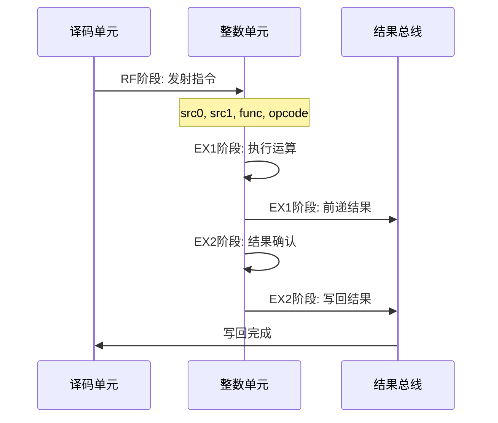
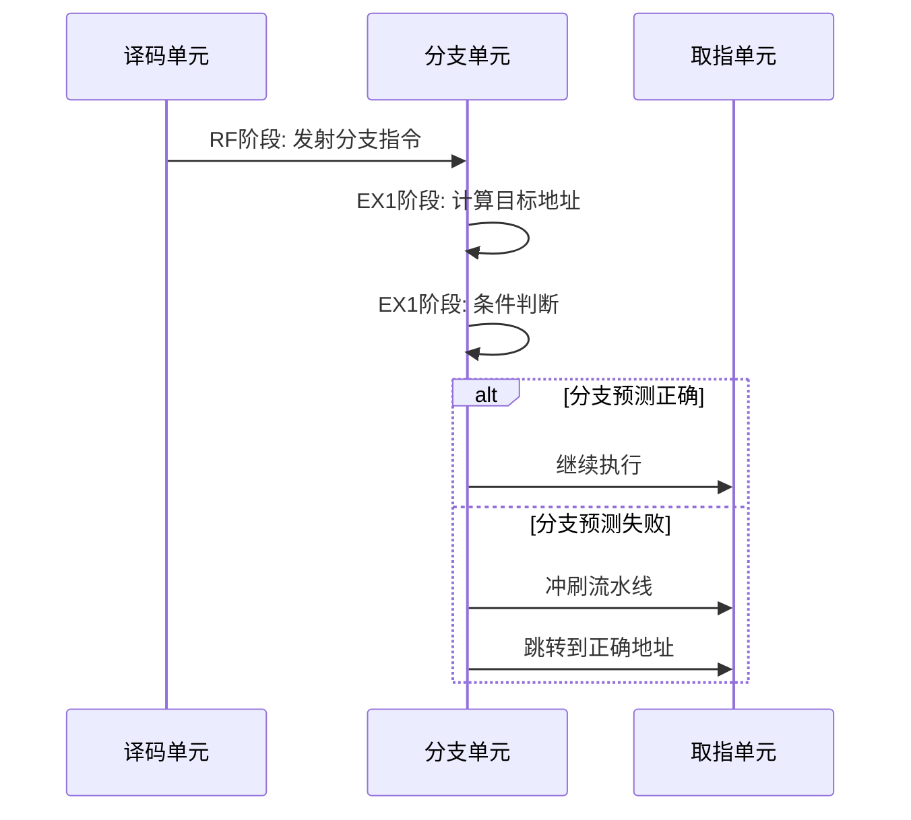
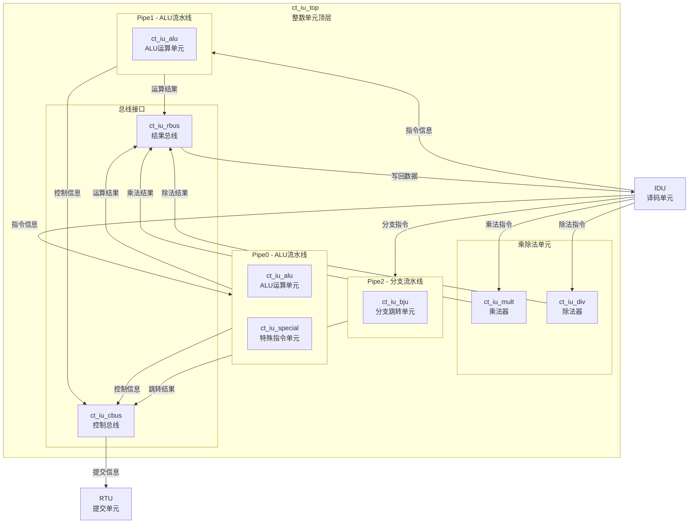
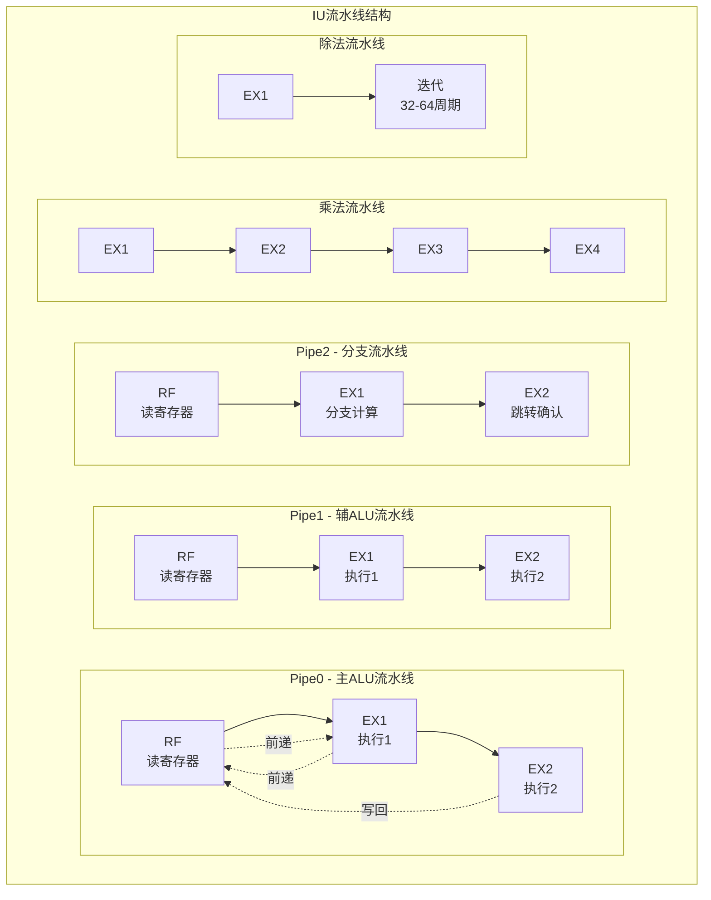
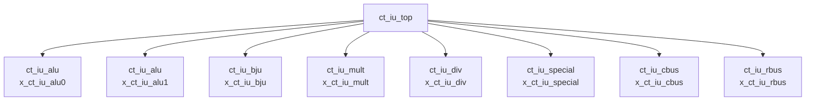

# ct_iu_top 模块详细方案文档

## 1. 模块概述

### 1.1 基本信息

| 属性 | 值 |
|------|-----|
| 模块名称 | ct_iu_top |
| 文件路径 | C910_RTL_FACTORY/gen_rtl/iu/rtl/ct_iu_top.v |
| 功能描述 | 整数执行单元顶层模块 |
| 子模块数量 | 8 |

### 1.2 功能描述

ct_iu_top是OpenC910处理器的整数执行单元（Integer Unit，IU）顶层模块，负责处理所有整数运算指令的执行。该模块实现了超标量双发射架构，支持两条独立的ALU流水线（Pipe0和Pipe1），一条分支跳转流水线（Pipe2），以及独立的乘除法单元。

**主要功能包括：**

- **ALU运算**：支持加减运算、逻辑运算、移位运算等基础整数运算
- **分支跳转**：处理条件分支、无条件跳转、函数调用等控制流指令
- **乘法运算**：支持32位和64位乘法运算，包括有符号和无符号乘法
- **除法运算**：支持32位和64位除法运算，包括有符号和无符号除法及取余
- **特殊指令**：处理系统调用、断点、CSR访问等特殊指令
- **结果写回**：管理运算结果的写回和数据前递

### 1.3 设计特点

- **双发射超标量架构**：支持同时发射两条独立的ALU指令
- **多级流水线设计**：ALU采用2级流水线，乘法采用4级流水线，除法采用迭代设计
- **数据前递机制**：支持跨流水线的数据前递，减少数据冒险
- **异常处理**：完整的异常检测和处理机制
- **低功耗设计**：采用门控时钟技术降低功耗

## 2. 模块接口说明

### 2.1 输入端口

| 信号名 | 方向 | 位宽 | 描述 |
|--------|------|------|------|
| cpurst_b | input | 1 | 系统复位信号，低有效 |
| forever_cpuclk | input | 1 | CPU主时钟 |
| cp0_yy_clk_en | input | 1 | CP0时钟使能 |
| cp0_iu_icg_en | input | 1 | IU门控时钟使能 |
| pad_yy_icg_scan_en | input | 1 | 扫描测试使能 |
| rtu_yy_xx_flush | input | 1 | 流水线冲刷信号 |
| idu_iu_rf_pipe0_sel | input | 1 | Pipe0指令选择 |
| idu_iu_rf_pipe1_sel | input | 1 | Pipe1指令选择 |
| idu_iu_rf_pipe0_src0 | input | 64 | Pipe0源操作数0 |
| idu_iu_rf_pipe0_src1 | input | 64 | Pipe0源操作数1 |
| idu_iu_rf_pipe1_src0 | input | 64 | Pipe1源操作数0 |
| idu_iu_rf_pipe1_src1 | input | 64 | Pipe1源操作数1 |
| idu_iu_rf_pipe0_func | input | 5 | Pipe0功能码 |
| idu_iu_rf_pipe1_func | input | 5 | Pipe1功能码 |
| idu_iu_rf_pipe0_opcode | input | 32 | Pipe0操作码 |
| idu_iu_rf_pipe1_opcode | input | 32 | Pipe1操作码 |
| idu_iu_rf_pipe0_dst_preg | input | 7 | Pipe0目标物理寄存器 |
| idu_iu_rf_pipe1_dst_preg | input | 7 | Pipe1目标物理寄存器 |
| idu_iu_rf_pipe0_iid | input | 7 | Pipe0指令ID |
| idu_iu_rf_pipe1_iid | input | 7 | Pipe1指令ID |
| idu_iu_rf_bju_sel | input | 1 | 分支指令选择 |
| idu_iu_rf_mult_sel | input | 1 | 乘法指令选择 |
| idu_iu_rf_div_sel | input | 1 | 除法指令选择 |
| cp0_yy_priv_mode | input | 2 | 特权模式 |
| mmu_xx_mmu_en | input | 1 | MMU使能 |

### 2.2 输出端口

| 信号名 | 方向 | 位宽 | 描述 |
|--------|------|------|------|
| iu_idu_ex1_pipe0_fwd_preg | output | 7 | Pipe0前递物理寄存器号 |
| iu_idu_ex1_pipe0_fwd_preg_data | output | 64 | Pipe0前递数据 |
| iu_idu_ex1_pipe0_fwd_preg_vld | output | 1 | Pipe0前递有效 |
| iu_idu_ex1_pipe1_fwd_preg | output | 7 | Pipe1前递物理寄存器号 |
| iu_idu_ex1_pipe1_fwd_preg_data | output | 64 | Pipe1前递数据 |
| iu_idu_ex1_pipe1_fwd_preg_vld | output | 1 | Pipe1前递有效 |
| iu_idu_ex2_pipe0_wb_preg | output | 7 | Pipe0写回物理寄存器号 |
| iu_idu_ex2_pipe0_wb_preg_data | output | 64 | Pipe0写回数据 |
| iu_idu_ex2_pipe0_wb_preg_vld | output | 1 | Pipe0写回有效 |
| iu_idu_ex2_pipe1_wb_preg | output | 7 | Pipe1写回物理寄存器号 |
| iu_idu_ex2_pipe1_wb_preg_data | output | 64 | Pipe1写回数据 |
| iu_idu_ex2_pipe1_wb_preg_vld | output | 1 | Pipe1写回有效 |
| iu_rtu_pipe0_cmplt | output | 1 | Pipe0完成信号 |
| iu_rtu_pipe1_cmplt | output | 1 | Pipe1完成信号 |
| iu_rtu_pipe2_cmplt | output | 1 | Pipe2完成信号 |
| iu_rtu_pipe0_expt_vld | output | 1 | Pipe0异常有效 |
| iu_rtu_pipe0_expt_vec | output | 5 | Pipe0异常向量 |
| iu_rtu_pipe0_flush | output | 1 | Pipe0冲刷信号 |
| iu_rtu_pipe2_jmp_mispred | output | 1 | 分支预测失败 |
| iu_rtu_pipe2_bht_mispred | output | 1 | BHT预测失败 |

### 2.3 接口时序图

#### 2.3.1 ALU指令执行时序

#### 2.3.2 分支指令执行时序

## 3. 模块框图

### 3.1 模块架构图

### 3.2 流水线结构图

### 3.3 主要数据连线

| 源模块 | 目标模块 | 信号名 | 位宽 | 说明 |
|--------|----------|--------|------|------|
| IDU | ct_iu_alu | idu_iu_rf_pipe0_src0 | 64 | Pipe0源操作数0 |
| IDU | ct_iu_alu | idu_iu_rf_pipe0_src1 | 64 | Pipe0源操作数1 |
| IDU | ct_iu_alu | idu_iu_rf_pipe1_src0 | 64 | Pipe1源操作数0 |
| IDU | ct_iu_alu | idu_iu_rf_pipe1_src1 | 64 | Pipe1源操作数1 |
| ct_iu_alu | ct_iu_rbus | alu_rbus_ex1_pipe0_data | 64 | Pipe0运算结果 |
| ct_iu_alu | ct_iu_rbus | alu_rbus_ex1_pipe1_data | 64 | Pipe1运算结果 |
| ct_iu_bju | ct_iu_cbus | bju_cbus_ex2_pipe2_jmp_mispred | 1 | 分支预测失败 |
| ct_iu_mult | ct_iu_rbus | mult_rbus_ex4_data | 64 | 乘法结果 |
| ct_iu_div | ct_iu_rbus | div_rbus_data | 64 | 除法结果 |
| ct_iu_rbus | IDU | iu_idu_ex2_pipe0_wb_preg_data | 64 | 写回数据 |

## 4. 模块实现方案

### 4.1 流水线设计

#### 4.1.1 流水线概述

| 流水线 | 执行单元 | 级数 | 支持指令 |
|--------|----------|------|----------|
| Pipe0 | ALU + Special | 2级 | 加减运算、逻辑运算、移位运算、系统指令 |
| Pipe1 | ALU | 2级 | 加减运算、逻辑运算、移位运算 |
| Pipe2 | BJU | 2级 | 条件分支、无条件跳转、函数调用 |
| Mult | Multiplier | 4级 | MUL、MULH、MULHSU、MULHU |
| Div | Divider | 迭代 | DIV、DIVU、REM、REMU |

#### 4.1.2 各流水线详细说明

**Pipe0 - 主ALU流水线**

Pipe0是主要的算术逻辑运算流水线，支持完整的整数运算指令集。该流水线还集成了特殊指令处理单元，用于处理系统调用、断点等特殊指令。

- **RF阶段**：读取源操作数，接收译码信息
- **EX1阶段**：执行运算，产生结果，前递数据
- **EX2阶段**：结果确认，写回寄存器堆

**Pipe1 - 辅ALU流水线**

Pipe1是辅助的算术逻辑运算流水线，与Pipe0并行执行，实现双发射能力。

- **RF阶段**：读取源操作数，接收译码信息
- **EX1阶段**：执行运算，产生结果，前递数据
- **EX2阶段**：结果确认，写回寄存器堆

**Pipe2 - 分支流水线**

Pipe2专门处理分支和跳转指令，支持分支预测和预测失败恢复。

- **RF阶段**：读取源操作数，接收分支目标地址
- **EX1阶段**：计算分支条件，判断是否跳转
- **EX2阶段**：确认分支结果，处理预测失败

**乘法流水线**

乘法器采用4级流水线设计，支持32位和64位乘法运算。

- **EX1阶段**：部分积计算
- **EX2阶段**：部分积累加
- **EX3阶段**：结果调整
- **EX4阶段**：结果输出

**除法流水线**

除法器采用迭代设计，根据操作数位宽需要32-64个周期完成运算。

### 4.2 关键逻辑描述

#### 4.2.1 ALU运算逻辑

ALU支持以下运算类型：

| 运算类型 | 功能码 | 描述 |
|----------|--------|------|
| ADD | 00000 | 加法运算 |
| SUB | 00001 | 减法运算 |
| AND | 00010 | 按位与 |
| OR | 00011 | 按位或 |
| XOR | 00100 | 按位异或 |
| SLL | 00101 | 逻辑左移 |
| SRL | 00110 | 逻辑右移 |
| SRA | 00111 | 算术右移 |
| SLT | 01000 | 有符号比较 |
| SLTU | 01001 | 无符号比较 |

#### 4.2.2 分支判断逻辑

分支单元支持以下分支条件：

| 分支类型 | 条件 | 描述 |
|----------|------|------|
| BEQ | src0 == src1 | 相等跳转 |
| BNE | src0 != src1 | 不等跳转 |
| BLT | src0 < src1 (有符号) | 小于跳转 |
| BGE | src0 >= src1 (有符号) | 大于等于跳转 |
| BLTU | src0 < src1 (无符号) | 无符号小于跳转 |
| BGEU | src0 >= src1 (无符号) | 无符号大于等于跳转 |

### 4.3 数据前递机制

| 前递路径 | 源阶段 | 目标阶段 | 说明 |
|----------|--------|----------|------|
| EX1→RF | EX1 | RF | ALU结果直接前递给下条指令 |
| EX2→RF | EX2 | RF | 写回结果前递 |
| MULT→RF | EX4 | RF | 乘法结果前递 |
| DIV→RF | 完成 | RF | 除法结果前递 |

### 4.4 流水线控制信号

| 信号 | 说明 |
|------|------|
| rtu_yy_xx_flush | 流水线冲刷信号 |
| idu_iu_rf_pipe0_sel | Pipe0指令选择 |
| idu_iu_rf_pipe1_sel | Pipe1指令选择 |
| idu_iu_rf_bju_sel | 分支指令选择 |
| iu_rtu_pipe0_cmplt | Pipe0完成信号 |
| iu_rtu_pipe1_cmplt | Pipe1完成信号 |
| iu_rtu_pipe2_cmplt | Pipe2完成信号 |

## 5. 子模块方案

### 5.1 模块例化层次结构

### 5.2 子模块列表

| 层级 | 模块名 | 实例名 | 文件路径 | 功能描述 |
|------|--------|--------|----------|----------|
| 1 | ct_iu_alu | x_ct_iu_alu0 | ct_iu_alu.v | Pipe0 ALU运算单元 |
| 1 | ct_iu_alu | x_ct_iu_alu1 | ct_iu_alu.v | Pipe1 ALU运算单元 |
| 1 | ct_iu_bju | x_ct_iu_bju | ct_iu_bju.v | 分支跳转单元 |
| 1 | ct_iu_mult | x_ct_iu_mult | ct_iu_mult.v | 乘法器 |
| 1 | ct_iu_div | x_ct_iu_div | ct_iu_div.v | 除法器 |
| 1 | ct_iu_special | x_ct_iu_special | ct_iu_special.v | 特殊指令单元 |
| 1 | ct_iu_cbus | x_ct_iu_cbus | ct_iu_cbus.v | 控制总线 |
| 1 | ct_iu_rbus | x_ct_iu_rbus | ct_iu_rbus.v | 结果总线 |

### 5.3 子模块功能说明

#### ct_iu_alu - ALU运算单元

ALU运算单元负责执行整数算术逻辑运算。支持加减运算、逻辑运算、移位运算和比较运算。采用组合逻辑实现，单周期完成运算。

**主要功能：**
- 64位加减法运算
- 64位逻辑运算（AND、OR、XOR）
- 64位移位运算（SLL、SRL、SRA）
- 有符号/无符号比较运算
- 条件码生成

#### ct_iu_bju - 分支跳转单元

分支跳转单元负责处理所有分支和跳转指令。支持条件分支、无条件跳转、函数调用和返回等指令。实现分支预测验证和预测失败恢复。

**主要功能：**
- 分支条件判断
- 分支目标地址计算
- 分支预测验证
- 预测失败处理
- 返回地址存储

#### ct_iu_mult - 乘法器

乘法器实现整数乘法运算。采用Booth算法和Wallace树结构，4级流水线设计。

**主要功能：**
- 32位乘法（结果低32位）
- 32位乘法（结果高32位）
- 64位乘法
- 有符号/无符号乘法
- 混合符号乘法

#### ct_iu_div - 除法器

除法器实现整数除法和取余运算。采用迭代算法，支持提前结束。

**主要功能：**
- 32位除法
- 64位除法
- 有符号/无符号除法
- 取余运算
- 除零异常检测

#### ct_iu_special - 特殊指令单元

特殊指令单元处理系统级指令和特殊操作。

**主要功能：**
- ECALL系统调用
- EBREAK断点指令
- AUIPC指令
- VSETVL/VSETVLI向量配置指令
- 特权级检查

#### ct_iu_cbus - 控制总线

控制总线负责收集和仲裁各流水线的控制信息，向提交单元发送完成和异常信号。

**主要功能：**
- 流水线完成信号仲裁
- 异常信号收集
- 冲刷信号处理
- 提交信息发送

#### ct_iu_rbus - 结果总线

结果总线负责收集各执行单元的运算结果，管理数据前递和写回。

**主要功能：**
- 运算结果收集
- 数据前递管理
- 写回数据仲裁
- 寄存器号管理

## 6. 内部关键信号列表

### 6.1 寄存器信号

| 信号名 | 位宽 | 描述 |
|--------|------|------|
| alu_ex1_src0 | 64 | ALU EX1阶段源操作数0 |
| alu_ex1_src1 | 64 | ALU EX1阶段源操作数1 |
| alu_ex1_func | 5 | ALU EX1阶段功能码 |
| alu_ex1_dst_preg | 7 | ALU EX1阶段目标寄存器 |
| bju_ex1_pc | 40 | BJU EX1阶段当前PC |
| bju_ex1_target | 40 | BJU EX1阶段跳转目标 |
| mult_ex1_src0 | 64 | 乘法器源操作数0 |
| mult_ex1_src1 | 64 | 乘法器源操作数1 |
| div_ex1_dividend | 64 | 除法器被除数 |
| div_ex1_divisor | 64 | 除法器除数 |

### 6.2 线网信号

| 信号名 | 位宽 | 描述 |
|--------|------|------|
| alu_ex1_result | 64 | ALU EX1运算结果 |
| alu_ex1_overflow | 1 | ALU溢出标志 |
| bju_ex1_taken | 1 | 分支跳转判断结果 |
| bju_ex1_mispred | 1 | 分支预测失败 |
| mult_ex4_result | 64 | 乘法结果 |
| div_result | 64 | 除法结果 |
| div_ready | 1 | 除法完成标志 |

## 7. 数据结构定义

### 7.1 ALU功能码定义

| 功能码 | 名称 | 描述 |
|--------|------|------|
| 5'b00000 | ALU_ADD | 加法运算 |
| 5'b00001 | ALU_SUB | 减法运算 |
| 5'b00010 | ALU_AND | 按位与 |
| 5'b00011 | ALU_OR | 按位或 |
| 5'b00100 | ALU_XOR | 按位异或 |
| 5'b00101 | ALU_SLL | 逻辑左移 |
| 5'b00110 | ALU_SRL | 逻辑右移 |
| 5'b00111 | ALU_SRA | 算术右移 |
| 5'b01000 | ALU_SLT | 有符号比较 |
| 5'b01001 | ALU_SLTU | 无符号比较 |
| 5'b01010 | ALU_LUI | LUI指令 |
| 5'b01011 | ALU_ADDSL | 地址计算 |

### 7.2 异常向量定义

| 向量值 | 名称 | 描述 |
|--------|------|------|
| 5'h00 | EXPT_NONE | 无异常 |
| 5'h02 | EXPT_ILLEGAL | 非法指令 |
| 5'h03 | EXPT_BREAKPOINT | 断点异常 |
| 5'h08 | EXPT_ECALL_U | 用户态系统调用 |
| 5'h09 | EXPT_ECALL_S | 监管态系统调用 |
| 5'h0B | EXPT_ECALL_M | 机器态系统调用 |

### 7.3 特权模式定义

| 模式值 | 名称 | 描述 |
|--------|------|------|
| 2'b00 | PRIV_USER | 用户模式 |
| 2'b01 | PRIV_SUPERVISOR | 监管模式 |
| 2'b11 | PRIV_MACHINE | 机器模式 |

## 8. 可测试性设计

### 8.1 测试信号

| 信号名 | 方向 | 位宽 | 描述 |
|--------|------|------|------|
| pad_yy_icg_scan_en | input | 1 | 扫描测试使能 |
| had_idu_wbbr_data | input | 64 | 调试写回数据 |
| had_idu_wbbr_vld | input | 1 | 调试写回有效 |

### 8.2 调试接口

IU模块支持通过以下接口进行调试：

- **门控时钟扫描**：支持扫描链插入，用于制造测试
- **写回旁路**：支持调试器直接写回数据
- **性能计数器**：支持统计各类指令执行次数

### 8.3 扫描链支持

IU模块采用门控时钟设计，支持扫描链插入：

- 所有触发器支持扫描模式
- 门控时钟单元支持扫描使能
- 支持全扫描测试

## 9. 性能指标

### 9.1 时序指标

| 指标 | 值 | 说明 |
|------|-----|------|
| ALU延迟 | 1周期 | 算术逻辑运算延迟 |
| 分支延迟 | 2周期 | 分支判断到跳转确认 |
| 乘法延迟 | 4周期 | 64位乘法延迟 |
| 除法延迟 | 32-64周期 | 32-64位除法延迟 |
| 最大频率 | 待定 | 综合后确定 |

### 9.2 吞吐率指标

| 指标 | 值 | 说明 |
|------|-----|------|
| ALU吞吐率 | 2指令/周期 | 双发射 |
| 分支吞吐率 | 1指令/周期 | 单发射 |
| 乘法吞吐率 | 1指令/4周期 | 流水线 |
| 除法吞吐率 | 1指令/32-64周期 | 迭代 |

## 10. 修订历史

| 版本 | 日期 | 作者 | 说明 |
|------|------|------|------|
| 1.0 | 2026-03-13 | Auto-generated | 初始版本，基于RTL自动生成 |
