# ct_lsu_top 模块框图

## 1. 模块层次结构

| 层级 | 模块名 | 实例名 | 说明 |
|------|--------|--------|------|
| 0 | ct_lsu_top | ct_lsu_top | 顶层模块 |
| 1 | ct_lsu_ld_ag | x_ct_lsu_ld_ag | 子模块 |
| 2 | gated_clk_cell | x_lsu_ld_ag_gated_clk | 孙模块 |
| 2 | ct_rtu_compare_iid | x_lsu_rf_compare_ld_ag_iid | 孙模块 |
| 2 | ct_rtu_compare_iid | x_lsu_ld_ag_compare_st_ag_iid | 孙模块 |
| 1 | ct_lsu_st_ag | x_ct_lsu_st_ag | 子模块 |
| 2 | gated_clk_cell | x_lsu_st_ag_gated_clk | 孙模块 |
| 2 | ct_rtu_compare_iid | x_lsu_rf_compare_st_ag_iid | 孙模块 |
| 1 | ct_lsu_sd_ex1 | x_ct_lsu_sd_ex1 | 子模块 |
| 2 | gated_clk_cell | x_lsu_sd_ex1_gated_clk | 孙模块 |
| 2 | gated_clk_cell | x_lsu_sd_ex1_data_gated_clk | 孙模块 |
| 2 | gated_clk_cell | x_lsu_sd_ex1_vdata_gated_clk | 孙模块 |
| 1 | ct_lsu_mcic | x_ct_lsu_mcic | 子模块 |
| 2 | gated_clk_cell | x_lsu_mcic_gated_clk | 孙模块 |
| 1 | ct_lsu_dcache_arb | x_ct_lsu_dcache_arb | 子模块 |
| 2 | gated_clk_cell | x_lsu_dcache_serial_clk_en | 孙模块 |
| 1 | ct_lsu_dcache_top | x_ct_lsu_dcache_top | 子模块 |
| 2 | ct_lsu_dcache_ld_tag_array | x_ct_lsu_dcache_ld_tag_array | 孙模块 |
| 2 | ct_lsu_dcache_tag_array | x_ct_lsu_dcache_st_tag_array | 孙模块 |
| 2 | ct_lsu_dcache_dirty_array | x_ct_lsu_dcache_st_dirty_array | 孙模块 |
| 2 | ct_lsu_dcache_data_array | x_ct_lsu_dcache_ld_data_bank0_array | 孙模块 |
| 2 | ct_lsu_dcache_data_array | x_ct_lsu_dcache_ld_data_bank1_array | 孙模块 |
| 2 | ... | ... | 还有 6 个孙模块 |
| 1 | ct_lsu_ld_dc | x_ct_lsu_ld_dc | 子模块 |
| 2 | gated_clk_cell | x_lsu_ld_dc_gated_clk | 孙模块 |
| 2 | gated_clk_cell | x_lsu_ld_dc_inst_gated_clk | 孙模块 |
| 2 | gated_clk_cell | x_lsu_ld_dc_borrow_gated_clk | 孙模块 |
| 1 | ct_lsu_st_dc | x_ct_lsu_st_dc | 子模块 |
| 2 | gated_clk_cell | x_lsu_st_dc_gated_clk | 孙模块 |
| 2 | gated_clk_cell | x_lsu_st_dc_inst_gated_clk | 孙模块 |
| 2 | gated_clk_cell | x_lsu_st_dc_borrow_gated_clk | 孙模块 |
| 2 | gated_clk_cell | x_lsu_st_dc_expt_illegal_inst_gated_clk | 孙模块 |
| 1 | ct_lsu_lq | x_ct_lsu_lq | 子模块 |
| 2 | gated_clk_cell | x_lsu_lq_gated_clk | 孙模块 |
| 2 | ct_lsu_lq_entry | x_ct_lsu_lq_entry_0 | 孙模块 |
| 2 | ct_lsu_lq_entry | x_ct_lsu_lq_entry_1 | 孙模块 |
| 2 | ct_lsu_lq_entry | x_ct_lsu_lq_entry_2 | 孙模块 |
| 2 | ct_lsu_lq_entry | x_ct_lsu_lq_entry_3 | 孙模块 |
| 2 | ... | ... | 还有 12 个孙模块 |
| 1 | ct_lsu_sq | x_ct_lsu_sq | 子模块 |
| 2 | gated_clk_cell | x_lsu_sq_gated_clk | 孙模块 |
| 2 | gated_clk_cell | x_lsu_sq_create_pop_gated_clk | 孙模块 |
| 2 | gated_clk_cell | x_lsu_sq_wakeup_queue_gated_clk | 孙模块 |
| 2 | gated_clk_cell | x_lsu_sq_fwd_data_pe_gated_clk | 孙模块 |
| 2 | gated_clk_cell | x_lsu_sq_pop_gated_clk | 孙模块 |
| 2 | ... | ... | 还有 15 个孙模块 |
| 1 | ... | ... | 还有 22 个子模块 |

## 2. 模块框图 (Mermaid)

```mermaid
graph TB
    subgraph ct_lsu_top["ct_lsu_top"]
        subgraph x_ct_lsu_ld_ag["ct_lsu_ld_ag"]
            x_lsu_ld_ag_gated_clk["gated_clk_cell"]
            x_lsu_rf_compare_ld_ag_iid["ct_rtu_compare_iid"]
            x_lsu_ld_ag_compare_st_ag_iid["ct_rtu_compare_iid"]
        end
        subgraph x_ct_lsu_st_ag["ct_lsu_st_ag"]
            x_lsu_st_ag_gated_clk["gated_clk_cell"]
            x_lsu_rf_compare_st_ag_iid["ct_rtu_compare_iid"]
        end
        subgraph x_ct_lsu_sd_ex1["ct_lsu_sd_ex1"]
            x_lsu_sd_ex1_gated_clk["gated_clk_cell"]
            x_lsu_sd_ex1_data_gated_clk["gated_clk_cell"]
            x_lsu_sd_ex1_vdata_gated_clk["gated_clk_cell"]
        end
        subgraph x_ct_lsu_mcic["ct_lsu_mcic"]
            x_lsu_mcic_gated_clk["gated_clk_cell"]
        end
        subgraph x_ct_lsu_dcache_arb["ct_lsu_dcache_arb"]
            x_lsu_dcache_serial_clk_en["gated_clk_cell"]
        end
        subgraph x_ct_lsu_dcache_top["ct_lsu_dcache_top"]
            x_ct_lsu_dcache_ld_tag_array["ct_lsu_dcache_ld_tag_array"]
            x_ct_lsu_dcache_st_tag_array["ct_lsu_dcache_tag_array"]
            x_ct_lsu_dcache_st_dirty_array["ct_lsu_dcache_dirty_array"]
            x_ct_lsu_dcache_ld_data_bank0_array["ct_lsu_dcache_data_array"]
            x_ct_lsu_dcache_ld_data_bank1_array["ct_lsu_dcache_data_array"]
            x_ct_lsu_dcache_ld_data_bank2_array["ct_lsu_dcache_data_array"]
            x_ct_lsu_dcache_ld_data_bank3_array["ct_lsu_dcache_data_array"]
            x_ct_lsu_dcache_ld_data_bank4_array["ct_lsu_dcache_data_array"]
            x_ct_lsu_dcache_ld_data_bank5_array["ct_lsu_dcache_data_array"]
            x_ct_lsu_dcache_ld_data_bank6_array["ct_lsu_dcache_data_array"]
            more_x_ct_lsu_dcache_top["... (1 more)"]
        end
        subgraph x_ct_lsu_ld_dc["ct_lsu_ld_dc"]
            x_lsu_ld_dc_gated_clk["gated_clk_cell"]
            x_lsu_ld_dc_inst_gated_clk["gated_clk_cell"]
            x_lsu_ld_dc_borrow_gated_clk["gated_clk_cell"]
        end
        subgraph x_ct_lsu_st_dc["ct_lsu_st_dc"]
            x_lsu_st_dc_gated_clk["gated_clk_cell"]
            x_lsu_st_dc_inst_gated_clk["gated_clk_cell"]
            x_lsu_st_dc_borrow_gated_clk["gated_clk_cell"]
            x_lsu_st_dc_expt_illegal_inst_gated_clk["gated_clk_cell"]
        end
        subgraph x_ct_lsu_lq["ct_lsu_lq"]
            x_lsu_lq_gated_clk["gated_clk_cell"]
            x_ct_lsu_lq_entry_0["ct_lsu_lq_entry"]
            x_ct_lsu_lq_entry_1["ct_lsu_lq_entry"]
            x_ct_lsu_lq_entry_2["ct_lsu_lq_entry"]
            x_ct_lsu_lq_entry_3["ct_lsu_lq_entry"]
            x_ct_lsu_lq_entry_4["ct_lsu_lq_entry"]
            x_ct_lsu_lq_entry_5["ct_lsu_lq_entry"]
            x_ct_lsu_lq_entry_6["ct_lsu_lq_entry"]
            x_ct_lsu_lq_entry_7["ct_lsu_lq_entry"]
            x_ct_lsu_lq_entry_8["ct_lsu_lq_entry"]
            more_x_ct_lsu_lq["... (7 more)"]
        end
        subgraph x_ct_lsu_sq["ct_lsu_sq"]
            x_lsu_sq_gated_clk["gated_clk_cell"]
            x_lsu_sq_create_pop_gated_clk["gated_clk_cell"]
            x_lsu_sq_wakeup_queue_gated_clk["gated_clk_cell"]
            x_lsu_sq_fwd_data_pe_gated_clk["gated_clk_cell"]
            x_lsu_sq_pop_gated_clk["gated_clk_cell"]
            x_lsu_sq_dbg_gated_clk["gated_clk_cell"]
            x_ct_lsu_sq_entry_0["ct_lsu_sq_entry"]
            x_ct_lsu_sq_entry_1["ct_lsu_sq_entry"]
            x_ct_lsu_sq_entry_2["ct_lsu_sq_entry"]
            x_ct_lsu_sq_entry_3["ct_lsu_sq_entry"]
            more_x_ct_lsu_sq["... (10 more)"]
        end
        more_ct_lsu_top["... (22 more)"]
    end
    x_ct_lsu_ld_ag -->|data| x_ct_lsu_st_ag
    x_ct_lsu_st_ag -->|data| x_ct_lsu_sd_ex1
    x_ct_lsu_sd_ex1 -->|data| x_ct_lsu_mcic
    x_ct_lsu_mcic -->|data| x_ct_lsu_dcache_arb
    x_ct_lsu_dcache_arb -->|data| x_ct_lsu_dcache_top
    x_ct_lsu_dcache_top -->|data| x_ct_lsu_ld_dc
    x_ct_lsu_ld_dc -->|data| x_ct_lsu_st_dc
    x_ct_lsu_st_dc -->|data| x_ct_lsu_lq
    x_ct_lsu_lq -->|data| x_ct_lsu_sq
    x_ct_lsu_sq -->|data| x_ct_lsu_ld_da
    x_ct_lsu_ld_da -->|data| x_ct_lsu_st_da
    x_ct_lsu_st_da -->|data| x_ct_lsu_rb
    x_ct_lsu_rb -->|data| x_ct_lsu_wmb
    x_ct_lsu_wmb -->|data| x_ct_lsu_wmb_ce
    x_ct_lsu_wmb_ce -->|data| x_ct_lsu_ld_wb
    x_ct_lsu_ld_wb -->|data| x_ct_lsu_st_wb
    x_ct_lsu_st_wb -->|data| x_ct_lsu_lfb
    x_ct_lsu_lfb -->|data| x_ct_lsu_vb
    x_ct_lsu_vb -->|data| x_ct_lsu_vb_sdb_data
    x_ct_lsu_vb_sdb_data -->|data| x_ct_lsu_snoop_req_arbiter
    x_ct_lsu_snoop_req_arbiter -->|data| x_ct_lsu_snoop_resp
    x_ct_lsu_snoop_resp -->|data| x_ct_lsu_snoop_ctcq
    x_ct_lsu_snoop_ctcq -->|data| x_ct_lsu_snoop_snq
    x_ct_lsu_snoop_snq -->|data| x_ct_lsu_lm
    x_ct_lsu_lm -->|data| x_ct_lsu_amr
    x_ct_lsu_amr -->|data| x_ct_lsu_icc
    x_ct_lsu_icc -->|data| x_ct_lsu_ctrl
    x_ct_lsu_ctrl -->|data| x_ct_lsu_bus_arb
    x_ct_lsu_bus_arb -->|data| x_ct_lsu_pfu
    x_ct_lsu_pfu -->|data| x_ct_lsu_cache_buffer
    x_ct_lsu_cache_buffer -->|data| x_ct_lsu_spec_fail_predict
    input_biu_lsu_ac_req["biu_lsu_ac_req"]
    input_biu_lsu_ac_req --> ct_lsu_top
    input_biu_lsu_ar_ready["biu_lsu_ar_ready"]
    input_biu_lsu_ar_ready --> ct_lsu_top
    input_biu_lsu_aw_vb_grnt["biu_lsu_aw_vb_grnt"]
    input_biu_lsu_aw_vb_grnt --> ct_lsu_top
    input_biu_lsu_aw_wmb_grnt["biu_lsu_aw_wmb_grnt"]
    input_biu_lsu_aw_wmb_grnt --> ct_lsu_top
    input_biu_lsu_b_vld["biu_lsu_b_vld"]
    input_biu_lsu_b_vld --> ct_lsu_top
    output_lsu_biu_ac_empty["lsu_biu_ac_empty"]
    ct_lsu_top --> output_lsu_biu_ac_empty
    output_lsu_biu_ac_ready["lsu_biu_ac_ready"]
    ct_lsu_top --> output_lsu_biu_ac_ready
    output_lsu_biu_ar_dp_req["lsu_biu_ar_dp_req"]
    ct_lsu_top --> output_lsu_biu_ar_dp_req
    output_lsu_biu_ar_lock["lsu_biu_ar_lock"]
    ct_lsu_top --> output_lsu_biu_ar_lock
    output_lsu_biu_ar_req["lsu_biu_ar_req"]
    ct_lsu_top --> output_lsu_biu_ar_req
```



## 3. 主要数据连线

| 源模块 | 信号名 | 位宽 | 目标模块 |
|--------|--------|------|----------|
| ct_lsu_top | ag_dcache_arb_ld_data_gateclk_en | - | x_ct_lsu_ld_ag |
| ct_lsu_top | ag_dcache_arb_st_dirty_gateclk_en | - | x_ct_lsu_st_ag |
| ct_lsu_top | cp0_lsu_icg_en | - | x_ct_lsu_sd_ex1 |
| ct_lsu_top | biu_lsu_r_data | - | x_ct_lsu_mcic |
| ct_lsu_top | ag_dcache_arb_ld_data_gateclk_en | - | x_ct_lsu_dcache_arb |
| ct_lsu_top | cp0_lsu_icg_en | - | x_ct_lsu_dcache_top |
| ct_lsu_top | cb_ld_dc_addr_hit | - | x_ct_lsu_ld_dc |
| ct_lsu_top | cp0_lsu_dcache_en | - | x_ct_lsu_st_dc |
| ct_lsu_top | cp0_lsu_corr_dis | - | x_ct_lsu_lq |
| ct_lsu_top | cp0_lsu_icg_en | - | x_ct_lsu_sq |
| ct_lsu_top | cb_ld_da_data | - | x_ct_lsu_ld_da |
| ct_lsu_top | amr_wa_cancel | - | x_ct_lsu_st_da |
| ct_lsu_top | biu_lsu_b_id | - | x_ct_lsu_rb |
| ct_lsu_top | amr_l2_mem_set | - | x_ct_lsu_wmb |
| ct_lsu_top | cp0_lsu_icg_en | - | x_ct_lsu_wmb_ce |
| ct_lsu_top | cp0_lsu_icg_en | - | x_ct_lsu_ld_wb |
| ct_lsu_top | cp0_lsu_icg_en | - | x_ct_lsu_st_wb |
| ct_lsu_top | biu_lsu_r_data | - | x_ct_lsu_lfb |
| ct_lsu_top | biu_lsu_b_id | - | x_ct_lsu_vb |
| ct_lsu_top | cp0_lsu_icg_en | - | x_ct_lsu_vb_sdb_data |
| ct_lsu_top | arb_ctcq_ctc_2nd_trans | - | x_ct_lsu_snoop_req_arbiter |
| ct_lsu_top | biu_ctcq_cr_ready | - | x_ct_lsu_snoop_resp |
| ct_lsu_top | arb_ctcq_ctc_2nd_trans | - | x_ct_lsu_snoop_ctcq |
| ct_lsu_top | arb_snq_entry_oldest_index | - | x_ct_lsu_snoop_snq |
| ct_lsu_top | biu_lsu_r_id | - | x_ct_lsu_lm |
| ct_lsu_top | amr_l2_mem_set | - | x_ct_lsu_amr |
| ct_lsu_top | cp0_lsu_dcache_clr | - | x_ct_lsu_icc |
| ct_lsu_top | cp0_lsu_dcache_pref_dist | - | x_ct_lsu_ctrl |
| ct_lsu_top | biu_lsu_ar_ready | - | x_ct_lsu_bus_arb |
| ct_lsu_top | amr_wa_cancel | - | x_ct_lsu_pfu |
| ct_lsu_top | cb_ld_da_data | - | x_ct_lsu_cache_buffer |
| ct_lsu_top | cp0_lsu_icg_en | - | x_ct_lsu_spec_fail_predict |

## 4. ASCII 框图 (Word兼容)

```
┌──────────────────────────────────────────────────────────┐
│                        ct_lsu_top                        │
│                     (显示 10/32 个子模块)                      │
│  ┌──────────┐  ┌──────────┐  ┌──────────┐  ┌──────────┐  ┌──────────┐  │
│  │ ct_lsu_l │  │ ct_lsu_s │  │ ct_lsu_s │  │ ct_lsu_m │  │ ct_lsu_d │  │
│  └──────────┘  └──────────┘  └──────────┘  └──────────┘  └──────────┘  │
│            ──►          ──►          ──►          ──►            │
│  biu_lsu_ac_req, biu_lsu_ar_ready, biu_lsu_aw_vb_grnt    │
│  ▲                                                       │
│   lsu_biu_ac_empty, lsu_biu_ac_ready, lsu_biu_ar_dp_req  │
│                                                       ▼  │
└──────────────────────────────────────────────────────────┘
```