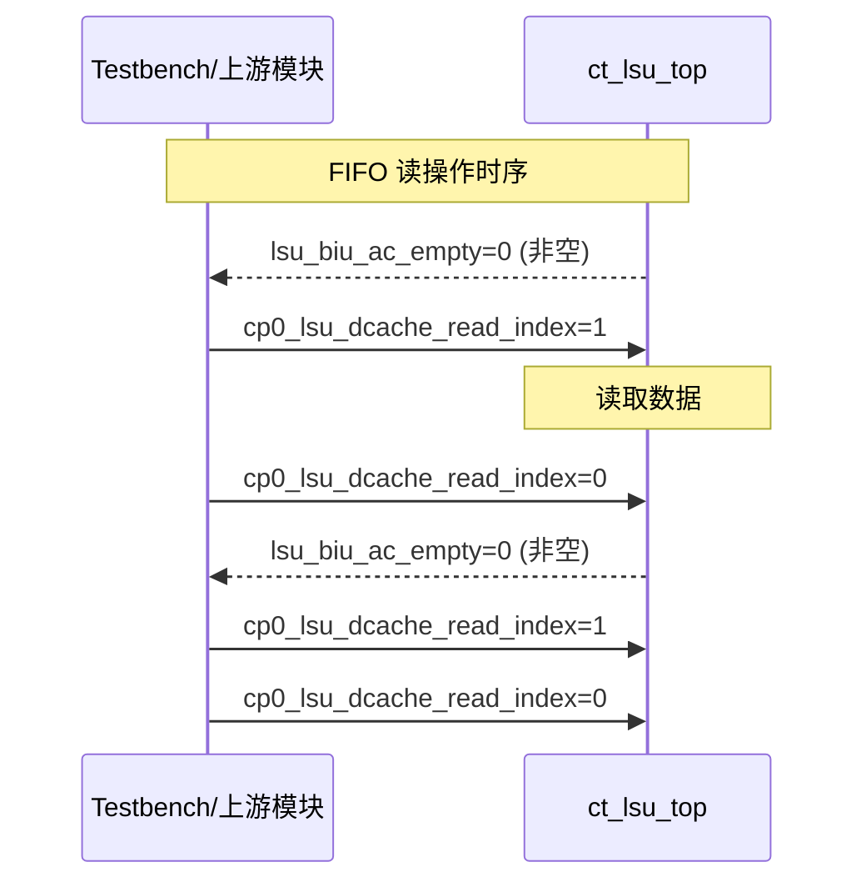
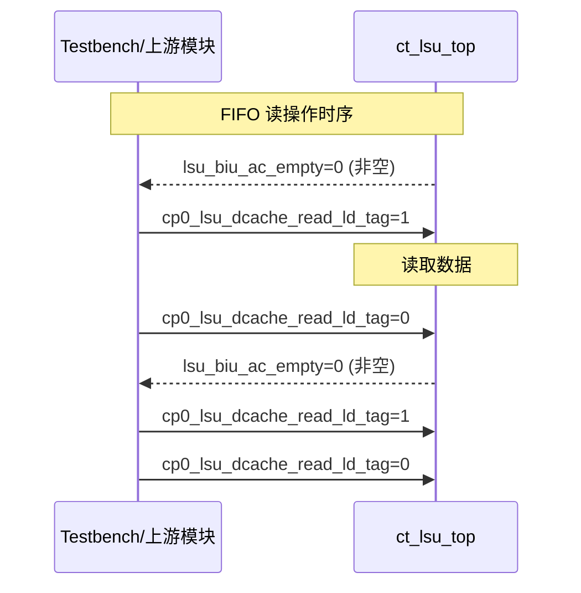
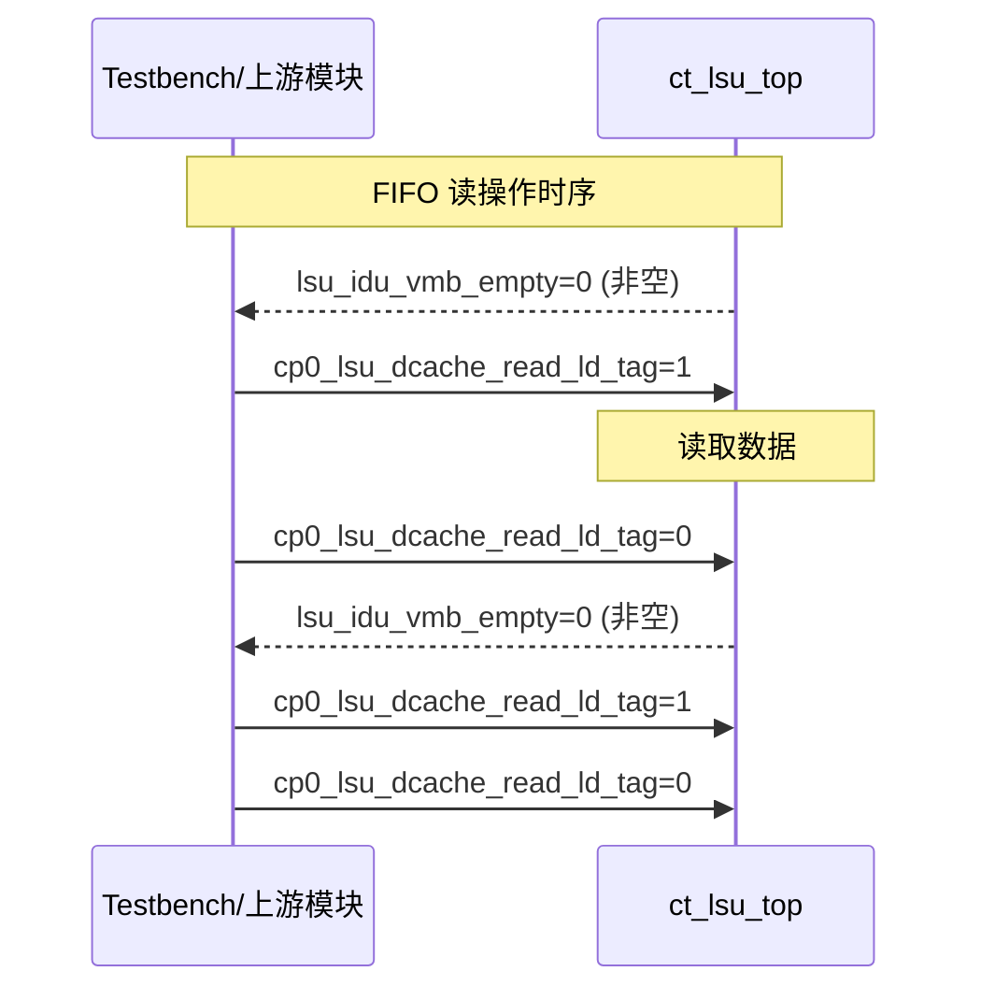
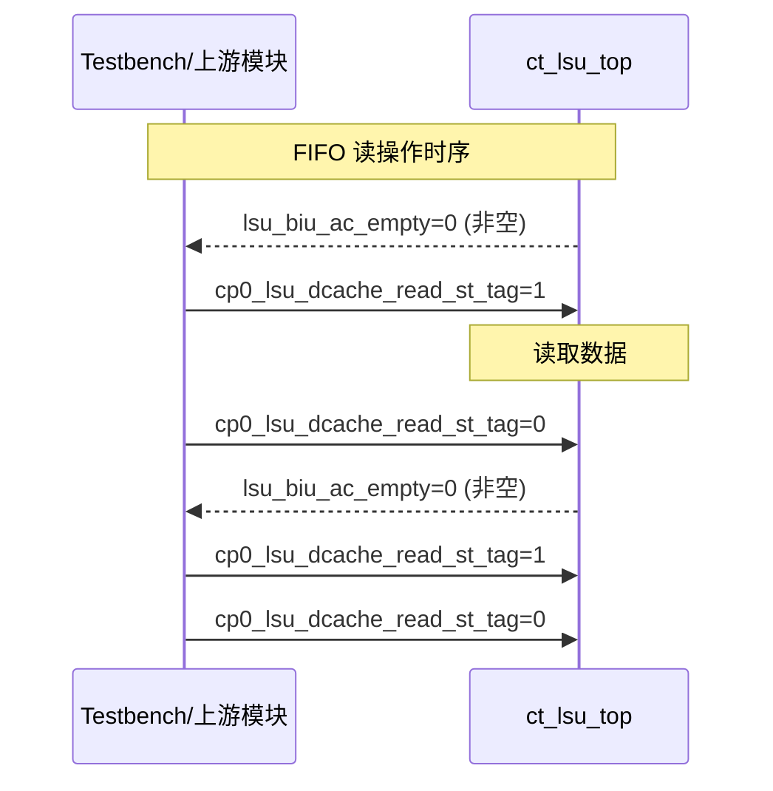
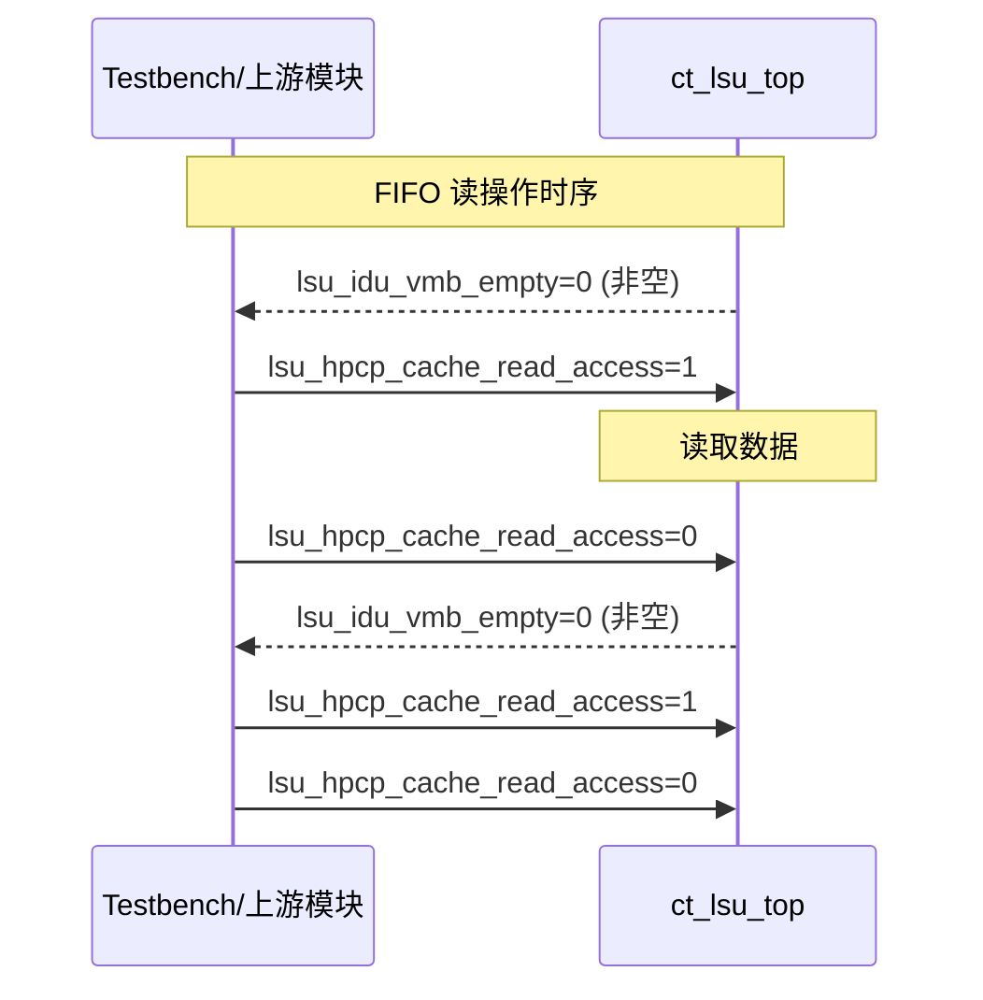
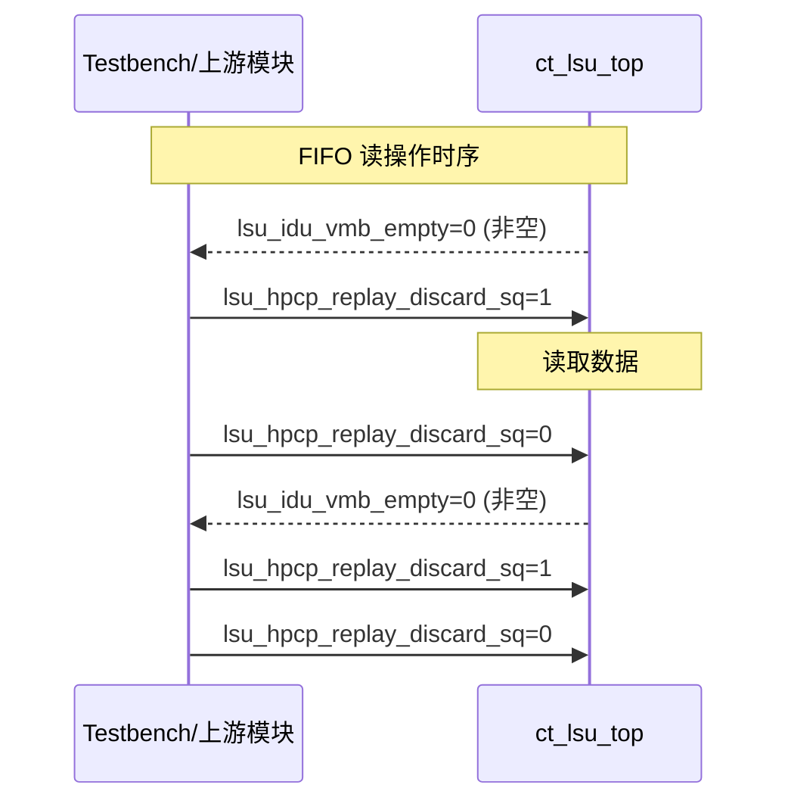

# ct_lsu_top 接口时序图

## 时序模式说明

| 模式类型 | 相关信号 | 描述 |
|----------|----------|------|
| fifo_read | cp0_lsu_dcache_read_index, lsu_biu_ac_empty | cp0_lsu_dcache_read_index 和 lsu_biu_ac_empty 构成 FIFO 读接口 |
| fifo_read | cp0_lsu_dcache_read_index, lsu_idu_vmb_empty | cp0_lsu_dcache_read_index 和 lsu_idu_vmb_empty 构成 FIFO 读接口 |
| fifo_read | cp0_lsu_dcache_read_ld_tag, lsu_biu_ac_empty | cp0_lsu_dcache_read_ld_tag 和 lsu_biu_ac_empty 构成 FIFO 读接口 |
| fifo_read | cp0_lsu_dcache_read_ld_tag, lsu_idu_vmb_empty | cp0_lsu_dcache_read_ld_tag 和 lsu_idu_vmb_empty 构成 FIFO 读接口 |
| fifo_read | cp0_lsu_dcache_read_st_tag, lsu_biu_ac_empty | cp0_lsu_dcache_read_st_tag 和 lsu_biu_ac_empty 构成 FIFO 读接口 |
| fifo_read | cp0_lsu_dcache_read_st_tag, lsu_idu_vmb_empty | cp0_lsu_dcache_read_st_tag 和 lsu_idu_vmb_empty 构成 FIFO 读接口 |
| fifo_read | cp0_lsu_dcache_read_way, lsu_biu_ac_empty | cp0_lsu_dcache_read_way 和 lsu_biu_ac_empty 构成 FIFO 读接口 |
| fifo_read | cp0_lsu_dcache_read_way, lsu_idu_vmb_empty | cp0_lsu_dcache_read_way 和 lsu_idu_vmb_empty 构成 FIFO 读接口 |
| fifo_read | lsu_hpcp_cache_read_access, lsu_biu_ac_empty | lsu_hpcp_cache_read_access 和 lsu_biu_ac_empty 构成 FIFO 读接口 |
| fifo_read | lsu_hpcp_cache_read_access, lsu_idu_vmb_empty | lsu_hpcp_cache_read_access 和 lsu_idu_vmb_empty 构成 FIFO 读接口 |
| fifo_read | lsu_hpcp_cache_read_miss, lsu_biu_ac_empty | lsu_hpcp_cache_read_miss 和 lsu_biu_ac_empty 构成 FIFO 读接口 |
| fifo_read | lsu_hpcp_cache_read_miss, lsu_idu_vmb_empty | lsu_hpcp_cache_read_miss 和 lsu_idu_vmb_empty 构成 FIFO 读接口 |
| fifo_read | lsu_hpcp_replay_discard_sq, lsu_biu_ac_empty | lsu_hpcp_replay_discard_sq 和 lsu_biu_ac_empty 构成 FIFO 读接口 |
| fifo_read | lsu_hpcp_replay_discard_sq, lsu_idu_vmb_empty | lsu_hpcp_replay_discard_sq 和 lsu_idu_vmb_empty 构成 FIFO 读接口 |

## 时序图 1: cp0_lsu_dcache_read_index 和 lsu_biu_ac_empty 构成 FIFO 读接口

### Mermaid 序列图

## 时序图 2: cp0_lsu_dcache_read_index 和 lsu_idu_vmb_empty 构成 FIFO 读接口

### Mermaid 序列图

## 时序图 3: cp0_lsu_dcache_read_ld_tag 和 lsu_biu_ac_empty 构成 FIFO 读接口

### Mermaid 序列图

## 时序图 4: cp0_lsu_dcache_read_ld_tag 和 lsu_idu_vmb_empty 构成 FIFO 读接口

### Mermaid 序列图

## 时序图 5: cp0_lsu_dcache_read_st_tag 和 lsu_biu_ac_empty 构成 FIFO 读接口

### Mermaid 序列图

## 时序图 6: cp0_lsu_dcache_read_st_tag 和 lsu_idu_vmb_empty 构成 FIFO 读接口

### Mermaid 序列图

## 时序图 7: cp0_lsu_dcache_read_way 和 lsu_biu_ac_empty 构成 FIFO 读接口

### Mermaid 序列图

## 时序图 8: cp0_lsu_dcache_read_way 和 lsu_idu_vmb_empty 构成 FIFO 读接口

### Mermaid 序列图

## 时序图 9: lsu_hpcp_cache_read_access 和 lsu_biu_ac_empty 构成 FIFO 读接口

### Mermaid 序列图

## 时序图 10: lsu_hpcp_cache_read_access 和 lsu_idu_vmb_empty 构成 FIFO 读接口

### Mermaid 序列图

## 时序图 11: lsu_hpcp_cache_read_miss 和 lsu_biu_ac_empty 构成 FIFO 读接口

### Mermaid 序列图

## 时序图 12: lsu_hpcp_cache_read_miss 和 lsu_idu_vmb_empty 构成 FIFO 读接口

### Mermaid 序列图

## 时序图 13: lsu_hpcp_replay_discard_sq 和 lsu_biu_ac_empty 构成 FIFO 读接口

### Mermaid 序列图

## 时序图 14: lsu_hpcp_replay_discard_sq 和 lsu_idu_vmb_empty 构成 FIFO 读接口

### Mermaid 序列图

