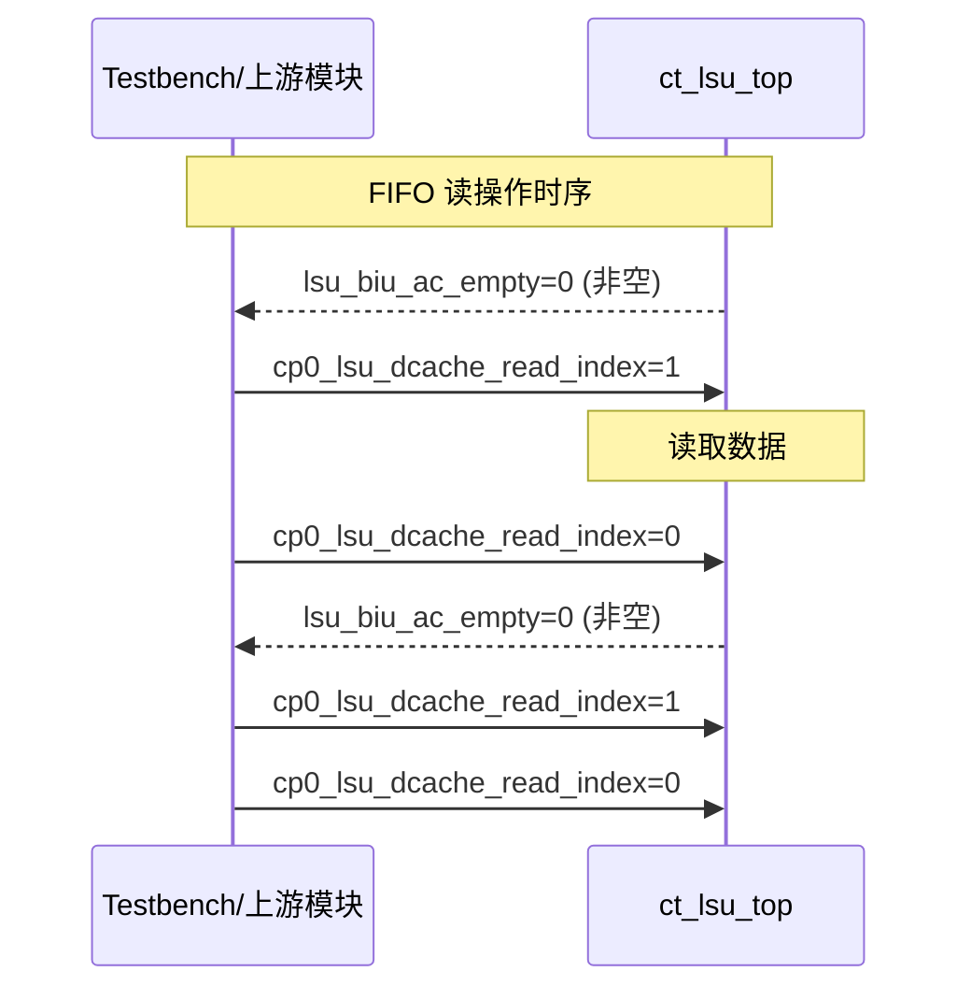

# ct_lsu_top 模块详细方案文档

## 1. 模块概述

### 1.1 基本信息

| 属性 | 值 |
|------|-----|
| 模块名称 | ct_lsu_top |
| 文件路径 | C910_RTL_FACTORY/gen_rtl/lsu/rtl/ct_lsu_top.v |
| 功能描述 | Load Store Unit (LSU) 顶层模块，负责处理所有加载和存储操作，包括数据缓存管理、地址转换、总线接口和预取功能 |

### 1.2 功能描述

ct_lsu_top 是 OpenC910 处理器的 Load Store Unit (LSU) 顶层模块，主要功能包括：

1. **加载/存储流水线处理**：
   - 支持 Pipe3 加载指令流水线（AG → DC → DA → WB）
   - 支持 Pipe4 存储地址计算流水线（AG → DC → DA → WB）
   - 支持 Pipe5 存储数据流水线

2. **数据缓存管理**：
   - 32KB 数据缓存，8路组相联
   - 支持 Cache 一致性协议（ACE）
   - 支持缓存失效和清除操作

3. **地址转换**：
   - 与 MMU 模块交互完成虚拟地址到物理地址的转换
   - 支持 TLB 缺失处理

4. **总线接口**：
   - AXI4 总线接口，支持读写操作
   - ACE 协议支持缓存一致性

5. **预取功能**：
   - L1 数据缓存预取
   - L2 缓存预取

6. **Snoop 处理**：
   - 支持缓存一致性 Snoop 操作
   - CTCQ (Coherence Transaction Completion Queue)
   - SNQ (Snoop Queue)

### 1.3 设计特点

- 支持乱序执行的加载存储操作
- 支持 Store Buffer 和 Write Merge Buffer
- 支持 Load Queue (LQ) 和 Store Queue (SQ)
- 支持向量加载存储指令
- 支持原子操作（AMO）
- 支持非对齐访问
- 支持 Fence 指令
- 支持调试和性能监控

## 2. 模块接口说明

### 2.1 输入端口

#### 2.1.1 总线接口输入信号

| 信号名 | 方向 | 位宽 | 描述 |
|--------|------|------|------|
| biu_lsu_ac_addr | input | 40 | ACE Snoop 地址 |
| biu_lsu_ac_prot | input | 3 | ACE Snoop 保护属性 |
| biu_lsu_ac_req | input | 1 | ACE Snoop 请求 |
| biu_lsu_ac_snoop | input | 4 | ACE Snoop 类型 |
| biu_lsu_ar_ready | input | 1 | AXI 读通道就绪 |
| biu_lsu_aw_vb_grnt | input | 1 | AXI 写地址通道授权（Victim Buffer） |
| biu_lsu_aw_wmb_grnt | input | 1 | AXI 写地址通道授权（Write Merge Buffer） |
| biu_lsu_b_id | input | 5 | AXI 写响应 ID |
| biu_lsu_b_resp | input | 2 | AXI 写响应 |
| biu_lsu_b_vld | input | 1 | AXI 写响应有效 |
| biu_lsu_cd_ready | input | 1 | ACE Snoop 数据就绪 |
| biu_lsu_cr_ready | input | 1 | ACE Snoop 响应就绪 |
| biu_lsu_r_data | input | 128 | AXI 读数据 |
| biu_lsu_r_id | input | 5 | AXI 读 ID |
| biu_lsu_r_last | input | 1 | AXI 读数据最后一拍 |
| biu_lsu_r_resp | input | 4 | AXI 读响应 |
| biu_lsu_r_vld | input | 1 | AXI 读数据有效 |
| biu_lsu_w_vb_grnt | input | 1 | AXI 写数据通道授权（Victim Buffer） |
| biu_lsu_w_wmb_grnt | input | 1 | AXI 写数据通道授权（Write Merge Buffer） |

#### 2.1.2 CP0 配置信号

| 信号名 | 方向 | 位宽 | 描述 |
|--------|------|------|------|
| cp0_lsu_amr | input | 1 | AMR 配置 |
| cp0_lsu_amr2 | input | 1 | AMR2 配置 |
| cp0_lsu_cb_aclr_dis | input | 1 | Cache Buffer 自动清除禁用 |
| cp0_lsu_corr_dis | input | 1 | 纠错禁用 |
| cp0_lsu_ctc_flush_dis | input | 1 | CTC 刷新禁用 |
| cp0_lsu_da_fwd_dis | input | 1 | DA 阶段前递禁用 |
| cp0_lsu_dcache_clr | input | 1 | 数据缓存清除 |
| cp0_lsu_dcache_en | input | 1 | 数据缓存使能 |
| cp0_lsu_dcache_inv | input | 1 | 数据缓存失效 |
| cp0_lsu_dcache_pref_dist | input | 2 | 数据缓存预取距离 |
| cp0_lsu_dcache_pref_en | input | 1 | 数据缓存预取使能 |
| cp0_lsu_dcache_read_index | input | 17 | 数据缓存读索引 |
| cp0_lsu_dcache_read_ld_tag | input | 1 | 数据缓存读加载标签 |
| cp0_lsu_dcache_read_req | input | 1 | 数据缓存读请求 |
| cp0_lsu_dcache_read_st_tag | input | 1 | 数据缓存读存储标签 |
| cp0_lsu_dcache_read_way | input | 1 | 数据缓存读路选择 |
| cp0_lsu_icg_en | input | 1 | 时钟门控使能 |
| cp0_lsu_l2_pref_dist | input | 2 | L2 预取距离 |
| cp0_lsu_l2_pref_en | input | 1 | L2 预取使能 |
| cp0_lsu_l2_st_pref_en | input | 1 | L2 存储预取使能 |
| cp0_lsu_mm | input | 1 | 内存管理使能 |
| cp0_lsu_no_op_req | input | 1 | 无操作请求 |
| cp0_lsu_nsfe | input | 1 | NSFE 配置 |
| cp0_lsu_pfu_mmu_dis | input | 1 | 预取单元 MMU 禁用 |
| cp0_lsu_timeout_cnt | input | 30 | 超时计数 |
| cp0_lsu_tvm | input | 1 | TVM 配置 |
| cp0_lsu_ucme | input | 1 | UCME 配置 |
| cp0_lsu_vstart | input | 7 | 向量起始位置 |
| cp0_lsu_wa | input | 1 | WA 配置 |
| cp0_lsu_wr_burst_dis | input | 1 | 写突发禁用 |
| cp0_yy_clk_en | input | 1 | 时钟使能 |
| cp0_yy_dcache_pref_en | input | 1 | 数据缓存预取使能 |
| cp0_yy_priv_mode | input | 2 | 特权模式 |
| cp0_yy_virtual_mode | input | 1 | 虚拟模式 |

#### 2.1.3 IDU 指令发射信号

| 信号名 | 方向 | 位宽 | 描述 |
|--------|------|------|------|
| idu_lsu_rf_pipe3_* | input | - | Pipe3 加载指令相关信号 |
| idu_lsu_rf_pipe4_* | input | - | Pipe4 存储地址指令相关信号 |
| idu_lsu_rf_pipe5_* | input | - | Pipe5 存储数据指令相关信号 |
| idu_lsu_vmb_create0_* | input | - | 向量存储 Buffer 创建0信号 |
| idu_lsu_vmb_create1_* | input | - | 向量存储 Buffer 创建1信号 |

#### 2.1.4 MMU 接口信号

| 信号名 | 方向 | 位宽 | 描述 |
|--------|------|------|------|
| mmu_lsu_access_fault0 | input | 1 | 访问错误0 |
| mmu_lsu_access_fault1 | input | 1 | 访问错误1 |
| mmu_lsu_buf0 | input | 1 | 缓冲属性0 |
| mmu_lsu_buf1 | input | 1 | 缓冲属性1 |
| mmu_lsu_ca0 | input | 1 | Cache 属性0 |
| mmu_lsu_ca1 | input | 1 | Cache 属性1 |
| mmu_lsu_pa0 | input | 28 | 物理地址0 |
| mmu_lsu_pa0_vld | input | 1 | 物理地址0 有效 |
| mmu_lsu_pa1 | input | 28 | 物理地址1 |
| mmu_lsu_pa1_vld | input | 1 | 物理地址1 有效 |
| mmu_lsu_page_fault0 | input | 1 | 页错误0 |
| mmu_lsu_page_fault1 | input | 1 | 页错误1 |
| mmu_lsu_sec0 | input | 1 | 安全属性0 |
| mmu_lsu_sec1 | input | 1 | 安全属性1 |
| mmu_lsu_sh0 | input | 1 | 共享属性0 |
| mmu_lsu_sh1 | input | 1 | 共享属性1 |
| mmu_lsu_stall0 | input | 1 | 停顿0 |
| mmu_lsu_stall1 | input | 1 | 停顿1 |
| mmu_lsu_tlb_busy | input | 1 | TLB 忙 |
| mmu_lsu_tlb_inv_done | input | 1 | TLB 失效完成 |

#### 2.1.5 RTU 提交信号

| 信号名 | 方向 | 位宽 | 描述 |
|--------|------|------|------|
| rtu_lsu_async_flush | input | 1 | 异步刷新 |
| rtu_lsu_commit*_iid_updt_val | input | 7 | 提交 IID 更新值 |
| rtu_lsu_eret_flush | input | 1 | ERET 刷新 |
| rtu_lsu_expt_flush | input | 1 | 异常刷新 |
| rtu_lsu_spec_fail_flush | input | 1 | Spec 失败刷新 |
| rtu_yy_xx_commit* | input | 1 | 提交信号 |
| rtu_yy_xx_dbgon | input | 1 | 调试模式 |
| rtu_yy_xx_flush | input | 1 | 刷新信号 |

#### 2.1.6 其他输入信号

| 信号名 | 方向 | 位宽 | 描述 |
|--------|------|------|------|
| cpurst_b | input | 1 | 复位信号（低有效） |
| forever_cpuclk | input | 1 | CPU 时钟 |
| had_lsu_* | input | - | HAD 调试相关信号 |
| hpcp_lsu_cnt_en | input | 1 | HPCP 计数使能 |
| ifu_lsu_icache_inv_done | input | 1 | I-Cache 失效完成 |
| pad_yy_icg_scan_en | input | 1 | 扫描使能 |

### 2.2 输出端口

#### 2.2.1 总线接口输出信号

| 信号名 | 方向 | 位宽 | 描述 |
|--------|------|------|------|
| lsu_biu_ac_empty | output | 1 | ACE Snoop 队列空 |
| lsu_biu_ac_ready | output | 1 | ACE Snoop 就绪 |
| lsu_biu_ar_addr | output | 40 | AXI 读地址 |
| lsu_biu_ar_bar | output | 2 | AXI 读屏障 |
| lsu_biu_ar_burst | output | 2 | AXI 读突发类型 |
| lsu_biu_ar_cache | output | 4 | AXI 读缓存属性 |
| lsu_biu_ar_domain | output | 2 | AXI 读域 |
| lsu_biu_ar_dp_req | output | 1 | AXI 读数据路径请求 |
| lsu_biu_ar_id | output | 5 | AXI 读 ID |
| lsu_biu_ar_len | output | 2 | AXI 读长度 |
| lsu_biu_ar_lock | output | 1 | AXI 读锁定 |
| lsu_biu_ar_prot | output | 3 | AXI 读保护 |
| lsu_biu_ar_req | output | 1 | AXI 读请求 |
| lsu_biu_ar_size | output | 3 | AXI 读大小 |
| lsu_biu_ar_snoop | output | 4 | AXI 读 Snoop |
| lsu_biu_ar_user | output | 3 | AXI 读用户信号 |
| lsu_biu_aw_st_* | output | - | AXI 写地址通道（Store） |
| lsu_biu_aw_vict_* | output | - | AXI 写地址通道（Victim） |
| lsu_biu_cd_data | output | 128 | ACE Snoop 数据 |
| lsu_biu_cd_last | output | 1 | ACE Snoop 数据最后一拍 |
| lsu_biu_cd_valid | output | 1 | ACE Snoop 数据有效 |
| lsu_biu_cr_resp | output | 5 | ACE Snoop 响应 |
| lsu_biu_cr_valid | output | 1 | ACE Snoop 响应有效 |
| lsu_biu_r_linefill_ready | output | 1 | 行填充就绪 |
| lsu_biu_w_st_* | output | - | AXI 写数据通道（Store） |
| lsu_biu_w_vict_* | output | - | AXI 写数据通道（Victim） |

#### 2.2.2 IDU 反馈信号

| 信号名 | 方向 | 位宽 | 描述 |
|--------|------|------|------|
| lsu_idu_ag_pipe3_load_inst_vld | output | 1 | AG 阶段加载指令有效 |
| lsu_idu_ag_pipe3_preg_dup* | output | 7 | AG 阶段物理寄存器 |
| lsu_idu_ag_pipe3_vload_inst_vld | output | 1 | AG 阶段向量加载指令有效 |
| lsu_idu_da_pipe3_fwd_* | output | - | DA 阶段前递信号 |
| lsu_idu_dc_pipe3_* | output | - | DC 阶段反馈信号 |
| lsu_idu_lq_full | output | 12 | 加载队列满 |
| lsu_idu_rb_full | output | 12 | 重放 Buffer 满 |
| lsu_idu_sq_full | output | 12 | 存储队列满 |
| lsu_idu_tlb_busy | output | 12 | TLB 忙 |
| lsu_idu_vmb_* | output | - | 向量存储 Buffer 状态 |
| lsu_idu_wb_pipe3_* | output | - | WB 阶段反馈信号 |

#### 2.2.3 RTU 提交信号

| 信号名 | 方向 | 位宽 | 描述 |
|--------|------|------|------|
| lsu_rtu_all_commit_data_vld | output | 1 | 所有提交数据有效 |
| lsu_rtu_async_expt_* | output | - | 异步异常信号 |
| lsu_rtu_ctc_flush_vld | output | 1 | CTC 刷新有效 |
| lsu_rtu_da_pipe*_split_spec_fail_* | output | - | DA 阶段 Spec 失败信号 |
| lsu_rtu_wb_pipe*_cmplt | output | 1 | WB 阶段完成 |
| lsu_rtu_wb_pipe*_expt_* | output | - | WB 阶段异常信号 |

#### 2.2.4 MMU 接口信号

| 信号名 | 方向 | 位宽 | 描述 |
|--------|------|------|------|
| lsu_mmu_abort* | output | 1 | 中止信号 |
| lsu_mmu_bus_error | output | 1 | 总线错误 |
| lsu_mmu_data | output | 64 | 数据 |
| lsu_mmu_data_vld | output | 1 | 数据有效 |
| lsu_mmu_id* | output | 7 | ID |
| lsu_mmu_st_inst* | output | 1 | 存储指令 |
| lsu_mmu_stamo_* | output | - | 原子操作信号 |
| lsu_mmu_tlb_* | output | - | TLB 操作信号 |
| lsu_mmu_va* | output | - | 虚拟地址信号 |

#### 2.2.5 其他输出信号

| 信号名 | 方向 | 位宽 | 描述 |
|--------|------|------|------|
| lsu_cp0_dcache_done | output | 1 | 数据缓存操作完成 |
| lsu_cp0_dcache_read_data | output | 128 | 数据缓存读数据 |
| lsu_cp0_dcache_read_data_vld | output | 1 | 数据缓存读数据有效 |
| lsu_had_debug_info | output | 184 | 调试信息 |
| lsu_had_ld_* | output | - | 加载调试信号 |
| lsu_had_st_* | output | - | 存储调试信号 |
| lsu_hpcp_* | output | - | 性能计数器信号 |
| lsu_ifu_icache_* | output | - | I-Cache 控制信号 |
| lsu_yy_xx_no_op | output | 1 | 无操作 |

## 3. 模块框图

### 3.1 模块架构图

```mermaid
graph TB
    subgraph ct_lsu_top["ct_lsu_top"]
        subgraph x_ct_lsu_ld_ag["ct_lsu_ld_ag"]
            x_lsu_ld_ag_gated_clk["gated_clk_cell"]
            x_lsu_rf_compare_ld_ag_iid["ct_rtu_compare_iid"]
            x_lsu_ld_ag_compare_st_ag_iid["ct_rtu_compare_iid"]
        end
        subgraph x_ct_lsu_st_ag["ct_lsu_st_ag"]
            x_lsu_st_ag_gated_clk["gated_clk_cell"]
            x_lsu_rf_compare_st_ag_iid["ct_rtu_compare_iid"]
        end
        subgraph x_ct_lsu_sd_ex1["ct_lsu_sd_ex1"]
            x_lsu_sd_ex1_gated_clk["gated_clk_cell"]
            x_lsu_sd_ex1_data_gated_clk["gated_clk_cell"]
            x_lsu_sd_ex1_vdata_gated_clk["gated_clk_cell"]
        end
        subgraph x_ct_lsu_mcic["ct_lsu_mcic"]
            x_lsu_mcic_gated_clk["gated_clk_cell"]
        end
        subgraph x_ct_lsu_dcache_arb["ct_lsu_dcache_arb"]
            x_lsu_dcache_serial_clk_en["gated_clk_cell"]
        end
        subgraph x_ct_lsu_dcache_top["ct_lsu_dcache_top"]
            x_ct_lsu_dcache_ld_tag_array["ct_lsu_dcache_ld_tag_array"]
            x_ct_lsu_dcache_st_tag_array["ct_lsu_dcache_tag_array"]
            x_ct_lsu_dcache_st_dirty_array["ct_lsu_dcache_dirty_array"]
        end
        subgraph x_ct_lsu_ld_dc["ct_lsu_ld_dc"]
            x_lsu_ld_dc_gated_clk["gated_clk_cell"]
        end
        subgraph x_ct_lsu_st_dc["ct_lsu_st_dc"]
            x_lsu_st_dc_gated_clk["gated_clk_cell"]
        end
        subgraph x_ct_lsu_lq["ct_lsu_lq"]
            x_lsu_lq_gated_clk["gated_clk_cell"]
        end
        subgraph x_ct_lsu_sq["ct_lsu_sq"]
            x_lsu_sq_gated_clk["gated_clk_cell"]
        end
        more_ct_lsu_top["... (22 more)"]
    end
    x_ct_lsu_ld_ag -->|data| x_ct_lsu_st_ag
    x_ct_lsu_st_ag -->|data| x_ct_lsu_sd_ex1
    x_ct_lsu_sd_ex1 -->|data| x_ct_lsu_mcic
    x_ct_lsu_mcic -->|data| x_ct_lsu_dcache_arb
    x_ct_lsu_dcache_arb -->|data| x_ct_lsu_dcache_top
    x_ct_lsu_dcache_top -->|data| x_ct_lsu_ld_dc
    x_ct_lsu_ld_dc -->|data| x_ct_lsu_st_dc
    x_ct_lsu_st_dc -->|data| x_ct_lsu_lq
    x_ct_lsu_lq -->|data| x_ct_lsu_sq
    input_biu_lsu_ac_req["biu_lsu_ac_req"]
    input_biu_lsu_ac_req --> ct_lsu_top
    output_lsu_biu_ac_empty["lsu_biu_ac_empty"]
    ct_lsu_top --> output_lsu_biu_ac_empty
```



### 3.2 主要数据连线

| 源模块 | 信号名 | 位宽 | 目标模块 |
|--------|--------|------|----------|
| ct_lsu_top | ag_dcache_arb_ld_data_gateclk_en | - | x_ct_lsu_ld_ag |
| ct_lsu_top | ag_dcache_arb_st_dirty_gateclk_en | - | x_ct_lsu_st_ag |
| ct_lsu_top | cp0_lsu_icg_en | - | x_ct_lsu_sd_ex1 |
| ct_lsu_top | biu_lsu_r_data | 128 | x_ct_lsu_mcic |
| ct_lsu_top | ag_dcache_arb_ld_data_gateclk_en | - | x_ct_lsu_dcache_arb |
| ct_lsu_top | cp0_lsu_icg_en | - | x_ct_lsu_dcache_top |
| ct_lsu_top | cb_ld_dc_addr_hit | - | x_ct_lsu_ld_dc |
| ct_lsu_top | cp0_lsu_dcache_en | - | x_ct_lsu_st_dc |
| ct_lsu_top | cp0_lsu_corr_dis | - | x_ct_lsu_lq |
| ct_lsu_top | cp0_lsu_icg_en | - | x_ct_lsu_sq |

## 4. 模块实现方案

### 4.1 流水线设计

#### 4.1.1 流水线概述

LSU 采用多级流水线设计，支持加载和存储操作的并行处理：

| 流水线 | 执行单元 | 级数 | 支持指令 |
|--------|----------|------|----------|
| Pipe3 | Load Pipeline | 4级 (AG→DC→DA→WB) | 加载指令、原子指令 |
| Pipe4 | Store Address Pipeline | 4级 (AG→DC→DA→WB) | 存储地址计算、Fence指令 |
| Pipe5 | Store Data Pipeline | 1级 (EX1) | 存储数据处理 |

#### 4.1.2 各流水线详细说明

**Pipe3 - Load Pipeline:**

```
AG (Address Generation) → DC (Data Cache) → DA (Data Alignment) → WB (Write Back)
```

- **AG 阶段**：地址计算、TLB 查询、依赖检查
- **DC 阶段**：数据缓存访问、前递检查
- **DA 阶段**：数据对齐、符号扩展、异常处理
- **WB 阶段**：结果写回、前递

**Pipe4 - Store Address Pipeline:**

```
AG (Address Generation) → DC (Data Cache) → DA (Data Alignment) → WB (Write Back)
```

- **AG 阶段**：地址计算、TLB 查询
- **DC 阶段**：地址检查、队列分配
- **DA 阶段**：地址对齐、异常处理
- **WB 阶段**：地址提交

**Pipe5 - Store Data Pipeline:**

```
EX1 (Execute 1)
```

- **EX1 阶段**：存储数据处理、数据对齐

### 4.2 关键逻辑描述

#### 4.2.1 加载操作处理

1. 从 IDU 接收加载指令
2. AG 阶段计算地址并进行 TLB 转换
3. DC 阶段访问数据缓存
4. DA 阶段处理数据对齐和前递
5. WB 阶段写回结果

#### 4.2.2 存储操作处理

1. 从 IDU 接收存储指令
2. Pipe4 处理地址计算
3. Pipe5 处理存储数据
4. 数据写入 Store Queue
5. 提交后写入 Write Merge Buffer
6. 通过总线写入内存

#### 4.2.3 缓存一致性处理

1. 支持 ACE 协议
2. 处理 Snoop 请求
3. 维护缓存状态一致性
4. 支持 Cache 维护操作

### 4.3 数据前递机制

| 前递路径 | 源阶段 | 目标阶段 | 说明 |
|----------|--------|----------|------|
| Load-Load Forward | DA/DC | AG | 加载到加载前递 |
| Store-Load Forward | SQ/WMB | DC | 存储到加载前递 |
| Store-Store Forward | WMB | DC | 存储到存储前递 |

### 4.4 流水线控制信号

| 信号 | 说明 |
|------|------|
| stall | 流水线暂停 |
| flush | 流水线刷新 |
| bypass | 旁路控制 |
| replay | 重放控制 |

## 5. 接口时序图

### 5.1 FIFO 读操作时序



## 6. 内部关键信号列表

### 6.1 寄存器信号

| 信号名 | 位宽 | 描述 |
|--------|------|------|
| ld_ag_* | - | 加载 AG 阶段寄存器 |
| ld_dc_* | - | 加载 DC 阶段寄存器 |
| ld_da_* | - | 加载 DA 阶段寄存器 |
| ld_wb_* | - | 加载 WB 阶段寄存器 |
| st_ag_* | - | 存储 AG 阶段寄存器 |
| st_dc_* | - | 存储 DC 阶段寄存器 |
| st_da_* | - | 存储 DA 阶段寄存器 |
| st_wb_* | - | 存储 WB 阶段寄存器 |

### 6.2 线网信号

| 信号名 | 位宽 | 描述 |
|--------|------|------|
| dcache_* | - | 数据缓存接口信号 |
| biu_* | - | 总线接口信号 |
| mmu_* | - | MMU 接口信号 |
| idu_* | - | IDU 接口信号 |
| rtu_* | - | RTU 接口信号 |

## 7. 子模块方案

### 7.1 模块例化层次结构

| 层级 | 模块名 | 实例名 | 功能描述 |
|------|--------|--------|----------|
| 0 | ct_lsu_top | ct_lsu_top | LSU 顶层模块 |
| 1 | ct_lsu_ld_ag | x_ct_lsu_ld_ag | 加载地址生成 |
| 1 | ct_lsu_st_ag | x_ct_lsu_st_ag | 存储地址生成 |
| 1 | ct_lsu_sd_ex1 | x_ct_lsu_sd_ex1 | 存储数据执行 |
| 1 | ct_lsu_mcic | x_ct_lsu_mcic | 多缓存一致性控制 |
| 1 | ct_lsu_dcache_arb | x_ct_lsu_dcache_arb | 数据缓存仲裁 |
| 1 | ct_lsu_dcache_top | x_ct_lsu_dcache_top | 数据缓存顶层 |
| 1 | ct_lsu_ld_dc | x_ct_lsu_ld_dc | 加载数据缓存访问 |
| 1 | ct_lsu_st_dc | x_ct_lsu_st_dc | 存储数据缓存访问 |
| 1 | ct_lsu_lq | x_ct_lsu_lq | 加载队列 |
| 1 | ct_lsu_sq | x_ct_lsu_sq | 存储队列 |
| 1 | ct_lsu_ld_da | x_ct_lsu_ld_da | 加载数据对齐 |
| 1 | ct_lsu_st_da | x_ct_lsu_st_da | 存储数据对齐 |
| 1 | ct_lsu_rb | x_ct_lsu_rb | 重放 Buffer |
| 1 | ct_lsu_wmb | x_ct_lsu_wmb | 写合并 Buffer |
| 1 | ct_lsu_wmb_ce | x_ct_lsu_wmb_ce | 写合并 Buffer 控制 |
| 1 | ct_lsu_ld_wb | x_ct_lsu_ld_wb | 加载写回 |
| 1 | ct_lsu_st_wb | x_ct_lsu_st_wb | 存储写回 |
| 1 | ct_lsu_lfb | x_ct_lsu_lfb | 行填充 Buffer |
| 1 | ct_lsu_vb | x_ct_lsu_vb | 驱逐 Buffer |
| 1 | ct_lsu_vb_sdb_data | x_ct_lsu_vb_sdb_data | 驱逐 Buffer 数据 |
| 1 | ct_lsu_snoop_req_arbiter | x_ct_lsu_snoop_req_arbiter | Snoop 请求仲裁 |
| 1 | ct_lsu_snoop_resp | x_ct_lsu_snoop_resp | Snoop 响应 |
| 1 | ct_lsu_snoop_ctcq | x_ct_lsu_snoop_ctcq | Snoop CTCQ |
| 1 | ct_lsu_snoop_snq | x_ct_lsu_snoop_snq | Snoop SNQ |
| 1 | ct_lsu_lm | x_ct_lsu_lm | 锁定机制 |
| 1 | ct_lsu_amr | x_ct_lsu_amr | AMR 控制 |
| 1 | ct_lsu_icc | x_ct_lsu_icc | 指令缓存一致性 |
| 1 | ct_lsu_ctrl | x_ct_lsu_ctrl | LSU 控制 |
| 1 | ct_lsu_bus_arb | x_ct_lsu_bus_arb | 总线仲裁 |
| 1 | ct_lsu_pfu | x_ct_lsu_pfu | 预取单元 |
| 1 | ct_lsu_cache_buffer | x_ct_lsu_cache_buffer | 缓存 Buffer |
| 1 | ct_lsu_spec_fail_predict | x_ct_lsu_spec_fail_predict | Spec 失败预测 |

### 7.2 子模块功能说明

#### 7.2.1 ct_lsu_ld_ag (加载地址生成)

负责加载指令的地址生成阶段处理，包括：
- 基地址和偏移量计算
- TLB 地址转换请求
- 依赖检查和前递

#### 7.2.2 ct_lsu_st_ag (存储地址生成)

负责存储指令的地址生成阶段处理，包括：
- 基地址和偏移量计算
- TLB 地址转换请求
- Fence 指令处理

#### 7.2.3 ct_lsu_dcache_top (数据缓存)

32KB 数据缓存，包括：
- 8路组相联结构
- Tag Array、Dirty Array、Data Array
- 支持 ECC 纠错
- 支持 Cache 维护操作

#### 7.2.4 ct_lsu_lq (加载队列)

加载队列管理，包括：
- 16 个条目
- 支持乱序完成
- 支持依赖追踪

#### 7.2.5 ct_lsu_sq (存储队列)

存储队列管理，包括：
- 16 个条目
- 支持存储转发
- 支持原子操作

#### 7.2.6 ct_lsu_wmb (写合并 Buffer)

写合并 Buffer 管理，包括：
- 合并连续写操作
- 支持突发写
- 提高总线效率

#### 7.2.7 ct_lsu_pfu (预取单元)

预取单元，包括：
- L1 数据缓存预取
- L2 缓存预取
- 自适应预取算法

## 8. 可测试性设计

### 8.1 测试信号

| 信号名 | 方向 | 位宽 | 描述 |
|--------|------|------|------|
| had_lsu_dbg_en | input | 1 | 调试使能 |
| had_lsu_bus_trace_en | input | 1 | 总线跟踪使能 |
| lsu_had_debug_info | output | 184 | 调试信息 |

### 8.2 调试接口

- 支持加载/存储地址观察
- 支持数据观察
- 支持状态机状态监控

### 8.3 扫描链支持

- 支持全扫描设计
- 支持时钟门控扫描

## 9. 修订历史

| 版本 | 日期 | 作者 | 说明 |
|------|------|------|------|
| 1.0 | 2026-03-13 | Auto-generated | 初始版本，基于 RTL 自动生成 |
