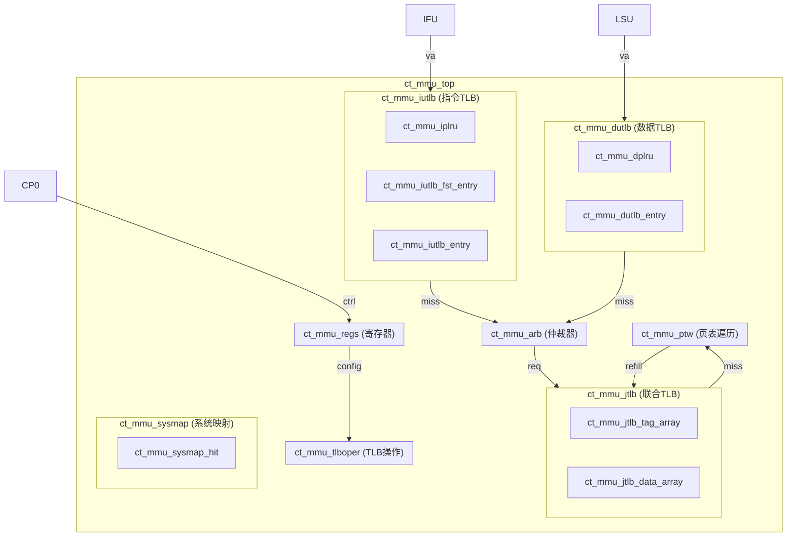
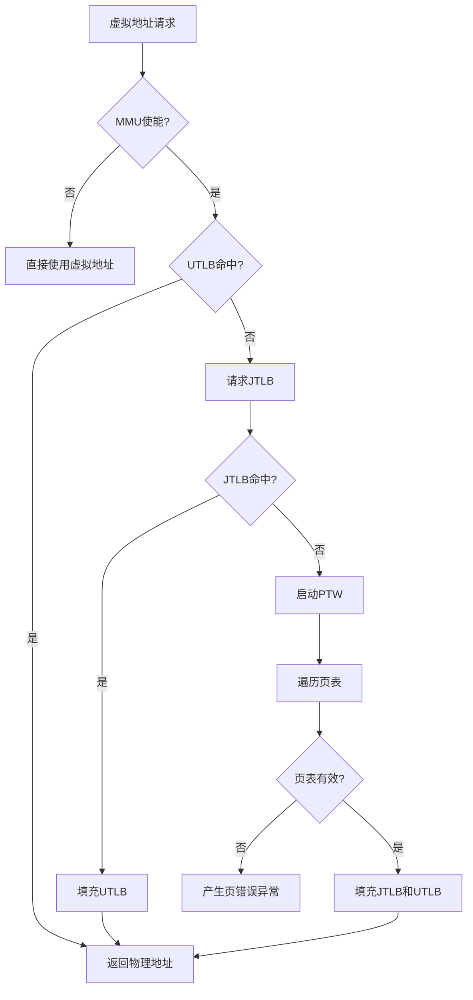

# ct_mmu_top 模块详细方案文档

## 1. 模块概述

### 1.1 基本信息

| 属性 | 值 |
|------|-----|
| 模块名称 | ct_mmu_top |
| 文件路径 | C910_RTL_FACTORY/gen_rtl/mmu/rtl/ct_mmu_top.v |
| 功能分类 | 内存管理单元 (MMU) |

### 1.2 功能描述

ct_mmu_top 是 OpenC910 处理器的内存管理单元（MMU）顶层模块，负责虚拟地址到物理地址的转换、内存访问权限检查以及 TLB（Translation Lookaside Buffer）管理。该模块实现了 RISC-V Sv39/Sv48 虚拟内存管理机制，支持多级页表遍历和 TLB 操作指令。

### 1.3 设计特点

- 支持 RISC-V Sv39/Sv48 虚拟地址模式
- 分离的指令 TLB (IUTLB) 和数据 TLB (DUTLB)
- 统一的联合 TLB (JTLB) 用于 TLB 缺失处理
- 硬件页表遍历 (PTW) 支持
- 支持多种页面大小：4KB、2MB、1GB
- TLB 操作指令支持：TLBR、TLBWI、TLBWR、TLBP、TLBIAL等
- 系统地址映射 (SYSMAP) 支持
- 性能计数器支持

## 2. 模块接口说明

### 2.1 输入端口

| 信号名 | 方向 | 位宽 | 描述 |
|--------|------|------|------|
| biu_mmu_smp_disable | input | 1 | SMP 禁用信号 |
| cp0_mmu_cskyee | input | 1 | CSKY 扩展使能 |
| cp0_mmu_icg_en | input | 1 | 时钟门控使能 |
| cp0_mmu_maee | input | 1 | MAEE 扩展使能 |
| cp0_mmu_mpp | input | 2 | 机器模式之前的特权模式 |
| cp0_mmu_mprv | input | 1 | 内存特权修改位 |
| cp0_mmu_mxr | input | 1 | 可执行权限修改位 |
| cp0_mmu_no_op_req | input | 1 | 无操作请求 |
| cp0_mmu_ptw_en | input | 1 | PTW 使能 |
| cp0_mmu_reg_num | input | 2 | 寄存器编号 |
| cp0_mmu_satp_sel | input | 1 | SATP 选择 |
| cp0_mmu_sum | input | 1 | 用户模式访问使能 |
| cp0_mmu_tlb_all_inv | input | 1 | TLB 全局无效化 |
| cp0_mmu_wdata | input | 64 | CP0 写数据 |
| cp0_mmu_wreg | input | 1 | CP0 写寄存器使能 |
| cp0_yy_priv_mode | input | 2 | 当前特权模式 |
| cpurst_b | input | 1 | 复位信号（低有效） |
| forever_cpuclk | input | 1 | CPU 时钟 |
| hpcp_mmu_cnt_en | input | 1 | 性能计数器使能 |
| ifu_mmu_abort | input | 1 | IFU 中止请求 |
| ifu_mmu_va | input | 63 | IFU 虚拟地址 |
| ifu_mmu_va_vld | input | 1 | IFU 虚拟地址有效 |
| lsu_mmu_abort0 | input | 1 | LSU 中止请求0 |
| lsu_mmu_abort1 | input | 1 | LSU 中止请求1 |
| lsu_mmu_bus_error | input | 1 | 总线错误 |
| lsu_mmu_data | input | 64 | LSU 数据 |
| lsu_mmu_data_vld | input | 1 | LSU 数据有效 |
| lsu_mmu_id0 | input | 7 | LSU ID0 |
| lsu_mmu_id1 | input | 7 | LSU ID1 |
| lsu_mmu_st_inst0 | input | 1 | 存储指令0 |
| lsu_mmu_st_inst1 | input | 1 | 存储指令1 |
| lsu_mmu_stamo_pa | input | 28 | 原子操作物理地址 |
| lsu_mmu_stamo_vld | input | 1 | 原子操作有效 |
| lsu_mmu_tlb_all_inv | input | 1 | LSU TLB 全局无效化 |
| lsu_mmu_tlb_asid | input | 16 | TLB ASID |
| lsu_mmu_tlb_asid_all_inv | input | 1 | ASID 全局无效化 |
| lsu_mmu_tlb_va | input | 27 | TLB 虚拟地址 |
| lsu_mmu_tlb_va_all_inv | input | 1 | VA 全局无效化 |
| lsu_mmu_tlb_va_asid_inv | input | 1 | VA+ASID 无效化 |
| lsu_mmu_va0 | input | 64 | LSU 虚拟地址0 |
| lsu_mmu_va0_vld | input | 1 | LSU VA0 有效 |
| lsu_mmu_va1 | input | 64 | LSU 虚拟地址1 |
| lsu_mmu_va1_vld | input | 1 | LSU VA1 有效 |
| lsu_mmu_va2 | input | 28 | LSU 虚拟地址2 |
| lsu_mmu_va2_vld | input | 1 | LSU VA2 有效 |
| lsu_mmu_vabuf0 | input | 28 | LSU VA 缓冲0 |
| lsu_mmu_vabuf1 | input | 28 | LSU VA 缓冲1 |
| pad_yy_icg_scan_en | input | 1 | 扫描使能 |
| pmp_mmu_flg0 | input | 4 | PMP 标志0 |
| pmp_mmu_flg1 | input | 4 | PMP 标志1 |
| pmp_mmu_flg2 | input | 4 | PMP 标志2 |
| pmp_mmu_flg3 | input | 4 | PMP 标志3 |
| pmp_mmu_flg4 | input | 4 | PMP 标志4 |
| rtu_mmu_bad_vpn | input | 27 | 错误 VPN |
| rtu_mmu_expt_vld | input | 1 | 异常有效 |
| rtu_yy_xx_flush | input | 1 | 流水线冲刷 |

### 2.2 输出端口

| 信号名 | 方向 | 位宽 | 描述 |
|--------|------|------|------|
| mmu_cp0_cmplt | output | 1 | CP0 操作完成 |
| mmu_cp0_data | output | 64 | CP0 读数据 |
| mmu_cp0_satp_data | output | 64 | SATP 数据 |
| mmu_cp0_tlb_done | output | 1 | TLB 操作完成 |
| mmu_had_debug_info | output | 34 | 调试信息 |
| mmu_hpcp_dutlb_miss | output | 1 | DUTLB 缺失 |
| mmu_hpcp_iutlb_miss | output | 1 | IUTLB 缺失 |
| mmu_hpcp_jtlb_miss | output | 1 | JTLB 缺失 |
| mmu_ifu_buf | output | 1 | IFU 缓冲属性 |
| mmu_ifu_ca | output | 1 | IFU 缓存属性 |
| mmu_ifu_deny | output | 1 | IFU 拒绝访问 |
| mmu_ifu_pa | output | 28 | IFU 物理地址 |
| mmu_ifu_pavld | output | 1 | IFU PA 有效 |
| mmu_ifu_pgflt | output | 1 | IFU 页错误 |
| mmu_ifu_sec | output | 1 | IFU 安全属性 |
| mmu_lsu_access_fault0 | output | 1 | LSU 访问错误0 |
| mmu_lsu_access_fault1 | output | 1 | LSU 访问错误1 |
| mmu_lsu_buf0 | output | 1 | LSU 缓冲属性0 |
| mmu_lsu_buf1 | output | 1 | LSU 缓冲属性1 |
| mmu_lsu_ca0 | output | 1 | LSU 缓存属性0 |
| mmu_lsu_ca1 | output | 1 | LSU 缓存属性1 |
| mmu_lsu_data_req | output | 1 | LSU 数据请求 |
| mmu_lsu_data_req_addr | output | 40 | LSU 数据请求地址 |
| mmu_lsu_data_req_size | output | 1 | LSU 数据请求大小 |
| mmu_lsu_mmu_en | output | 1 | MMU 使能 |
| mmu_lsu_pa0 | output | 28 | LSU 物理地址0 |
| mmu_lsu_pa0_vld | output | 1 | LSU PA0 有效 |
| mmu_lsu_pa1 | output | 28 | LSU 物理地址1 |
| mmu_lsu_pa1_vld | output | 1 | LSU PA1 有效 |
| mmu_lsu_pa2 | output | 28 | LSU 物理地址2 |
| mmu_lsu_pa2_err | output | 1 | LSU PA2 错误 |
| mmu_lsu_pa2_vld | output | 1 | LSU PA2 有效 |
| mmu_lsu_page_fault0 | output | 1 | LSU 页错误0 |
| mmu_lsu_page_fault1 | output | 1 | LSU 页错误1 |
| mmu_lsu_sec0 | output | 1 | LSU 安全属性0 |
| mmu_lsu_sec1 | output | 1 | LSU 安全属性1 |
| mmu_lsu_sec2 | output | 1 | LSU 安全属性2 |
| mmu_lsu_sh0 | output | 1 | LSU 共享属性0 |
| mmu_lsu_sh1 | output | 1 | LSU 共享属性1 |
| mmu_lsu_share2 | output | 1 | LSU 共享属性2 |
| mmu_lsu_so0 | output | 1 | LSU 强序属性0 |
| mmu_lsu_so1 | output | 1 | LSU 强序属性1 |
| mmu_lsu_stall0 | output | 1 | LSU 暂停0 |
| mmu_lsu_stall1 | output | 1 | LSU 暂停1 |
| mmu_lsu_tlb_busy | output | 1 | TLB 忙 |
| mmu_lsu_tlb_inv_done | output | 1 | TLB 无效化完成 |
| mmu_lsu_tlb_wakeup | output | 12 | TLB 唤醒 |
| mmu_pmp_fetch3 | output | 1 | PMP 取指3 |
| mmu_pmp_pa0 | output | 28 | PMP 物理地址0 |
| mmu_pmp_pa1 | output | 28 | PMP 物理地址1 |
| mmu_pmp_pa2 | output | 28 | PMP 物理地址2 |
| mmu_pmp_pa3 | output | 28 | PMP 物理地址3 |
| mmu_pmp_pa4 | output | 28 | PMP 物理地址4 |
| mmu_xx_mmu_en | output | 1 | MMU 全局使能 |
| mmu_yy_xx_no_op | output | 1 | 无操作 |

## 3. 模块框图

### 3.1 模块架构图



### 3.2 主要数据连线

| 源模块 | 信号名 | 位宽 | 目标模块 | 说明 |
|--------|--------|------|----------|------|
| ct_mmu_top | forever_cpuclk | 1 | x_utlb_gateclk | 时钟信号 |
| ct_mmu_top | arb_iutlb_grant | 1 | x_ct_mmu_iutlb | IUTLB 仲裁许可 |
| ct_mmu_top | arb_dutlb_grant | 1 | x_ct_mmu_dutlb | DUTLB 仲裁许可 |
| ct_mmu_top | cp0_mmu_cskyee | 1 | x_ct_mmu_regs | CSKY 扩展使能 |
| ct_mmu_top | arb_tlboper_grant | 1 | x_ct_mmu_tlboper | TLB操作仲裁许可 |
| ct_mmu_top | arb_jtlb_acc_type | 3 | x_ct_mmu_jtlb | JTLB 访问类型 |
| ct_mmu_top | arb_ptw_grant | 1 | x_ct_mmu_ptw | PTW 仲裁许可 |
| ct_mmu_top | mmu_sysmap_pa0 | 28 | x_ct_mmu_sysmap_0 | 系统映射PA |

## 4. 模块实现方案

### 4.1 架构概述

ct_mmu_top 模块采用分层 TLB 架构设计，包含以下主要组件：

1. **IUTLB (指令 TLB)**: 用于指令取指的地址翻译，采用全相联结构
2. **DUTLB (数据 TLB)**: 用于数据访问的地址翻译，支持双端口并行访问
3. **JTLB (联合 TLB)**: 统一的二级 TLB，采用组相联结构
4. **PTW (页表遍历)**: 硬件页表遍历单元，负责从内存加载页表项
5. **TLBOPER (TLB 操作)**: 处理 TLB 相关的控制指令
6. **ARB (仲裁器)**: 仲裁来自 IUTLB、DUTLB 和 TLBOPER 的请求
7. **SYSMAP (系统映射)**: 系统地址空间的直接映射

### 4.2 地址翻译流程



### 4.3 关键逻辑描述

#### 4.3.1 UTLB 时钟门控

```verilog
assign utlb_clk_en = regs_utlb_clr
                  || tlboper_utlb_clr
                  || tlboper_utlb_inv_va_req
                  || !regs_mmu_en
                  || jtlb_top_utlb_pavld
                  || dutlb_top_scd_updt
                  || iutlb_top_scd_updt;
```

UTLB 时钟使能信号在以下情况下有效：
- 寄存器清除请求
- TLB 操作清除请求
- TLB 无效化请求
- MMU 禁用时
- JTLB 返回有效物理地址
- DUTLB/IUTLB 需要更新

#### 4.3.2 调试信息输出

```verilog
assign mmu_had_debug_info[33:0] = {iutlb_top_ref_cur_st[1:0],
                                   dutlb_top_ref_cur_st[2:0], dutlb_top_ref_type,
                                   tlboper_top_tlbp_cur_st[1:0], tlboper_top_tlbr_cur_st[1:0],
                                   tlboper_top_tlbwi_cur_st[1:0], tlboper_top_tlbwr_cur_st[1:0],
                                   tlboper_top_tlbiasid_cur_st[2:0], tlboper_top_tlbiall_cur_st,
                                   tlboper_top_tlbiva_cur_st[3:0], tlboper_top_lsu_oper, tlboper_top_lsu_cmplt,
                                   arb_top_cur_st[1:0], arb_top_tlboper_on, jtlb_top_cur_st[1:0],
                                   ptw_top_cur_st[3:0], ptw_top_imiss};
```

调试信息包含各子模块的状态机状态，用于调试和测试。

## 5. 子模块方案

### 5.1 模块例化层次结构

| 层级 | 模块名 | 实例名 | 功能描述 |
|------|--------|--------|----------|
| 0 | ct_mmu_top | - | MMU 顶层模块 |
| 1 | ct_mmu_iutlb | x_ct_mmu_iutlb | 指令 TLB |
| 1 | ct_mmu_dutlb | x_ct_mmu_dutlb | 数据 TLB |
| 1 | ct_mmu_regs | x_ct_mmu_regs | MMU 寄存器 |
| 1 | ct_mmu_tlboper | x_ct_mmu_tlboper | TLB 操作控制 |
| 1 | ct_mmu_arb | x_ct_mmu_arb | 请求仲裁器 |
| 1 | ct_mmu_jtlb | x_ct_mmu_jtlb | 联合 TLB |
| 1 | ct_mmu_ptw | x_ct_mmu_ptw | 页表遍历 |
| 1 | ct_mmu_sysmap | x_ct_mmu_sysmap_0~4 | 系统地址映射 |

### 5.2 子模块功能说明

#### 5.2.1 ct_mmu_iutlb (指令 TLB)

指令 TLB 用于缓存指令取指的地址翻译结果。主要特点：
- 全相联结构，支持快速查找
- 支持多页面大小（4KB、2MB、1GB）
- PLRU 替换算法
- 支持地址空间标识符 (ASID)

#### 5.2.2 ct_mmu_dutlb (数据 TLB)

数据 TLB 用于缓存数据访问的地址翻译结果。主要特点：
- 双端口设计，支持并行访问
- 支持 Load/Store 指令的地址翻译
- 支持原子操作地址翻译
- 支持访问权限检查

#### 5.2.3 ct_mmu_jtlb (联合 TLB)

联合 TLB 作为二级 TLB，缓存更多的地址翻译结果。主要特点：
- 组相联结构，大容量设计
- 支持 TLB 缺失时的查找
- 支持 TLB 操作指令
- 支持 TLB 一致性维护

#### 5.2.4 ct_mmu_ptw (页表遍历)

页表遍历模块负责从内存加载页表项。主要特点：
- 支持 Sv39/Sv48 页表格式
- 多级页表遍历
- 支持大页面检测
- 错误处理和异常报告

#### 5.2.5 ct_mmu_tlboper (TLB 操作)

TLB 操作模块处理 TLB 相关的控制指令。支持的指令：
- TLBR: 读 TLB 项
- TLBWI: 写 TLB 项（指定索引）
- TLBWR: 写 TLB 项（随机索引）
- TLBP: 探测 TLB 项
- TLBIAL: 无效化所有 TLB 项
- TLBIA: 无效化指定 ASID 的 TLB 项
- TLBIV: 无效化指定地址的 TLB 项

#### 5.2.6 ct_mmu_arb (仲裁器)

仲裁器负责仲裁来自多个请求源的 TLB 访问请求。主要特点：
- 优先级仲裁
- 支持并发请求处理
- 公平调度

#### 5.2.7 ct_mmu_sysmap (系统映射)

系统映射模块处理系统地址空间的直接映射。主要特点：
- 设备地址空间映射
- 非缓存区域处理
- 安全属性管理

## 6. 内部关键信号列表

### 6.1 寄存器信号

| 信号名 | 位宽 | 描述 |
|--------|------|------|
| regs_mmu_en | 1 | MMU 使能 |
| regs_jtlb_cur_asid | 16 | 当前 ASID |
| regs_jtlb_cur_ppn | 28 | 当前 PPN |
| regs_jtlb_cur_flg | 14 | 当前标志位 |
| regs_ptw_cur_asid | 16 | PTW 当前 ASID |
| regs_ptw_satp_ppn | 28 | SATP 页表基址 |
| regs_utlb_clr | 1 | UTLB 清除 |

### 6.2 线网信号

| 信号名 | 位宽 | 描述 |
|--------|------|------|
| arb_iutlb_grant | 1 | IUTLB 仲裁许可 |
| arb_dutlb_grant | 1 | DUTLB 仲裁许可 |
| arb_ptw_grant | 1 | PTW 仲裁许可 |
| arb_tlboper_grant | 1 | TLBOPER 仲裁许可 |
| arb_jtlb_req | 1 | JTLB 请求 |
| arb_jtlb_vpn | 27 | JTLB 查找 VPN |
| jtlb_ptw_req | 1 | PTW 请求 |
| jtlb_ptw_vpn | 27 | PTW 查找 VPN |
| utlb_clk | 1 | UTLB 时钟 |
| utlb_clk_en | 1 | UTLB 时钟使能 |

## 7. 数据结构定义

### 7.1 页面大小编码

| 编码值 | 页面大小 | 说明 |
|--------|----------|------|
| 3'b000 | 4KB | 标准页面 |
| 3'b001 | 2MB | 大页面 |
| 3'b010 | 1GB | 超大页面 |

### 7.2 TLB 标志位定义

| 位域 | 名称 | 描述 |
|------|------|------|
| [0] | V | 有效位 |
| [1] | R | 读取权限 |
| [2] | W | 写入权限 |
| [3] | X | 执行权限 |
| [4] | U | 用户模式访问 |
| [5] | G | 全局映射 |
| [6] | A | 访问位 |
| [7] | D | 脏位 |
| [8] | C | 缓存属性 |

### 7.3 访问类型编码

| 编码值 | 访问类型 | 说明 |
|--------|----------|------|
| 3'b000 | 指令取指 | IFU 请求 |
| 3'b001 | 数据读取 | LSU Load |
| 3'b010 | 数据写入 | LSU Store |
| 3'b011 | 原子操作 | LSU AMO |

## 8. 可测试性设计

### 8.1 调试接口

| 信号名 | 方向 | 位宽 | 描述 |
|--------|------|------|------|
| mmu_had_debug_info | output | 34 | 调试状态信息 |

### 8.2 调试信息编码

| 位域 | 内容 |
|------|------|
| [33:32] | IUTLB 状态 |
| [31:28] | DUTLB 状态和类型 |
| [27:26] | TLBP 状态 |
| [25:24] | TLBR 状态 |
| [23:22] | TLBWI 状态 |
| [21:20] | TLBWR 状态 |
| [19:17] | TLBIASID 状态 |
| [16] | TLBIALL 状态 |
| [15:12] | TLBIVA 状态 |
| [11:10] | LSU 操作状态 |
| [9:8] | ARB 状态 |
| [7] | TLBOPER 使能 |
| [6:5] | JTLB 状态 |
| [4:1] | PTW 状态 |
| [0] | PTW IUTLB 缺失 |

## 9. 性能计数器

### 9.1 性能事件

| 事件 | 信号 | 描述 |
|------|------|------|
| IUTLB 缺失 | mmu_hpcp_iutlb_miss | 指令 TLB 缺失次数 |
| DUTLB 缺失 | mmu_hpcp_dutlb_miss | 数据 TLB 缺失次数 |
| JTLB 缺失 | mmu_hpcp_jtlb_miss | 联合 TLB 缺失次数 |

## 10. 修订历史

| 版本 | 日期 | 作者 | 说明 |
|------|------|------|------|
| 1.0 | 2026-03-13 | Auto-generated | 初始版本 |
