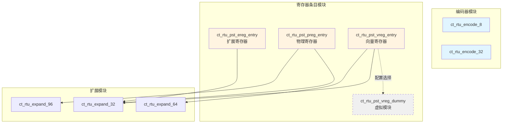
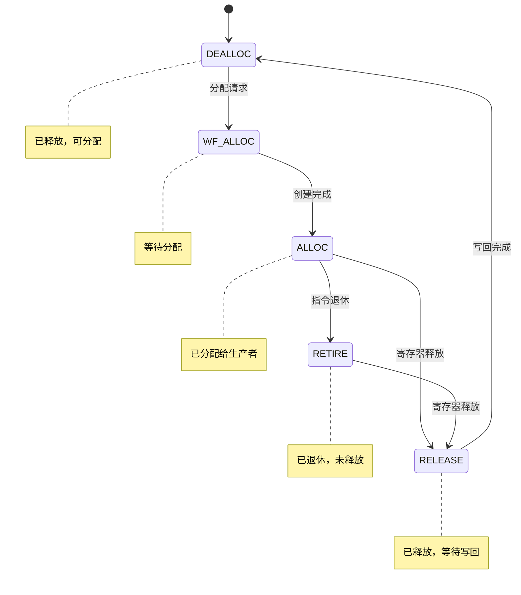
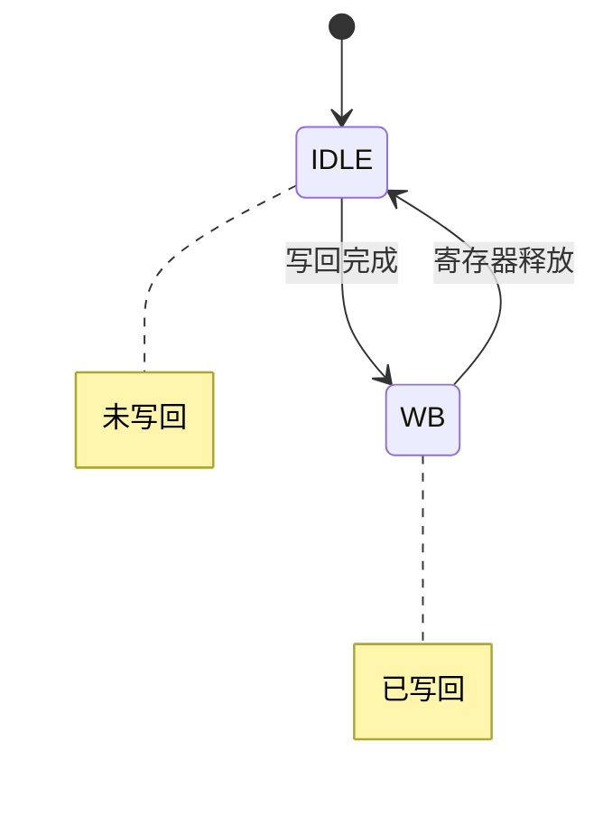

# RTU 模块设计文档总览

## 文档概述

本文档汇总了 OpenC910 RTU（Rename Table Unit）子系统中 6 个核心模块的设计文档，包括编码器模块和寄存器条目管理模块。

---

## 模块清单

| 序号 | 模块名称 | 文档路径 | 功能描述 |
|------|---------|---------|---------|
| 1 | ct_rtu_encode_8 | [ct_rtu_encode_8_top.md](./ct_rtu_encode_8_top.md) | 8位独热码编码器 |
| 2 | ct_rtu_encode_32 | [ct_rtu_encode_32_top.md](./ct_rtu_encode_32_top.md) | 32位独热码编码器 |
| 3 | ct_rtu_pst_ereg_entry | [ct_rtu_pst_ereg_entry_top.md](./ct_rtu_pst_ereg_entry_top.md) | 扩展寄存器条目管理 |
| 4 | ct_rtu_pst_preg_entry | [ct_rtu_pst_preg_entry_top.md](./ct_rtu_pst_preg_entry_top.md) | 物理寄存器条目管理 |
| 5 | ct_rtu_pst_vreg_dummy | [ct_rtu_pst_vreg_dummy_top.md](./ct_rtu_pst_vreg_dummy_top.md) | 向量寄存器虚拟模块 |
| 6 | ct_rtu_pst_vreg_entry | [ct_rtu_pst_vreg_entry_top.md](./ct_rtu_pst_vreg_entry_top.md) | 向量寄存器条目管理 |

---

## 模块分类

### 1. 编码器模块

#### 1.1 ct_rtu_encode_8

**功能**：将 8 位独热码转换为 3 位二进制数

**特性**：
- 纯组合逻辑
- 无状态设计
- 低延迟单周期编码
- 支持 0-7 的编码范围

**应用**：小规模寄存器池索引生成

#### 1.2 ct_rtu_encode_32

**功能**：将 32 位独热码转换为 5 位二进制数

**特性**：
- 纯组合逻辑
- 无状态设计
- 低延迟单周期编码
- 支持 0-31 的完整编码

**应用**：大规模寄存器池索引生成（32个物理寄存器）

---

### 2. 寄存器条目管理模块

#### 2.1 ct_rtu_pst_ereg_entry（扩展寄存器）

**功能**：管理单个扩展寄存器的完整生命周期

**核心特性**：
- 5状态生命周期状态机（DEALLOC/WF_ALLOC/ALLOC/RETIRE/RELEASE）
- 2状态写回状态机（IDLE/WB）
- 实时IID匹配
- 门控时钟低功耗设计

**关键参数**：
- 关联寄存器位宽：5位
- 扩展输出：32位
- 时钟源：ereg_top_clk

#### 2.2 ct_rtu_pst_preg_entry（物理寄存器）

**功能**：管理单个物理寄存器的完整生命周期

**核心特性**：
- 5状态生命周期状态机
- 2状态写回状态机
- IID预匹配时序优化
- 释放掩码支持
- 目标寄存器跟踪

**关键参数**：
- 关联寄存器位宽：7位
- 目标寄存器位宽：5位
- 关联扩展输出：96位
- 目标扩展输出：32位
- 时钟源：forever_cpuclk

**与 ereg_entry 的区别**：
- 使用寄存器存储IID匹配结果（时序优化）
- 支持目标寄存器跟踪
- 支持释放掩码控制
- 更大的关联寄存器空间

#### 2.3 ct_rtu_pst_vreg_entry（向量寄存器）

**功能**：管理单个向量寄存器的完整生命周期

**核心特性**：
- 5状态生命周期状态机
- 2状态写回状态机
- IID预匹配时序优化
- 释放掩码支持
- 目标向量寄存器跟踪

**关键参数**：
- 关联寄存器位宽：6位
- 目标寄存器位宽：5位
- 关联扩展输出：64位
- 目标扩展输出：32位
- 时钟源：vreg_top_clk

**特点**：
- 独立的向量寄存器时钟域
- 优化的扩展宽度（64位）
- 兼具 ereg_entry 和 preg_entry 的特性

#### 2.4 ct_rtu_pst_vreg_dummy（向量寄存器虚拟模块）

**功能**：不支持向量扩展时的占位模块

**核心特性**：
- 所有输出为固定常量
- 无内部状态和寄存器
- 零功能开销
- 接口兼容

**应用场景**：
- 不支持向量扩展的配置
- 节省面积和功耗
- 测试简化环境

---

## 模块关系图



---

## 状态机设计对比

### 生命周期状态机（5状态）

所有寄存器条目模块共享相同的状态机设计：



### 写回状态机（2状态）



---

## 关键设计技术

### 1. 时序优化技术

#### IID预匹配（preg_entry, vreg_entry）

**原理**：提前一周期计算并存储IID匹配结果

**优点**：
- 减少退休关键路径延迟
- 提高时序裕量

**代价**：
- 增加寄存器面积
- 增加门控时钟复杂度

### 2. 低功耗设计

#### 门控时钟

所有寄存器条目模块使用两级门控时钟：

1. **状态机时钟（sm_clk）**
   - 仅在状态转换时使能
   - 减少不必要的时钟翻转

2. **分配时钟（alloc_clk）**
   - 仅在分配操作时使能
   - 降低空闲功耗

### 3. 状态编码

使用 one-hot 编码：
- 每个状态位直接对应状态输出
- 减少状态译码功耗
- 简化状态判断逻辑

---

## 接口信号分类

### 1. 时钟与复位

| 信号 | 描述 | 使用模块 |
|------|------|---------|
| ereg_top_clk | 扩展寄存器时钟 | ereg_entry |
| forever_cpuclk | 永久CPU时钟 | preg_entry |
| vreg_top_clk | 向量寄存器时钟 | vreg_entry |
| cpurst_b | 全局复位（低有效） | 所有entry模块 |
| ifu_xx_sync_reset | 同步复位 | 所有entry模块 |

### 2. 分配接口

| 信号组 | 描述 |
|--------|------|
| idu_rtu_pst_dis_inst*_iid | 指令IID |
| idu_rtu_pst_dis_inst*_reg | 关联寄存器 |
| idu_rtu_pst_dis_inst*_dst_reg | 目标寄存器 |
| x_create_vld | 创建有效向量 |

### 3. 退休接口

| 信号组 | 描述 |
|--------|------|
| rob_pst_retire_inst*_iid | 退休IID |
| retire_pst_wb_retire_inst*_vld | 退休有效 |
| rob_pst_retire_inst*_gateclk_vld | 门控时钟有效 |

### 4. 控制接口

| 信号 | 描述 |
|------|------|
| rtu_yy_xx_flush | 全局刷新 |
| retire_pst_async_flush | 异步刷新 |
| x_dealloc_vld | 释放有效 |
| x_release_vld | 释放请求 |
| x_wb_vld | 写回有效 |

---

## 验证要点总结

### 功能验证

1. **编码器模块**
   - 所有独热码输入的正确编码
   - 边界值测试

2. **寄存器条目模块**
   - 所有状态转换路径
   - IID匹配逻辑
   - 刷新和复位处理
   - 写回与释放时序

### 覆盖率目标

| 类型 | 目标 |
|------|------|
| 状态覆盖率 | 100% |
| 转换覆盖率 | 100% |
| 行覆盖率 | ≥95% |
| 条件覆盖率 | ≥95% |

---

## 设计约束建议

### 时钟约束

```tcl
# 各时钟域约束
create_clock -period 2 [get_ports ereg_top_clk]
create_clock -period 2 [get_ports forever_cpuclk]
create_clock -period 2 [get_ports vreg_top_clk]

# 门控时钟检查
set_clock_gating_check -setup 0.2 [get_cells *gated_clk*]
set_clock_gating_check -hold 0.1 [get_cells *gated_clk*]
```

### 多周期路径

```tcl
# 状态机路径
set_multicycle_path 2 -setup -from [get_cells lifecycle_cur_state*]
```

---

## 文档修订历史

| 版本 | 日期 | 作者 | 修改描述 |
|------|------|------|---------|
| 1.0 | 2026-04-01 | IC设计专家 | 初始版本，创建所有模块文档 |

---

## 参考文档

- OpenC910 架构参考手册
- RTU 子系统设计规范
- IEEE 1364-2005 Verilog HDL 标准
- RISC-V 指令集架构规范
- RISC-V 向量扩展规范
