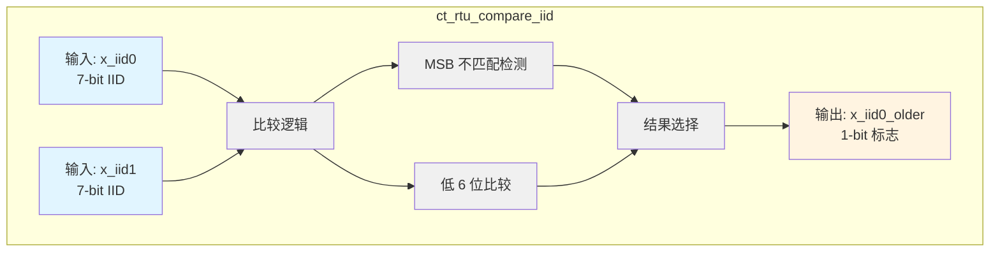
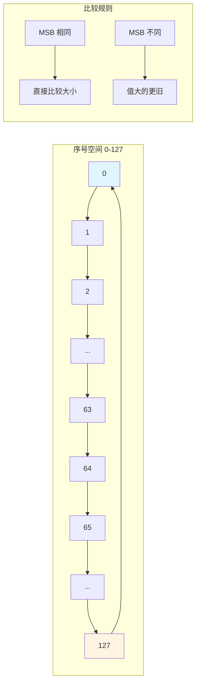

# ct_rtu_compare_iid 模块设计文档

## 1. 模块概述

### 1.1 功能描述
`ct_rtu_compare_iid` 模块实现两个 7 位指令标识符（IID, Instruction ID）的新旧顺序比较功能。该模块用于判断两个 IID 的相对年龄，确定哪个指令更旧，从而支持 RTU（Rename Table Unit）中的指令调度和依赖关系管理。

### 1.2 设计特点
- **循环序号比较**：支持循环序号空间的新旧判断
- **纯组合逻辑设计**：无时钟和复位信号，纯组合逻辑实现
- **MSB 不匹配处理**：正确处理序号回绕情况
- **低延迟设计**：优化比较逻辑，减少关键路径延迟

### 1.3 应用场景
- RTU 中的指令年龄比较
- 重命名表的依赖检测
- 调度器的优先级判断
- 提交顺序的验证

---

## 2. 接口说明

### 2.1 端口列表

| 端口名称 | 方向 | 位宽 | 类型 | 描述 |
|---------|------|------|------|------|
| `x_iid0` | Input | 7 | wire | 第一个 IID（待比较的 IID） |
| `x_iid1` | Input | 7 | wire | 第二个 IID（参考 IID） |
| `x_iid0_older` | Output | 1 | wire | x_iid0 是否比 x_iid1 更旧 |

### 2.2 端口详细说明

#### 2.2.1 输入端口

**x_iid0[6:0]**
- **功能**：第一个待比较的 IID
- **取值范围**：0 到 127（7 位全范围）
- **时序要求**：无时序要求，纯组合逻辑输入
- **用途**：作为待判断年龄的 IID

**x_iid1[6:0]**
- **功能**：第二个参考 IID
- **取值范围**：0 到 127（7 位全范围）
- **时序要求**：无时序要求，纯组合逻辑输入
- **用途**：作为参考基准 IID

#### 2.2.2 输出端口

**x_iid0_older**
- **功能**：指示 x_iid0 是否比 x_iid1 更旧
- **输出值**：
  - `1'b1`：x_iid0 比 x_iid1 更旧（年龄更大）
  - `1'b0`：x_iid0 比 x_iid1 更新或相等
- **判断逻辑**：基于循环序号比较算法

---

## 3. 模块框图

### 3.1 整体架构图



### 3.2 比较逻辑详细结构

```mermaid
graph TB
    subgraph "输入"
        A[x_iid0]
        B[x_iid1]
    end
    
    subgraph "MSB 处理"
        A --> C[x_iid0[6]]
        B --> D[x_iid1[6]]
        C --> E[异或运算<br/>MSB 不匹配检测]
        D --> E
    end
    
    subgraph "低 6 位比较"
        A --> F[iid0_larger<br/>逐位比较]
        B --> F
        
        A --> G[iid1_larger<br/>逐位比较]
        B --> G
        
        F --> H[iid0_5_0_larger<br/>优先级编码]
        G --> I[iid1_5_0_larger<br/>优先级编码]
    end
    
    subgraph "结果生成"
        E --> J[结果选择 MUX]
        H --> J
        I --> J
        J --> K[x_iid0_older]
    end
    
    style A fill:#e1f5ff
    style B fill:#e1f5ff
    style K fill:#fff4e1
```

### 3.3 循环序号比较原理图



---

## 4. 关键逻辑说明

### 4.1 循环序号比较算法

#### 4.1.1 循环序号原理
IID 使用 7 位循环序号，范围 0-127，序号会循环使用。判断两个 IID 的新旧关系需要考虑序号回绕的情况。

#### 4.1.2 比较规则

**情况 1：MSB 相同（iid_msb_mismatch = 0）**
- 两个 IID 在同一半空间（0-63 或 64-127）
- 直接比较低 6 位的大小
- 值大的 IID 更新

**情况 2：MSB 不同（iid_msb_mismatch = 1）**
- 两个 IID 在不同半空间
- 值大的 IID 更旧（因为序号已回绕）

#### 4.1.3 算法实现

```verilog
// MSB 不匹配检测
assign iid_msb_mismatch = x_iid0[6] ^ x_iid1[6];

// 最终结果
assign x_iid0_older = !iid_msb_mismatch && iid1_5_0_larger
                  || iid_msb_mismatch && iid0_5_0_larger;
```

### 4.2 低 6 位比较逻辑

#### 4.2.1 逐位比较

模块实现了逐位比较逻辑，判断每一位的大小关系：

```verilog
// iid0 的某一位大于 iid1 的对应位
assign iid0_larger[5] = x_iid0[5] && !x_iid1[5];
assign iid0_larger[4] = x_iid0[4] && !x_iid1[4];
...
assign iid0_larger[0] = x_iid0[0] && !x_iid1[0];

// iid1 的某一位大于 iid0 的对应位
assign iid1_larger[5] = !x_iid0[5] && x_iid1[5];
assign iid1_larger[4] = !x_iid0[4] && x_iid1[4];
...
assign iid1_larger[0] = !x_iid0[0] && x_iid1[0];
```

#### 4.2.2 优先级编码

采用从高位到低位的优先级编码，确定整体大小关系：

```verilog
assign iid0_5_0_larger =
     iid0_larger[5]
  || iid0_larger[4] && !iid1_larger[5]
  || iid0_larger[3] && !(|iid1_larger[5:4])
  || iid0_larger[2] && !(|iid1_larger[5:3])
  || iid0_larger[1] && !(|iid1_larger[5:2])
  || iid0_larger[0] && !(|iid1_larger[5:1]);
```

**逻辑解释**：
- 如果 bit 5 上 iid0 大，则 iid0 整体大
- 如果 bit 5 相等且 bit 4 上 iid0 大，则 iid0 整体大
- 以此类推，从高位到低位逐级判断

### 4.3 时序特性

#### 4.3.1 关键路径

```
输入 → 逐位比较 → 优先级编码 → 结果选择 → 输出
```

**延迟分析**：
1. 逐位比较：1 级逻辑（AND + NOT）
2. 优先级编码：2-3 级逻辑（OR + AND）
3. 结果选择：1 级逻辑（AND + OR）
4. **总延迟**：约 4-5 级逻辑门

#### 4.3.2 时序约束

```sdc
# 设置输入延迟
set_input_delay -max 0.2 [get_ports x_iid0[*]]
set_input_delay -max 0.2 [get_ports x_iid1[*]]

# 设置输出延迟
set_output_delay -max 0.3 [get_ports x_iid0_older]
```

### 4.4 设计优化

#### 4.4.1 逻辑优化

当前实现采用逐位比较 + 优先级编码的方式，优点：
- 逻辑清晰，易于理解和验证
- 综合工具可自动优化
- 时序可预测

#### 4.4.2 替代方案

**方案 1：减法比较**
```verilog
assign x_iid0_older = (x_iid0 - x_iid1) > 64;
```
- 优点：代码简洁
- 缺点：需要减法器，面积较大，延迟可能更长

**方案 2：查找表**
- 优点：延迟固定
- 缺点：面积大（128x128 表）

---

## 5. 内部信号列表

### 5.1 输入信号

| 信号名称 | 位宽 | 类型 | 描述 |
|---------|------|------|------|
| `x_iid0[6:0]` | 7 | wire | 第一个待比较的 IID |
| `x_iid1[6:0]` | 7 | wire | 第二个参考 IID |

### 5.2 输出信号

| 信号名称 | 位宽 | 类型 | 描述 |
|---------|------|------|------|
| `x_iid0_older` | 1 | wire | x_iid0 是否比 x_iid1 更旧 |

### 5.3 内部信号

| 信号名称 | 位宽 | 类型 | 描述 |
|---------|------|------|------|
| `iid_msb_mismatch` | 1 | wire | MSB 是否不匹配 |
| `iid0_larger[5:0]` | 6 | wire | iid0 每一位是否大于 iid1 |
| `iid1_larger[5:0]` | 6 | wire | iid1 每一位是否大于 iid0 |
| `iid0_5_0_larger` | 1 | wire | iid0 低 6 位是否大于 iid1 |
| `iid1_5_0_larger` | 1 | wire | iid1 低 6 位是否大于 iid0 |

---

## 6. 设计参数

### 6.1 参数定义

本模块无参数定义。

### 6.2 常量定义

| 常量名称 | 值 | 描述 |
|---------|---|------|
| `IID_WIDTH` | 7 | IID 位宽 |
| `IID_MAX` | 127 | IID 最大值 |
| `HALF_SPACE` | 64 | 半空间大小 |

---

## 7. 使用示例

### 7.1 模块实例化

```verilog
// 实例化 IID 比较模块
ct_rtu_compare_iid u_compare_iid (
    .x_iid0      (current_iid),    // 当前 IID
    .x_iid1      (reference_iid),  // 参考 IID
    .x_iid0_older(is_older)        // 输出：current_iid 是否更旧
);
```

### 7.2 典型应用场景

#### 7.2.1 指令年龄比较

```verilog
// 比较两个指令的新旧关系
always @(*) begin
    // 判断 instr0 是否比 instr1 更旧
    if (x_iid0_older) begin
        // instr0 更旧，优先调度
        priority_instr = instr0;
    end else begin
        // instr1 更旧或相等，优先调度
        priority_instr = instr1;
    end
end
```

#### 7.2.2 依赖关系检测

```verilog
// 检测 RAW 依赖
always @(*) begin
    // 如果当前指令的 IID 比前一条指令更旧，说明有依赖
    if (ct_rtu_compare_iid(current_iid, prev_iid)) begin
        has_dependency = 1'b1;
    end else begin
        has_dependency = 1'b0;
    end
end
```

---

## 8. 验证要点

### 8.1 功能验证

#### 8.1.1 边界测试

| 测试场景 | x_iid0 | x_iid1 | 预期输出 | 说明 |
|---------|--------|--------|---------|------|
| 相同 IID | 50 | 50 | 0 | 相同 IID，不更旧 |
| iid0 小（同半空间） | 10 | 50 | 1 | iid0 更旧 |
| iid0 大（同半空间） | 50 | 10 | 0 | iid0 更新 |
| iid0 小（跨半空间） | 10 | 100 | 0 | iid0 更新（MSB 不同） |
| iid0 大（跨半空间） | 100 | 10 | 1 | iid0 更旧（MSB 不同） |
| 边界值 0 | 0 | 127 | 0 | iid0 更新（跨半空间） |
| 边界值 127 | 127 | 0 | 1 | iid0 更旧（跨半空间） |

#### 8.1.2 循环序号验证

```verilog
// 验证序号回绕场景
initial begin
    // 测试序号回绕
    x_iid0 = 7'd0;
    x_iid1 = 7'd127;
    #10;
    assert(x_iid0_older == 1'b0); // 0 比 127 更新
    
    x_iid0 = 7'd127;
    x_iid1 = 7'd0;
    #10;
    assert(x_iid0_older == 1'b1); // 127 比 0 更旧
end
```

#### 8.1.3 随机测试

```verilog
// 随机测试
initial begin
    repeat(1000) begin
        x_iid0 = $random;
        x_iid1 = $random;
        #10;
        
        // 计算预期结果
        expected = compare_iid_expected(x_iid0, x_iid1);
        
        // 验证结果
        assert(x_iid0_older == expected)
            else $error("Comparison failed: iid0=%0d, iid1=%0d", x_iid0, x_iid1);
    end
end
```

### 8.2 时序验证

- 检查关键路径延迟是否满足时序要求
- 验证在典型工作频率下的建立时间和保持时间
- 检查组合逻辑环路（不应存在）

---

## 9. 综合结果预估

### 9.1 面积预估

| 资源类型 | 数量 | 说明 |
|---------|------|------|
| 组合逻辑门 | ~50 | 比较器和优先级编码器 |
| 线网 | 15 | 输入 14 + 输出 1 |
| 总面积 | ~100 μm² | 40nm 工艺预估 |

### 9.2 时序预估

| 参数 | 数值 | 说明 |
|------|------|------|
| 输入延迟 | 0.2 ns | 输入端口延迟 |
| 逻辑延迟 | 0.5 ns | 比较逻辑延迟 |
| 输出延迟 | 0.2 ns | 输出端口延迟 |
| 总延迟 | 0.9 ns | 从输入到输出 |

---

## 10. 设计考虑

### 10.1 循环序号管理

#### 10.1.1 序号分配策略
- IID 从 0 开始递增分配
- 达到最大值 127 后回绕到 0
- 需要确保序号空间足够大，避免冲突

#### 10.1.2 冲突检测
- 当序号回绕时，需要检测是否还有旧指令未完成
- 如果旧指令未完成，需要等待或暂停分配新 IID

### 10.2 性能优化

#### 10.2.1 流水线化
如果比较逻辑成为关键路径，可考虑流水线化：
```verilog
// 流水线版本
always @(posedge clk) begin
    iid0_reg <= x_iid0;
    iid1_reg <= x_iid1;
    x_iid0_older <= compare_logic(iid0_reg, iid1_reg);
end
```

#### 10.2.2 并行比较
如果需要比较多个 IID 对，可并行实例化多个比较模块。

---

## 11. 修改记录

| 日期 | 版本 | 修改人 | 修改内容 |
|------|------|--------|---------|
| 2026-04-01 | v1.0 | IC 设计专家 | 初始版本，生成模块设计文档 |

---

## 12. 参考资料

1. OpenC910 RTL 代码：`d:\code\openc910\C910_RTL_FACTORY\gen_rtl\rtu\rtl\ct_rtu_compare_iid.v`
2. RISC-V 指令集架构规范
3. 循环序号比较算法原理
4. 处理器微架构设计指南
