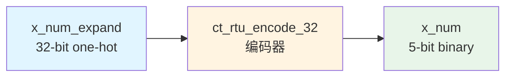

# ct_rtu_encode_32 模块设计文档

## 1. 模块概述

### 1.1 功能描述
`ct_rtu_encode_32` 是一个 32 位独热码编码器模块，用于将 32 位独热码（one-hot encoding）转换为 5 位二进制数。该模块是 RTU（Rename Table Unit）子系统的基本组件，主要用于大规模寄存器重命名过程中的索引编码。

### 1.2 主要特性
- 纯组合逻辑实现
- 32 位独热码输入，5 位二进制输出
- 低延迟设计，单周期完成编码
- 无状态模块，无需时钟和复位
- 支持完整的 32 个索引编码

### 1.3 应用场景
- 物理寄存器池索引生成（32个物理寄存器）
- 扩展寄存器分配时的索引编码
- RTU 子系统中的大规模地址译码

---

## 2. 接口说明

### 2.1 端口列表

| 端口名称 | 方向 | 位宽 | 类型 | 描述 |
|---------|------|------|------|------|
| x_num_expand | input | 32 | wire | 32位独热码输入信号 |
| x_num | output | 5 | wire | 5位二进制编码输出 |

### 2.2 端口详细说明

#### 输入端口

**x_num_expand[31:0]**
- 功能：32位独热码输入
- 特性：同一时刻仅有一位为高电平
- 编码范围：支持 0-31 的完整编码

#### 输出端口

**x_num[4:0]**
- 功能：5位二进制编码输出
- 范围：0-31
- 延迟：组合逻辑延迟

---

## 3. 模块框图



### 3.1 内部结构图

```mermaid
graph TB
    subgraph 输入[32位独热码输入]
        IN0[x_num_expand[0]]
        IN1[x_num_expand[1]]
        IN2[...]
        IN30[x_num_expand[30]]
        IN31[x_num_expand[31]]
    end

    subgraph 编码逻辑
        MUX[32-to-5 编码器<br/>组合逻辑]
    end

    subgraph 输出
        OUT[x_num[4:0]]
    end

    IN0 --> MUX
    IN1 --> MUX
    IN2 --> MUX
    IN30 --> MUX
    IN31 --> MUX
    MUX --> OUT
```

---

## 4. 关键逻辑说明

### 4.1 编码算法

模块采用并行优先级编码方式，通过位扩展和按位或运算实现独热码到二进制码的转换：

```verilog
assign x_num[4:0] =
           {5{x_num_expand[0]}}  & 5'd0
         | {5{x_num_expand[1]}}  & 5'd1
         | {5{x_num_expand[2]}}  & 5'd2
         // ... 省略中间位
         | {5{x_num_expand[30]}} & 5'd30
         | {5{x_num_expand[31]}} & 5'd31;
```

### 4.2 设计特点

1. **并行处理**：所有 32 个输入位同时参与运算
2. **低延迟**：单级组合逻辑实现
3. **面积优化**：使用位扩展和与或逻辑
4. **扩展性好**：可轻松扩展到更大位宽

### 4.3 编码真值表（部分）

| x_num_expand | x_num | 十进制值 |
|-------------|-------|---------|
| 0000_0000_0000_0000_0000_0000_0000_0001 | 00000 | 0 |
| 0000_0000_0000_0000_0000_0000_0000_0010 | 00001 | 1 |
| 0000_0000_0000_0000_0000_0000_0000_0100 | 00010 | 2 |
| ... | ... | ... |
| 0100_0000_0000_0000_0000_0000_0000_0000 | 11110 | 30 |
| 1000_0000_0000_0000_0000_0000_0000_0000 | 11111 | 31 |

---

## 5. 内部信号列表

### 5.1 信号声明

| 信号名称 | 位宽 | 类型 | 描述 |
|---------|------|------|------|
| x_num_expand | 32 | wire (input) | 32位独热码输入 |
| x_num | 5 | wire (output) | 5位二进制输出 |

### 5.2 无内部寄存器
本模块为纯组合逻辑，无内部寄存器或状态信号。

---

## 6. 时序与约束

### 6.1 时序特性
- **组合逻辑延迟**：取决于工艺库，典型值为 0.3-0.8ns
- **关键路径**：输入到输出的单级逻辑，32位比8位稍长

### 6.2 设计约束建议
```tcl
# 输入延迟约束
set_input_delay -max 0.5 [get_ports x_num_expand[*]]

# 输出延迟约束
set_output_delay -max 0.5 [get_ports x_num[*]]

# 负载约束
set_load 0.1 [get_ports x_num[*]]
```

---

## 7. 验证要点

### 7.1 功能验证
- 验证所有 32 种独热码输入的正确编码输出
- 验证边界值（0, 1, 30, 31）的编码正确性
- 验证相邻位的编码正确性

### 7.2 边界条件
- 全 0 输入
- 全 1 输入
- 相邻位同时为 1

### 7.3 覆盖率目标
- 行覆盖率：100%
- 跳转覆盖率：100%
- 功能覆盖率：100%（所有 32 种独热码）

---

## 8. 使用示例

### 8.1 模块实例化

```verilog
// 实例化 32 位编码器
ct_rtu_encode_32 u_encode_32 (
    .x_num_expand   (preg_alloc_mask_expand),  // 32位独热码输入
    .x_num          (preg_alloc_index)         // 5位二进制输出
);
```

### 8.2 典型应用场景

在物理寄存器重命名单元中，当需要将 32 个物理寄存器的分配掩码转换为索引时：

```verilog
// 物理寄存器分配掩码（独热码，32个物理寄存器）
wire [31:0] preg_alloc_mask;

// 分配的物理寄存器索引
wire [4:0] preg_index;

// 实例化编码器
ct_rtu_encode_32 u_preg_encode (
    .x_num_expand   (preg_alloc_mask),
    .x_num          (preg_index)
);
```

---

## 9. 与 ct_rtu_encode_8 的对比

| 特性 | ct_rtu_encode_8 | ct_rtu_encode_32 |
|------|----------------|------------------|
| 输入位宽 | 8 位 | 32 位 |
| 输出位宽 | 3 位 | 5 位 |
| 编码范围 | 0-7 | 0-31 |
| 组合逻辑深度 | 较浅 | 稍深 |
| 面积 | 较小 | 较大 |
| 典型应用 | 小规模寄存器池 | 大规模寄存器池 |

---

## 10. 修订历史

| 版本 | 日期 | 作者 | 修改描述 |
|------|------|------|---------|
| 1.0 | 2026-04-01 | IC设计专家 | 初始版本 |

---

## 11. 参考文档

- OpenC910 架构参考手册
- RTU 子系统设计规范
- IEEE 1364-2005 Verilog HDL 标准
