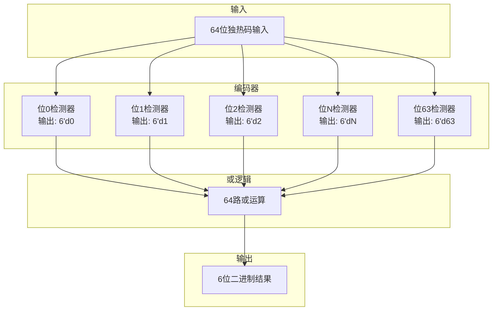

# ct_rtu_encode_64 模块设计文档

## 1. 模块概述

### 1.1 功能描述
`ct_rtu_encode_64` 模块是一个独热码到二进制编码器，用于将64位独热码（One-Hot）编码转换为6位二进制数。该模块是RTU（Rename Table Unit，重命名表单元）子系统的重要组成部分，主要用于处理重命名表中的索引编码操作。

### 1.2 主要特性
- 输入：64位独热码信号
- 输出：6位二进制编码
- 纯组合逻辑实现，无时钟依赖
- 低延迟设计，单级逻辑完成编码
- 支持全范围编码（0-63）

### 1.3 应用场景
- 重命名表索引编码
- 物理寄存器索引生成
- 仲裁器优先级编码
- 多路选择器控制信号生成

---

## 2. 接口说明

### 2.1 端口列表

| 端口名称 | 方向 | 位宽 | 类型 | 描述 |
|---------|------|------|------|------|
| `x_num_expand` | Input | 64 | wire | 64位独热码输入信号 |
| `x_num` | Output | 6 | wire | 6位二进制编码输出 |

### 2.2 端口详细说明

#### 2.2.1 输入端口

**x_num_expand[63:0]**
- 类型：64位独热码
- 功能：表示需要编码的位置索引
- 编码规则：同一时刻仅允许1位为高电平
- 示例：
  - `64'h0000_0000_0000_0001` → 表示索引0
  - `64'h0000_0000_0000_0002` → 表示索引1
  - `64'h8000_0000_0000_0000` → 表示索引63

#### 2.2.2 输出端口

**x_num[5:0]**
- 类型：6位二进制数
- 功能：输出独热码对应的二进制索引值
- 取值范围：0-63
- 示例：
  - 输入 `x_num_expand[0]=1` → 输出 `x_num=6'd0`
  - 输入 `x_num_expand[1]=1` → 输出 `x_num=6'd1`
  - 输入 `x_num_expand[63]=1` → 输出 `x_num=6'd63`

---

## 3. 模块框图

### 3.1 结构框图

```mermaid
graph LR
    A[64位独热码输入<br/>x_num_expand[63:0]] --> B[编码逻辑<br/>One-Hot to Binary]
    B --> C[6位二进制输出<br/>x_num[5:0]]

    style A fill:#e1f5ff
    style B fill:#fff4e1
    style C fill:#e8f5e9
```

### 3.2 内部逻辑结构



---

## 4. 关键逻辑说明

### 4.1 编码原理

该模块采用**并行比较+或运算**的方式实现独热码到二进制的编码：

```
x_num[5:0] = {6{x_num_expand[0]}}  & 6'd0  |
             {6{x_num_expand[1]}}  & 6'd1  |
             {6{x_num_expand[2]}}  & 6'd2  |
             ...                           |
             {6{x_num_expand[63]}} & 6'd63
```

### 4.2 编码逻辑详解

#### 4.2.1 位扩展操作
- `{6{x_num_expand[i]}}`：将单比特信号复制6次
- 例如：`x_num_expand[5]=1` → `{6{1'b1}} = 6'b111111`

#### 4.2.2 条件选择
- `& 6'dN`：与对应的二进制值进行与运算
- 例如：`x_num_expand[5]=1` → `6'b111111 & 6'd5 = 6'd5`

#### 4.2.3 结果合并
- 所有64路结果通过或运算合并
- 由于输入是独热码，同一时刻只有一路有效

### 4.3 时序特性

| 参数 | 描述 | 典型值 |
|------|------|--------|
| Tpd | 传播延迟 | 取决于综合优化 |
| 逻辑深度 | 组合逻辑级数 | 1级（并行结构） |
| 关键路径 | 64输入或树 | 工具自动优化 |

### 4.4 设计优势

1. **并行处理**：所有64个输入同时检测，无优先级冲突
2. **低延迟**：单级逻辑实现，无流水线开销
3. **面积优化**：综合工具可优化为优先编码器或树形结构
4. **可综合性**：纯组合逻辑，易于综合和时序收敛

---

## 5. 内部信号列表

### 5.1 信号定义表

| 信号名称 | 方向 | 位宽 | 类型 | 描述 |
|---------|------|------|------|------|
| `x_num_expand` | Input | 64 | wire | 64位独热码输入 |
| `x_num` | Output | 6 | wire | 6位二进制编码输出 |

### 5.2 无内部寄存器

该模块为纯组合逻辑设计，无内部寄存器或状态信号。

---

## 6. 使用示例

### 6.1 典型应用场景

```verilog
// 例化编码器
ct_rtu_encode_64 u_encode_64 (
    .x_num_expand (reg_onehot[63:0]),  // 64位独热码输入
    .x_num        (reg_index [5:0] )   // 6位索引输出
);
```

### 6.2 输入输出示例

| 输入 (x_num_expand) | 输出 (x_num) | 说明 |
|---------------------|--------------|------|
| 64'h0000_0000_0000_0001 | 6'd0 | 第0位有效 |
| 64'h0000_0000_0000_0002 | 6'd1 | 第1位有效 |
| 64'h0000_0000_0000_0004 | 6'd2 | 第2位有效 |
| 64'h0000_0000_0000_0010 | 6'd4 | 第4位有效 |
| 64'h0000_0000_0000_0100 | 6'd6 | 第6位有效 |
| 64'h0000_0000_0000_1000 | 6'd7 | 第7位有效 |
| 64'h0000_0000_0001_0000 | 6'd8 | 第8位有效 |
| 64'h8000_0000_0000_0000 | 6'd63 | 第63位有效 |

---

## 7. 设计注意事项

### 7.1 输入约束
- 输入必须为有效的独热码（同一时刻仅1位为高）
- 若输入全0或多位为高，输出结果不可预测

### 7.2 时序考虑
- 该模块为组合逻辑，输出可能产生毛刺
- 建议在输出端添加寄存器采样
- 在高速设计中需关注关键路径延迟

### 7.3 综合优化
- 综合工具会自动优化编码逻辑
- 可能优化为优先编码器或树形编码器
- 面积和时序可通过约束文件控制

---

## 8. 版本历史

| 版本 | 日期 | 作者 | 修改说明 |
|------|------|------|----------|
| 1.0 | 2019 | T-Head | 初始版本 |
| 1.1 | 2026-04-01 | IC设计专家 | 生成详细设计文档 |

---

## 9. 参考文档

- OpenC910 架构参考手册
- RTU 子系统设计规范
- IEEE 1364-2005 Verilog HDL 标准
