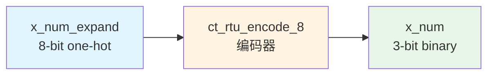

# ct_rtu_encode_8 模块设计文档

## 1. 模块概述

### 1.1 功能描述
`ct_rtu_encode_8` 是一个 8 位独热码编码器模块，用于将 8 位独热码（one-hot encoding）转换为 3 位二进制数。该模块是 RTU（Rename Table Unit）子系统的基本组件，主要用于寄存器重命名过程中的索引编码。

### 1.2 主要特性
- 纯组合逻辑实现
- 8 位独热码输入，3 位二进制输出
- 低延迟设计，单周期完成编码
- 无状态模块，无需时钟和复位

### 1.3 应用场景
- 寄存器重命名表索引生成
- 物理寄存器分配时的索引编码
- RTU 子系统中的地址译码

---

## 2. 接口说明

### 2.1 端口列表

| 端口名称 | 方向 | 位宽 | 类型 | 描述 |
|---------|------|------|------|------|
| x_num_expand | input | 8 | wire | 8位独热码输入信号 |
| x_num | output | 3 | wire | 3位二进制编码输出 |

### 2.2 端口详细说明

#### 输入端口

**x_num_expand[7:0]**
- 功能：8位独热码输入
- 特性：同一时刻仅有一位为高电平
- 编码映射：
  - 8'b00000001 → 输出 0
  - 8'b00000010 → 输出 1
  - 8'b00000100 → 输出 2
  - 8'b00001000 → 输出 3
  - 8'b00010000 → 输出 4
  - 8'b00100000 → 输出 5
  - 8'b01000000 → 输出 6
  - 8'b10000000 → 输出 7

#### 输出端口

**x_num[2:0]**
- 功能：3位二进制编码输出
- 范围：0-7
- 延迟：组合逻辑延迟

---

## 3. 模块框图



### 3.1 内部结构图

```mermaid
graph TB
    subgraph 输入
        IN0[x_num_expand[0]]
        IN1[x_num_expand[1]]
        IN2[x_num_expand[2]]
        IN3[x_num_expand[3]]
        IN4[x_num_expand[4]]
        IN5[x_num_expand[5]]
        IN6[x_num_expand[6]]
        IN7[x_num_expand[7]]
    end

    subgraph 编码逻辑
        MUX[8-to-1 编码器<br/>组合逻辑]
    end

    subgraph 输出
        OUT[x_num[2:0]]
    end

    IN0 --> MUX
    IN1 --> MUX
    IN2 --> MUX
    IN3 --> MUX
    IN4 --> MUX
    IN5 --> MUX
    IN6 --> MUX
    IN7 --> MUX
    MUX --> OUT
```

---

## 4. 关键逻辑说明

### 4.1 编码算法

模块采用并行优先级编码方式，通过位扩展和按位或运算实现独热码到二进制码的转换：

```verilog
assign x_num[2:0] =
           {3{x_num_expand[0]}} & 3'd0
         | {3{x_num_expand[1]}} & 3'd1
         | {3{x_num_expand[2]}} & 3'd2
         | {3{x_num_expand[3]}} & 3'd3
         | {3{x_num_expand[4]}} & 3'd4
         | {3{x_num_expand[5]}} & 3'd5
         | {3{x_num_expand[6]}} & 3'd6
         | {3{x_num_expand[7]}} & 3'd7;
```

### 4.2 设计特点

1. **并行处理**：所有输入位同时参与运算，无优先级冲突
2. **低延迟**：单级组合逻辑，关键路径短
3. **面积优化**：使用位扩展和与或逻辑，综合后面积小
4. **无毛刺**：独热码输入保证输出稳定

### 4.3 编码真值表

| x_num_expand | x_num | 十进制值 |
|-------------|-------|---------|
| 0000_0001 | 000 | 0 |
| 0000_0010 | 001 | 1 |
| 0000_0100 | 010 | 2 |
| 0000_1000 | 011 | 3 |
| 0001_0000 | 100 | 4 |
| 0010_0000 | 101 | 5 |
| 0100_0000 | 110 | 6 |
| 1000_0000 | 111 | 7 |

---

## 5. 内部信号列表

### 5.1 信号声明

| 信号名称 | 位宽 | 类型 | 描述 |
|---------|------|------|------|
| x_num_expand | 8 | wire (input) | 8位独热码输入 |
| x_num | 3 | wire (output) | 3位二进制输出 |

### 5.2 无内部寄存器
本模块为纯组合逻辑，无内部寄存器或状态信号。

---

## 6. 时序与约束

### 6.1 时序特性
- **组合逻辑延迟**：取决于工艺库，典型值为 0.2-0.5ns
- **关键路径**：输入到输出的单级逻辑

### 6.2 设计约束建议
```tcl
# 输入延迟约束
set_input_delay -max 0.5 [get_ports x_num_expand[*]]

# 输出延迟约束
set_output_delay -max 0.5 [get_ports x_num[*]]

# 负载约束
set_load 0.1 [get_ports x_num[*]]
```

---

## 7. 验证要点

### 7.1 功能验证
- 验证所有 8 种独热码输入的正确编码输出
- 验证输入为 0 时的输出行为（未定义，需确认）
- 验证多位置位时的输出行为（未定义，需确认）

### 7.2 边界条件
- 全 0 输入
- 全 1 输入
- 相邻位同时为 1

### 7.3 覆盖率目标
- 行覆盖率：100%
- 跳转覆盖率：100%
- 功能覆盖率：100%（所有 8 种独热码）

---

## 8. 使用示例

### 8.1 模块实例化

```verilog
// 实例化 8 位编码器
ct_rtu_encode_8 u_encode_8 (
    .x_num_expand   (alloc_mask_expand),  // 8位独热码输入
    .x_num          (alloc_index)         // 3位二进制输出
);
```

### 8.2 典型应用场景

在寄存器重命名单元中，当需要将物理寄存器的分配掩码转换为索引时：

```verilog
// 物理寄存器分配掩码（独热码）
wire [7:0] preg_alloc_mask;

// 分配的物理寄存器索引
wire [2:0] preg_index;

// 实例化编码器
ct_rtu_encode_8 u_preg_encode (
    .x_num_expand   (preg_alloc_mask),
    .x_num          (preg_index)
);
```

---

## 9. 修订历史

| 版本 | 日期 | 作者 | 修改描述 |
|------|------|------|---------|
| 1.0 | 2026-04-01 | IC设计专家 | 初始版本 |

---

## 10. 参考文档

- OpenC910 架构参考手册
- RTU 子系统设计规范
- IEEE 1364-2005 Verilog HDL 标准
