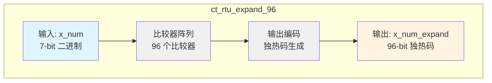
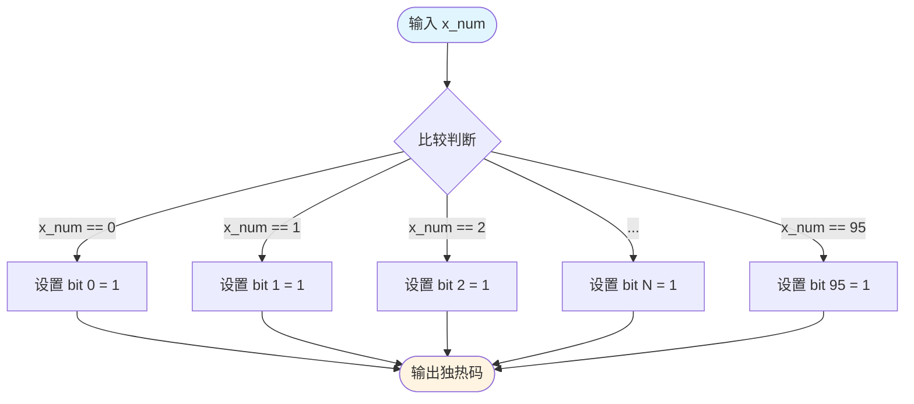

# ct_rtu_expand_96 模块设计文档

## 1. 模块概述

### 1.1 功能描述
`ct_rtu_expand_96` 模块实现将 7 位二进制数扩展为 96 位独热码（One-Hot Encoding）的功能。该模块主要用于 RTU（Rename Table Unit）中的指令标识符（IID）扩展，将压缩的二进制表示转换为独热码形式，便于后续的位操作和匹配逻辑。

### 1.2 设计特点
- **纯组合逻辑设计**：无时钟和复位信号，纯组合逻辑实现
- **独热码输出**：输出 96 位独热码，任意时刻仅有一位为高电平
- **支持范围 0-95**：输入范围支持 0 到 95 共 96 个数值
- **低延迟设计**：单级比较逻辑，延迟最小化

### 1.3 应用场景
- RTU 中的 IID 扩展
- 指令年龄比较逻辑
- 重命名表的索引扩展
- 调度器的唤醒逻辑

---

## 2. 接口说明

### 2.1 端口列表

| 端口名称 | 方向 | 位宽 | 类型 | 描述 |
|---------|------|------|------|------|
| `x_num` | Input | 7 | wire | 输入的 7 位二进制数（0-95） |
| `x_num_expand` | Output | 96 | wire | 输出的 96 位独热码 |

### 2.2 端口详细说明

#### 2.2.1 输入端口

**x_num[6:0]**
- **功能**：输入的 7 位二进制数
- **取值范围**：0 到 95（共 96 个有效值）
- **位宽说明**：虽然 7 位可表示 0-127，但本模块仅支持 0-95
- **时序要求**：无时序要求，纯组合逻辑输入

#### 2.2.2 输出端口

**x_num_expand[95:0]**
- **功能**：输出的 96 位独热码
- **输出特性**：
  - 任意时刻仅有一位为高电平（1'b1）
  - 其余位均为低电平（1'b0）
  - 输出位索引与输入值对应
- **示例**：
  - 输入 `x_num = 7'd0` → 输出 `x_num_expand = 96'b0000...0001`
  - 输入 `x_num = 7'd5` → 输出 `x_num_expand = 96'b0000...0100000`

---

## 3. 模块框图

### 3.1 整体架构图



### 3.2 内部逻辑结构图

```mermaid
graph LR
    subgraph "比较器阵列"
        A[x_num] --> B0[比较器 0<br/>x_num == 0?]
        A --> B1[比较器 1<br/>x_num == 1?]
        A --> B2[比较器 2<br/>x_num == 2?]
        A --> B3[...]
        A --> B95[比较器 95<br/>x_num == 95?]
    end
    
    B0 --> C0[bit 0]
    B1 --> C1[bit 1]
    B2 --> C2[bit 2]
    B3 --> C3[...]
    B95 --> C95[bit 95]
    
    C0 --> D[x_num_expand<br/>96-bit]
    C1 --> D
    C2 --> D
    C3 --> D
    C95 --> D
    
    style A fill:#e1f5ff
    style D fill:#fff4e1
```



### 3.3 数据流图



---

## 4. 关键逻辑说明

### 4.1 独热码扩展原理

#### 4.1.1 基本原理
独热码扩展的核心思想是将二进制数值转换为对应的位向量，其中只有与该数值对应的位为 1，其余位为 0。

#### 4.1.2 实现方式
模块采用并行比较器阵列实现：

```verilog
assign x_num_expand[0]  = (x_num[6:0] == 7'd0);
assign x_num_expand[1]  = (x_num[6:0] == 7'd1);
...
assign x_num_expand[95] = (x_num[6:0] == 7'd95);
```

每个输出位对应一个比较器，判断输入是否等于该位的索引值。

### 4.2 比较器逻辑

#### 4.2.1 比较器结构
每个比较器执行以下逻辑：

```
x_num_expand[i] = (x_num == i) ? 1'b1 : 1'b0
```

#### 4.2.2 综合优化
- 综合工具会将比较器优化为与门/或门/非门的组合
- 对于 7 位输入，每个比较器需要约 7 个逻辑门
- 总计 96 个比较器，约 672 个逻辑门

### 4.3 时序特性

#### 4.3.1 关键路径
- **输入到输出延迟**：1 级比较器逻辑
- **典型延迟**：约 0.3-0.5ns（取决于工艺库）
- **优化建议**：如果时序紧张，可考虑使用译码器结构

#### 4.3.2 时序约束
```sdc
# 设置输入延迟
set_input_delay -max 0.2 [get_ports x_num[*]]
set_input_delay -min 0.1 [get_ports x_num[*]]

# 设置输出延迟
set_output_delay -max 0.3 [get_ports x_num_expand[*]]
set_output_delay -min 0.1 [get_ports x_num_expand[*]]
```

### 4.4 设计考虑

#### 4.4.1 面积优化
- 当前实现为并行比较器，面积较大
- 可考虑使用 3-8 译码器级联结构减小面积
- 面积与速度的权衡

#### 4.4.2 功耗优化
- 输入变化时所有比较器都会翻转
- 可考虑添加时钟门控（如果应用场景允许）
- 独热码输出功耗较高，需权衡

---

## 5. 内部信号列表

### 5.1 输入信号

| 信号名称 | 位宽 | 类型 | 描述 |
|---------|------|------|------|
| `x_num[6:0]` | 7 | wire | 输入的 7 位二进制数 |

### 5.2 输出信号

| 信号名称 | 位宽 | 类型 | 描述 |
|---------|------|------|------|
| `x_num_expand[95:0]` | 96 | wire | 输出的 96 位独热码 |

### 5.3 内部信号

本模块为纯组合逻辑，无内部寄存器信号。

---

## 6. 设计参数

### 6.1 参数定义

本模块无参数定义。

### 6.2 常量定义

| 常量名称 | 值 | 描述 |
|---------|---|------|
| `INPUT_WIDTH` | 7 | 输入位宽 |
| `OUTPUT_WIDTH` | 96 | 输出位宽 |
| `MAX_VALUE` | 95 | 最大支持值 |

---

## 7. 使用示例

### 7.1 模块实例化

```verilog
// 实例化独热码扩展模块
ct_rtu_expand_96 u_expand (
    .x_num       (iid_num),        // 输入 7 位 IID
    .x_num_expand(iid_onehot)      // 输出 96 位独热码
);
```

### 7.2 典型应用场景

```verilog
// 在 RTU 中的应用示例
always @(*) begin
    // 将 IID 扩展为独热码
    iid_expand = expand_96(iid);
    
    // 使用独热码进行年龄比较
    older_mask = ~iid_expand & age_bitmap;
    is_older = |older_mask;
end
```

---

## 8. 验证要点

### 8.1 功能验证

#### 8.1.1 边界测试
- 输入 0：验证输出 bit 0 为 1
- 输入 95：验证输出 bit 95 为 1
- 输入中间值：验证对应位为 1

#### 8.1.2 独热性检查
```verilog
// 验证输出为独热码
assert property (@(*) $onehot(x_num_expand));
```

#### 8.1.3 一致性检查
```verilog
// 验证输出位索引与输入值一致
assert property (@(*) x_num_expand[x_num] == 1'b1);
```

### 8.2 时序验证

- 检查输入到输出的延迟是否满足时序要求
- 验证在典型工作频率下的建立时间和保持时间

---

## 9. 综合结果预估

### 9.1 面积预估

| 资源类型 | 数量 | 说明 |
|---------|------|------|
| 组合逻辑门 | ~700 | 96 个比较器 |
| 线网 | 103 | 输入 7 + 输出 96 |
| 总面积 | ~1500 μm² | 40nm 工艺预估 |

### 9.2 时序预估

| 参数 | 数值 | 说明 |
|------|------|------|
| 输入延迟 | 0.2 ns | 输入端口延迟 |
| 逻辑延迟 | 0.3 ns | 比较器逻辑延迟 |
| 输出延迟 | 0.2 ns | 输出端口延迟 |
| 总延迟 | 0.7 ns | 从输入到输出 |

---

## 10. 修改记录

| 日期 | 版本 | 修改人 | 修改内容 |
|------|------|--------|---------|
| 2026-04-01 | v1.0 | IC 设计专家 | 初始版本，生成模块设计文档 |

---

## 11. 参考资料

1. OpenC910 RTL 代码：`d:\code\openc910\C910_RTL_FACTORY\gen_rtl\rtu\rtl\ct_rtu_expand_96.v`
2. RISC-V 指令集架构规范
3. 独热码编码最佳实践
